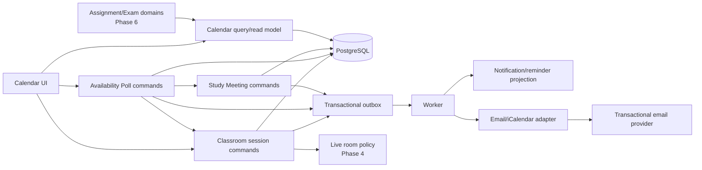

# Báo cáo nghiên cứu và thiết kế tab Lịch TutorHub V2

- Trạng thái: `PROPOSED v5`, final pre-code readiness audit đã hoàn tất; ADR-0021 đã
  `Accepted`
- Ngày nghiên cứu: 2026-07-22 đến 2026-07-23
- Phạm vi: Phase 3, P3-CAL-00B/P3-CAL-00C/P3-CAL-01/P3-CAL-02, P3-01 đến
  P3-05A/P3-05B và khả
  năng mở rộng về sau
- Nguồn: tài liệu chính thức Google, Microsoft, Zoom, ClassIn; RFC/WCAG; mã nguồn mở;
  source và ảnh TutorHub V1; ảnh Teams/Google do owner cung cấp; website/CSS Vauliys;
  kiến trúc TutorHub V2 hiện tại
- Tài liệu kiến trúc liên quan:
  [ADR-0017](adr/0017-class-session-scheduling-and-civil-time.md) và
  [ADR-0018](adr/0018-postgresql-leased-outbox-worker.md), cùng
  [ADR-0021](adr/0021-native-availability-polls-and-member-owned-study-meetings.md)

> Đây là báo cáo thiết kế và đề xuất, chưa phải bằng chứng tính năng đã được triển khai.
> Bản v4 tích hợp chỉ đạo ngày 2026-07-23: professional-core parity Teams/Google,
> visual direction kem lấy cảm hứng từ Vauliys và email/ICS/RSVP trong Phase 3. Những
> quyết định mới về recurrence, conflict, thư viện và email provider phải được chốt bằng
> ADR/spike trước khi sửa runtime. Native Availability Poll, share mode và permission
> boundary đã được chốt bằng ADR-0021. Readiness review này chỉ làm rõ contract, gate và
> dependency; đây vẫn là kế hoạch, chưa phải runtime.

## 1. Kết luận điều hành

Tab Lịch nên trở thành **learning operations hub** của TutorHub, không phải một bản sao
Google Calendar và cũng không chỉ là lưới ngày/tháng đẹp mắt. Một người dùng phải có thể:

1. biết hôm nay và sắp tới cần học/dạy gì;
2. tạo, đổi, hủy buổi học đúng quyền và đúng múi giờ;
3. phát hiện xung đột trước khi lưu;
4. chuẩn bị tài liệu/thiết bị trước lớp;
5. vào lớp đúng thời điểm bằng CTA phù hợp vai trò;
6. sau lớp mở attendance, recording, report, chat và file;
7. mời người tham dự, nhận RSVP và tìm giờ phù hợp mà không lộ chi tiết lịch riêng;
8. gửi invitation/update/cancellation/reminder email kèm ICS đáng tin cậy mà lỗi gửi
   không làm rollback lịch;
9. tạo/chia sẻ Availability Poll, đánh dấu giờ phù hợp và chốt đúng loại session/meeting
   theo quyền;
10. sử dụng hoàn chỉnh bằng bàn phím, screen reader và màn hình nhỏ.

Quyết định đề xuất:

- Dùng **FullCalendar Standard (MIT)** làm renderer/interaction engine sau một technical
  spike đạt yêu cầu; không dùng Premium trong Phase 3.
- TutorHub tự sở hữu domain, form, quyền, recurrence, conflict, reminder, LiveKit và
  external sync. Object của thư viện UI không được trở thành database schema.
- `classroom` tiếp tục sở hữu mutation của `ClassSession` theo ADR-0017. Calendar là
  read model tổng hợp, không tạo microservice và không gom mọi domain vào một bảng
  `calendar_events` chung.
- P3-01 vẫn triển khai session một lần trước. P3-02 thêm top-level calendar và recurrence
  theo series/exception; không clone vô hạn occurrence.
- Desktop có Day/Work week/Week/Month/Agenda; mobile mặc định Agenda. Year chỉ là
  navigation/heatmap về sau, không phải exit gate Phase 3.
- Dùng information architecture và event editor hai cột **lấy cảm hứng từ Teams**,
  semantics attendee/recurrence/free-busy/RSVP **đạt professional core kiểu Google**,
  rồi bổ sung class roster, Prepare/Join/Attendance/Files/Recap riêng của TutorHub.
- Visual direction của Calendar dùng nền kem/ivory, đường viền mảnh và accent xanh nhạt
  lấy cảm hứng từ Vauliys; không sao chép logo, illustration, custom cursor, font
  Henriette hay trade dress của website.
- Recurrence phải hỗ trợ `chỉ buổi này`, `buổi này và các buổi sau`, `toàn bộ chuỗi`;
  giữ tombstone của occurrence bị hủy và identity ổn định.
- Phase 3 bắt buộc có email mời/cập nhật/hủy/nhắc lịch, RSVP và `.ics` liên thông:
  `METHOD:REQUEST`, UID ổn định, `SEQUENCE` tăng và `METHOD:CANCEL`. Tất cả chạy sau
  commit qua outbox/worker idempotent.
- AWS SES là transactional email provider target đã được owner chọn. P3-CAL-02/ADR-0020
  vẫn phải validate region/account/sandbox/quota/adapter/event-ingress/suppression. Trước khi
  có domain chỉ dùng personal email identity đã verify cho sandbox; production exit gate
  vẫn cần domain cùng SPF/DKIM/DMARC.
- Phase 3 chỉ đồng bộ lịch nội bộ. Google/Microsoft two-way sync, public booking page và
  advanced resource scheduling thuộc phase sau, khi đã có ADR/provider/security model.
- Phase 3 có **Native Availability Poll** TutorHub-owned ở P3-02D. Mọi active
  authenticated member có thể tạo poll/Study Meeting của mình; chỉ actor có
  `session.schedule` mới được finalize thành ClassSession.
- Poll học mental model link + drag/paint heatmap, nhưng không gọi/nhúng/scrape/fork
  When2meet. `anyone_with_link` chỉ là response capability, không phải public booking.

### 1.1 Kết quả readiness review cuối trước khi code

Kết luận ngày 2026-07-23:

- **Được phép bắt đầu:** P3-CAL-01 technical spike/ADR-0019 và P3-01 one-time
  ClassSession contract-first.
- **Chưa được code production:** recurrence trước khi ADR-0019 `Accepted`;
  participant/RSVP/email trước ADR-0020; mọi consumer side effect trước P3-03 worker.
- **Chưa được gọi production-ready:** SES sandbox dùng personal verified identities,
  Calendar UI chưa đạt cross-client/a11y/performance gate hoặc chưa có sending domain
  cùng SPF/DKIM/DMARC.
- Triển khai theo vertical slice: contract/domain đi trước một nhịp, UI interaction spike
  chạy rất sớm, sau đó hoàn thiện từng luồng end-to-end. Không làm xong toàn bộ frontend
  rồi mới nối backend, cũng không xây toàn bộ backend khi chưa kiểm chứng interaction.

| Điểm phải khóa | Nơi quyết định | Điều kiện pass/fail |
| --- | --- | --- |
| FullCalendar major/package/license/fallback và numeric bundle/render budget | P3-CAL-01 + ADR-0019 | Spike React 19/Vite/strict/a11y/performance xanh; pin exact version; dependency tree không có Premium/telemetry |
| Recurrence subset, DST, exception khi split “following”, occurrence/ICS identity và engine Go | P3-CAL-01 + ADR-0019 | Golden/property/conformance xanh; preview không âm thầm mất exception; hard cap/range/deadline có số cụ thể |
| Working schedule, free/busy privacy và suggested-time ranking | ADR-0019 + P3-02C OpenAPI | IANA zone, nhiều interval/ngày, exception/OOO, unknown semantics, deterministic tie-break và reason code được chốt |
| Audience diff, organizer lifecycle, RSVP boundary và iCalendar/MIME | P3-CAL-02 + ADR-0020 | Ma trận added/removed/unchanged/role-change; UID/SEQUENCE/RECURRENCE-ID; CTA-only được mô tả đúng, không hứa native reply |
| SES ambiguous timeout, event transport, suppression và deliverability | P3-CAL-02 + ADR-0020 | App effect ledger; `outcome_unknown`; SNS/EventBridge topology được chọn và xác minh; domain gate giữ nguyên |
| Worker hosting/lease/retry/dead-letter | P3-03 + ADR-0018 | Process bền vững không spin-down, crash/reclaim test và operational runbook đạt |
| Poll/Study Meeting lifecycle, privacy, quota và anti-abuse | ADR-0021 + P3-02D | Close/reopen/edit rules, direct meeting API, response identity/dedupe, aggregate suppression và hard cap có acceptance |

Mỗi gate phải ghi quyết định, bằng chứng, con số giới hạn và rollback trong ADR/backlog.
Không dùng từ “parity đầy đủ” cho chức năng deferred như two-way provider sync, native
email RSVP, Year view, Exchange federation, assignment/exam projection hoặc Phase 4 media.

## 2. Phương pháp và giới hạn nghiên cứu

### 2.1 Nguồn đã dùng

- Google Calendar Help và Google Calendar API.
- Microsoft Teams Support và Microsoft Graph Calendar.
- Zoom Support, Zoom Calendar/Scheduler và developer documentation.
- ClassIn website, admin/LTI pages và teacher/student manual công khai.
- RFC 5545, PostgreSQL datetime, Unicode date/time, WCAG 2.2 và WAI-ARIA APG.
- Repository/tài liệu FullCalendar, Schedule-X, React Big Calendar, TOAST UI Calendar,
  Cal.diy, rrule.js và một số thư viện recurrence Go.
- Source read-only trong `D:\Ban_sao_du_an`; không đọc `.env*`, token, credential hoặc
  cấu hình production.

### 2.2 Quy tắc diễn giải

- `FACT`: nguồn chính thức hoặc source code xác nhận.
- `INFERENCE`: bài học/đề xuất cho TutorHub; không được mô tả như tính năng đối thủ.
- Không có tài liệu công khai không có nghĩa sản phẩm không có chức năng.
- Manual ClassIn công khai không đủ để suy ra backend hoặc UI phiên bản mới nhất.
- Ảnh Teams/Google do owner cung cấp là bằng chứng UI tại thời điểm nghiên cứu, không
  phải hợp đồng backend hay giấy phép sao chép giao diện.
- Giá trị màu Vauliys lấy từ CSS public của live site; hover/focus/status của TutorHub là
  giá trị dẫn xuất và phải qua contrast test, không mặc nhiên sao chép.
- Không dùng font Henriette, illustration, texture, logo hoặc asset Vauliys nếu chưa có
  giấy phép riêng.
- “Parity” trong tài liệu là hợp đồng `MUST/SHOULD/LATER`, không phải sao chép mọi tính
  năng Exchange/Google Workspace trong một phase.
- Tên/version thư viện có thể đổi; pin version chỉ sau spike và dependency review.

## 3. Tầm nhìn sản phẩm và thước đo thành công

### 3.1 North-star

> Trong tối đa ba thao tác, người dùng biết buổi học tiếp theo, trạng thái chuẩn bị và
> hành động cần làm; người có quyền có thể tạo hoặc đổi lịch mà không gây lỗi tenant,
> timezone, recurrence hay gửi nhắc trùng.

### 3.2 Persona và job-to-be-done

| Persona | Việc chính trong Lịch | View mặc định đề xuất |
| --- | --- | --- |
| Student | Xem agenda, nhận nhắc, Join, xem thay đổi/hủy và mở recap | Agenda hoặc Week |
| Teacher | Tạo/sửa series, kiểm tra xung đột, Prepare/Start, quản lý thay đổi | Work week |
| Co-teacher/TA | Xem lịch lớp, hỗ trợ chuẩn bị/join theo capability | Week |
| Organization Admin | Điều phối lớp/teacher, batch schedule, override có audit | Week + filter |
| Guest/Parent tương lai | Xem projection giới hạn, không thấy dữ liệu riêng tư | Agenda read-only |

### 3.3 KPI sản phẩm

- Tỷ lệ vào đúng buổi từ Calendar/Home.
- Tỷ lệ mutation lịch thành công và tỷ lệ `409` conflict/stale.
- Số xung đột được phát hiện trước khi lưu.
- Reminder đúng hạn, trùng, muộn và dead-letter.
- Invitation/update/cancellation email accepted/delivered-to-recipient-server/bounced/
  complained/suppressed; không diễn giải provider delivery là “đã vào inbox”.
- RSVP accept/tentative/decline, thời gian phản hồi và duplicate/out-of-order delivery.
- Tỷ lệ người dùng tìm được thời gian không xung đột bằng Scheduling Assistant.
- Thời gian tải view p50/p95 và số item trên visible range.
- Tỷ lệ hoàn tất bằng keyboard; lỗi Axe/WCAG.
- Số yêu cầu support do timezone/đổi lịch/mất link.

Không dùng số KPI giả định làm exit gate cho private alpha; bắt đầu thu baseline rồi mới
chốt SLO có số liệu.

## 4. Nghiên cứu đối thủ

### 4.1 Ma trận tổng hợp

| Năng lực | Google Calendar | Microsoft Teams | Zoom | ClassIn | Bài học cho TutorHub |
| --- | --- | --- | --- | --- | --- |
| Views | Day, Week, Month, Year, Schedule, 4 days | Day, Work week, Week, Month/agenda | Day, Work week, Week, Month, Agenda tùy client | Calendar/upcoming/finished được xác nhận | Day/Work week/Week/Month/Agenda |
| Tạo nhanh | Click/drag rồi mở chi tiết | Timeslot hoặc New | Quick scheduler/full editor | Course → Lesson | Quick create + full drawer |
| Recurrence | RRULE + occurrence + exception | Pattern + range | Daily/weekly/monthly/custom | Không đủ tài liệu | Series/exception chuẩn |
| Availability | Find a time, room, appointment | Scheduler/free-busy/room | Suggested time, buffer, lead time | Scheduling/batch ở admin | Conflict nội bộ trước; booking sau |
| Timezone | Event/calendar, secondary zone | Event/recurrence zone | Primary/secondary zone | Không đủ tài liệu | UTC + IANA + dual-zone label |
| Lifecycle | Event/meet/link/file | Prejoin/live/recap/chat/files | Reminder/Join/Start/assets | Prepare/Enter/Evaluation/Playback/Report | Lifecycle giáo dục |
| Admin | Share permissions | Meeting policies/groups | Account/group lock, delegate | Roster, scheduling, supervision | Quyền lịch tách quyền phòng |
| Sync | Token, push signal, ETag | Graph delta/change notification | Calendar integration/webhook | LTI calendar sync | Adapter provider ở phase sau |
| Accessibility | Keyboard/screen reader/agenda | Tài liệu keyboard rất chi tiết | WCAG 2.2 AA/VPAT | Không đủ bằng chứng | Agenda semantic + keyboard-first |

### 4.2 Google Calendar

Điểm đáng học:

- Toolbar ổn định gồm Today, previous/next, range title và view switcher.
- Mini-calendar, danh sách calendar/lớp, màu/filter ở sidebar.
- Progressive disclosure: thao tác phổ biến trong quick create; form chi tiết chỉ mở khi
  cần attendee, timezone, recurrence, reminder, permission hoặc file.
- Schedule/Agenda là view quan trọng cho mobile và assistive technology.
- Event có attendee/RSVP, visibility, guest permission, location, conference và file.
- Recurrence dùng master series; occurrence có `originalStartTime`; sửa một lần là
  exception. “This and following” cắt series cũ và tạo phần mới.
- Reminder của từng người tách khỏi default calendar và notification về thay đổi.
- Required/optional guest, guest permission, RSVP, show-as, visibility và Find a time là
  semantics nghiệp vụ, không chỉ là field trang trí trong form.
- `iCalUID`, `sequence`, organizer, attendee response và `sendUpdates` cho thấy
  create/update/cancel phải giữ identity ổn định và có notification lifecycle rõ.
- Push notification chỉ báo resource đã đổi; consumer phải chạy incremental sync.

Nguồn:
[views](https://support.google.com/calendar/answer/6110849?co=GENIE.Platform%3DDesktop&hl=en-GB),
[create event](https://support.google.com/calendar/answer/72143?hl=en-uk),
[event resource](https://developers.google.com/workspace/calendar/api/v3/reference/events),
[recurring events](https://developers.google.com/workspace/calendar/api/guides/recurringevents),
[incremental sync](https://developers.google.com/workspace/calendar/api/guides/sync),
[push](https://developers.google.com/workspace/calendar/api/guides/push),
[version/ETag](https://developers.google.com/workspace/calendar/api/guides/version-resources),
[Find a time](https://support.google.com/calendar/answer/6294878?co=GENIE.Platform%3DDesktop&hl=EN),
[accessibility](https://support.google.com/calendar/answer/16271522?hl=EN).

Không nên sao chép:

- General-purpose personal calendar đầy đủ trong Phase 3.
- Appointment booking, room inventory và external sync trước khi lịch lớp ổn định.
- Cho frontend tự quản recurring instances hoặc gửi hàng trăm notification khi sửa series.

### 4.3 Microsoft Teams

Điểm đáng học:

- Work week là default hợp lý cho teacher; hỗ trợ time scale và multiple calendars.
- Scheduling Assistant đặt free/busy ngay trong luồng tạo meeting.
- `Show as`, required/optional attendee, room/location và timezone có semantics rõ.
- Command bar giữ navigation/view/filter/Meet now/New ở một hàng; `New` là split-button
  theo loại event/capability.
- Full editor dùng vùng form chính và day-preview/Scheduler bên phải, phù hợp tác vụ
  desktop mật độ cao.
- Có quyền xem, được mời và nhận notification là ba trạng thái khác nhau.
- Past event vẫn hữu ích nhờ recap, recording, transcript, note, task, chat và file.
- Graph tách recurrence pattern/range, query occurrence bằng bounded `calendarView`, có
  delta sync và timezone preference.
- Policy tạo private/channel meeting được admin kiểm soát độc lập.

Nguồn:
[Teams Calendar](https://support.microsoft.com/en-US/teams/meetings/get-started-with-the-microsoft-teams-calendar),
[schedule](https://support.microsoft.com/en-US/teams/meetings/schedule-a-meeting-in-microsoft-teams),
[multiple calendars](https://support.microsoft.com/en-US/teams/meetings/view-multiple-calendars-in-microsoft-teams),
[screen reader scheduling](https://support.microsoft.com/en-US/accessibility/teams/use-a-screen-reader-to-schedule-a-meeting-in-microsoft-teams),
[Graph overview](https://learn.microsoft.com/en-us/graph/outlook-calendar-concept-overview),
[calendarView](https://learn.microsoft.com/en-us/graph/api/calendar-list-calendarview?view=graph-rest-1.0),
[recurrence pattern](https://learn.microsoft.com/en-us/graph/api/resources/recurrencepattern?view=graph-rest-1.0),
[recurrence range](https://learn.microsoft.com/en-us/graph/api/resources/recurrencerange?view=graph-rest-1.0),
[delta](https://learn.microsoft.com/en-us/graph/delta-query-events),
[findMeetingTimes](https://learn.microsoft.com/en-us/graph/api/user-findmeetingtimes?view=graph-rest-1.0).

Không nên sao chép:

- Độ phức tạp Exchange/Outlook, work-location và organization resource ở MVP.
- Channel calendar semantics nếu TutorHub chưa có channel domain.

### 4.4 Zoom Calendar và Scheduler

Điểm đáng học:

- Quick editor và full editor; click-drag tạo block.
- CTA thay đổi theo vai trò/trạng thái: Start, Join, Edit, Copy, RSVP.
- Primary/secondary timezone hiển thị song song.
- Unsaved-change protection và lựa chọn gửi/cập nhật invite.
- Scheduler có buffer, minimum notice, date override và conflict calendar.
- Tách calendar event identity khỏi video meeting identity dù UI trình bày liền mạch.
- OAuth/calendar integration có reauthorization, ACL và sync failure mode rõ.

Nguồn:
[scheduled meetings](https://support.zoom.com/hc/en/article?id=zm_kb&sysparm_article=KB0060655),
[Calendar Client](https://support.zoom.com/hc/en/article?id=zm_kb&sysparm_article=KB0060791),
[recurring meetings](https://support.zoom.com/hc/en/article?id=zm_kb&sysparm_article=KB0064248),
[Calendar settings](https://support.zoom.com/hc/en/article?id=zm_kb&sysparm_article=KB0074552),
[Scheduler](https://support.zoom.com/hc/en/article?id=zm_kb&sysparm_article=KB0058092),
[availability](https://support.zoom.com/hc/en/article?id=zm_kb&sysparm_article=KB0080971),
[sharing](https://support.zoom.com/hc/en/article?id=zm_kb&sysparm_article=KB0084752),
[developer Calendar](https://developers.zoom.us/docs/calendar/),
[accessibility](https://www.zoom.com/en/accessibility/).

Không nên sao chép:

- “No fixed time” recurring meeting.
- Public booking/CRM appointment vào lịch lớp Phase 3.
- Ba màn Home/Meeting/Calendar lặp dữ liệu nhưng khác behavior.

### 4.5 ClassIn

ClassIn công khai ít chi tiết calendar hơn ba nền tảng còn lại, nhưng cho mental model
giáo dục tốt nhất:

1. tạo Course/Lesson;
2. chuẩn bị bảng/tài liệu trước lớp;
3. Enter theo join window;
4. dạy/học;
5. evaluation;
6. playback/teaching report/learning data.

Admin có scheduling, roster, custom permissions, supervision, recording và analytics;
LTI page xác nhận upcoming/ongoing/finished, playback, learning analytics và calendar
synchronization.

Nguồn:
[teacher manual](https://www.classin.com/classin-teacher-manual-an-ultimate-guide-to-classin/),
[student manual](https://www.classin.com/classin-student-manual-a-step-by-step-guide-to-getting-started/),
[administrator](https://www.classin.com/administrator/),
[LTI](https://www.classin.com/lti/),
[pricing/features](https://www.classin.com/pricing/).

Không đủ bằng chứng công khai để khẳng định chi tiết recurrence, DST, free/busy,
keyboard accessibility, optimistic concurrency hoặc sync protocol của ClassIn. Không
hard-code join window 20/10 phút; TutorHub phải dùng policy cấu hình.

### 4.6 Parity contract và visual benchmark mới

| Năng lực | Teams | Google | TutorHub Phase 3 | Quyết định |
| --- | --- | --- | --- | --- |
| Day/Work week/Week/Month/Agenda | Có | Có, thêm Year/4-day | `MUST` | Command bar kiểu Teams; Year là `SHOULD` |
| Mini month + source/class filters | Có | Có | `MUST` | Lọc nhiều nguồn trong một view; combined/split multi-calendar là `SHOULD` |
| Quick create + full editor | Có | Có | `MUST` | Progressive disclosure, không clone form |
| Required/optional attendee | Có | Có | `MUST` | Roster authoritative + external guest có policy |
| Scheduling Assistant/Find a time | Có | Có | `MUST` nội bộ | External chưa sync hiển thị `Không rõ` |
| Availability Poll + heatmap/link | Không phải Calendar core | Không phải Calendar core | `MUST` native | Teacher/student/member tạo; class/invited/public capability an toàn |
| Show-as, visibility, guest permission | Có | Có | `MUST` | Server policy; student/external mặc định không sửa/mời |
| Recurrence one/following/all | Có | Có | `MUST` | Series/exception, bounded expansion |
| Email invite/update/cancel | Có | Có | `MUST` | Outbox/worker + iCalendar |
| RSVP | Có | Có | `MUST` | Tách khỏi attendance |
| Resource federation/public booking | Có | Có | `LATER` | Chưa có resource/booking domain |
| Two-way external sync | Có | Có | `LATER` | Không phải điều kiện gửi ICS email |
| Prepare/Join/Attendance/Files/Recap | Meeting-centric | Event-centric | `MUST` theo phase/domain | Điểm khác biệt giáo dục TutorHub |

Visual benchmark [Vauliys](https://vauliys.com/) được dùng cho **không khí warm academic**,
không dùng làm component library. CSS public tại thời điểm audit có:

| Vai trò quan sát | Màu |
| --- | --- |
| Ivory canvas | `#FDFDF5` |
| Pale cream surface | `#EFEEDC` |
| Soft green accent | `#C5DE9B` |
| Mint information fill | `#DDEDEB` |
| Warm brown/gold | `#8C6A49` |
| Primary ink | `#282828` |
| Dark olive/inverse | `#343831` |

TutorHub chỉ chuyển hóa palette, border mảnh, pill CTA và khoảng trắng. Font Henriette,
custom cursor, faded-grid asset, doodle/illustration và trade dress không được sao chép.
UI lịch dữ liệu dày tiếp tục dùng font sans hệ thống và motion ngắn.

## 5. Nghiên cứu mã nguồn mở và quyết định build-vs-adopt

### 5.1 Ma trận

| Dự án | License/phạm vi | Điểm mạnh | Rủi ro | Kết luận |
| --- | --- | --- | --- | --- |
| [FullCalendar](https://github.com/fullcalendar/fullcalendar) | Standard MIT cho phép dùng thương mại nếu giữ copyright header; Premium cần commercial license, trừ khi cả frontend/backend tuân AGPLv3 | React tốt, Day/Week/Month/List, range fetch, drag/resize, constraints, a11y docs | Latest quan sát ngày 2026-07-23 là v7.0.1, cần `temporal-polyfill`; Resource/Timeline/print optimization là Premium; phải kiểm tra keyboard, CSS, bundle và major mới | Lựa chọn số 1 cho renderer sau spike |
| [Schedule-X](https://github.com/schedule-x/schedule-x) | Core MIT; drag/drop và resize đã chuyển Premium ở dòng mới | API hiện đại, React, Temporal, responsive, component slots | Chức năng chỉnh lịch chuyên nghiệp tạo license/vendor dependency | Chỉ dùng comparator |
| [React Big Calendar](https://github.com/jquense/react-big-calendar) | MIT | React-native mental model, controlled state, DnD addon | Tự làm nhiều recurrence/timezone/a11y; localizer/CSS burden | Phương án dự phòng |
| [TOAST UI Calendar](https://github.com/nhn/tui.calendar) | MIT | Week/month, popup, drag/resize | Release/wrapper cũ, a11y/timezone/recurrence yếu; cần tắt usage statistics | Không chọn cho greenfield |
| [Cal.diy](https://github.com/calcom/cal.diy) | Community source/license phải kiểm tra tại version pin | Nguồn học availability, booking, buffer, lead time, provider adapter | Là cả hệ thống khác stack, không phải component | Chỉ đọc logic, không fork/embed |
| [When2meet](https://www.when2meet.com/) | Hosted service, không phải dependency/source package của TutorHub | Mental model link chia sẻ + heatmap đánh dấu giờ đơn giản | Không có contract API/white-label/SLA do TutorHub kiểm soát; external data/runtime dependency | Chỉ làm comparator; không iframe/API không chính thức/scrape/fork/copy |
| [rrule.js](https://github.com/jkbrzt/rrule) | BSD-3-Clause | RRULE/RDATE/EXDATE, range expansion, TZID | Quy ước JavaScript Date “floating/UTC” dễ gây DST bug | Preview client nếu thật cần |
| [rrule-go](https://github.com/teambition/rrule-go) | MIT | Go, API range, RFC-style rules | Maintenance và conformance phải audit; không tự động tin README | Candidate backend spike |

### 5.2 Quyết định đề xuất

Adopt:

- candidate `@fullcalendar/react` v7.0.1 và `temporal-polyfill`; exact version chỉ được
  pin sau spike, có v6.1.x làm fallback stability nếu v7 không đạt;
- Standard plugins allowlist: `daygrid`, `timegrid`, `list`, `interaction`;
- locale vi/en;
- lazy-loaded chỉ ở route Calendar.

Tự xây:

- `CalendarSurface` adapter của TutorHub;
- quick create, full editor, detail drawer;
- Availability Poll editor, drag/paint heatmap, mobile list/card và capability exchange;
- domain/API/schema;
- permission/tenant isolation;
- recurrence/exception/conflict;
- reminder/notification/outbox;
- attendance/LiveKit/classroom links;
- external provider sync.

Không làm:

- lưu FullCalendar Event Object vào database;
- cho FullCalendar tự là source of truth;
- import Premium package vô tình;
- import `@fullcalendar/react-scheduler`, `fullcalendar-scheduler`, resource/timeline hoặc
  adaptive/print Premium khi chưa có ADR và commercial-license approval;
- dùng `rrule.js` làm authority phía server;
- fork Cal.diy hoặc Nextcloud Calendar vào monorepo.

Nguồn:
[FullCalendar license](https://fullcalendar.io/license),
[React integration](https://fullcalendar.io/docs/react),
[accessibility](https://fullcalendar.io/docs/accessibility),
[drag/resize](https://fullcalendar.io/docs/event-dragging-resizing),
[RRule plugin](https://fullcalendar.io/docs/rrule-plugin),
[Schedule-X v4](https://schedule-x.dev/blog/schedule-x-v4),
[Schedule-X recurrence](https://schedule-x.dev/docs/calendar/plugins/recurrence).

### 5.3 Spike bắt buộc trước khi thêm dependency

Spike là task riêng, không đưa code thử vào production route cho tới khi đạt:

1. React 19, TypeScript strict, Vite và StrictMode.
2. So sánh v7.0.1 với fallback v6.1.x về package topology, Temporal/timezone, CSS/theme,
   stability và bundle; pin exact version từ bằng chứng.
3. Lazy chunk; đo bundle trước/sau, kiểm tra license tree; không kéo Premium hoặc
   telemetry.
4. 500, 1.000 và 2.000 item trong visible range; ghi p50/p95, long task, memory và
   numeric pass budget vào ADR.
5. Locale Việt/Anh, tuần bắt đầu thứ Hai, 12/24 giờ.
6. Timed, all-day display, multi-day và qua nửa đêm.
7. `Asia/Ho_Chi_Minh`, `America/New_York` gap/overlap và secondary timezone.
8. Drag/resize optimistic, API `409`, `revert()` và undo.
9. Keyboard-only, NVDA, Axe, zoom, forced-colors, focus order và live announcement;
   `eventInteractive` phải được kiểm chứng, không suy WCAG từ claim của thư viện.
10. Desktop/tablet/mobile; Agenda không phụ thuộc time-grid.
11. Theme bằng design token, không fork CSS lõi.
12. Dependency/license/security review, exact-version pin và CI guard cấm Premium.

Nếu một tiêu chí bắt buộc không đạt, thử React Big Calendar hoặc build surface giới hạn;
không hạ tiêu chuẩn accessibility để giữ thư viện.

Go recurrence candidate luôn nằm sau interface adapter. Với `rrule-go`, spike phải kiểm
tra maintenance/open issue và không gọi `.All()`. Rule nhận từ người dùng phải đi qua
iterator do adapter kiểm soát được `context`, deadline và item cap giữa từng occurrence;
`Between()` chỉ được dùng sau khi validator chứng minh upper bound nhỏ hơn hard cap vì
hàm này tạo cả slice trước khi caller có thể ngắt. Phase 3 không hỗ trợ
`SECONDLY/MINUTELY/HOURLY`; monthly/yearly chỉ mở khi golden/conformance xanh. Nếu
candidate không cho hủy an toàn hoặc sai subset bắt buộc, chọn restricted engine/fork đã
review thay vì vá sai lệch ở UI.

## 6. Audit TutorHub V1

### 6.1 Phạm vi đã đọc

- `D:\Ban_sao_du_an\src\main\java\com\mycompany\tutorhub_enterprise\client\ScheduleTab.java`
- `...\client\CreateEventDialog.java`
- `...\models\CalendarEventModel.java`
- `...\models\CalendarTaskModel.java`
- `...\models\CalendarPollModel.java`
- `...\models\TutorScheduleModel.java`
- `...\server\dao\CalendarEventDAO.java`
- `...\server\dao\CalendarTaskDAO.java`
- `...\server\dao\CalendarPollDAO.java`
- `...\server\dao\TutorScheduleDAO.java`
- `D:\Ban_sao_du_an\src\main\resources\calendar-theme.css`
- `D:\Ban_sao_du_an\docs\Báo cáo đồ án\anh\tablich.jpg`
- `...\formkhaosatlich.jpg` và `...\emailkhaosatlich.jpg`

V1 chỉ được đọc làm nguồn nghiệp vụ; không sửa và không lấy secret/cấu hình sang V2.

### 6.2 Chức năng thực tế

`ScheduleTab` dài 1.427 dòng, dùng CalendarFX JavaFX nhúng trong Swing `JFXPanel`.
Nó có:

- toolbar Hôm nay, trước/sau, Ngày/Tuần/Tháng/Năm;
- all-day toggle và panel bên phải;
- tạo event, task và availability poll;
- event fields về guest, reminder, video, location, description, attachment;
- hiển thị event/task/poll;
- popover chi tiết, gửi lại email, xóa;
- drag/resize;
- email gửi nền bằng `SwingWorker`;
- poll heatmap/public-link concept thể hiện trong ảnh.

`CalendarPollDAO` lưu `date_list` dạng chuỗi; vote lưu `available_slots` dạng JSON string
và public link dùng short code trên một GitHub Pages site riêng. V2 không port schema/
link này: slot/answer phải normalized, tenant-scoped, versioned và capability chỉ lưu
hash với expiry/revoke/rate limit.

Các mốc code chính:

- khởi tạo: `ScheduleTab.java:99-118`;
- toolbar: `197-314`;
- reload: `356-435`;
- email: `466-550`;
- create flow: `552-935`;
- side panel: `942-1049`;
- popover: `1061-1232`.

### 6.3 Điểm tốt nên giữ ở mức ý tưởng

- Lịch là điểm hợp nhất buổi học, deadline/task và khảo sát lịch.
- Click/drag tạo nhanh, all-day, timed event và popover.
- Availability poll/heatmap hữu ích cho học bù hoặc office hour.
- Event card có join link, location, description, guest và file.
- Side panel gần với agenda/management view.
- Email được tách khỏi insert nên lỗi email không rollback event.
- Visual hierarchy của ảnh `tablich.jpg` sạch và gần mental model quen thuộc.

### 6.4 Phần chỉ là vỏ hoặc lỗi

- “Tuần” gọi `showMonthPage()`, nên nút chọn Tuần vẫn hiện month grid
  (`ScheduleTab.java:275-280`).
- Edit event/poll, “Tùy chọn khác”, “Mở Link” và “Xem Maps” thiếu handler.
- Reminder hiện trong form nhưng không đi vào model/save.
- Poll guest/reminder/location/video/file không được persist.
- Attachment event chỉ là absolute local path và DAO không insert.
- `repeatType`, class/student/parent/visibility là field chết; recurrence không tồn tại.
- Một Calendar object được tạo cho mỗi event; màu phụ thuộc thứ tự tải.
- Task insert không ghi `created_by` trong khi query dựa vào field này.
- Save đóng modal/reload cả khi insert thất bại; delete bỏ qua failure.
- Drag sang ngày khác tính ngày mới nhưng SQL chỉ đổi time, giữ DATE cũ.
- Poll web đẹp trong ảnh nhưng source web không nằm trong repo; chưa thể xác nhận end-to-end.

### 6.5 Rủi ro không được mang sang V2

- `currentTutorId = 2` hard-code (`ScheduleTab.java:88`).
- UI cho nhiều role nhưng query cùng tutor ID.
- Desktop JDBC trực tiếp; không API/policy authoritative.
- Query/update/delete không tenant, class membership hoặc version.
- `LocalDateTime`/`Timestamp` không UTC/IANA/DST.
- All-day là `00:00`–`23:59`, không phải date range exclusive-end.
- Guest/date-list/attachment lưu JSON string hoặc local path.
- Hard delete, không cancel/tombstone/audit/outbox.
- Jitsi link tự sinh, không token/lobby/policy.
- Full-history query không range/pagination; một reload chạy nhiều full-list query.
- DB chạy trên JavaFX thread; Swing/JavaFX thread confinement sai.
- Inline CSS, icon mạng ngoài, fixed width và không accessibility state.
- Không có calendar test, authorization test, timezone/DST test.

Kết luận: V1 là prototype ý tưởng tốt nhưng kiến trúc lịch không đạt production. Không
port model, DAO, CalendarFX hoặc threading; chỉ chuyển các user job đã được xác nhận.

## 7. Baseline và khoảng trống TutorHub V2

### 7.1 Nền đã đúng

- React + TypeScript strict + Vite, TanStack Query và design system.
- Go modular monolith; `classroom` sở hữu class policy/lifecycle.
- Tenant/class authorization và conceal foreign ID đã có.
- Class/user/tenant đã có IANA timezone.
- Transactional outbox, audit, request ID và typed Problem Details đã có nền.
- ADR-0017 chốt UTC instant + IANA timezone, DST validation, optimistic version,
  bounded range và session một lần.
- ADR-0018 chốt worker process riêng, PostgreSQL lease/fencing, at-least-once,
  idempotency, retry và dead-letter.

### 7.2 Chưa có

- route `/app/calendar` và navigation item;
- migration `class_sessions`;
- session OpenAPI/client/backend;
- calendar read model/range query;
- recurrence/exception semantics;
- conflict engine;
- worker runtime/reminder delivery;
- attendee/invitation/RSVP domain và availability query;
- iCalendar renderer, email provider adapter, delivery ledger, provider-event ingress và
  suppression;
- Calendar semantic token warm-academic;
- calendar UI và test.

`apps/web/src/App.test.tsx` hiện còn khẳng định link “Lịch” không xuất hiện. Vì vậy mọi
ảnh mockup hoặc i18n `nav.calendar` hiện không phải chức năng đã chạy.

## 8. Information architecture và trải nghiệm đề xuất

### 8.1 Route và URL state

Route chính:

```text
/app/calendar
/app/calendar?view=week&date=2026-07-23
/app/calendar?view=month&date=2026-07-01&class_ids=...
/app/calendar?view=agenda&from=2026-07-23
```

Nguyên tắc:

- view/date/filter ở URL để back/forward, bookmark và deep link hoạt động;
- timezone viewer lấy từ profile, không cho URL thay authorization;
- event detail dùng drawer và URL/deep link có ID opaque;
- filter ID lạ phải bị server conceal, không lộ tên lớp;
- đổi workspace xóa cache/range/filter tenant cũ rồi về Today.

### 8.2 Bố cục desktop

```text
┌─────────────── TutorHub application shell ───────────────────────────────────┐
│ Calendar command bar: [☰] [Hôm nay] ‹ › [20–24/7] [View] [Lọc] [Mới ▾]      │
├─────────────────────┬───────────────────────────────────────┬────────────────┤
│ Calendar sidebar    │ All-day row                           │ Detail drawer  │
│ Lịch                ├───────────────────────────────────────┤ (khi xem)      │
│ Mini month          │                                       │                │
│ Thêm lịch/filter    │ Day/work-week/week/month/agenda       │ Class + time   │
│ Lịch của tôi        │ grid                                  │ RSVP/status    │
│ Lớp học             │                                       │ Prepare/Join   │
│ Timezone            │                                       │ Files/recap    │
└─────────────────────┴───────────────────────────────────────┴────────────────┘
```

Đây là **Teams-inspired layout contract**, không phải bản sao:

| Vùng | Desktop contract |
| --- | --- |
| TutorHub shell | Giữ navigation/app shell hiện có; không sao chép app rail Teams |
| Calendar sidebar | 272–304 px; title, mini month, add/filter, lịch cá nhân, lớp, timezone; collapse được |
| Command bar | Sidebar toggle, Today, previous/next, range, view, filter, timezone, role-aware quick action, `Mới` split-button |
| Calendar surface | All-day row, time ruler, current-time line, today highlight và một trong năm view |
| Detail/editor | Drawer khi xem; modal/page hai cột khi tạo/sửa |

`Mới` chỉ hiện lựa chọn đã có domain/capability. P3-01 chỉ có `Buổi học`; Availability
Poll và Study Meeting chỉ xuất hiện sau P3-02D. `Office hour` chỉ được bật nếu P3-01/
ADR-0019 chốt một `ClassSession.kind` typed và policy tương ứng; deadline, exam,
organization event hoặc all-day item chỉ xuất hiện khi source domain tương ứng đã chạy.
Không dùng một form “event chung” để lén tạo generic source domain.
Detail drawer không làm grid co quá hẹp; ở tablet/mobile nó thành overlay, bottom sheet
hoặc page.

### 8.3 Toolbar

Bắt buộc:

- `Hôm nay`;
- previous/next;
- range title được đọc bởi screen reader;
- view selector;
- search/filter;
- `Học ngay`/`Vào lớp` theo lifecycle nếu domain hiện tại hỗ trợ;
- `Mới` split-button nếu có capability;
- timezone badge khi viewer/event khác class timezone.

Không lặp toolbar nội bộ của thư viện như V1. Chỉ có một nguồn navigation.

### 8.4 Views

#### Day

- timeline chi tiết, all-day row, current-time indicator;
- phù hợp ngày nhiều buổi;
- click/drag range để tạo;
- overlapping event có layout rõ và không che CTA.

#### Work week

- Thứ Hai–Thứ Sáu mặc định cho teacher; cho phép cấu hình ngày làm việc.
- Không loại cuối tuần khỏi dữ liệu; chỉ đổi cách hiển thị.

#### Week

- View chính để dạy/học; thể hiện overlap, break và giờ ngoài working hours.

#### Month

- Dùng chip compact; overflow thành `+N lịch khác`;
- event spanning nhiều ngày giữ continuity;
- không nhét mô tả/attendee vào cell;
- chọn ngày mở Agenda của ngày đó.

#### Agenda

- semantic list nhóm theo ngày;
- default mobile và fallback accessibility;
- infinite/bounded pagination rõ;
- mỗi item có time, class, title, status, timezone và CTA.

#### Year

- Không nằm trong exit gate Phase 3. Có thể là heatmap/navigator về sau; tránh làm một
  view tốn công nhưng ít hỗ trợ hành động học tập.

### 8.5 Quick create

Mở bằng:

- click slot;
- drag time range;
- nút `+`;
- keyboard shortcut;
- từ class detail.

Chỉ gồm:

- class;
- title mặc định từ class;
- start/end;
- timezone;
- one-time/repeat cơ bản;
- nút `Lên lịch và gửi` và `Tùy chọn khác`.

Quick create không có raw attendee email. Participant lấy từ roster authoritative.

### 8.6 Full editor và Scheduling Assistant

Editor desktop là modal/page hai cột lấy cảm hứng từ Teams và progressive disclosure
kiểu Google:

| Vùng | Nội dung |
| --- | --- |
| Header/command | Event type, repeat, show-as, reminder, visibility, close, `Lên lịch và gửi` |
| Cột chính 68–72% | Class/title; required/optional attendee; date/time/timezone; location; online intent/deep link khi source contract có thật; description; materials; guest permissions; reminder |
| Cột phải 28–32% | Mini day preview, conflict, working hours và Scheduling Assistant |

Tab/section `Chi tiết` và `Tìm thời gian` dùng chung một source of truth. Free/busy chỉ
trả canonical status `free/tentative/busy/out_of_office/unknown`; không lộ
title/description khi viewer
không có quyền. External email chưa có calendar sync hiển thị `Không rõ`, không giả là
rảnh. Suggested time phải giải thích timezone, working-hours và conflict; backend mới là
authority ở thời điểm lưu.

Nguyên tắc recipient:

- quick create không nhận raw email;
- full editor cho external guest chỉ khi tenant policy/capability cho phép;
- roster là nguồn gợi ý authoritative, nhưng audience gửi đi được snapshot lúc publish;
- teacher/co-teacher/TA/student, required/optional và guest permission là field khác nhau;
- một recipient trùng roster/manual phải được normalize và deduplicate.

ADR-0020 phải chốt audience-diff matrix thay vì luôn gửi lại toàn bộ:

| Diff | Business/RSVP | Email/iCalendar effect |
| --- | --- | --- |
| Added | Tạo attendee `needs_action` | Recipient mới nhận `REQUEST` revision hiện tại |
| Removed | Revoke capability, giữ audit/history | Recipient bị xóa nhận recipient-specific `CANCEL` |
| Unchanged | Giữ RSVP nếu nội dung không yêu cầu reset | Chỉ nhận update khi revision có attendee-visible change |
| Required ↔ optional | Giữ response nhưng đổi role có audit | Nhận `REQUEST` sequence mới |
| Roster join/leave sau publish | Không tự mutate snapshot | Chỉ đổi khi organizer chạy explicit audience-update command |

ADR cũng phải chốt organizer bị disable/rời class, transfer organizer, archived class,
resend-to-changed-only so với resend-all và revision stale. Không để worker đọc roster
hiện tại rồi tự quyết định.

Form có unsaved-change guard, validation summary, recurrence scope prompt và preview
occurrence/timezone. Phase 3 không tuyên bố persisted server draft cho tới khi ADR chốt
lifecycle; `Lên lịch và gửi` commit nghiệp vụ rồi enqueue notification. Reschedule dùng
`Cập nhật và gửi`; cancel published event dùng `Hủy và thông báo`. Không cho published
session biến mất âm thầm bằng lựa chọn “không gửi”, trừ repair/admin command có policy,
reason và audit riêng.

ClassSession và StudyMeeting authoring trong Phase 3 là **timed**. Renderer vẫn phải hiển
thị all-day item đúng chuẩn cho holiday/announcement projection tương lai, nhưng không
hiện all-day toggle nếu chưa có authoritative source domain. Online-room field trong
Phase 3 chỉ được hiện khi có typed intent/deep-link contract; LiveKit room, token,
lobby/moderation và join lifecycle vẫn thuộc Phase 4.

### 8.7 Detail drawer và CTA theo lifecycle

| Trạng thái | Teacher | Student | Admin |
| --- | --- | --- | --- |
| Scheduled | Edit, Prepare, Cancel | Xem chi tiết/countdown | Edit/override/audit |
| Preparing | Prepare, kiểm tra thiết bị | Xem tài liệu | Monitor |
| Joinable | Start/Join qua prejoin | Join qua prejoin | Join/observe nếu policy |
| Live | Rejoin/manage | Join/rejoin | Supervise nếu policy |
| Ended/processing | Attendance/evaluation | Chờ recap | Audit |
| Ready | Recording/report/files | Recording/report/files | Analytics |
| Cancelled | Xem lý do/history | Xem thay đổi | Audit/restore không mặc định |

P3-01/P3-02 chỉ có public lifecycle `scheduled/cancelled`; các CTA media sâu vẫn
deferred theo ADR-0017. UI có thể reserve layout nhưng không giả chức năng.

### 8.8 Drag, resize và undo

- Chỉ hiện affordance nếu server capability cho phép.
- Keyboard phải có action tương đương `Đổi thời gian`.
- Drag series luôn hỏi scope.
- Client cập nhật optimistic nhưng giữ snapshot.
- API `409` stale/conflict gọi `revert()` và mở compare/retry.
- Thành công có toast với `Hoàn tác`; undo là mutation mới có expected version, không
  đơn thuần đổi state local.
- Live region đọc “Đã chuyển …” hoặc lý do revert.
- Không cho kéo event đang live/ended/cancelled.

### 8.9 Trạng thái UI bắt buộc

| State | Hành vi |
| --- | --- |
| Initial loading | Skeleton giữ layout toolbar/sidebar/grid |
| Range loading | Giữ dữ liệu cũ, progress nhẹ, không nhấp nháy trắng |
| Empty | Giải thích không có lịch; CTA theo quyền |
| Filtered empty | Nêu filter đang ẩn dữ liệu và nút reset |
| Error | Typed message, request ID, retry đúng range |
| Forbidden | Không render dữ liệu cache cũ |
| Offline | Read cached range, cấm mutation hoặc xếp draft đúng policy |
| Stale | Badge “Có thay đổi mới”, refetch không phá thao tác đang nhập |
| Partial/degraded | Tách lỗi session/reminder/file, không hỏng toàn page |
| Conflict | Hiển thị resource/time bị trùng, không lộ title riêng tư |
| Archived class | Read history; không tạo/sửa |

### 8.10 TutorHub education lifecycle

| Giai đoạn | Calendar hiển thị | Domain sở hữu |
| --- | --- | --- |
| Trước lớp | Lesson plan, material readiness, checklist, device preflight, countdown | Classroom/File projection |
| Joinable/live | Prepare/Start/Join theo capability | Classroom/LiveKit ở phase tương ứng |
| Sau lớp | Attendance, recording, recap, file, report | Domain đích qua deep link |
| Đổi/hủy | Changed/cancelled badge, reason, email update/cancel, acknowledgement | Session + invitation |
| Học bù/office hour | Availability và suggested time | Calendar/session |

`RSVP` là ý định tham dự; `attendance` là hiện diện thực tế; `enrollment` là tư cách
thành viên lớp. Ba khái niệm không dùng chung field hoặc transition. Calendar chỉ chiếu
trạng thái của domain đích và cung cấp CTA có capability; không sở hữu recording,
attendance hay media lifecycle.

### 8.11 Teams structure × Vauliys-inspired “Warm Academic”

Visual direction dành riêng cho route Calendar:

| Semantic token đề xuất | Giá trị tham chiếu | Cách dùng |
| --- | --- | --- |
| `--cal-bg` | `#FDFDF5` | Main calendar canvas |
| `--cal-surface-alt` | `#EFEEDC` | Sidebar, grouped section |
| `--cal-ink` | `#282828` | Text/icon chính |
| `--cal-brand-ink` | `#343831` | Primary CTA/inverse |
| `--cal-accent-fill` | `#C5DE9B` | Selected view/date, soft highlight |
| `--cal-info-fill` | `#DDEDEB` | Informational item |
| `--cal-gold` | `#8C6A49` | Accent lớn/decorative có kiểm soát |
| `--cal-link` | `#6F5037` | Brown dẫn xuất đủ contrast |
| `--cal-muted` | `#65655D` | Secondary text dẫn xuất |
| `--cal-border` | `#D8D6C5` | Warm grid/border dẫn xuất |
| `--cal-border-strong` | `#838276` | Control boundary, >3:1 trên cream |
| `--cal-focus` | `#343831` | 2 px focus ring + offset |
| `--cal-selected-indicator` | `#343831` | Outline/underline/icon cho selected state |

Contrast audit của màu gốc:

- `#282828` trên ivory/cream/soft green/mint đều vượt 10:1;
- `#8C6A49` trên ivory khoảng 4,81:1 nhưng trên cream khoảng 4,20:1, vì vậy không dùng
  làm chữ nhỏ trên cream;
- soft green trên cream chỉ khoảng 1,25:1 nên selected date/view phải có thêm outline,
  underline, icon hoặc text `#343831`; không dùng chênh lệch fill làm dấu hiệu duy nhất;
- teal/cyan/ochre trang trí của Vauliys không đủ contrast cho chữ nhỏ hoặc focus ring.

Quy tắc:

- dùng chữ tối trên green/mint; cream là surface, không thay semantic
  success/warning/danger/info;
- event có icon/text/left stripe và class/type token; không truyền nghĩa chỉ bằng màu;
- border 1 px, radius control 8 px/panel 12 px/pill 999 px, shadow chỉ cho modal/menu;
- time grid giữ sạch; texture/doodle chỉ dùng rất nhẹ ở empty/onboarding, không dùng asset
  Vauliys;
- font Aptos/Segoe/system cho grid, time, form và tiếng Việt. Editorial serif chỉ dành
  cho page title/empty state nếu là font open-source tự host có Vietnamese glyph và qua
  license/performance review;
- interaction 120–180 ms, drawer 180–220 ms; hỗ trợ reduced motion/forced colors;
- dark mode có token riêng, không đảo tự động palette kem;
- component chỉ dùng semantic token; không rải các hex trên trong JSX/CSS feature.

## 9. Phạm vi chức năng theo ưu tiên

### 9.1 Phase 3 bắt buộc

- **Shell/views:** top-level route; Teams-inspired sidebar/command bar; mini-calendar;
  Day/Work week/Week/Month/Agenda; all-day/current-time; persisted URL view; search và
  class/type/status filters; saved view preference và density/time-scale preference.
- **Create/edit:** quick create; full editor hai cột; detail drawer; timed authoring và
  all-day projection rendering;
  `location`, all-day authoring, online intent và material link chỉ hiện khi typed source
  contract có thật; drag, resize, revert và undo. ClassSession/StudyMeeting Phase 3 là
  timed. Class Files picker/projection chỉ bật sau khi P3-11 có domain/API thật; milestone
  Calendar + email không bị block bởi placeholder attachment.
- **Participants:** organizer, teacher/co-teacher/TA/student; roster-derived audience;
  required/optional attendee; external guest có tenant policy; guest list permission,
  visibility và show-as.
- **Availability:** Scheduling Assistant/Find a time; versioned working schedule; viewer
  và attendee timezone/dual-zone khi khác nhau; privacy-safe canonical status
  `free/tentative/busy/out_of_office/unknown`; hard class/teacher conflict, student warning và
  admin override có reason/audit.
- **Availability Poll:** mọi active authenticated member tạo poll native; response
  preferred/available/unavailable; class-only/invited/public link có kiểm soát; aggregate
  privacy-safe; desktop heatmap, mobile/keyboard/screen-reader; ranking và finalize
  authoritative thành ClassSession hoặc Study Meeting đúng capability.
- **Recurrence:** daily/weekly/monthly/yearly/custom interval; end date/count; edit/cancel
  one/following/all; stable occurrence identity và exception/tombstone.
- **RSVP:** accept/tentative/decline, response note, occurrence/series scope, organizer
  summary và thay đổi response; không đồng nhất RSVP với attendance.
- **Email/iCalendar:** invitation khi publish, update khi reschedule, cancellation khi
  hủy và reminder theo preference; HTML + text + `.ics`; stable UID, monotonic
  `SEQUENCE`, `METHOD:REQUEST/CANCEL`; delivery ledger, retry/dead-letter, bounce,
  complaint và suppression.
- **Education lifecycle:** class timezone, lesson/material readiness, Prepare/Join,
  Attendance/Recording/Files/Recap link và role-aware CTA theo domain đã triển khai.
- **Platform quality:** UTC/IANA/DST; URL state; loading/empty/error/forbidden/offline/
  stale; vi/en; responsive; keyboard/screen reader; visual Warm Academic; audit,
  version, idempotency và tenant isolation.
- **Acceptance:** unit/integration/E2E/a11y/performance, email-provider sandbox và
  Gmail/Google Calendar/Outlook/Apple Calendar interoperability theo gate.

### 9.2 Nên có ngay sau core nếu còn ngân sách Phase 3

- Year và custom multi-day view;
- multiple calendars và combined/split view;
- start/end timezone khác nhau cho travel event;
- admin batch schedule/import template;
- suggested-time explanation, propose-new-time, office hours và out-of-office auto-decline;
- read-only ICS export/feed có capability rotate/revoke;
- advanced event search, print agenda và recurrence/conflict heatmap;
- room/equipment resource cơ bản chỉ khi resource domain được duyệt;
- email preview/test-send và operational delivery dashboard.

### 9.3 Phase sau

- Google/Microsoft/Zoom two-way sync;
- public booking page;
- delegated calendar sharing;
- room/campus/resource inventory;
- parent calendar;
- cross-tenant invitation;
- AI suggested time/automatic reschedule;
- advanced attendance/learning analytics;
- public appointment booking/payment;
- organization-wide calendar ACL/delegate;
- inbound email/iTIP reply parsing nếu Phase 3 chỉ theo dõi RSVP qua TutorHub CTA;
- mobile push provider;
- native desktop offline mutation.

### 9.4 Non-goal

- Không sao chép pixel, icon, font, illustration hoặc trade dress của Teams/Google/Vauliys.
- Không xây Exchange/Google resource federation, public booking hoặc two-way sync trong
  Phase 3; professional everyday core và transactional email/ICS vẫn là bắt buộc.
- Public poll link không phải public booking: không directory/hold/payment/auto-confirm
  và responder không được finalize.
- Student không tạo arbitrary organization event hoặc ClassSession nếu thiếu
  `session.schedule`; student vẫn được tạo poll và Study Meeting của mình.
- Không lưu token calendar provider trong browser/localStorage.
- Không để frontend tự cấp LiveKit room/token.
- Không gửi business/end-user email trước khi provider, sending domain, SPF/DKIM/DMARC,
  provider-event ingress verification, suppression và runbook đạt gate. Trước domain chỉ
  được gửi deterministic fixture giữa sender/recipient identity do owner kiểm soát và đã
  verify trong SES sandbox; đây không phải business delivery hay production readiness.
- Không làm marketing/bulk email platform, inbound mailbox hoặc mobile push trong Phase 3.
- Không hỗ trợ recurrence vô hạn ở private alpha; yêu cầu end date hoặc bounded count.

## 10. Domain model đề xuất

### 10.1 Boundary



- `classroom` sở hữu class session mutation và policy.
- `calendar` sở hữu Availability Poll và member-owned Study Meeting scheduling intent;
  poll chỉ gọi ClassSession command khi actor có `session.schedule`.
- `calendar` là application/read-model layer tổng hợp item từ domain, không sở hữu mọi
  lifecycle.
- `notification` và worker chỉ tiêu thụ event đã commit.
- `invitation` giữ recipient snapshot, RSVP/iCalendar identity và delivery state; provider
  không trở thành source of truth của session.
- Live room có identity riêng; session tham chiếu room khi cần, không đồng nhất hai ID.
- Assignment/exam về sau implement projection contract, không insert trực tiếp vào bảng
  session.

### 10.2 Aggregate và projection

#### ClassSession

Occurrence một lần của P3-01:

- `id`, `tenant_id`, `class_id`;
- title/description allowlist;
- `starts_at`, `ends_at` instant UTC;
- `timezone` IANA;
- status, version;
- creator/updater, cancelled metadata;
- audit/outbox metadata;
- optional `series_id`, immutable `occurrence_key` và original civil tuple khi P3-02
  materialize lifecycle instance.

#### ClassSessionSeries

Master recurrence:

- series identity/tenant/class;
- local start date/time và IANA timezone;
- duration;
- normalized RRULE subset;
- end date hoặc count;
- lifecycle/version/sequence;
- default metadata;
- `split_from_series_id` khi edit following.

#### ClassSessionException

Key bởi `(series_id, occurrence_key)`:

- cancel tombstone hoặc override;
- giữ original civil tuple gồm local datetime, IANA timezone và overlap choice/offset;
- override start/end/timezone/title/teacher nếu cho phép;
- version và reason;
- không xóa identity lịch sử.

#### ClassSessionOccurrence

Chỉ materialize khi occurrence cần durable lifecycle riêng như attendance, room,
recording hoặc audit detail. Occurrence chưa materialize được expand trong bounded range
với stable opaque key sinh từ canonical original civil tuple.

#### CalendarItem

Read projection typed:

```text
id, source_type, source_id, occurrence_key
title, starts_at, ends_at, all_day
display_timezone, class_id, class_title
status, color_token, icon
viewer_capabilities
primary_action
recurrence_summary
organizer, viewer_response
attendee_summary, show_as, visibility
invitation_state, changed_acknowledgement
version
```

`CalendarItem` không nhận mutation chung; client gọi endpoint của source domain.

#### CalendarDisplayPreference và WorkingSchedule

Calendar module sở hữu preference hiển thị và lịch làm việc của từng user, không sở hữu
event nghiệp vụ:

- `CalendarDisplayPreference`: viewer IANA timezone, locale, first-day-of-week,
  12/24-hour, default/saved view, density/time scale và optional secondary timezone;
- `WorkingSchedule` versioned gồm nhiều interval không chồng lấn cho mỗi weekday, IANA
  timezone và date exception như nghỉ/OOO/giờ đặc biệt;
- tenant có default; user override theo policy; update dùng expected version;
- mức chia sẻ tách riêng: owner thấy chi tiết, Scheduling Assistant chỉ nhận interval
  free/tentative/busy/out_of_office/unknown đã privacy-filter;
- unknown không được coi là free; absence của preference dùng default có nhãn rõ.

P3-02A phải có migration/OpenAPI/UI tối thiểu cho `CalendarDisplayPreference` trước khi
tuyên bố saved/default view bền vững. P3-02C sở hữu migration/OpenAPI/UI cho
`WorkingSchedule` trước khi tuyên bố working hours hoặc suggested time. Exact range,
participant, interval và candidate cap được chốt trong ADR/OpenAPI, không để endpoint
unbounded.

#### SessionAttendee và CalendarInvitation

Thiết kế chi tiết phải được chốt trong ADR-0020, nhưng contract tối thiểu gồm:

- attendee tenant/session/series/occurrence scope;
- internal `user_id` hoặc external guest identity được minimize/protect;
- organizer/teacher/student/required/optional role tách nhau;
- RSVP `needs_action/accepted/tentative/declined`, response timestamp và note allowlist;
- source `roster/manual`, guest permissions và `response_requested`;
- invitation audience snapshot lúc publish;
- globally unique, stable `ical_uid` (UUID/domain-qualified), monotonic `ical_sequence`
  và lifecycle `published/updated/cancelled`;
- per-recipient delivery effect/state; không dùng delivery status làm business status;
- RSVP không cập nhật attendance hoặc enrollment.

External RSVP capability chỉ lưu purpose-bound token hash, scope, expiry, revoke/replay
state; raw token không vào database, audit, log hoặc analytics. Delivery ledger giữ
effect key, template/locale, provider reference, attempt/retry và đúng một state machine:
`pending`, `sending`, `accepted`, `outcome_unknown`, `retry_wait`,
`delivered_to_recipient_server`, `bounced`, `complained`, `suppressed`, `dead_letter`
hoặc `superseded`. `accepted` chỉ là SES nhận request;
`delivered_to_recipient_server` chỉ là mail server đích chấp nhận, không chứng minh email
vào inbox. Không dùng email làm metric label.

#### AvailabilityPoll

- `id`, `tenant_id`, optional `class_id`, `owner_user_id`;
- title/description allowlist, share mode, lifecycle và version;
- IANA timezone, date range, working hours, duration, slot granularity, deadline;
- normalized slot/participant/response/answer rows;
- capability hash/purpose/scope/expiry/revoke;
- selected slot, deterministic ranking revision và optional outcome identity;
- participant thường thấy own response + aggregate; individual projection cần capability.

#### StudyMeeting

- `id`, `tenant_id`, owner và optional class/audience;
- title, `starts_at`, `ends_at`, IANA timezone, status và version;
- optional `source_poll_id`;
- không mang attendance/grade/official-class semantics;
- calendar read projection có Prepare/Join chỉ khi Phase 4 room lifecycle cấp capability.
- active member có `study_meeting.schedule_own` được tạo trực tiếp hoặc từ poll; owner
  sửa/hủy, safety admin chỉ recovery/revoke có reason/audit;
- Phase 3 có create/list/detail/update/cancel scheduling API và conflict check tối thiểu;
  invitation/RSVP chỉ bật khi ADR-0020 định nghĩa audience/delivery contract cho loại này.

### 10.3 Vì sao không dùng một bảng `calendar_events`

Một generic table như V1 làm mờ:

- ai sở hữu lifecycle;
- quyền class/assignment/exam;
- attendance/room/recording;
- validation đặc thù;
- retention và privacy.

Read model chung vẫn cho UX hợp nhất mà không phá domain boundary.

## 11. Timezone, civil time và all-day

### 11.1 Timed session

Theo ADR-0017:

- PostgreSQL `timestamptz` cho instant;
- IANA timezone riêng để giữ civil-time intent;
- request mutation có RFC 3339 offset rõ và timezone;
- server kiểm tra zone, offset và local round-trip;
- DST gap bị từ chối;
- DST overlap cần offset disambiguation.

PostgreSQL lưu `timestamptz` nội bộ theo UTC và không giữ original timezone, vì vậy
timezone riêng là bắt buộc.
[PostgreSQL datetime](https://www.postgresql.org/docs/current/datatype-datetime.html)

### 11.2 Recurring session

Series phải giữ:

- `dtstart_local`;
- IANA timezone;
- duration;
- RRULE;
- start-of-week/locale semantics nếu rule cần.

Mỗi occurrence được resolve bằng timezone database tại thời điểm expand. Không cộng
`7 * 24h` trên UTC cho lịch “9:00 mỗi thứ Hai”, vì sẽ lệch wall time qua DST.

### 11.3 DST policy đề xuất cho ADR-0019

- Không silently tạo hoặc bỏ một buổi học.
- Form preview toàn bộ occurrence trong bounded series/term.
- Gap occurrence yêu cầu organizer chọn exception: chuyển tới thời điểm hợp lệ hoặc hủy.
- Overlap occurrence yêu cầu earlier/later offset; lưu lựa chọn trong exception.
- Tzdata/version thay đổi phải có regression suite và cảnh báo nếu projection đổi.

RFC 5545 là chuẩn interoperability, nhưng UX giáo dục được phép chặt hơn để không vô
tình bỏ lớp. Nguồn chuẩn:
[RFC 5545](https://datatracker.ietf.org/doc/html/rfc5545).

### 11.4 All-day

Class session Phase 3 là timed. Khi calendar nhận holiday/announcement:

- lưu `start_date`/`end_date` dạng `DATE`;
- `end_date` exclusive;
- không giả lập `00:00–23:59`;
- không chuyển all-day theo timezone thành giờ khác.

## 12. Recurrence và exception semantics

### 12.1 Subset Phase 3

- Daily.
- Weekly với một hoặc nhiều weekday.
- Monthly theo ngày hoặc nth weekday nếu spike/conformance đạt.
- Yearly theo tháng/ngày hoặc nth weekday nếu spike/conformance đạt.
- Interval.
- End by date hoặc occurrence count.
- Không “never ends” trong private alpha.
- Không cho nhập raw RRULE text từ UI.

Server serialize canonical RRULE để tương thích ICS, nhưng API form dùng schema typed.

### 12.2 Scope sửa

#### Chỉ buổi này

- tạo/update exception keyed bằng immutable `occurrence_key`;
- giữ series master;
- occurrence key không đổi;
- nếu đã có attendance/room, update durable occurrence với version.

#### Buổi này và các buổi sau

- cắt series cũ trước original start;
- tạo series mới với metadata/rule mới;
- link `split_from_series_id`;
- giữ past history và audit.
- trước commit, server trả preview số future exception/RSVP/reminder bị ảnh hưởng;
- không âm thầm reset exception tương lai. ADR-0019 phải chốt và test từng loại
  carry/rebase/discard; khi không map one-to-one, organizer chọn rõ hoặc mutation bị từ
  chối;
- internal semantics là split-series, không tuyên bố hỗ trợ iCalendar
  `RANGE=THISANDFUTURE`. ADR-0020 phải chốt old/new UID, sequence và fan-out lifecycle
  cho external client.

#### Toàn bộ chuỗi

- update master cho future virtual occurrences;
- occurrence đã live/ended/attendance không bị viết lại;
- UI phải nói rõ phạm vi thực tế nếu series có history.

#### Hủy

- hủy một occurrence tạo tombstone;
- hủy series không hard delete;
- reminder pending bị supersede async;
- student vẫn có thể thấy cancelled item trong khoảng retention để hiểu thay đổi.

### 12.3 Stable identity

Không dùng array index, expanded UTC instant hoặc timestamp hiển thị làm ID. Canonical
identity đề xuất cho ADR-0019 gồm:

- series ID;
- original local civil datetime;
- original IANA timezone;
- overlap choice/original UTC offset nếu civil time bị lặp;
- optional durable occurrence ID.

Server trả `occurrence_key` opaque, có thể sinh deterministic UUID từ tuple trên. Exception
và durable occurrence phải persist cả key lẫn tuple; `starts_at` UTC chỉ là kết quả resolve,
không phải identity. Thay đổi timezone/start/rule làm đổi tập occurrence phải split/tạo
series revision tại effective boundary thay vì âm thầm tái định danh occurrence cũ.

Đây là khóa liên kết attendance, recording, reminder, audit và external provider mapping,
kể cả khi tzdata về sau thay đổi cách civil time được ánh xạ sang instant.

### 12.4 Expansion

- Chỉ expand trong query range bounded.
- Có hard cap item/range/series.
- Cache theo tenant/viewer/range/filter/version.
- Không gọi `all()` trên recurrence không bounded.
- Server authority; client chỉ preview bằng cùng test vector.
- Typed rule không cho cả `COUNT` và `UNTIL`; `UNTIL` type/UTC semantics, `EXDATE`
  precedence và duplicate collapse phải theo subset ADR-0019.
- Moved occurrence giữ original occurrence tuple/`RECURRENCE-ID`.
- Ngày 29/30/31, leap day, malformed/complex rule, fuzz/resource exhaustion và tzdata
  version đều có fixture.

## 13. Conflict và availability

### 13.1 Phân loại

| Conflict | Mặc định | Ghi chú |
| --- | --- | --- |
| Cùng class có hai session trùng | Hard block | Trừ admin override có reason nếu policy cho |
| Teacher/co-teacher bị trùng | Hard block hoặc admin override | Chỉ bật sau P3-02C khi teacher assignment/attendee authoritative tồn tại |
| Student có hai lớp trùng | Soft warning | Không lộ title lớp người khác |
| Room/resource trùng | Hard block khi resource domain có | Phase sau |
| External calendar busy | Warning | Chỉ sau provider sync |
| Ngoài working hours | Warning | Preference, không phải authorization |
| Quá sát giờ/minimum notice | Policy block/warning | Theo tenant/class capability |

### 13.2 Privacy

Free/busy projection chỉ trả:

- canonical status `free | tentative | busy | out_of_office | unknown`;
- range;
- resource opaque;
- override capability.

Không trả title, class, attendee hoặc description nếu viewer không có quyền.

### 13.3 Race condition

- Frontend preview không phải authority.
- Backend recheck trong transaction.
- Mọi interval dùng half-open `[start, end)`; hai buổi chạm biên không overlap.
- Cancelled hoặc `show_as=free` không block; tentative/busy/OOO và override policy phải
  được ADR-0019 liệt kê, không suy từ màu UI.
- Mutation có expected version và idempotency key.
- Lock/order theo tenant + class + teacher resource để hai request đồng thời không cùng
  vượt qua check.
- Nếu dùng PostgreSQL exclusion/range index, phải chứng minh hoạt động với recurrence
  virtual occurrence; không ép schema phức tạp trước spike.

### 13.4 Availability poll

ADR-0021 đã chốt Availability Poll là P3-02D native, không phải future placeholder:

- poll luôn thuộc tenant, có optional class và owner active authenticated;
- class-linked poll mặc định `class_members`; classless poll mặc định `invited_only`;
  `anyone_with_link` phải được organizer bật rõ ràng;
- poll giữ timezone IANA, date range, working hours, meeting duration, slot granularity,
  deadline, version và lifecycle `draft/open/closed/finalized/cancelled`;
- response theo slot là `preferred`, `available`, `unavailable`; chưa trả lời là
  `unknown`, không dùng JSON/string như V1;
- desktop drag/paint heatmap; mobile list/card; keyboard/screen reader/forced-colors có
  action và label tương đương;
- participant thường chỉ thấy response của mình và aggregate. Organizer hoặc
  teacher/admin đủ capability mới thấy individual response;
- public projection không lộ roster, email, class detail, file, individual availability
  hoặc lịch riêng;
- ranking deterministic và có explanation bounded; frontend ranking không phải authority;
- finalize dùng command chuẩn, expected version/idempotency và conflict recheck. Actor có
  `session.schedule` mới được tạo ClassSession; actor khác chỉ tạo Study Meeting của mình;
- `anyone_with_link` chỉ là response capability, không phải booking/hold/payment/
  auto-confirm; responder không được finalize;
- token entropy cao chỉ lưu hash, có expiry/revoke/scope/rate limit. Link dùng URL
  fragment exchange rồi `history.replaceState`; raw token không nằm trong query,
  referrer, log, audit, outbox, metric hoặc analytics;
- Phase 3 sở hữu poll và Study Meeting scheduling intent. LiveKit token, lobby,
  moderation, reconnect và media lifecycle vẫn thuộc Phase 4;
- production không gọi/nhúng/scrape/fork/copy When2meet.

### 13.5 Suggested-time contract

P3-02C không dùng một “điểm AI” mơ hồ. Request phải nêu participant required/optional,
bounded range, scheduling IANA timezone, duration, step/granularity, working-hours policy
và `max_candidates`. Slot có hard conflict của organizer hoặc required resource bị loại
trừ khi actor có override capability và gửi reason. Các slot còn lại được sort theo tuple
lexicographic tăng dần:

```text
(
  required_out_of_office,
  required_busy,
  required_unknown,
  required_tentative,
  required_outside_working_schedule,
  optional_out_of_office,
  optional_busy,
  optional_unknown,
  optional_tentative,
  optional_outside_working_schedule,
  start_instant,
  stable_slot_key
)
```

Vì vậy thứ tự chất lượng cho từng người là
`free > tentative > unknown > busy > out_of_office`; một required attendee chắc chắn bận
không thể thắng slot chỉ `unknown` do tie-break sai thứ tự. Candidate grid được dựng theo
civil time của scheduling timezone: label rơi vào DST gap bị bỏ; overlap tạo hai instant
khác offset, sort theo instant và dedupe bằng `(start_instant, end_instant)`. Grid start
không được sinh bằng cách bước trên UTC rồi gắn nhãn local. Sau khi một start civil hợp lệ
được resolve thành `start_instant`, tính `end_instant = start_instant + elapsed_duration`
trên timeline; vì vậy meeting vẫn dài đúng số phút thực qua DST.

Response trả reason code/breakdown bounded cho từng candidate và
`empty_suggestions_reason`; không lộ lịch/title nguồn. External/no-sync participant là
`unknown`, không được cộng như free. ADR/OpenAPI phải ghi exact max range, participant,
step và candidate cap trước implementation.

## 14. Authorization và privacy

### 14.1 Quyền

- `session.schedule`: create/update/cancel theo shared policy.
- `availability.poll.create`: mọi active authenticated tenant member, gồm student/guest
  có account, được tạo poll nếu feature/quota cho phép.
- Poll chỉ được bind `class_id` khi creator là active class member có `class.view`;
  foreign/inaccessible class bị conceal `404`.
- `availability.poll.manage_own`: owner sửa/open/share/close/cancel/finalize/revoke link
  của poll mình; safety admin có capability riêng và audit.
- `availability.poll.publish_to_class`: fan-out tới roster; việc tạo poll hoặc có
  class-only link không tự cấp quyền enumerate/broadcast email lớp.
- `study_meeting.schedule_own`: active member tạo lịch học nhóm không chính thức của mình.
- `room.create.instant`: authorization target đã chốt cho Phase 4; P3-02D không tự cấp
  LiveKit room/token.
- Read dùng authoritative class viewer projection.
- ClassSession mutation chỉ dành cho org admin, class owner/co-teacher và teacher đủ
  capability; poll/Study Meeting dùng ownership/capability riêng ở trên.
- Active student/TA xem session theo class policy; capability poll/Study Meeting chi tiết
  do server trả, không suy từ role.
- External/anonymous responder không được tạo poll, meeting hoặc finalize.
- Draft/archived class không nhận schedule mutation; history vẫn đọc đúng policy.
- Foreign tenant/class/session/series/poll/meeting ID conceal `404`.

### 14.2 Viewer capabilities

Client không suy từ role. API trả tối thiểu:

```text
can_view
can_edit
can_cancel
can_reschedule
can_prepare
can_join
can_start
can_override_conflict
can_view_participants
can_invite
can_rsvp
can_see_guest_list
can_resend_invitation
can_create_availability_poll
can_manage_poll
can_publish_poll_to_class
can_view_individual_poll_responses
can_finalize_as_class_session
can_finalize_as_study_meeting
can_create_instant_room
```

### 14.3 Dữ liệu nhạy cảm

- Không log attendee, description, join token, signed URL hoặc notification body.
- Search/index không tạo snippet vượt quyền.
- Calendar cache key chứa tenant + user + filter/range.
- Workspace switch/archive/logout hủy query và xóa cache tenant cũ.
- Public ICS URL nếu có phải là capability có thể rotate/revoke; không dùng access token.
- External OAuth token chỉ ở backend secret store, không localStorage.
- External guest nhận invitation không tự động có quyền đọc lớp, file, roster hoặc join;
  mọi deep link vẫn qua membership/capability server-side.
- Fan-out dùng message riêng theo recipient hoặc cơ chế tương đương để không lộ roster
  email qua `To/CC` hoặc ATTENDEE list không cần thiết.
- Public poll route chỉ trả allowlist projection/aggregate, dùng `no-store`, `noindex`,
  `Referrer-Policy: no-referrer` và không chạy analytics trước capability exchange.
- Broad public poll token không làm identity chung để sửa response người khác; anonymous
  responder nhận response handle/edit secret riêng, chỉ lưu hash.
- Capability dùng tối thiểu 128-bit CSPRNG, versioned HMAC/hash-at-rest và constant-time
  comparison. URL chỉ dựng từ canonical HTTPS origin, không tin `Host`/
  `X-Forwarded-Host`.
- Landing/GET và security-scanner prefetch không được accept/decline/vote/finalize.
  Mutation chỉ sau explicit POST + confirm; short-lived handle dùng Secure/HttpOnly/
  SameSite cookie hoặc memory-only handle cùng Origin/CSRF protection phù hợp.
- Share token có thể multi-use; responder edit token và recipient-bound RSVP token là
  purpose/scope/revision riêng. Stale/cancelled invitation không mutate revision mới.
- Public aggregate mặc định chỉ hiện sau khi responder đã gửi và đạt minimum cohort theo
  tenant policy; dưới ngưỡng trả “chưa đủ phản hồi”. Đây chỉ là biện pháp giảm rủi ro,
  không thể bảo đảm chống differencing/Sybil. Public view dùng coarse bucket và không lộ
  exact responder count; exact count/individual response chỉ cho organizer/capability nội
  bộ. Anonymous dedupe chỉ bảo đảm retry idempotent theo response handle, không tuyên bố
  “một người thật chỉ phản hồi một lần”.
- Chặn invitation bombing/recipient enumeration bằng tenant policy, maximum audience,
  rate limit và typed error không tiết lộ tài khoản tồn tại.
- HTML/subject/ICS phải escape, chống header/property injection và chỉ cho URL scheme/
  domain đã duyệt.
- Provider event ingress xác minh transport signature/identity, timestamp và replay ID;
  bounce/complaint luôn đưa recipient vào suppression theo policy.
- RSVP token có entropy đủ, purpose/scope/expiry/revoke và rate limit; không nằm ở URL
  analytics, log hoặc referrer ngoài ý muốn.

## 15. API đề xuất

### 15.1 P3-01 source-domain API

Giữ theo backlog:

```http
GET  /api/v1/classes/{class_id}/sessions?from=&to=&cursor=
POST /api/v1/classes/{class_id}/sessions
GET  /api/v1/classes/{class_id}/sessions/{session_id}
PATCH /api/v1/classes/{class_id}/sessions/{session_id}
POST /api/v1/classes/{class_id}/sessions/{session_id}/cancel
```

### 15.2 P3-02 aggregate read API

```http
GET /api/v1/calendar/items
  ?from=RFC3339
  &to=RFC3339
  &types=class_session,study_meeting,availability_poll_deadline,deadline,exam
  &class_ids=...
  &statuses=...
  &cursor=...
```

Quy tắc:

- `from/to` bắt buộc và có maximum span.
- Kết quả occurrence trong range, không trả master vô hạn.
- Stable order `(starts_at, source_type, occurrence_key)`.
- Opaque cursor bind tenant/user/range/filter.
- ETag/version cho range hoặc item.
- `Cache-Control: private, no-store` nếu session data nhạy cảm; nếu cache client thì
  không để shared CDN cache.

### 15.3 Recurrence command API

Contract nên typed, ví dụ:

```json
{
  "local_start": "2026-08-03T09:00:00",
  "timezone": "Asia/Ho_Chi_Minh",
  "duration_minutes": 90,
  "recurrence": {
    "frequency": "weekly",
    "interval": 1,
    "weekdays": ["MO", "WE"],
    "ends": { "type": "on_date", "date": "2026-12-31" }
  },
  "expected_version": 3
}
```

Occurrence mutation phải nêu:

```json
{
  "scope": "this_occurrence",
  "occurrence_key": "opaque-occurrence-key",
  "expected_version": 3,
  "idempotency_key": "..."
}
```

Create/update contract sau ADR-0020 có typed audience thay vì raw recipient string:

```text
required_attendee_ids, optional_attendee_ids
external_guests, guest_permissions
show_as, visibility, response_requested
notification_policy
expected_version, idempotency_key
```

Server resolve roster/class/tenant và deduplicate recipient; frontend không được tự khai
role hoặc quyết định ai có quyền nhận dữ liệu lớp.

### 15.4 Free/busy, attendee, RSVP và invitation API

```http
GET  /api/v1/calendar/preferences
PATCH /api/v1/calendar/preferences
GET  /api/v1/calendar/working-schedule
PUT  /api/v1/calendar/working-schedule
POST /api/v1/calendar/availability/query
GET  /api/v1/classes/{class_id}/sessions/{session_id}/attendees
POST /api/v1/classes/{class_id}/sessions/{session_id}/responses
POST /api/v1/classes/{class_id}/sessions/{session_id}/resend-invitations
GET  /api/v1/classes/{class_id}/sessions/{session_id}/ical
POST /api/v1/calendar/invitations/resolve
POST /api/v1/calendar/invitations/respond
```

Đây là route proposal cho ADR/OpenAPI review, chưa phải contract đã triển khai. Public
invitation link đặt capability ở URL fragment để browser không gửi token trong HTTP
request/referrer. SPA đọc token vào biến memory, xóa fragment đồng bộ bằng
`history.replaceState` **trước network call**, rồi POST token từ memory trong JSON tới
`resolve/respond` và xóa biến ngay sau exchange. Endpoint chỉ trả projection allowlist,
không lộ class roster/guest list. Route đặt `Referrer-Policy: no-referrer`,
`Cache-Control: no-store`, `X-Robots-Tag: noindex` và CSP chặt
(`default-src 'none'`, chỉ allow self script/style/connect cần thiết, `base-uri 'none'`,
`form-action 'none'`, `frame-ancestors 'none'`); không tải third-party subresource hay
analytics trước exchange và bắt buộc app/proxy log redaction. Provider-event ingress là
internal topology-specific boundary, không phải public Calendar API; ADR-0020 chọn toàn
bộ durable path và định nghĩa adapter/verification tương ứng.

### 15.5 Native Availability Poll API

Authenticated proposal:

```http
POST  /api/v1/calendar/availability-polls
GET   /api/v1/calendar/availability-polls/{poll_id}
PATCH /api/v1/calendar/availability-polls/{poll_id}
POST  /api/v1/calendar/availability-polls/{poll_id}/open
POST  /api/v1/calendar/availability-polls/{poll_id}/close
POST  /api/v1/calendar/availability-polls/{poll_id}/reopen
PUT   /api/v1/calendar/availability-polls/{poll_id}/responses/me
GET   /api/v1/calendar/availability-polls/{poll_id}/summary
POST  /api/v1/calendar/availability-polls/{poll_id}/finalize
POST  /api/v1/calendar/availability-polls/{poll_id}/cancel
POST  /api/v1/calendar/availability-polls/{poll_id}/capabilities
POST  /api/v1/calendar/availability-polls/{poll_id}/capabilities/{capability_id}/revoke
GET   /api/v1/calendar/study-meetings
POST  /api/v1/calendar/study-meetings
GET   /api/v1/calendar/study-meetings/{meeting_id}
PATCH /api/v1/calendar/study-meetings/{meeting_id}
POST  /api/v1/calendar/study-meetings/{meeting_id}/cancel
```

External proposal:

```http
POST /api/v1/calendar/availability-polls/resolve
POST /api/v1/calendar/availability-polls/respond
```

OpenAPI review có thể tinh chỉnh path/name nhưng không đổi semantics ADR-0021. Secret
không nằm trong path/query; external endpoint nhận token/response handle trong JSON và
chỉ trả projection allowlist. Public route dùng `public_id` không mang authority.

Poll slot/timezone/duration được sửa tự do ở `draft`; sau khi `open` và có response, các
field làm đổi meaning của answer là immutable. Organizer phải đóng/cancel và tạo revision
mới. Deadline có thể auto-close idempotent qua worker. `closed -> open` chỉ được phép khi
chưa finalized/cancelled, deadline mới hợp lệ, slot không đổi; response được giữ và
transition ghi version/audit/outbox.

### 15.6 Problem types

- invalid time range/duration;
- invalid IANA timezone;
- offset mismatch;
- DST gap/overlap ambiguity;
- recurrence rule/range too large;
- occurrence not in series;
- stale version;
- schedule conflict;
- archived/draft class;
- permission/feature/quota;
- idempotency conflict.
- invalid/duplicate/blocked/suppressed recipient;
- invitation not published, expired/revoked response capability hoặc RSVP closed;
- guest permission/organizer transition denied;
- availability partial/unknown;
- poll not open, deadline passed, invalid share mode, capability expired/revoked;
- poll slot/participant/range limit hoặc response handle conflict;
- poll finalize outcome denied hoặc poll already finalized;
- delivery provider degraded/quota;
- out-of-order invitation sequence.

Problem response không được lộ resource khác tenant. Conflict detail chỉ gồm data viewer
được phép thấy; response không chứa raw email, provider payload hoặc invitation token.

## 16. Backend và persistence

### 16.1 Module

Trong `services/core-api/internal/modules/classroom`:

- model/validation session;
- command service;
- PostgreSQL repository tenant-scoped;
- policy adapter;
- audit/outbox;
- recurrence engine adapter sau ADR-0019.

Calendar aggregate query có thể bắt đầu là application service cùng modular monolith,
không cần microservice. Chỉ tách package rõ:

```text
internal/modules/classroom/session_*.go
internal/modules/calendar/query_*.go
internal/modules/calendar/availability_poll_*.go
internal/modules/notification/...
cmd/worker
```

Tên cuối cùng theo convention repo khi implementation; không đổi public package hiện có
nếu không cần.

### 16.2 Migration dự kiến

P3-01:

- `000014_class_sessions`;
- tenant/class/time indexes;
- status/version/check constraints;
- forward/down path trên disposable branch.

P3-02 sau ADR:

- series table;
- exception table;
- optional occurrence materialization;
- attendee/invitation và RSVP state;
- external invite capability hash/expiry/revoke;
- notification delivery/suppression projection;
- globally unique `ical_uid` được tạo từ UUID ngẫu nhiên/domain-qualified; stable
  delivery effect key;
- dedupe/unique keys;
- range indexes dựa trên query plan thực tế.

P3-02D theo ADR-0021:

- `availability_polls`;
- `availability_poll_slots`;
- `availability_poll_participants`;
- `availability_poll_responses`;
- `availability_poll_answers`;
- `availability_poll_capabilities`;
- `study_meetings`.

Slot/answer là row normalized, không dùng `date_list` hay `available_slots` JSON/string.
Capability chỉ lưu hash/purpose/scope/expiry/revoke; raw token chỉ trả một lần. Mọi row
nghiệp vụ tenant-scoped, optional class dùng integrity cùng tenant và query có hard cap.

PII external guest phải được minimize, có retention/purge rõ và không nằm trong index/log
không cần thiết. Không tạo generic `calendar_events` chỉ để chứa email. Không hard-code
runtime role theo môi trường; migration role/grant theo runbook hiện tại.

### 16.3 Transaction

Một mutation thành công:

1. load class/viewer authoritative;
2. validate lifecycle/capability/timezone/recurrence;
3. acquire conflict locks;
4. recheck conflict;
5. insert/update aggregate với expected version;
6. nếu publish/update/cancel, persist invitation revision và immutable recipient snapshot;
7. append audit allowlist;
8. insert outbox event chỉ tham chiếu ID/revision;
9. commit;
10. worker load snapshot đã commit và xử lý reminder/notification/email.

Không gửi email, tạo LiveKit token hoặc gọi provider trước commit.

Finalize poll phải load poll/owner/viewer/class authoritative, validate lifecycle/
expected version/idempotency, lock và recheck conflict, rồi tạo đúng một ClassSession
hoặc Study Meeting theo capability. Link outcome, chuyển `finalized`, ghi audit/outbox
và commit trong cùng transaction. External responder không được finalize; retry hoặc
hai request đồng thời không được tạo hai outcome.

### 16.4 Event contract

Ví dụ:

```text
class_session.scheduled.v1
class_session.rescheduled.v1
class_session.cancelled.v1
class_session.series_split.v1
class_session.occurrence_overridden.v1
class_session.participants_changed.v1
class_session.response_recorded.v1
availability_poll.opened.v1
availability_poll.reopened.v1
availability_poll.response_recorded.v1
availability_poll.closed.v1
availability_poll.cancelled.v1
availability_poll.finalized.v1
study_meeting.scheduled.v1
study_meeting.rescheduled.v1
study_meeting.cancelled.v1
```

Payload chỉ có ID, tenant/class context tối thiểu, timestamps/version và actor ID nếu cần;
không chứa full description, raw attendee email, token hoặc signed URL.

### 16.5 Idempotency

- Create/reschedule/cancel nhận idempotency key khi retry có thể tự động.
- Store fingerprint của normalized command và response identity.
- Cùng key + khác payload trả conflict.
- Worker effect dedupe theo source outbox event ID hoặc stable reminder key.
- Email effect dedupe theo `(invitation_id, recipient_id, effect, sequence, channel)`;
  retry provider sau timeout không được tạo invitation thứ hai.
- Update/cancel có sequence cũ phải bị supersede/reject để worker chậm không làm event
  “sống lại”.
- Poll response/finalize dùng expected version hoặc response-scoped concurrency key;
  finalize effect unique theo poll/outcome.

## 17. Frontend architecture

### 17.1 Route boundary

```text
apps/web/src/pages/CalendarPage.tsx
apps/web/src/features/calendar/
  api.ts
  queries.ts
  model.ts
  CalendarSurface.tsx
  FullCalendarSurface.tsx
  CalendarToolbar.tsx
  CalendarSidebar.tsx
  CalendarAgenda.tsx
  SessionQuickCreate.tsx
  SessionEditor.tsx
  SchedulingAssistant.tsx
  SessionAttendees.tsx
  SessionRsvp.tsx
  SessionDetailDrawer.tsx
  AvailabilityPollEditor.tsx
  AvailabilityPollHeatmap.tsx
  AvailabilityPollMobileList.tsx
  AvailabilityPollPublicPage.tsx
  recurrence/
  accessibility/
```

Đây là định hướng, không bắt buộc tạo đúng mọi file trước khi code cần đến. Tránh một
component monolith kiểu V1.

### 17.2 Adapter renderer

`CalendarSurface` nhận TutorHub `CalendarItemViewModel` và phát semantic commands:

```text
onRangeChange
onSelectRange
onOpenItem
onMoveItem
onResizeItem
```

FullCalendar-specific type không đi vào app service, API client hoặc form domain.

### 17.3 Data fetching

- TanStack Query key: tenant + viewer timezone + range + filters.
- Prefetch previous/next range có budget.
- Abort old request khi chuyển workspace/range nhanh.
- `keepPreviousData`/placeholder để grid không flash.
- Mutation patch exact cached item, invalidate affected ranges.
- Recurrence mutation invalidates all intersecting cached ranges.
- Không fetch full history.

### 17.4 Date/time

- Format bằng `Intl.DateTimeFormat` và Unicode locale semantics.
- Không tự parse ISO bằng string slicing.
- Temporal có thể dùng qua polyfill trong isolated adapter nếu spike chứng minh lợi ích;
  không dựa vào native Temporal khi browser support chưa đủ.
- Backend test vector là authority; client preview phải đối chiếu cùng fixtures.

Nguồn:
[Unicode LDML dates](https://unicode.org/reports/tr35/tr35-dates.html),
[Temporal warning](https://developer.mozilla.org/en-US/docs/Web/JavaScript/Reference/Global_Objects/Temporal/ZonedDateTime/toPlainDateTime).

### 17.5 Teams structure + Warm Academic visual direction

- Section 8.11 là nguồn palette/contrast có thẩm quyền; runtime map giá trị sang semantic
  design token và không thay toàn bộ app theme trong task Calendar.
- Teams chỉ là nguồn layout/interaction; TutorHub giữ app shell, icon system, copy,
  education lifecycle và brand riêng.
- Color event theo stable class/type token, không theo thứ tự load như V1.
- Mỗi type/status có icon/text/shape/stripe, không chỉ màu; semantic status tách khỏi
  green/cream brand fill.
- Contrast phải đạt AA ở normal, hover, selected, disabled và focus. Dark text đặt trên
  soft green/mint; warm gold không dùng làm chữ nhỏ trên cream.
- Cancelled dùng text + strike/icon; không chỉ giảm opacity.
- Current time, today và selection không tranh chấp màu.
- Functional UI giữ font sans hiện hành; font/asset Vauliys không đi vào dependency.
- Respect `prefers-reduced-motion`, high-contrast/forced-colors và visual regression ở
  1280/1440/1920 px.

## 18. Worker, notification, email invitation và reminder

### 18.1 Flow

```mermaid
sequenceDiagram
    participant U as User
    participant API as Core API
    participant DB as PostgreSQL
    participant W as Worker
    participant R as Renderer
    participant E as Email provider
    participant T as Durable event transport
    participant C as Provider event consumer

    U->>API: Publish/reschedule/cancel
    API->>DB: Business row + recipient snapshot + audit + outbox
    DB-->>API: Commit
    API-->>U: Saved; delivery pending
    W->>DB: Claim with lease/fencing
    W->>DB: Persist/claim unique application effect + attempt
    W->>R: Render localized text/HTML/iCalendar
    R-->>W: Deterministic MIME payload
    W->>E: SES SendEmail (one recipient; no caller idempotency token)
    E-->>W: Accepted + MessageId (not proof of delivery)
    W->>DB: accepted / outcome_unknown / retry / dead-letter
    E-->>T: Configuration-set provider event
    T-->>C: Claim/retry normalized event
    C->>DB: Inbox dedupe + idempotent state/suppression update
```

Provider call ở runtime/production luôn sau commit. Một provider lỗi không làm schedule
rollback; UI hiển thị
`Đã lưu, email đang gửi`, `Gửi lỗi — thử lại` hoặc suppressed state theo quyền.
Audience/recipient snapshot được resolve và persist trong business transaction; worker
không đọc roster hiện tại để tự quyết định người nhận. Roster đổi sau publish chỉ ảnh
hưởng invitation khi organizer chạy command cập nhật audience có audit/version rõ.

SES v2 `SendEmail` không có caller idempotency token. Application effect có unique key
`(invitation_id, recipient_id, effect_type, ical_sequence, channel)`; attempt được persist
trước provider call. Timeout sau khi request có thể đã rời process là
`outcome_unknown`, không được retry tức thì như lỗi chắc chắn. Worker dùng grace/reconcile,
opaque effect tag và configuration-set event để correlate; external duplicate hiếm vẫn
phải có SLO/metric/runbook vì không thể hứa exactly-once qua SMTP.

Canonical transition của delivery effect là:

```text
pending/retry_wait -> sending
sending -> accepted | outcome_unknown | retry_wait | suppressed | dead_letter
accepted -> delivered_to_recipient_server | bounced | complained
delivered_to_recipient_server -> complained
outcome_unknown -> accepted | delivered_to_recipient_server | bounced | complained
                   | retry_wait | dead_letter
pending/retry_wait -> superseded
```

Mọi transition dùng expected version và provider-event inbox idempotent. Event đến trễ
được lưu vào history rồi project theo transition hợp lệ, không đơn giản “last timestamp
wins”. `complained` có thể đến sau `delivered_to_recipient_server`; projection phải giữ
complaint/suppression severity thay vì hạ cấp về delivery.

### 18.2 Reminder và notification model

- default theo tenant/class/event type và per-user override;
- in-app + calendar email invitation/reminder thuộc Phase 3; mobile push để phase sau;
- stable key `(user, occurrence, channel, offset, schedule_version)`;
- create/update/cancel notification là lifecycle effect, tách khỏi reminder theo giờ;
- poll opened/deadline/cancelled/finalized là lifecycle effect riêng, một effect/recipient;
- reschedule/cancel supersede reminder cũ;
- preference được áp dụng lúc delivery; transactional cancellation không bị biến thành
  marketing opt-out;
- late policy bounded: gửi trễ có ích hay bỏ + audit/metric;
- per-user reminder là private preference, tách khỏi change notification của organizer;
- in-app reminder có `snooze`, `dismiss` và `join/open`; snooze có maximum horizon/count,
  event đã cancel/ended hoặc quá late threshold thì supersede/expire;
- không gửi hàng trăm notification không kiểm soát khi sửa series; fan-out có quota,
  batching/digest chỉ khi không phá semantics recipient.

### 18.3 Email/iCalendar contract

- Mỗi recipient có effect/MIME/ICS riêng để không lộ guest list/token qua `To/CC`.
  Mặc định file ICS chỉ có organizer và chính recipient đó trong `ATTENDEE`; chỉ thêm
  attendee khác khi `can_see_guest_list` được server cho phép và ADR-0020 chứng minh
  client interoperability không làm lộ roster.
- Mỗi `VCALENDAR` bắt buộc có `PRODID`, `VERSION:2.0`, `CALSCALE:GREGORIAN` và đúng một
  `METHOD`; fixture khóa giá trị `PRODID` stable của TutorHub.
- Create/publish: `METHOD:REQUEST`.
- Update/reschedule: giữ UID, tăng `SEQUENCE`, gửi `METHOD:REQUEST`.
- Cancel: cùng UID/sequence mới, `METHOD:CANCEL` + `STATUS:CANCELLED`.
- Override/cancel occurrence dùng stable `RECURRENCE-ID`; recurrence dùng
  `RRULE/EXDATE` trong subset ADR-0019.
- Payload có `DTSTAMP`, `DTSTART/DTEND`, IANA `TZID`/`VTIMEZONE`, `ORGANIZER`,
  recipient-specific `ATTENDEE` + `ROLE/PARTSTAT`, `LOCATION`, deep link và description
  allowlist. CTA-only mode phát `RSVP=FALSE`; chỉ phát `RSVP=TRUE` khi inbound
  `METHOD:REPLY` đã được ADR-0020 đưa vào scope, xác thực và test end-to-end.
- Phase 3 dùng một `multipart/alternative` có đúng ba part theo thứ tự: `text/plain`,
  escaped `text/html`, rồi **một** `text/calendar; method=...; charset=UTF-8` với
  `Content-Disposition: inline; filename="invite.ics"` và transfer encoding được ADR-0020
  khóa. Không đính kèm thêm bản `.ics` thứ hai để tránh client xử lý trùng; nếu spike bắt
  buộc hierarchy/disposition khác cho một client thì ADR phải chọn một calendar part
  authoritative duy nhất. MIME `method` phải khớp `VCALENDAR METHOD`. Renderer phát CRLF,
  fold 75 octet không cắt UTF-8, escape text đúng RFC và transfer-encoding an toàn; dùng
  persisted canonical snapshot/bytes hash, không ghép chuỗi từ outbox payload tự do hoặc
  đổi `DTSTAMP` khi retry cùng revision. Golden bytes riêng cho create/update/cancel phải
  kiểm cả header MIME lẫn nội dung VCALENDAR.
- RSVP trong app/email CTA là source được hỗ trợ Phase 3. Email phải nói rõ “Phản hồi
  trong TutorHub”; không hứa thao tác Accept/Decline native của Google/Outlook cập nhật
  TutorHub. Inbound `METHOD:REPLY` chỉ được tuyên bố nếu ADR-0020 thêm inbound parser,
  signature/spoofing controls và interoperability gate.
- Poll email dùng recipient-specific capability, không lộ roster qua `To/CC`. Poll
  finalized chỉ kèm ICS khi outcome ClassSession/StudyMeeting có delivery contract hợp
  lệ; provider failure không rollback poll hoặc outcome.

### 18.4 Provider và deliverability gate

AWS SES là provider target đã chọn, nhưng ADR-0020 chỉ được chấp nhận cho runtime sau
spike; không hard-code AWS SDK vào domain. Gate gồm:

- adapter interface, AWS account/region/sandbox, cost/quota/rate limit và provider
  timeout/ambiguous-acceptance semantics; không hard-code pricing snapshot cũ;
- invitation/update/cancel dùng SES v2 `SendEmail` với `Content.Raw`/`RawMessage` chứa
  chính canonical MIME bytes đã persist/hash; adapter không tái tạo bằng Simple/Template
  content rồi làm đổi header, boundary hoặc calendar bytes;
- pin một SES region; identity, sandbox/quota, suppression và event configuration được
  kiểm chứng theo region; mỗi call chỉ có một recipient, không CC/BCC;
- pre-domain test chỉ dùng sender/recipient email identity đã verify trong SES sandbox;
  không gọi sandbox là production readiness;
- sending domain dùng Easy DKIM; DMARC pass/alignment được chứng minh bằng aligned DKIM
  hoặc SPF. Nếu dựa vào SPF alignment thì cấu hình custom MAIL FROM cùng organizational
  domain; không coi SPF của default SES MAIL FROM là aligned;
- chốt **toàn bộ durable topology**, ưu tiên
  `Configuration Set -> EventBridge -> SQS + DLQ -> P3-03 provider-event consumer ->
  PostgreSQL inbox`. Phương án `SNS HTTPS -> verified ingress -> PostgreSQL inbox` chỉ
  được chọn nếu endpoint trả `2xx` sau khi inbox commit và retry/DLQ/recovery được chứng
  minh. Nếu dùng SNS HTTPS, topic phải cấu hình `SignatureVersion=2`; ingress reject
  version khác, verify SHA-256 signature/certificate chain qua HTTPS, allowlist
  TopicArn/account/region, timestamp/replay và SubscriptionConfirmation an toàn; không
  gọi chung chung là “SES signed webhook”;
- provider inbox dedupe theo hash canonical của
  `(provider_message_id, event_type, recipient, event_timestamp, provider_event_id nếu có)`.
  Out-of-order event được append history rồi project bằng state machine/sequence severity,
  không overwrite mù theo arrival time;
- bounce/complaint/suppression và resend policy;
- retry/backoff/dead-letter, out-of-order sequence protection;
- localized template, header/HTML/ICS injection tests;
- no secret/token/raw email/body/provider payload trong log, metric hoặc outbox;
- tắt open/click tracking cho RSVP/poll capability vì link rewrite có thể phá security
  contract; test href nhận được sau provider;
- UI/metric gọi `delivered_to_recipient_server` là “máy chủ nhận đã chấp nhận”, không
  hiển thị “đã vào inbox”;
- runbook rotate key, pause send, inspect/replay có authorization/audit.

SPF/DKIM/DMARC là domain authentication/deliverability, không tương đương S/MIME và
không đủ để tuyên bố full RFC 6047 security conformance.

### 18.5 Operational requirements

- backlog age, due lag, render/send/provider latency và success/retry/dead-letter;
- accepted/delivered-to-recipient-server/bounced/complained/suppressed và duplicate
  prevented;
- RSVP outcome/latency chỉ ở bounded aggregate, không làm metric label theo user/class;
- lease reclaim, duplicate delivery, cancel-before-invite và out-of-order tests;
- Render Free web spin-down không được xem là durable worker;
- durable worker hosting ở P3-03; provider/interoperability ở P3-CAL-02/P3-05A/P3-05B.

## 19. External calendar interoperability

### 19.1 Phase 3 transactional iCalendar email

Email invite/update/cancel kèm `.ics` là Phase 3 `MUST`, nhưng không phải two-way account
sync. Core API vẫn là source of truth. Cross-client gate kiểm tra ít nhất:

- Gmail/Google Calendar;
- Outlook;
- Apple Calendar nếu có thiết bị/client phù hợp;
- update giữ một calendar item thay vì tạo bản sao;
- cancel làm item hiện có chuyển cancelled/remove đúng client policy;
- recurrence exception gắn đúng occurrence.

Read-only ICS export/feed là `SHOULD` sau core và phải là capability rotate/revoke được.

### 19.2 RSVP boundary

Internal user RSVP bằng authenticated session. External recipient dùng opaque
purpose-bound capability rồi POST response vào TutorHub; capability không cấp quyền vào
classroom. Nếu không triển khai inbound mail parser, response bấm trực tiếp trong
Google/Outlook client không phải response source được hỗ trợ: ICS dùng `RSVP=FALSE`,
UI/email hướng recipient sang TutorHub CTA và exit gate không được tuyên bố inbound iTIP
parity giả. ADR-0020 chỉ được đổi sang `RSVP=TRUE` sau khi inbound reply path đạt
authentication, spoof/replay protection và end-to-end test.

### 19.3 Thiết kế để không chặn future two-way sync

Provider mapping tương lai cần:

- provider/account/calendar/event ID;
- internal source + occurrence identity;
- ETag/version;
- sync cursor/delta token;
- webhook channel/subscription expiry;
- tombstone;
- last successful sync/error/retry state.

### 19.4 Sync algorithm tương lai

- full sync ban đầu;
- incremental sync giữ nguyên query qua pagination;
- chỉ commit cursor sau trang cuối;
- webhook chỉ là signal, luôn delta fetch;
- invalid cursor/HTTP 410 → controlled full resync;
- renew subscription trước expiry;
- periodic reconciliation để phục hồi missed notification;
- conflict policy explicit: source priority, compare version, manual resolution.

Không lưu provider token trong frontend, log hoặc outbox payload.

## 20. Accessibility và responsive

### 20.1 Chuẩn

- WCAG 2.2 AA.
- WAI-ARIA grid chỉ dùng nếu thực hiện đầy đủ keyboard/focus semantics.
- Agenda semantic list là đường sử dụng hạng nhất, không phải fallback nghèo tính năng.

Nguồn:
[WCAG 2.2](https://www.w3.org/TR/WCAG22/),
[ARIA grid](https://www.w3.org/WAI/ARIA/apg/patterns/grid/),
[date picker dialog](https://www.w3.org/WAI/ARIA/apg/patterns/dialog-modal/examples/datepicker-dialog/),
[keyboard interface](https://www.w3.org/WAI/ARIA/apg/practices/keyboard-interface/).

### 20.2 Keyboard baseline

- `T`: Today.
- Arrow/PageUp/PageDown: navigation có hướng dẫn và không cướp phím ngoài grid.
- `D/W/M/A`: đổi view khi shortcut setting bật.
- `C` hoặc nút accessible: create.
- Enter/Space: mở item.
- Context action cho reschedule thay drag.
- Escape: đóng popover/drawer và trả focus đúng trigger.
- Delete/cancel luôn confirmation theo lifecycle.

Shortcut phải discoverable và không xung đột browser/screen reader.

### 20.3 Focus và announcement

- roving tabindex trong grid nếu dùng;
- focus visible rõ;
- modal/drawer trap đúng và restore focus;
- validation focus summary/field đầu lỗi;
- live region cho range loaded, drag result, conflict và save;
- event accessible name gồm title, time, class, status;
- không đọc hàng nghìn cell/event khi mở page.

### 20.4 Responsive

| Width | Hành vi |
| --- | --- |
| Desktop | Sidebar + grid + optional detail drawer |
| Tablet | Sidebar collapse; drawer overlay; Week/3-day |
| Mobile | Agenda default; Day/3-day; bottom-sheet detail; floating create nếu có quyền |

Không thu nhỏ month grid desktop thành chữ không đọc được.

### 20.5 Drag alternative và target size

WCAG 2.2 yêu cầu alternative cho dragging và target size phù hợp. Mọi drag/resize đều có
form/action bằng click/keyboard. Touch dùng long-press chỉ là enhancement.

## 21. Performance, cache và offline

### 21.1 Budget ban đầu để đo

- Route Calendar lazy load; không làm Home bundle tăng lớn khi chưa mở Calendar.
- Visible range response bounded; hard cap occurrence/item.
- Không query hơn range cần cho view + small prefetch window.
- Không N+1 class/participant/reminder.
- Measure render/query p50/p95 với 500–2.000 item.
- Month overflow collapse; agenda virtualize nếu measurement cần.

Các ngưỡng cuối cùng phải chốt sau spike, không lấy con số giả làm SLO.

### 21.2 Cache

- client cache tenant/user/range/filter scoped;
- no shared CDN cache cho private data;
- mutation invalidate đúng intersecting ranges;
- cancel logout/workspace-switch request;
- không persist sensitive detail lâu dài.

### 21.3 Offline

Phase 3:

- read-only cached agenda/range;
- banner rõ timestamp “Cập nhật lần cuối”;
- tạo/sửa bị disable hoặc chỉ lưu local draft không nhạy cảm;
- không khẳng định đã schedule khi server chưa commit.

Offline mutation chỉ làm khi có encrypted/policy-safe queue, idempotency, conflict
resolution và replay UX đầy đủ.

## 22. Testing và quality gates

### 22.1 Unit

- validation start/end/duration;
- timezone offset round-trip;
- recurrence parse/normalize/expand;
- exception/split semantics;
- capability-to-CTA mapping;
- range/filter/query key;
- reminder dedupe/supersede;
- attendee/RSVP transition và guest permission;
- stable iCalendar UID, monotonic sequence và REQUEST → UPDATE → CANCEL;
- MIME/ICS escaping, line folding, locale và timezone rendering.
- poll lifecycle/share-mode transition, slot normalization, ranking và score tie-break;
- response handle ownership, capability rotation và finalize outcome permission.

### 22.2 Golden timezone/recurrence

Ít nhất:

- `Asia/Ho_Chi_Minh`;
- `UTC`;
- `America/New_York` spring gap/fall overlap;
- `Europe/London`;
- month/year boundary;
- leap day;
- month “31” behavior;
- timezone switch;
- series edit one/following/all;
- future exception carry/rebase/discard preview khi split following;
- COUNT xor UNTIL, EXDATE precedence và moved original RECURRENCE-ID;
- tzdata regression fixtures.

### 22.3 Property/conformance

- generated occurrence luôn nằm trong bounded range;
- no duplicate occurrence key;
- exception override đúng một original occurrence;
- split union không mất/trùng future occurrence;
- expansion có cap và không loop vô hạn;
- RFC 5545 examples phù hợp subset hỗ trợ.

### 22.4 PostgreSQL integration

- tenant/class isolation;
- concurrent create/update/conflict;
- expected version;
- idempotency;
- audit + outbox atomic;
- cancel replay no-op;
- range indexes/query plan;
- worker lease/reclaim/dead-letter.
- audience snapshot/fan-out và delivery effect unique;
- provider timeout/retry, bounce/complaint/suppression;
- out-of-order update/cancel và cancel supersede reminder;
- concurrent RSVP và external token expiry/revoke/replay;
- business commit vẫn thành công khi provider chết.
- normalized poll slot/answer constraints và hard cap;
- concurrent response không ghi đè nhau; concurrent/retry finalize chỉ tạo một outcome;
- poll capability expiry/revoke/rotate/rate limit và share-mode transition.

### 22.5 Authorization/security

- org admin/teacher/owner/co-teacher/student/TA/guest matrix;
- draft/active/archived class;
- foreign tenant/class/session/series/occurrence/poll/meeting ID;
- cache after workspace switch;
- conflict detail privacy;
- no token/PII in log/audit/outbox;
- rate/quota abuse với range, recurrence và invitation fan-out;
- unauthorized resend, recipient enumeration và cross-class guest-list leak;
- forged/replayed provider-event ingress và RSVP capability;
- poll fragment exchange không rò token qua query/referrer/log/analytics;
- public projection không lộ roster/email/individual availability; broad link không sửa
  response của người khác;
- student thiếu `session.schedule` không thể tạo ClassSession từ poll;
- HTML/header/ICS injection, malicious link và tracking/privacy.

### 22.6 Web

- component tests cho states/form/drawer/agenda;
- Playwright teacher create/reschedule/cancel và student view/join;
- quick/full editor, recurrence-scope dialog, required/optional attendee, Scheduling
  Assistant privacy, RSVP, reminder snooze/dismiss và mobile screen-reader;
- poll editor + desktop drag/paint heatmap + mobile list/card; preferred/available/
  unavailable có text/icon, keyboard/NVDA/forced-colors;
- class-only/invited/public external response, expiry/revoke và no-booking behavior;
- publish/update/cancel email sandbox + localized ICS download;
- recurrence scope and stale `409` revert;
- offline/read-cache;
- vi/en;
- Axe/NVDA/keyboard;
- responsive/visual regression cho Teams-inspired IA và Warm Academic theme;
- contrast normal/hover/focus/disabled, forced-colors và reduced-motion;
- bundle and dependency guard.

### 22.7 Staging acceptance

- migration up/down/up trên disposable Neon branch;
- deploy exact commit/image;
- teacher/student/admin roles;
- cross-timezone reload;
- worker paused/failing mà schedule vẫn commit;
- reminder retry không tạo duplicate application effect; external duplicate được đo và
  reconcile theo ngưỡng ADR-0020;
- provider sandbox create/update/cancel dùng cùng UID, sequence tăng và application
  effect dedupe đúng;
- Gmail/Google Calendar, Outlook và Apple Calendar interoperability smoke;
- internal/external RSVP; bounce/complaint/suppression và verified SES event ingress;
- student/member tạo poll; external trả lời mà không thấy roster; teacher/student
  finalize đúng loại outcome và duplicate finalize không tạo đôi;
- network/referrer/log evidence chứng minh poll token không rò; runtime không request/
  iframe/scrape When2meet;
- rollback application giữ schema compatible;
- public health/readiness và same-origin proxy.

## 23. Observability

Metrics bounded:

- calendar range request count/duration/result size;
- recurrence expansion duration/count/rejection;
- schedule mutation outcome/problem type;
- conflict detected/override;
- stale version;
- reminder due lag/success/retry/dead-letter;
- worker backlog age;
- invitation rendered/accepted/delivered-to-recipient-server/bounced/complained/
  suppressed;
- email provider latency/error và duplicate prevented;
- RSVP outcome/latency, token invalid/expired/rate-limited ở bounded aggregate;
- poll opened/responded/finalized/cancelled, slot/participant limit và capability
  invalid/expired/revoked/rate-limited ở bounded aggregate;
- out-of-order update/cancel rejected;
- external sync metrics chỉ khi provider được thêm.

Không dùng user/class/event ID làm metric label. Log correlation bằng request/event ID;
PII và nội dung lớp bị redacted.

## 24. Delivery plan calendar-first

### Gate C0 — Báo cáo và quyết định

- [x] Research Google/Teams/Zoom/ClassIn.
- [x] Audit TutorHub V1.
- [x] So sánh OSS/build-vs-adopt.
- [x] Product/UX/backend/security/test design.
- [x] P3-CAL-00B re-research Teams/Google, Vauliys visual audit và Phase 3 email
  re-baseline theo chỉ đạo owner ngày 2026-07-23.
- [x] ADR-0021 chốt native Availability Poll, permission/share mode, secure capability
  và Study Meeting boundary theo chỉ đạo owner ngày 2026-07-23.
- [x] Final implementation-readiness review khóa working schedule/suggested-time,
  recurrence exception, audience diff, SES ambiguous timeout, task dependency và
  poll/StudyMeeting lifecycle ngày 2026-07-23.

### Gate C1 — Technical spike

- Mở ADR-0019 ở trạng thái `PROPOSED`, ghi alternatives và tiêu chí spike.
- FullCalendar Standard v7.0.1 prototype không nối production API; so sánh fallback
  v6.1.x, Temporal/package/license tree và pin exact version.
- A11y, performance, bundle, timezone, drag/revert có numeric pass budget.
- Go recurrence candidate qua adapter, bounded conformance/maintenance/resource-
  exhaustion spike.
- WorkingSchedule/suggested-time contract, teacher-resource dependency và exact cap được
  ghi vào ADR/OpenAPI plan.
- Cập nhật và chấp nhận ADR-0019 từ bằng chứng spike.
- Chốt component/recurrence dependency hoặc phương án tự xây; chưa code production
  recurrence khi ADR vẫn `PROPOSED`.

### Gate C2 — Email/iCalendar/provider spike

- Mở ADR-0020 về participant/invitation/RSVP/iTIP/iMIP/provider/deliverability.
- Spike deterministic MIME/ICS renderer có required VCALENDAR fields, đúng một
  authoritative calendar part và Gmail/Outlook/Apple create/update/cancel.
- Validate AWS SES adapter từ cost/quota/region/idempotency/event-ingress/suppression
  evidence.
- Ghi rõ SES không có caller idempotency token; spike `accepted`/`outcome_unknown`,
  effect-tag reconciliation và external duplicate SLO.
- Chọn full durable Configuration Set event topology đến queue/inbox/consumer, khóa
  signature version, dedupe/out-of-order key và security contract.
- Khi chưa có domain, spike chỉ dùng personal sender/recipient identity đã verify trong
  SES sandbox; production gate vẫn chờ domain/DNS.
- Chốt sending domain, SPF/DKIM/DMARC, secret rotation, provider-event ingress và incident
  runbook.
- Spike chỉ dùng fixture và provider sandbox/sink cô lập; không nối Core API, consume
  outbox hoặc phát business side effect. Runtime delivery phải chờ P3-03/P3-05A.
- Không gửi business email tới end user hoặc thêm production dependency trước khi
  ADR-0020 được chấp nhận và provider sandbox gate đạt. Pre-domain sandbox chỉ dùng
  owner-controlled verified identities.

### P3-01 — One-time session vertical slice

- migration/OpenAPI/generated client;
- shared policy/backend/audit/outbox;
- class detail minimal UI;
- timezone/DST/version/idempotency tests;
- staging teacher/student acceptance.

### P3-02A — Professional calendar shell

- top-level route/navigation;
- Day/Work week/Week/Month/Agenda;
- range query/filter/URL state;
- saved view, density/time-scale preference và dual-zone badge;
- Teams-inspired sidebar/command bar, quick create/detail/editor hai cột;
- Warm Academic semantic token + responsive visual regression;
- responsive/a11y/state coverage.

### P3-02B — Recurrence và conflict

- series/exception migration/contract;
- one/following/all, future-exception preview/policy;
- backend expansion/conflict;
- class conflict trước; teacher/student conflict chỉ bật khi P3-02C có assignment/
  attendee authoritative;
- drag/resize/revert/undo;
- golden/property/integration/E2E tests.

### P3-02C — Participant, free/busy và RSVP

- roster audience + required/optional/external attendee policy;
- show-as, visibility, guest permissions;
- WorkingSchedule (display preference đã thuộc P3-02A), Scheduling Assistant/Find a time,
  deterministic suggested-time ranking và privacy-safe availability;
- RSVP domain/API/UI accept/tentative/decline, organizer summary và token security.

### P3-02D — Native Availability Poll và Study Meeting

- normalized poll/slot/participant/response/capability schema và tenant policy;
- explicit close/reopen/edit-after-response lifecycle; deadline auto-close;
- direct create/list/detail/update/cancel StudyMeeting scheduling API;
- class-only, invited-only và explicit anyone-link share mode;
- desktop drag/paint heatmap, mobile list/card, keyboard/screen-reader/forced-colors;
- preferred/available/unavailable, privacy-safe aggregate và deterministic ranking;
- high-entropy hash-at-rest capability, URL fragment exchange, expiry/revoke/rate limit;
- ClassSession finalize chỉ với `session.schedule`; còn lại là member-owned Study Meeting;
- audit/outbox/idempotency/conflict recheck, anti-abuse/quota và external projection tests;
- không có When2meet runtime/API/iframe/scrape/fork/code dependency.

### P3-03/P3-04/P3-05A/P3-05B — Worker, notification, email và reminder

- worker production shape;
- in-app projection/preference;
- P3-05A session invitation/update/cancellation/reminder + HTML/text/ICS;
- external capability/CTA delivery gọi lại RSVP command của P3-02C, không tạo response
  source of truth riêng;
- verified provider-event transport, delivery ledger, ambiguous-timeout reconciliation,
  bounce/complaint/suppression;
- reminder materialization/delivery/supersede/snooze/dismiss;
- P3-05B poll opened/reopened/deadline/cancelled/finalized và direct Study Meeting
  scheduled/rescheduled/cancelled fan-out theo recipient; manual close không broadcast
  mặc định;
- staging failure/retry/dead-letter và cross-client acceptance.

### Sau calendar core

Quay lại P3-06 đến P3-14 theo backlog. P3-11 bổ sung Class Files picker/projection vào
editor/detail; Home dùng Calendar read model cho “sắp tới”, không tự viết query/session
semantics thứ hai.

## 25. Các ADR bắt buộc

### 25.1 ADR-0019 — Renderer, recurrence và conflict

Trước P3-02B phải chốt:

1. schema series/exception/occurrence materialization;
2. recurrence subset và giới hạn;
3. DST gap/overlap cho recurrence;
4. edit one/following/all, future exception carry/rebase/discard và history đã live;
5. stable occurrence identity;
6. half-open overlap, cancelled/show-as, class/teacher/student resource foundation,
   hard/soft conflict, lock strategy và admin override;
7. recurrence engine Go sau conformance spike;
8. FullCalendar v7/fallback dependency, Temporal/package/license tree sau UI spike;
9. all-day scope;
10. ICS/export boundary, split-series UID/sequence policy;
11. CalendarDisplayPreference/WorkingSchedule và deterministic suggested-time contract;
12. exact range/item/occurrence/participant/deadline cap và numeric performance budget.

Không đổi ADR-0017: P3-01 vẫn session một lần và `classroom` vẫn sở hữu mutation.

### 25.2 ADR-0020 — Invitation, RSVP, iCalendar và email provider

Trước P3-02C/P3-05A phải chốt:

1. organizer/creator, attendee required/optional và roster audience snapshot;
   added/removed/unchanged/role-change diff, organizer transfer/disable/archive và RSVP
   retention/reset policy;
2. RSVP source of truth, external capability và CTA-only `RSVP=FALSE` mặc định; chỉ bật
   inbound `METHOD:REPLY`/`RSVP=TRUE` khi parser và security gate được đưa vào scope;
3. globally unique stable UID generation, sequence ownership, recurrence identity và
   iTIP/iMIP subset;
4. AWS SES qua provider abstraction, account/region/sandbox, sending domain,
   SPF/DKIM/DMARC;
5. application effect idempotency, SES `accepted`/`outcome_unknown`, order/supersede,
   grace/reconcile và external duplicate SLO;
6. Configuration Set -> SNS/EventBridge topology, ingress verification,
   bounce/complaint/suppression và resend policy;
7. external guest policy, retention/PII và abuse/rate/quota;
8. Gmail/Outlook/Apple compatibility và rollout/rollback/runbook.

ADR-0020 bổ sung ADR-0018, không thay đổi nguyên tắc provider call runtime chỉ chạy sau
commit qua leased worker. Provider sandbox/sink của Gate C2 không phải đường runtime.

### 25.3 ADR-0021 — Native Availability Poll và member-owned Study Meeting

ADR-0021 đã `Accepted` trước P3-02D và chốt:

1. TutorHub tự sở hữu React/Go/PostgreSQL poll; When2meet chỉ là comparator;
2. mọi active authenticated member tạo/quản lý poll và Study Meeting của mình;
3. `session.schedule` vẫn là gate ClassSession, không được nâng quyền qua poll;
4. class-only/invited-only/explicit anyone-link và privacy projection;
5. normalized slot/answer, lifecycle, ranking, conflict/version/idempotency;
6. high-entropy token hash-at-rest, fragment exchange, expiry/revoke/rate limit/redaction;
7. public poll không phải booking và responder không finalize;
8. poll email chạy sau commit; full LiveKit room lifecycle vẫn thuộc Phase 4.

OpenAPI/schema có thể tinh chỉnh tên nhưng không được đổi các boundary này nếu không có
ADR superseding.

## 26. Definition of Done để gọi là “tab Lịch chuyên nghiệp”

Chỉ được dùng cụm này khi:

- route thật, không phải placeholder;
- Day/Work week/Week/Month/Agenda đạt;
- create/edit/cancel/reschedule one-time và recurrence đúng;
- Teams-inspired sidebar/command bar/editor và Scheduling Assistant đạt responsive/a11y;
- Warm Academic semantic token đạt contrast/visual regression, không sao chép asset/font;
- timezone/DST và occurrence exception test xanh;
- backend conflict authoritative;
- required/optional attendee, guest permission, role-aware CTA và tenant isolation;
- RSVP accept/tentative/decline persist đúng và không bị tính là attendance;
- active member, gồm student, tạo/chia sẻ Availability Poll; external responder chỉ thấy
  projection/aggregate tối thiểu và không lộ roster/email/individual availability;
- poll heatmap đạt desktop/mobile/keyboard/screen-reader/forced-colors; share mode,
  expiry/revoke/rate limit, concurrency và token leak tests xanh;
- finalize recheck conflict/idempotency; chỉ actor có `session.schedule` tạo
  ClassSession, actor khác chỉ tạo Study Meeting;
- public poll không có booking/hold/payment/auto-confirm và runtime không phụ thuộc
  When2meet;
- publish tạo đúng một logical invitation effect cho mỗi recipient/revision; retry dùng
  application dedupe. SES không có caller idempotency token; ambiguous acceptance và
  duplicate delivery bên ngoài được đo/reconcile theo ngưỡng ADR-0020;
- reschedule giữ UID/tăng sequence; cancel gửi `METHOD:CANCEL` không sinh calendar item
  mới;
- reminder/email async idempotent, localized và đúng viewer timezone;
- provider failure không rollback lịch; bounce/complaint/suppression và retry/dead-letter
  có thể quan sát/khắc phục;
- RSVP token, provider-event ingress, rate limit và SPF/DKIM/DMARC gate đạt;
- Gmail/Google Calendar, Outlook và Apple interoperability đạt phạm vi ADR-0020;
- loading/empty/error/forbidden/offline/stale đầy đủ;
- keyboard/screen reader/mobile đạt;
- drag có alternative/revert/undo;
- performance/bundle budget đạt bằng số đo;
- audit/outbox/log redaction đạt;
- staging teacher/student/admin acceptance và rollback đạt;
- docs/backlog/state được cập nhật.

Một lưới lịch có event nhưng thiếu các điều kiện trên chỉ được gọi là calendar foundation,
không phải lịch production.

## 27. Danh mục nguồn chuẩn

### Standards

- [RFC 5545 iCalendar](https://datatracker.ietf.org/doc/html/rfc5545)
- [RFC 5546 iTIP](https://datatracker.ietf.org/doc/html/rfc5546)
- [RFC 6047 iMIP](https://datatracker.ietf.org/doc/html/rfc6047)
- [PostgreSQL datetime](https://www.postgresql.org/docs/current/datatype-datetime.html)
- [Unicode Date/Time LDML](https://unicode.org/reports/tr35/tr35-dates.html)
- [WCAG 2.2](https://www.w3.org/TR/WCAG22/)
- [WAI-ARIA grid](https://www.w3.org/WAI/ARIA/apg/patterns/grid/)

### Google

- [Calendar API events](https://developers.google.com/workspace/calendar/api/v3/reference/events)
- [Recurring events](https://developers.google.com/workspace/calendar/api/guides/recurringevents)
- [Create an event](https://support.google.com/calendar/answer/72143?hl=en)
- [Find a time](https://support.google.com/calendar/answer/6294878?hl=en)
- [Freebusy query](https://developers.google.com/workspace/calendar/api/v3/reference/freebusy/query)
- [Event insert/sendUpdates](https://developers.google.com/workspace/calendar/api/v3/reference/events/insert)
- [Event update/sendUpdates](https://developers.google.com/workspace/calendar/api/v3/reference/events/update)
- [Event delete/sendUpdates](https://developers.google.com/workspace/calendar/api/v3/reference/events/delete)
- [Reminders and notifications](https://developers.google.com/workspace/calendar/api/concepts/reminders)
- [Incremental sync](https://developers.google.com/workspace/calendar/api/guides/sync)
- [Push notifications](https://developers.google.com/workspace/calendar/api/guides/push)
- [Calendar accessibility](https://support.google.com/calendar/answer/16271522?hl=EN)

### Microsoft

- [Teams Calendar](https://support.microsoft.com/en-US/teams/meetings/get-started-with-the-microsoft-teams-calendar)
- [Schedule Teams meeting](https://support.microsoft.com/en-US/teams/meetings/schedule-a-meeting-in-microsoft-teams)
- [Manage Teams calendar](https://support.microsoft.com/en-US/teams/meetings/manage-your-calendar-in-microsoft-teams)
- [Customize Teams calendar](https://support.microsoft.com/en-US/teams/meetings/customize-your-calendar-in-microsoft-teams)
- [View multiple calendars](https://support.microsoft.com/en-US/teams/meetings/view-multiple-calendars-in-microsoft-teams)
- [Graph Calendar](https://learn.microsoft.com/en-us/graph/outlook-calendar-concept-overview)
- [Graph calendarView](https://learn.microsoft.com/en-us/graph/api/calendar-list-calendarview?view=graph-rest-1.0)
- [Graph scheduleInformation/workingHours](https://learn.microsoft.com/en-us/graph/api/resources/scheduleinformation?view=graph-rest-1.0)
- [Graph findMeetingTimes](https://learn.microsoft.com/en-us/graph/api/user-findmeetingtimes?view=graph-rest-1.0)
- [Graph delta events](https://learn.microsoft.com/en-us/graph/delta-query-events)

### AWS SES và event ingress

- [SES v2 SendEmail API](https://docs.aws.amazon.com/ses/latest/APIReference-V2/API_SendEmail.html)
- [SES event publishing](https://docs.aws.amazon.com/ses/latest/dg/monitor-using-event-publishing.html)
- [SES DMARC và alignment](https://docs.aws.amazon.com/ses/latest/dg/send-email-authentication-dmarc.html)
- [SNS message signature verification](https://docs.aws.amazon.com/sns/latest/dg/sns-verify-signature-of-message.html)
- [EventBridge targets](https://docs.aws.amazon.com/eventbridge/latest/userguide/eb-targets.html)

### Zoom

- [Zoom Calendar Client](https://support.zoom.com/hc/en/article?id=zm_kb&sysparm_article=KB0060791)
- [Viewing scheduled meetings](https://support.zoom.com/hc/en/article?id=zm_kb&sysparm_article=KB0060655)
- [Zoom Scheduler](https://support.zoom.com/hc/en/article?id=zm_kb&sysparm_article=KB0058092)
- [Zoom Calendar developer docs](https://developers.zoom.us/docs/calendar/)

### ClassIn

- [Teacher manual](https://www.classin.com/classin-teacher-manual-an-ultimate-guide-to-classin/)
- [Student manual](https://www.classin.com/classin-student-manual-a-step-by-step-guide-to-getting-started/)
- [Administrator](https://www.classin.com/administrator/)
- [LTI](https://www.classin.com/lti/)

### Visual reference

- [Vauliys live site](https://vauliys.com/)
- [Vauliys public stylesheet](https://vauliys.com/styles.css)

Chỉ palette/layout mood được tham khảo; font, illustration, logo, texture, cursor và
branded asset không được dùng nếu chưa có license.

### Availability Poll comparator

- [When2meet official site](https://www.when2meet.com/)

Chỉ tham khảo mental model link chia sẻ và drag/paint heatmap. TutorHub không tuyên bố
API/white-label/SLA của dịch vụ và không dùng nó làm runtime/source dependency.

### Open source

- [FullCalendar](https://github.com/fullcalendar/fullcalendar)
- [FullCalendar React v7](https://fullcalendar.io/docs/react)
- [FullCalendar license](https://fullcalendar.io/license)
- [Schedule-X](https://github.com/schedule-x/schedule-x)
- [React Big Calendar](https://github.com/jquense/react-big-calendar)
- [TOAST UI Calendar](https://github.com/nhn/tui.calendar)
- [Cal.diy](https://github.com/calcom/cal.diy)
- [rrule.js](https://github.com/jkbrzt/rrule)
- [rrule-go](https://github.com/teambition/rrule-go)

## 28. Bước tiếp theo được khuyến nghị

1. P3-CAL-00B/00C đã hoàn tất re-research, re-baseline và readiness review; đây chưa
   phải runtime.
2. Thực hiện P3-CAL-01: mở ADR-0019 và chạy FullCalendar/Go
   recurrence/theme/a11y/performance/license spike; chỉ pin dependency khi gate đạt.
3. Triển khai P3-01 one-time ClassSession contract-first. P3-CAL-01 và P3-01 có thể tiến
   song song, nhưng P3-02A chờ cả hai hoàn tất.
4. Triển khai P3-03 durable worker ngay sau P3-01 và trước mọi consumer side effect.
5. Triển khai P3-02A Calendar shell/read projection sau P3-01 và ADR-0019; không chờ
   email provider.
6. Chạy P3-CAL-02/ADR-0020 trong sandbox cô lập sau khi **cả P3-CAL-01 và P3-01**
   đạt gate để khóa audience diff, iCalendar/MIME, AWS SES adapter, ambiguous acceptance,
   durable event transport và deliverability. Pre-domain chỉ dùng owner-controlled
   verified identities; runtime delivery vẫn chờ P3-03.
7. Triển khai P3-02B recurrence/conflict và P3-02C WorkingSchedule,
   attendee/free-busy/RSVP theo gate tương ứng.
8. Triển khai P3-04 rồi P3-05A cho notification và ClassSession email/ICS/reminder.
9. Sau professional session core, triển khai P3-02D theo ADR-0021 rồi P3-05B cho
   Availability Poll/StudyMeeting delivery; không bypass worker hoặc provider gate.
