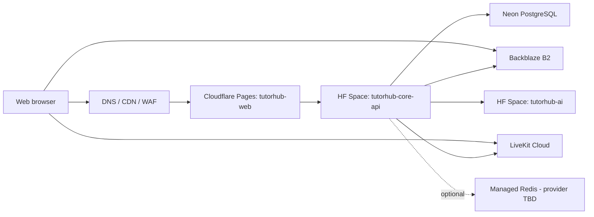

# Deployment baseline cho MVP

## 1. Sơ đồ triển khai



Browser chỉ upload trực tiếp lên B2 sau khi core API kiểm tra quyền và cấp presigned URL. Browser kết nối LiveKit sau khi core API cấp room token giới hạn quyền.

## 2. Tách môi trường

| Thành phần | Local | Staging | Production |
|---|---|---|---|
| Web/API | Local process | Cloudflare Pages + HF API Space | Chưa quyết định; review trước pilot |
| PostgreSQL | Local container | Neon staging branch/project | Neon production project |
| Object storage | Local emulator hoặc bucket dev | B2 staging bucket | B2 production bucket |
| LiveKit | Dev project | Staging project | Production project |
| Secrets | Local `.env` ignored | HF Secrets staging | HF Secrets production |

Không dùng chung database, bucket, LiveKit key hoặc OIDC client giữa staging và production.

## 3. Biến cấu hình tối thiểu

Chỉ tên biến được đưa vào `.env.example`; không có giá trị thật:

```text
APP_ENV
PUBLIC_WEB_ORIGIN
DATABASE_URL
DATABASE_POOL_URL
SESSION_SECRET
OIDC_ISSUER_URL
OIDC_CLIENT_ID
OIDC_CLIENT_SECRET
B2_ENDPOINT
B2_REGION
B2_BUCKET
B2_KEY_ID
B2_APPLICATION_KEY
LIVEKIT_URL
LIVEKIT_API_KEY
LIVEKIT_API_SECRET
OTEL_EXPORTER_OTLP_ENDPOINT
SENTRY_DSN
```

Redis chỉ được thêm khi Phase 1 xác nhận nhu cầu session/rate-limit coordination và chọn managed provider. Không chạy Redis bền vững bên trong cùng Hugging Face Space.

## 4. Quy tắc Neon

- Migration chạy bằng release job có kiểm soát, không chạy tùy tiện từ mọi replica lúc startup.
- API dùng connection pooling và timeout; không mở connection mới cho từng thao tác.
- Dùng role riêng cho migration và runtime.
- Backup/restore, branch strategy và point-in-time recovery phải được diễn tập trước public beta.
- Schema nghiệp vụ tenant-scoped luôn có `tenant_id` và index truy vấn tương ứng.

## 5. Quy tắc Backblaze B2

- Binary không đi qua database và không lưu vĩnh viễn trên HF filesystem.
- Object key dùng opaque ID; tên file người dùng chỉ là metadata.
- Presigned upload URL có thời hạn ngắn, giới hạn object key và content length theo policy.
- Sau upload, backend xác minh size/checksum/type và trạng thái malware scan trước khi công khai file.
- Download private dùng authorization check và signed URL; không biến bucket riêng tư thành public để đơn giản hóa.
- Lifecycle policy áp dụng cho multipart chưa hoàn tất, file tạm và retention theo tenant.

## 6. Quy tắc Hugging Face Spaces

- API stateless; session/state bền vững nằm ở Neon hoặc managed state service.
- Health endpoint tách liveness/readiness; readiness kiểm tra dependency quan trọng có timeout.
- Shutdown xử lý graceful, dừng nhận request và đóng connection pool.
- Background job quan trọng phải idempotent và lưu trạng thái ngoài Space.
- Log gửi ra observability backend; local log chỉ là tạm thời.
- Mỗi Space có image pin theo digest/tag release và rollback được.

## 7. Gate trước public beta

1. Load test HTTP và WebSocket trên cấu hình Space thực.
2. Đo cold start/restart và khả năng phục hồi khi Space bị thay thế.
3. Xác nhận giới hạn concurrent connection, request timeout và background job.
4. Kiểm tra Neon connection budget trong peak load.
5. Kiểm tra B2 multipart upload, signed download và CDN cache behavior.
6. Có phương án chuyển image sang nền tảng container khác nếu availability/SLA không đạt.
