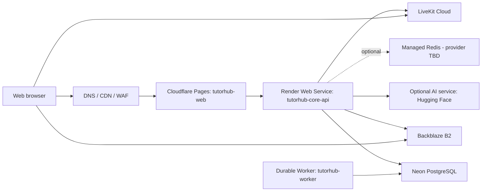

# Deployment baseline cho MVP

## 1. Sơ đồ triển khai


```mermaid
flowchart LR
    USER["Web browser"] --> EDGE["DNS / CDN / WAF"]
    EDGE --> WEB["Cloudflare Pages: tutorhub-web"]
    WEB --> API["Render Web Service: tutorhub-core-api"]
    API --> NEON["Neon PostgreSQL"]
    WORKER["Durable Worker: tutorhub-worker"] --> NEON
    API --> B2["Backblaze B2"]
    USER --> B2
    API --> LK["LiveKit Cloud"]
    USER --> LK
    API --> AI["Optional AI service: Hugging Face"]
    API -. optional .-> REDIS["Managed Redis - provider TBD"]
```

Browser chỉ upload trực tiếp lên B2 sau khi core API kiểm tra quyền và cấp presigned URL. Browser kết nối LiveKit sau khi core API cấp room token giới hạn quyền.

Core API và outbox worker dùng cùng OCI image nhưng là hai process và hai database
credential riêng. Worker phải chạy trên host bền vững không spin-down; Render Free Web
Service không đáp ứng điều kiện này.

### Quyết định vận hành hiện tại — 2026-07-31

Render Web Service tiếp tục là host Core API cho staging/private alpha. Chưa có quyết
định chuyển Core API sang OCI/Cloud Run/Oracle hay provider khác trong phạm vi cập nhật
này. Render Free không được dùng làm `tutorhub-worker`; không thay durable worker bằng
external ping, cron, GitHub Actions schedule hoặc laptop. Các kiểm tra local/CI/
disposable staging vẫn bắt buộc; gate cần worker host không spin-down, provider event
ingress hoặc domain production được ghi `DEFERRED/VERIFY` và không bật side effect.

## 2. Tách môi trường

| Thành phần | Local | Staging | Production |
|---|---|---|---|
| Web/API | Local process | Cloudflare Pages + Render Web Service | Chưa quyết định; review trước pilot |
| Outbox worker | Local process riêng | `DEFERRED`: durable non-spin-down host, provider chưa provision | Review capacity/SLA trước pilot |
| PostgreSQL | Local container | Neon staging branch/project | Neon production project |
| Object storage | Local emulator hoặc bucket dev | B2 staging bucket | B2 production bucket |
| LiveKit | Dev project | Staging project | Production project |
| Secrets | Local `.env` ignored | Render Environment + Cloudflare secrets | Managed secret store production |

Không dùng chung database, bucket, LiveKit key hoặc OIDC client giữa staging và production.

## 3. Biến cấu hình tối thiểu

Chỉ tên biến được đưa vào `.env.example`; không có giá trị thật:

```text
APP_ENV
PUBLIC_WEB_ORIGIN
DATABASE_URL
DATABASE_POOL_URL
DATABASE_WORKER_URL
SESSION_SECRET
OIDC_ISSUER_URL
OIDC_CLIENT_ID
OIDC_CLIENT_SECRET
B2_ENDPOINT
B2_REGION
B2_BUCKET
B2_KEY_ID
B2_APPLICATION_KEY
LIVEKIT_URL
LIVEKIT_API_KEY
LIVEKIT_API_SECRET
OTEL_EXPORTER_OTLP_ENDPOINT
SENTRY_DSN
EDGE_CONTEXT_SECRET
EDGE_CONTEXT_MAX_SKEW
FEATURE_CONTROL_DISABLE_MEMBERSHIP_INVITATIONS
FEATURE_CONTROL_DISABLE_CLASS_MANAGEMENT
FEATURE_CONTROL_DISABLE_CLASS_INVITE_LINKS
FEATURE_CONTROL_DISABLE_CLASS_SESSION_SCHEDULING
FEATURE_CONTROL_ENABLE_CLASS_SESSION_RECURRENCE
FEATURE_CONTROL_MAX_MEMBERS
FEATURE_CONTROL_MAX_ACTIVE_CLASSES
FEATURE_CONTROL_MAX_INVITE_CREATIONS_PER_HOUR
FEATURE_CONTROL_ENABLE_IN_APP_NOTIFICATIONS
OUTBOX_ENABLE_IN_APP_NOTIFICATION_CANARY
OUTBOX_WORKER_ID
OUTBOX_WORKER_POLL_INTERVAL
OUTBOX_WORKER_LEASE_DURATION
OUTBOX_WORKER_BATCH_SIZE
OUTBOX_WORKER_CONCURRENCY
OUTBOX_WORKER_MAX_ATTEMPTS
OUTBOX_WORKER_RETRY_BASE_DELAY
OUTBOX_WORKER_RETRY_MAX_DELAY
OUTBOX_WORKER_HANDLER_TIMEOUT
OUTBOX_WORKER_SHUTDOWN_TIMEOUT
OUTBOX_WORKER_METRICS_ADDR
```

Redis chỉ được thêm khi có nhu cầu session/rate-limit coordination đã đo được và chọn managed provider.

### P2-09 feature/quota và edge context

- `EDGE_CONTEXT_SECRET` là key base64 ngẫu nhiên, phải giống nhau ở Cloudflare Pages
  Function và Render Core API nhưng chỉ nằm trong secret store của từng provider.
- `EDGE_CONTEXT_MAX_SKEW` giới hạn tuổi chữ ký; staging mặc định `2m` và Core API từ
  chối khởi động nếu giá trị lớn hơn hard maximum `5m`. Core API fail fast ngoài local
  khi thiếu/sai secret. Assertion thiếu/sai/quá hạn không được tin; request dùng direct
  peer prefix và vẫn đi qua shared limiter.
- Ba `FEATURE_CONTROL_DISABLE_*` là global emergency switch. Tenant override không
  được phép bật lại feature đã bị global switch tắt.
- Ba `FEATURE_CONTROL_MAX_*` là default đồng thời là safety ceiling. Override tenant
  phải nằm trong ceiling; thay đổi giá trị phải qua review capacity và rollback plan.
- P2-09 dùng PostgreSQL shared fixed-window limiter để nhiều Render instance có cùng
  state. Bucket hash phải domain-separate theo limiter version, purpose và canonical
  client prefix; không dùng cùng digest cho hai purpose dù cột `purpose` khác nhau.
  Redis vẫn chưa phải dependency; chỉ xem xét lại sau số liệu contention/load.
- Trình tự staging bắt buộc: migration `000012` -> runtime grants/retention theo
  `docs/DATABASE.md` -> cấu hình Cloudflare/Render -> deploy Core API -> deploy web ->
  health/readiness/capability/limiter smoke -> acceptance. Không deploy code mới trước
  migration/grants vì limiter và evaluator được thiết kế fail closed.

## 4. Quy tắc Neon

- Migration chạy bằng release job có kiểm soát, không chạy tùy tiện từ mọi replica lúc startup.
- API dùng connection pooling và timeout; không mở connection mới cho từng thao tác.
- Dùng role riêng cho migration và runtime.
- Backup/restore, branch strategy và point-in-time recovery phải được diễn tập trước public beta.
- Schema nghiệp vụ tenant-scoped luôn có `tenant_id` và index truy vấn tương ứng.

## 5. Quy tắc Backblaze B2

- Binary không đi qua database và không lưu vĩnh viễn trên filesystem của container.
- Object key dùng opaque ID; tên file người dùng chỉ là metadata.
- Presigned upload URL có thời hạn ngắn, giới hạn object key và content length theo policy.
- Sau upload, backend xác minh size/checksum/type và trạng thái malware scan trước khi công khai file.
- Download private dùng authorization check và signed URL; không biến bucket riêng tư thành public để đơn giản hóa.
- Lifecycle policy áp dụng cho multipart chưa hoàn tất, file tạm và retention theo tenant.

## 6. Quy tắc Core API trên Render

- API stateless; session/state bền vững nằm ở Neon hoặc managed state service.
- Health endpoint tách liveness/readiness; readiness kiểm tra dependency quan trọng có timeout.
- Shutdown xử lý graceful, dừng nhận request và đóng connection pool.
- Background job quan trọng phải idempotent và lưu trạng thái ngoài container.
- Log gửi ra observability backend; local log chỉ là tạm thời.
- Image phải tái lập được; mỗi lần triển khai có health check, migration kiểm soát và đường rollback.
- Render Free chỉ dùng cho staging/private alpha vì instance có thể spin down và cold start trên 50 giây.
- Hugging Face chỉ còn là lựa chọn cho dịch vụ AI độc lập, không phải nơi chạy Core API.

### P3-03/P3-04 outbox worker và notification canary

- `tutorhub-core-api` và `tutorhub-worker` không dùng chung database login. API role chỉ
  có quyền feed/read-state/preference cần thiết; worker role chỉ có exact outbox lease
  grants và column-level `INSERT` cho effect đang bật.
- Thứ tự rollout bắt buộc: dừng worker -> migration `000015` rồi `000016` -> direct
  grants theo `docs/DATABASE.md` -> chạy capability probe bằng đúng worker/API login ->
  bật riêng canary gate -> khởi động worker -> nghiệm thu duplicate và crash/reclaim.
- Product gate `FEATURE_CONTROL_ENABLE_IN_APP_NOTIFICATIONS` vẫn `false` trong canary.
  Chỉ bật sau khi P3-03B và acceptance P3-04 đạt; API feed luôn loại system canary.
- Rollback: đặt cả hai gate về `false` -> dừng worker -> revoke notification effect grant
  -> khởi động lại worker với exact P3-03 ACL. Không xóa projection để rollback code.
- Render Free có thể tiếp tục chạy Core API staging/private alpha, nhưng không được dùng
  làm durable worker. Chi tiết lệnh grant/probe/canary nằm trong `docs/DATABASE.md` và
  `docs/P3_03_OUTBOX_WORKER_RUNBOOK.md`.

## 7. Gate trước public beta

1. Load test HTTP và WebSocket trên cấu hình hosting production dự kiến.
2. Đo cold start/restart và khả năng phục hồi khi container bị thay thế.
3. Xác nhận giới hạn concurrent connection, request timeout và background job.
4. Kiểm tra Neon connection budget trong peak load.
5. Kiểm tra B2 multipart upload, signed download và CDN cache behavior.
6. Chuyển khỏi Render Free trước public beta hoặc khi availability/SLA không đạt.
