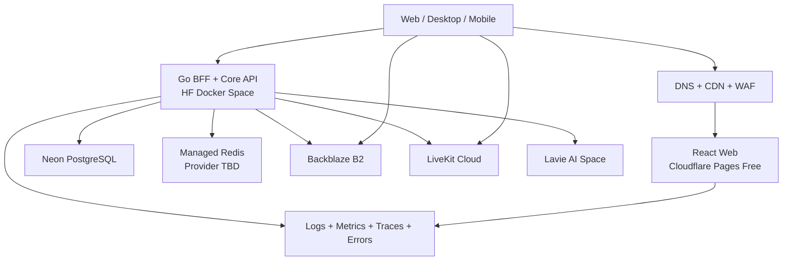

# TutorHub V2 - Master Engineering and Product Plan

> Tài liệu nguồn sự thật để tiếp quản dự án khi không còn lịch sử hội thoại.

| Thuộc tính | Giá trị |
|---|---|
| Dự án | TutorHub V2 |
| Thư mục | `D:\TutorHub_V2` |
| Repository | `https://github.com/basangnguyen/TUTORHUB_WEB` |
| Dự án tham chiếu V1 | `D:\Ban_sao_du_an` |
| Chiến lược | Web-first, sau đó Desktop Tauri và Mobile React Native |
| Trạng thái | Phase 0 hoàn thành; Phase 1 P1-01 hoàn thành cục bộ |
| Cập nhật | 2026-07-13 |

## 1. Cách sử dụng tài liệu

Agent hoặc thành viên mới phải đọc theo thứ tự:

1. `AGENTS.md` - quy tắc bắt buộc.
2. `docs/AGENT_COORDINATION.md` - ownership, Git workflow, checklist và bàn giao.
3. `docs/PROJECT_STATE.md` - trạng thái thực tế và việc kế tiếp.
4. Tài liệu này - kế hoạch tổng thể.
5. Các ADR trong `docs/adr` - quyết định kiến trúc có thẩm quyền cao nhất.
6. Tài liệu chuyên đề liên quan task.

Khi có xung đột, thứ tự ưu tiên là: ADR đã Accepted -> `PROJECT_STATE.md` mới nhất -> master plan -> tài liệu chuyên đề cũ. Không sửa quyết định Accepted bằng cách âm thầm đổi code; phải tạo ADR mới thay thế.

## 2. Tầm nhìn và mục tiêu

TutorHub V2 là nền tảng học trực tuyến đa tenant, đa thiết bị, hướng tới thị trường toàn cầu. Sản phẩm kết hợp:

- Quản lý tổ chức, giáo viên, học sinh và lớp học.
- Phòng học video quy mô lớn với moderation.
- Bảng trắng cộng tác và công cụ dạy học chuyên sâu.
- Tin nhắn, lịch, nhiệm vụ, tài liệu và thông báo.
- Ngân hàng câu hỏi, thi, QuizHub và phân tích học tập.
- Lavie AI có kiểm soát dữ liệu, quyền và audit.
- Secure Exam native cho các khả năng trình duyệt không thể thực hiện.

Mục tiêu kỹ thuật là dùng chung backend và contract cho web, desktop và mobile; không tạo ba hệ thống nghiệp vụ độc lập.

## 3. Phạm vi sản phẩm theo nền tảng

### 3.1 Web - nền tảng đầu tiên

Web cung cấp toàn bộ luồng phổ thông: auth, lớp, phòng học, cộng tác, nội dung, đánh giá, giao tiếp và quản trị. Đây là nơi domain/API/design system được ổn định trước.

### 3.2 Desktop - triển khai sau Web MVP

Desktop dùng Tauri 2 + React + TypeScript, bổ sung Rust command cho:

- Secure storage và tích hợp hệ điều hành.
- Native notification, auto-update và file integration.
- Local FFmpeg/media preprocessing khi cần.
- Secure Exam handoff tới native lockdown companion.

Desktop không dùng JCEF. WebView của Tauri tải frontend được build riêng và gọi cùng API V2.

### 3.3 Mobile - triển khai sau khi API ổn định

Mobile dùng React Native + TypeScript. Có thể chia sẻ domain types, validation, API client và design tokens; không chia sẻ trực tiếp component DOM của web.

### 3.4 Native Secure Exam

Secure Exam tiếp tục là sản phẩm Rust/Windows native. Web chỉ quản lý cấu hình, cấp phiên thi, nhận kết quả và kích hoạt signed handoff. Không tuyên bố browser có thể chặn Alt+Tab, process, capture hoặc khóa OS.

## 4. Hiện trạng TutorHub V1

V1 tại `D:\Ban_sao_du_an` là nguồn tham chiếu nghiệp vụ, UI flow và dữ liệu, không phải codebase V2.

| Lớp | Công nghệ V1 |
|---|---|
| Desktop UI | Java 21, Swing, FlatLaf, MigLayout |
| Web nhúng | JCEF, JavaFX Web/Media |
| Core server | Java socket server, packet/string protocol |
| Realtime classroom | Node.js, Express, WebSocket, Yjs, LiveKit |
| Whiteboard | React, Vite, tldraw, MathLive, Mermaid, Prism |
| AI | FastAPI, LangChain4j/Ollama/OpenAI-compatible, voice/vision/TTS |
| Database | PostgreSQL/Neon và SQLite cục bộ cho một số luồng thi |
| Storage/media | Backblaze B2, S3 API, Cloudflare, FFmpeg |
| Native security | Rust, JNA, Win32, DPAPI |

V1 có nhiều chức năng giá trị nhưng UI, networking, persistence và config bị phân tán. V2 tái sử dụng đặc tả và algorithm có kiểm tra, không port cơ học Swing/JCEF/packet code.

## 5. Quyết định kiến trúc đã khóa

| ID | Quyết định | Phạm vi |
|---|---|---|
| ADR-0001 | Monorepo | Toàn V2 |
| ADR-0002 | React + TypeScript strict + Vite | Web |
| ADR-0003 | Go modular monolith | Backend mới |
| ADR-0004 | LiveKit Cloud trước | Classroom MVP |
| ADR-0005 | OIDC + BFF opaque session cookie | Authentication |
| ADR-0006 | Neon + HF Docker Spaces + Backblaze B2 | MVP/private beta |
| ADR-0007 | Zero-cost alpha; Cloudflare Pages + HF Core API | Private alpha |

Quyết định bổ sung:

- OpenAPI là nguồn sự thật của HTTP contract.
- Generated TypeScript client, không viết tay API shape lặp lại.
- PostgreSQL là system of record; Redis chỉ giữ state có thể tái tạo.
- Multi-tenancy và authorization server-side từ ngày đầu.
- Managed services trước, không Kubernetes trong MVP.
- Strangler migration, không big-bang rewrite.

## 6. Kiến trúc mục tiêu



### 6.1 Nguyên tắc luồng dữ liệu

- Browser không kết nối Neon trực tiếp.
- Browser không biết Neon password, B2 application key, LiveKit API secret hoặc OIDC client secret.
- Upload file: client xin presigned URL -> upload B2 -> backend xác minh và hoàn tất metadata.
- Vào phòng: client xin join authorization -> backend kiểm tra tenant/class/session -> cấp LiveKit token tối thiểu quyền.
- Media đi client <-> LiveKit, không đi qua Go API hoặc Hugging Face.
- Persistent chat/score/notification đi qua backend realtime; LiveKit DataChannel chỉ dành cho tín hiệu tạm thời.
- Hugging Face filesystem là ephemeral, không là nguồn dữ liệu duy nhất.

## 7. Cấu trúc repository mục tiêu

```text
TutorHub_V2/
|-- apps/
|   `-- web/                    # React app
|-- packages/
|   |-- api-client/             # generated từ OpenAPI
|   |-- design-tokens/          # color/type/spacing/motion
|   |-- domain/                 # shared TS domain types an toàn
|   |-- realtime/               # web realtime abstractions
|   |-- ui/                     # accessible web components
|   `-- validation/             # shared client schemas khi phù hợp
|-- services/
|   `-- core-api/               # Go modular monolith/BFF
|-- infrastructure/
|   |-- docker/
|   |-- huggingface/
|   `-- scripts/
|-- docs/
|   |-- adr/
|   |-- api/
|   |-- runbooks/
|   `-- threat-models/
|-- pnpm-workspace.yaml
|-- turbo.json
`-- go.work
```

Không tạo `services/*` riêng cho từng danh từ ở Phase 1. Module nội bộ chỉ tách thành service khi có ownership, reliability hoặc scaling requirement đã đo.

## 8. Kiến trúc frontend web

### 8.1 Nền tảng

- React, TypeScript strict, Vite.
- React Router cho route và layout.
- TanStack Query cho server state/cache/retry.
- Local state trước; store toàn cục chỉ cho cross-route UI/session state thực sự cần.
- Storybook cho component states và visual QA.
- i18n tiếng Việt/Anh từ đầu.

### 8.2 App shell

App shell gồm sidebar, topbar/search, notification, tenant selector, profile menu và vùng route. Mọi route phải có loading, empty, error, forbidden, offline và retry state thích hợp.

### 8.3 Design system

Token bắt buộc: màu semantic, typography, spacing, radius, shadow, motion, breakpoint, z-index và focus ring. Component nền: button/icon button, field, select, checkbox, switch, tabs, menu, tooltip, dialog, drawer, toast, table, pagination, skeleton, empty state, avatar và permission guard.

WCAG, keyboard navigation, reduced motion, contrast và screen reader labels là acceptance criteria, không phải polish cuối dự án.

### 8.4 Performance

- Route-level code splitting.
- Lazy load whiteboard, editor, Mermaid, MathLive, PDF và media tools.
- Performance budget cho initial JS, image và font.
- Không nhúng một HTML hàng chục nghìn dòng như V1.
- Virtualize danh sách lớn và tránh rerender toàn bộ participant grid.

## 9. Kiến trúc backend Go

### 9.1 Module nội bộ

| Module | Trách nhiệm |
|---|---|
| identity | External identity mapping, user, session, revoke |
| tenancy | Tenant, membership, role assignment, policy |
| classroom | Class, enrollment, invite, schedule, live session |
| media | LiveKit room/token/recording metadata |
| messaging | Conversation, persistent message, moderation |
| content | File metadata, upload/download authorization, quota |
| assessment | Question bank, exam, QuizHub, attempt, grading |
| notification | In-app/email event và preference |
| search | Permission-filtered indexing/query |
| ai | Lavie orchestration, knowledge policy và audit |
| billing | Plan, entitlement, usage; triển khai sau |
| audit | Security/admin events và retention |

### 9.2 Layer trong mỗi module

`transport -> application service -> domain -> repository/adapter`. HTTP handler không chứa SQL hoặc rule chuyển trạng thái. Repository không quyết định authorization. Module không truy cập bảng module khác tùy tiện.

### 9.3 API conventions

- Base path `/api/v1`.
- JSON UTF-8; timestamp UTC ISO-8601.
- UUID/opaque ID ở public contract.
- Cursor pagination cho danh sách thay đổi thường xuyên.
- Problem Details cho lỗi, kèm `requestId` và error code ổn định.
- Idempotency key cho create/payment/upload-finalize/submit quan trọng.
- Optimistic concurrency/version cho resource dễ xung đột.
- OpenAPI update và generated client là một phần cùng PR.

### 9.4 Endpoint MVP dự kiến

```text
GET    /api/v1/me
POST   /api/v1/auth/logout
GET    /api/v1/tenants
POST   /api/v1/tenants/{tenantId}/select
GET    /api/v1/classes
POST   /api/v1/classes
GET    /api/v1/classes/{classId}
PATCH  /api/v1/classes/{classId}
POST   /api/v1/classes/{classId}/invitations
POST   /api/v1/invitations/{code}/accept
GET    /api/v1/classes/{classId}/sessions
POST   /api/v1/classes/{classId}/sessions
POST   /api/v1/class-sessions/{sessionId}/start
POST   /api/v1/class-sessions/{sessionId}/join-token
POST   /api/v1/class-sessions/{sessionId}/end
GET    /api/v1/class-sessions/{sessionId}/participants
GET    /api/v1/class-sessions/{sessionId}/messages
POST   /api/v1/class-sessions/{sessionId}/messages
POST   /api/v1/files/uploads
POST   /api/v1/files/uploads/{uploadId}/complete
GET    /api/v1/files/{fileId}/download-url
```

Danh sách này là contract plan, không phải API đã tồn tại.

## 10. Multi-tenancy và phân quyền

Mọi resource nghiệp vụ thuộc tenant phải có `tenant_id`. Tenant được lấy từ authenticated server context, không tin body/header tùy ý.

Role ban đầu: Platform Admin, Organization Admin, Teacher, Teaching Assistant, Student, Guest. Backend kiểm tra `subject + action + resource + tenant`; UI chỉ phản ánh permission, không thay thế authorization.

Các deny case bắt buộc test:

- Người tenant A đọc/sửa resource tenant B.
- Student gọi API teacher/admin.
- Teacher quản lý lớp không được phân công.
- Guest dùng invite hết hạn hoặc publish track vượt policy.
- User sửa object ID/tenant ID trong request.
- Presigned URL dùng sai object key hoặc hết hạn.

## 11. Dữ liệu Neon PostgreSQL

### 11.1 Bảng nền dự kiến

```text
users
external_identities
auth_sessions
tenants
memberships
role_assignments
classes
class_enrollments
class_invitations
class_sessions
media_rooms
session_participants
conversations
messages
file_objects
file_uploads
audit_events
outbox_events
```

Assessment/social/AI thêm migration sau, không tạo toàn bộ schema tương lai ngay Phase 1.

### 11.2 Quy tắc database

- Migration versioned; runtime production không tự `CREATE TABLE`.
- Migration role tách runtime role.
- Query tenant-scoped có index bắt đầu bằng/bao gồm `tenant_id` phù hợp pattern.
- Foreign key, unique constraint và check constraint bảo vệ invariant.
- Transaction ngắn; timeout và connection pool có giới hạn.
- Outbox event ghi cùng transaction với thay đổi domain.
- Không lưu binary/base64 lớn trong PostgreSQL.
- Neon staging và production tách project/branch và credential.

## 12. Hạ tầng Hugging Face Spaces

### 12.1 Spaces dự kiến

- `tutorhub-core-api`: Go API/BFF.
- `tutorhub-ai`: Lavie AI workload.
- `tutorhub-realtime`: chỉ thêm sau spike chứng minh cần tách.

React web được triển khai lên Cloudflare Pages Free trong private alpha. ADR-0007 thay thế phần web hosting bằng HF của ADR-0006.

### 12.2 Ràng buộc

- Container stateless và graceful shutdown.
- State bền vững ở Neon/B2/managed state service.
- Health, readiness, timeout, retry có jitter và circuit-break behavior hợp lý.
- Không đặt secret trong Dockerfile/image/repo/log.
- Không giả định free tier có SLA hoặc đủ concurrent connection.
- Trước public beta phải đo cold start, restart, HTTP concurrency, WebSocket/SSE và availability.

Nếu không đạt gate, chuyển cùng OCI image sang managed container platform khác; không thay API/domain chỉ để đổi host.

## 13. Backblaze B2 và file pipeline

```text
Client chọn file
-> API kiểm tra quyền/quota/type/size dự kiến
-> API tạo file_upload + presigned URL
-> Client multipart upload trực tiếp B2
-> Client gọi complete
-> Backend xác minh object, size, checksum
-> Malware/content scan
-> File chuyển trạng thái AVAILABLE hoặc REJECTED
-> Download yêu cầu authorization và signed URL
```

Object key là opaque ID theo environment/tenant, không dùng raw filename làm path authority. Bucket dev/staging/prod tách biệt. Lifecycle dọn multipart dang dở, file tạm và dữ liệu hết retention. Cloudflare có thể cache/phân phối nội dung theo policy, nhưng không bỏ authorization của file riêng tư.

## 14. LiveKit classroom

### 14.1 Flow vào phòng

1. User mở session detail.
2. Prejoin xin quyền mic/camera theo hành động người dùng.
3. User chọn thiết bị và preview.
4. API kiểm tra membership, session state và role.
5. API cấp LiveKit token có identity/metadata/grant tối thiểu.
6. Client connect, publish track theo policy.
7. Telemetry ghi join latency/failure/reconnect.
8. Leave giải phóng track và device.

### 14.2 Chức năng toolbar và phase

| Chức năng | Xử lý chính | Phase |
|---|---|---|
| Mic/camera | LiveKit local track, device permission/state | 3 |
| Screen share | LiveKit screen track, browser capability | 3 |
| Participant/active speaker | LiveKit events + server role metadata | 3 |
| Lobby/admit/remove/mute | Backend policy + LiveKit room API | 3 |
| Raise hand/reaction | Ephemeral realtime event, optional persistence | 3/4 |
| Chat | Persistent backend message; sanitize/moderate | 3/4 |
| Record | Server-side LiveKit egress, consent/retention | 4 |
| Whiteboard | tldraw + Yjs + snapshot/permission | 4 |
| Files | B2 pipeline, permission và preview | 4 |
| Breakout room | Separate room/session token, teacher orchestration | 4/6 |
| Quiz | Assessment service + realtime response | 5 |
| Code/Arena | Sandboxed execution service, quota và isolation | 6 |
| YouTube co-watch | Synchronized player state, provider policy | 4/6 |
| Math | MathLive/KaTeX custom board object | 4 |
| Diagram | Mermaid/custom board object, sanitized rendering | 4 |
| Snippet | Editor + syntax highlight; no arbitrary execution | 4 |
| Experiment/PhET | Allowlisted sandboxed embed | 4/6 |
| Browse video | Authorized content picker, no unrestricted proxy | 4/6 |

Breakout room không được mô phỏng bằng cách chỉ ẩn participant ở client. Recording không dùng browser local recording làm nguồn chính thức.

### 14.3 Quy mô

Phân biệt ba mode:

- Meeting/classroom tương tác: tất cả hoặc nhiều người publish.
- Webinar: ít presenter, nhiều attendee subscribe.
- Broadcast: media được chuyển sang CDN/streaming architecture.

Không hứa một room phục vụ mọi quy mô. Load profile và product mode quyết định topology.

## 15. Whiteboard và cộng tác

- React/tldraw là canvas chính.
- Yjs xử lý CRDT, awareness và incremental update.
- Backend lưu document metadata/snapshot/version; không tin local browser là bản duy nhất.
- Permission theo board/class/session và role.
- Custom shape: math, diagram, snippet, quiz, file, media, experiment.
- Renderer HTML/SVG/Mermaid phải sanitize hoặc sandbox.
- Snapshot, recovery, export và lesson replay được thiết kế theo event/timeline ở phase sau.

## 16. Các tab sản phẩm và kế hoạch di chuyển

| Tab/miền V1 | V2 dự kiến | Ưu tiên |
|---|---|---|
| Đăng nhập | OIDC/BFF, tenant selector, session revoke | MVP |
| Bảng tin | Dashboard học tập trước; social feed sau | P1/P3 |
| Reels/Locket | Upload/transcode/moderation/privacy | P3 |
| Tin nhắn | Persistent chat P1; Lavie AI P3 | P1/P3 |
| Lớp học/Đã nhận | Classes, enrollment, invite, session | MVP |
| Lịch | Session/assignment calendar | P1 |
| Thi | Assessment + native Secure Exam orchestration | P2/native |
| QuizHub | Quiz engine, scoring, power-up, analytics | P2 |
| Đề thi/Câu hỏi | Question bank, paper, import, grading | P2 |
| Nhiệm vụ | Assignment/task workflow | P2 |
| Tài liệu/Drive | B2 metadata, sharing, preview, quota | P1 |
| Bảng vẽ | tldraw/Yjs classroom board | P1 |
| Hồ sơ | User/org profile, settings, security sessions | MVP/P1 |
| Nâng cấp | Entitlement/billing/usage | P3 |
| Global search | Permission-aware indexed search | P1/P3 |
| Admin | Tenant/platform administration và audit | P2/P3 |

## 17. Authentication và session

- OIDC Authorization Code + PKCE.
- BFF giữ provider token; browser chỉ có opaque cookie.
- Cookie HttpOnly, Secure, SameSite phù hợp.
- CSRF protection cho request dùng cookie.
- Idle timeout, absolute timeout, revoke và refresh rotation.
- MFA/passkey bắt buộc cho Platform Admin; step-up cho thao tác nhạy cảm.
- Không lưu access/refresh token trong localStorage.
- Local, staging và production dùng OIDC client riêng.

IdP cụ thể vẫn là quyết định mở của Phase 1; phải tạo ADR sau spike chi phí, enterprise federation, MFA/passkey và portability.

## 18. Security và privacy

Baseline là OWASP ASVS Level 2 và NIST SSDF. Trước public beta:

- CSP, HSTS, CORS allowlist, CSRF, secure headers.
- Output encode/sanitize; sandbox nội dung không tin cậy.
- Secret scanning, SAST, dependency/container scan và SBOM.
- Least-privilege Neon role, B2 key và LiveKit grant.
- Structured immutable audit cho admin, permission, recording, exam và AI tool.
- Backup/restore drill, key rotation và incident runbook.
- Consent/retention cho recording, voice, trẻ em và AI.
- Legal review cho GDPR/COPPA và luật thị trường triển khai.

Toàn bộ key/token từng xuất hiện trong V1, ảnh hoặc hội thoại phải được coi là đã lộ và rotate. Không copy chúng sang V2.

## 19. Lavie AI

Lavie không nằm trong Web MVP. Khi triển khai:

- Backend quyết định system prompt, tenant knowledge scope và model provider.
- RAG chỉ truy xuất tài liệu user có quyền đọc.
- Citation gắn source/version/tenant.
- Voice, image, document và TTS có quota, consent và retention.
- Tool call theo allowlist, permission, preview/approval và audit.
- Web agent không được tự đọc/chạy code trên máy người dùng.
- Coding agent cần sandbox/worker riêng, workspace boundary và egress policy.

## 20. Migration V1 -> V2

### 20.1 Thứ tự

1. Identity mapping và tenant.
2. User/profile/membership.
3. Class/enrollment/invite.
4. Schedule/class session.
5. File metadata/object mapping.
6. Messaging/content.
7. Assessment/QuizHub.
8. Social/AI/admin.

### 20.2 Quy trình mỗi aggregate

- Data dictionary và source ownership.
- V2 schema/migration.
- Idempotent ETL và legacy-ID mapping.
- Dry-run trên bản sao không nhạy cảm.
- Count/checksum/reconciliation.
- Shadow read hoặc tenant feature flag.
- Cutover window và rollback.
- Loại bỏ adapter theo deadline.

Không dual-write kéo dài. Domain V2 không import Java class, packet name hoặc schema legacy.

## 21. Testing strategy

### Frontend

- Unit: pure function/hook/reducer.
- Component: React Testing Library.
- Storybook interaction và accessibility.
- Playwright E2E cho auth/class/prejoin/classroom.
- Visual regression cho layout quan trọng.

### Backend

- Unit domain/policy.
- Integration repository với PostgreSQL container.
- Contract/OpenAPI compatibility.
- Authorization allow/deny matrix.
- Migration forward/rollback test.

### Realtime/media

- Device permission/error matrix.
- Join/reconnect/leave và track cleanup.
- Participant role/moderation.
- Network degradation và browser compatibility.
- Load test API/token/WebSocket; LiveKit benchmark theo mode mục tiêu.

### Security

- Secret/SAST/dependency/container scan trong CI.
- DAST trên staging.
- Abuse/rate-limit/IDOR/tenant isolation tests.
- Pentest trước public beta.

## 22. CI/CD

### Pull request pipeline

`format -> lint -> typecheck -> unit -> integration -> build -> OpenAPI drift -> security scans -> preview -> Playwright smoke`.

### Deployment

- Image immutable, version/tag/digest rõ.
- Staging tự động sau merge theo policy.
- Production có approval, migration preflight, canary/feature flag và rollback.
- Migration không chạy đồng thời từ mọi replica.
- HF Secrets giữ credential; repo chỉ có `.env.example` giả.

## 23. Observability và SLO

Mọi request có request/trace ID. Log JSON không chứa secret/PII không cần thiết. OpenTelemetry cho trace/metric; error tracking cho web/API.

Dashboard tối thiểu:

- Auth success/failure/latency.
- API request rate, p50/p95/p99, error rate.
- Neon pool usage/query latency.
- B2 upload success/failure/duration.
- Classroom join success/latency, disconnect/reconnect, publish failure.
- HF restart/cold start/readiness.

Mục tiêu ban đầu: API CRUD p95 < 300 ms, classroom join success >= 99%, auth success >= 99,5%, không Critical/High trước public beta. Hiệu chỉnh sau telemetry beta.

## 24. Các phase và exit gate

### Phase 0 - Foundation - COMPLETED

Phạm vi, MVP, kiến trúc, domain, migration, security, deployment và ADR đã được tạo. Không có application code V2.

### Phase 1 - Engineering foundation - IN PROGRESS

Monorepo, React shell, Go API skeleton, design system, OpenAPI, Neon migration, OIDC spike, LiveKit spike, HF/B2 staging và CI.

P1-01 repository/toolchain đã hoàn thành cục bộ. Initial commit, push đầu tiên và CI Linux vẫn là gate chưa hoàn tất.

Exit: clean clone build/test; staging HTTPS; teacher/student đăng nhập và vào phòng test; không secret trong Git/bundle.

### Phase 2 - Identity, tenant, class

Session lifecycle, tenant membership/policy, class CRUD, enrollment/invite, schedule/session và authorization tests.

Exit: vertical slice class hoàn chỉnh, tenant isolation được chứng minh.

### Phase 3 - Classroom MVP

Prejoin, mic/camera/share, participant, active speaker, lobby/moderation, chat cơ bản, reconnect và telemetry.

Exit: E2E teacher/student ổn định trên browser matrix và load profile beta.

### Phase 4 - Classroom collaboration

Persistent chat, notification, whiteboard/Yjs, files/B2, recording/retention và công cụ board chính.

### Phase 5 - Learning workflows

Assignment, question bank, exam, attempt, grading, QuizHub và analytics.

### Phase 6 - Global readiness

Lavie, social, billing/admin, localization, moderation, compliance, multi-region assessment, DR và public launch.

### Native tracks

Desktop Tauri, mobile React Native và Secure Exam Rust được mở khi API/domain tương ứng đã ổn định; không làm chậm Web MVP trừ contract cần chuẩn bị.

## 25. Kế hoạch 30 ngày đầu Phase 1

### Tuần 1

- Pin Node/pnpm/Go.
- Tạo pnpm/Turborepo và Go workspace.
- Tạo app web/API skeleton, lint/format/test.
- Tạo CI đầu tiên và branch protection plan.

### Tuần 2

- Design tokens/component cơ bản/Storybook.
- Go config/log/health/error/request ID.
- Docker Compose local PostgreSQL/Redis placeholder.
- OpenAPI skeleton và generated client.

### Tuần 3

- Neon staging project, migration baseline.
- User/tenant/membership/session schema tối thiểu.
- OIDC/BFF spike, `/api/v1/me`, logout.
- App shell và protected routes.

### Tuần 4

- Class list/create vertical slice.
- LiveKit token/prejoin/room spike.
- HF staging Spaces và B2 staging bucket.
- Playwright smoke, telemetry và Phase 1 review.

## 26. Rủi ro và biện pháp

| Rủi ro | Biện pháp |
|---|---|
| HF Space sleep/restart/SLA | Stateless OCI, load/cold-start gate, portable host |
| Neon connection exhaustion | Pool, timeout, query index, connection budget |
| B2 upload abuse | Auth, quota, presign ngắn, verify, scan, lifecycle |
| Tenant data leak | Context bắt buộc, policy tập trung, deny tests |
| Media không ổn định | Prejoin, adaptive quality, reconnect, telemetry |
| V1 encoding/mojibake | UTF-8 end-to-end và fixture tiếng Việt |
| Port UI legacy nguyên khối | Route/module/design system và lazy loading |
| Microservice quá sớm | Modular monolith, ADR gate khi tách |
| Secure Exam vượt khả năng web | Native boundary và signed handoff |
| AI đọc sai dữ liệu nội bộ | Permission-filtered RAG, citation, audit |
| Chi phí tăng | Per-tenant usage telemetry, quota và review định kỳ |

## 27. Quyết định còn mở

Các mục sau cần spike/ADR, không tự chọn ngầm:

1. OIDC identity provider.
2. Managed Redis provider hoặc bỏ Redis khỏi giai đoạn đầu nếu chưa cần.
3. Observability/error tracking provider.
4. Cloudflare role cụ thể cho web/CDN/WAF và B2 private content.
5. Email/SMS provider.
6. Search engine khi PostgreSQL search không còn đủ.
7. Payment provider và legal entity/region.
8. Target concurrency, browser matrix và launch region đầu tiên.
9. HF Spaces có đạt public-beta gate hay phải chuyển host.

## 28. Quy trình làm việc cho agent

Trước task:

1. Đọc `PROJECT_STATE.md`, master plan, ADR và tài liệu chuyên đề.
2. Kiểm tra Git status; không revert thay đổi của người khác.
3. Ghi mục tiêu, file sửa, contract/module, rủi ro và cách test.
4. Nếu thay kiến trúc Accepted, tạo ADR superseding trước.

Sau task:

1. Chạy test/verification phù hợp.
2. Cập nhật OpenAPI/migration/docs cùng code.
3. Cập nhật checklist phase và `PROJECT_STATE.md`.
4. Báo file sửa, lệnh chạy, kết quả, rủi ro và bước tiếp theo.

Không được:

- Hardcode secret hoặc copy credential V1.
- Đưa token vào frontend/localStorage.
- Cho browser tự quyết quyền hoặc tự cấp LiveKit/B2 access.
- Lưu dữ liệu bền vững chỉ trên HF disk.
- Tạo microservice/Kubernetes chỉ vì “sẽ scale”.
- Chạy untrusted code trong core API hoặc browser origin chính.
- Port JCEF/Swing bridge sang web.

## 29. Definition of Done chung

Một tính năng chỉ hoàn thành khi:

- Behavior và permission acceptance criteria đạt.
- API/schema/version/migration nhất quán.
- Loading/empty/error/forbidden/offline states có xử lý.
- Unit/integration/E2E theo mức rủi ro đã chạy.
- Accessibility và i18n không bị phá vỡ.
- Telemetry/audit có cho flow quan trọng.
- Không lộ secret/PII và security scan qua gate.
- Deployment/rollback được mô tả.
- Tài liệu và `PROJECT_STATE.md` được cập nhật.

## 30. Điểm bắt đầu hiện tại

Task ưu tiên tiếp theo là bootstrap GitHub/CI, sau đó triển khai **P1-02 Web shell** và phần nền còn lại của **P1-04 Core API** theo ownership trong `docs/AGENT_COORDINATION.md`.

Không bắt đầu xây giao diện lớp học, QuizHub, Lavie hay Secure Exam trong V2 trước khi repository, CI, contract, auth skeleton và môi trường local/staging nền tảng tồn tại.
