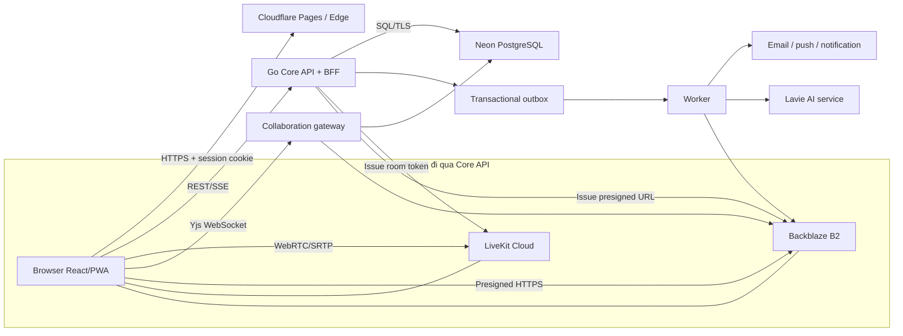
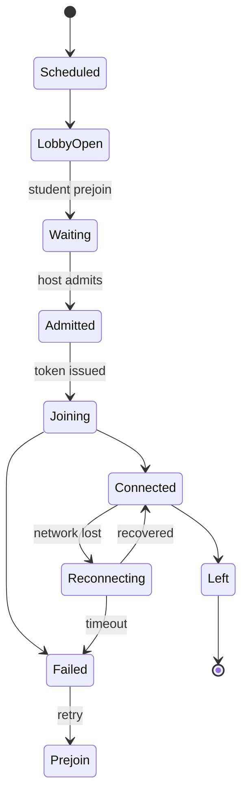
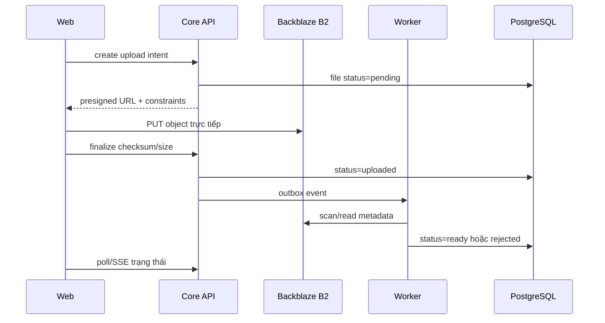
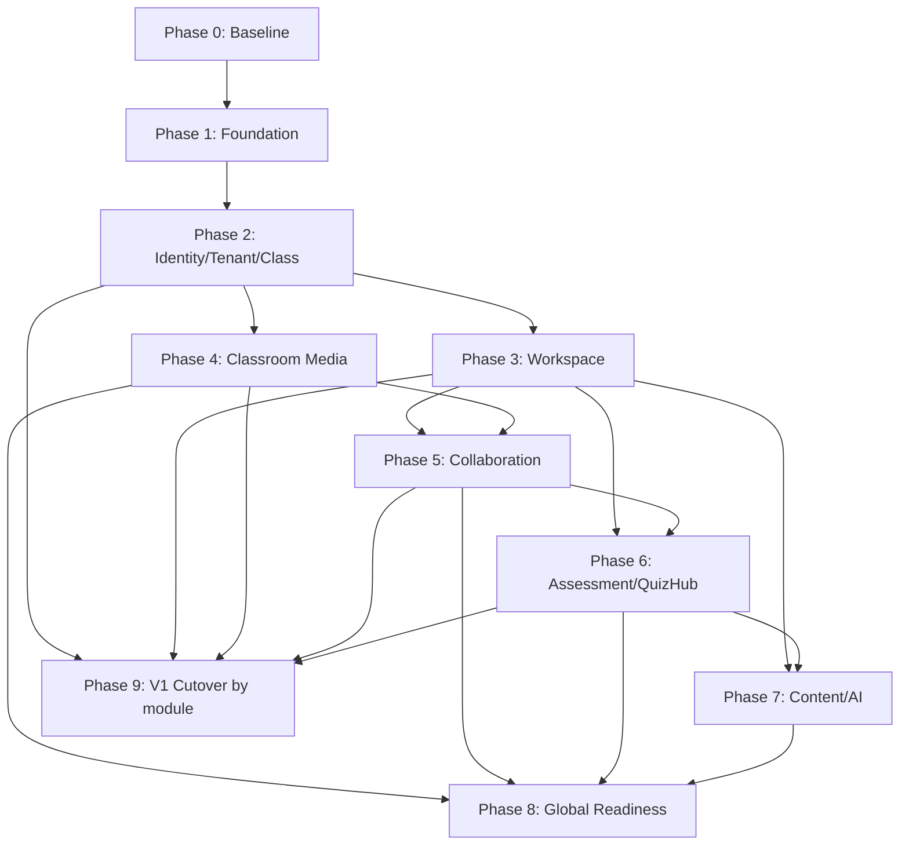

# TutorHub V2 - MASTER PLAN CHUYỂN ĐỔI SANG NỀN TẢNG WEB

> Nguồn sự thật cấp chiến lược cho việc xây dựng TutorHub V2 theo hướng web-first. Tài liệu này mô tả mục tiêu sản phẩm, kiến trúc, thứ tự triển khai, điều kiện nghiệm thu và lộ trình chuyển đổi từ TutorHub V1.

| Thuộc tính            | Giá trị                                                                                      |
| --------------------- | -------------------------------------------------------------------------------------------- |
| Phiên bản tài liệu    | 2.1                                                                                          |
| Cập nhật              | 2026-07-22                                                                                   |
| Phạm vi ưu tiên       | Web application                                                                              |
| Thư mục phát triển    | `D:\TutorHub_V2`                                                                             |
| Repository chính thức | `https://github.com/basangnguyen/TUTORHUB_WEB`                                               |
| Dự án V1 tham chiếu   | `D:\Ban_sao_du_an`, chỉ đọc                                                                  |
| Phase hiện tại        | Phase 2 - Identity, tenant và class core                                                     |
| Trạng thái gần nhất   | P2-10 tenant isolation/IDOR DONE; P2-11 V1 fixture import là task tiếp theo                  |
| Kiến trúc nền         | React + TypeScript + Vite; Go modular monolith; Neon PostgreSQL; LiveKit Cloud; Backblaze B2 |
| Môi trường miễn phí   | Chỉ dùng cho phát triển, demo và private alpha; không phải cam kết production                |

## 1. Mục đích và cách sử dụng

Master Plan trả lời sáu câu hỏi:

1. TutorHub V2 sẽ cung cấp sản phẩm web nào và chưa làm gì.
2. Kiến trúc nào được giữ, kiến trúc nào phải điều chỉnh sau khi đối chiếu Zoom, Google Meet và Microsoft Teams.
3. Mỗi phần của TutorHub V1 được chuyển sang web theo thứ tự nào.
4. Mỗi phase tạo ra đầu ra chạy được nào và điều kiện nào cho phép chuyển phase.
5. Hạ tầng miễn phí hiện tại phục vụ được quy mô nào và khi nào phải chuyển nhà cung cấp.
6. Agent hoặc thành viên mới phải bắt đầu ở đâu mà không phụ thuộc lịch sử hội thoại.

Thứ tự tài liệu có thẩm quyền:

1. ADR có trạng thái `Accepted`.
2. `docs/PROJECT_STATE.md` mới nhất.
3. `docs/AGENT_COORDINATION.md`.
4. Tài liệu này.
5. Backlog phase và tài liệu chuyên đề.

Nếu một quyết định trong tài liệu này khác ADR đã chấp nhận, phải tạo ADR mới để thay thế; không được âm thầm thay kiến trúc trong mã nguồn.

## 2. Kết luận điều hành

### 2.1 Quyết định được giữ

- Web dùng React, TypeScript strict và Vite.
- Backend bắt đầu bằng Go modular monolith, không tách microservice sớm.
- OpenAPI là nguồn contract giữa frontend và backend.
- OIDC Authorization Code + PKCE qua BFF, session bằng cookie bảo mật.
- Neon PostgreSQL là system of record.
- LiveKit Cloud xử lý media WebRTC trong giai đoạn đầu.
- Backblaze B2 lưu object; frontend upload/download qua URL ký ngắn hạn.
- Cloudflare Pages phục vụ static web.
- TutorHub V1 chỉ là nguồn tham chiếu nghiệp vụ; không port cơ học Swing/JCEF.
- Secure Exam là native companion riêng, không giả định browser có thể khóa hệ điều hành.

### 2.2 Điều chỉnh bắt buộc

1. Render Web Service là host Core API staging/private alpha hiện tại. API phải stateless và đóng gói OCI để có thể chuyển sang nền tảng container production khi đạt exit trigger; Hugging Face chỉ còn là lựa chọn cho dịch vụ AI chuyên biệt.
2. Kiến trúc phải tách rõ control plane, business data plane, media plane, collaboration plane, asynchronous plane và AI plane.
3. Phải có transactional outbox và worker trước khi triển khai thông báo, xử lý file, recording, transcript hoặc AI bất đồng bộ.
4. Chat bền vững phải ghi qua Core API/PostgreSQL; LiveKit DataChannel chỉ dùng cho tín hiệu tạm thời.
5. Lớp học tương tác, webinar và broadcast là ba capacity profile khác nhau; không dùng một phòng và một UI cho mọi quy mô.
6. Multi-tenancy, authorization, audit và retention phải xuất hiện từ schema đầu tiên.
7. Mọi tính năng lớn phải có feature flag, quota, telemetry, degraded mode và rollback.
8. Miễn phí toàn bộ chỉ khả thi ở giai đoạn phát triển/private alpha. Public beta và quy mô toàn cầu cần ngân sách hạ tầng theo tải thực tế.

## 3. Nghiên cứu đối chiếu Zoom, Google Meet và Microsoft Teams

Phần này dựa trên tài liệu công khai chính thức, không tuyên bố biết kiến trúc nội bộ không được công bố của các sản phẩm.

### 3.1 Những mẫu kiến trúc đáng học

| Nền tảng              | Bằng chứng công khai                                                                                                                  | Bài học cho TutorHub                                                                                                  |
| --------------------- | ------------------------------------------------------------------------------------------------------------------------------------- | --------------------------------------------------------------------------------------------------------------------- |
| Zoom                  | Client chọn Meeting Zone và Multimedia Router phù hợp; có waiting room và host moderation                                             | Tách signaling khỏi media, có prejoin/network test, admission state machine và quyền host rõ ràng                     |
| Google Meet           | Meeting space tồn tại độc lập với từng conference; participant session tách theo thiết bị; recording/transcript là artifact sau phiên | Mô hình `meeting_space -> session -> participant_session -> artifact`, không đồng nhất lớp học với một kết nối WebRTC |
| Google Meet Media API | SFU chỉ chuyển các stream liên quan khi số người vượt khả năng hiển thị của client                                                    | Dùng adaptive subscription, active speaker, pagination video tile và giới hạn track theo thiết bị                     |
| Microsoft Teams       | Tách real-time media, signaling và traffic nghiệp vụ; ưu tiên UDP/direct path, dùng relay khi cần                                     | Không proxy media qua Core API; đo network quality; thiết kế reconnect/TURN fallback                                  |
| Microsoft Teams       | Meeting tương tác và event quy mô lớn có role, policy và mức tương tác khác nhau                                                      | Tạo capacity profile riêng cho classroom, webinar và broadcast                                                        |
| Cả ba                 | Có lobby, host/co-host, policy, recording, transcript, audit/event sau cuộc họp                                                       | Quyền và vòng đời buổi học là domain server-side, không phải state cục bộ của UI                                      |

### 3.2 Điều không nên sao chép

- Không cố đạt hàng nghìn người tương tác bằng một phòng SFU ở giai đoạn đầu.
- Không tự xây SFU, TURN toàn cầu hoặc media router khi chưa có đội SRE chuyên trách.
- Không đưa mọi chức năng vào một màn hình lớp học.
- Không dùng DataChannel làm cơ sở dữ liệu.
- Không chia microservice theo danh từ sản phẩm khi chưa có tải, ownership và nhu cầu triển khai độc lập.
- Không xem số lượng tính năng của đối thủ là tiêu chí hoàn thành; độ tin cậy của luồng học chính quan trọng hơn.

## 4. Tầm nhìn sản phẩm web

TutorHub V2 là nền tảng học trực tuyến đa tenant, dùng được từ trình duyệt hiện đại, kết hợp:

- Quản lý tổ chức, thành viên, lớp và lịch học.
- Phòng học trực tuyến có camera, mic, chia sẻ màn hình, chat và moderation.
- Bảng trắng, quiz nhanh, file, video, công thức, diagram và công cụ giảng dạy.
- Tin nhắn, nhiệm vụ, thông báo và kho tài liệu.
- Ngân hàng câu hỏi, đề thi, QuizHub, chấm điểm và phân tích học tập.
- Lavie AI có permission filtering, citation và audit.
- Khả năng mở rộng về sau sang desktop và mobile qua cùng API/domain contract.

### 4.1 Nhóm người dùng

- Platform Admin.
- Organization Admin.
- Teacher.
- Teaching Assistant.
- Student.
- Parent/Observer ở phase sau.
- Guest tham gia phiên học có giới hạn.

### 4.2 Web MVP

Vertical slice bắt buộc:

```text
Đăng nhập
  -> chọn tenant
  -> xem hoặc tạo lớp
  -> tạo lịch buổi học
  -> prejoin kiểm tra thiết bị và mạng
  -> backend kiểm tra quyền, cấp LiveKit token
  -> vào phòng
  -> mic, camera, screen share, chat tạm thời, danh sách người tham gia
  -> giáo viên admit, mute, remove theo quyền
  -> rời phòng
  -> lưu participant session và audit cơ bản
```

### 4.3 Ngoài phạm vi Web MVP

- Secure Exam khóa OS.
- Webinar/broadcast hàng nghìn người.
- Recording production không giới hạn.
- Reels, Locket và social feed đầy đủ.
- AI coding agent chạy lệnh trên máy người dùng.
- Billing đa quốc gia.
- Migration toàn bộ V1 trong một lần.
- Mobile và desktop production.

## 5. Mục tiêu quy mô theo giai đoạn

Các con số là planning envelope, không phải cam kết nếu chưa qua benchmark.

| Giai đoạn              |          Tenant |            MAU | Lớp đồng thời |                           Người/phòng | Mục tiêu chính                    |
| ---------------------- | --------------: | -------------: | ------------: | ------------------------------------: | --------------------------------- |
| Local/CI               |     Dữ liệu giả |        Dưới 20 |             1 |                                   2-5 | Phát triển và test tự động        |
| Private alpha miễn phí |             1-3 |       Dưới 100 |           1-3 |                                  2-20 | Xác nhận luồng và UX              |
| Pilot                  |            3-10 |      100-1.000 |          5-20 |                             Tối đa 50 | Dữ liệu thật có kiểm soát         |
| Public beta            |          10-100 |   1.000-20.000 |        20-200 |                                50-150 | SLO, support, billing/quota       |
| Production khu vực     |            100+ | 20.000-200.000 |          200+ |                 Theo capacity profile | HA, DR, compliance                |
| Global                 | Theo thị trường |       200.000+ |  Multi-region | Classroom/webinar/broadcast tách biệt | Geo routing và regional isolation |

Không mở cấp tiếp theo nếu phase trước chưa đạt exit gate và chưa có ngân sách phù hợp.

## 6. Nguyên tắc chuyển đổi từ TutorHub V1

1. Xây mới theo domain, không dịch class Java thành component React.
2. Chuyển theo Strangler Pattern: module V2 chạy song song, dữ liệu được đối chiếu, sau đó mới cutover.
3. Mỗi vertical slice phải hoàn chỉnh từ UI, API, quyền, database, telemetry đến test.
4. Chuẩn hóa UTF-8, timezone UTC, ID bất biến và migration có thể chạy lại.
5. Không dùng database V1 làm schema production V2. Chỉ đọc để lập mapping và import qua staging.
6. Không copy secret, token, endpoint có credential hoặc dữ liệu thật vào repository.
7. Không ngừng V1 trước khi có rollback và reconciliation report.
8. Không giữ hai nguồn ghi cho cùng aggregate sau cutover; phải xác định source of truth.

## 7. Audit kiến trúc hiện tại

| Hạng mục                     | Đánh giá                       | Quyết định                                                                 |
| ---------------------------- | ------------------------------ | -------------------------------------------------------------------------- |
| React + TypeScript + Vite    | Phù hợp                        | Giữ                                                                        |
| Go modular monolith          | Phù hợp                        | Giữ; module hóa nội bộ và chỉ tách khi có bằng chứng                       |
| OpenAPI/generated client     | Phù hợp                        | Bắt buộc                                                                   |
| OIDC + BFF cookie            | Phù hợp                        | Giữ                                                                        |
| Neon PostgreSQL              | Phù hợp alpha/pilot            | Giữ; bổ sung pooling, migration role, backup/restore                       |
| LiveKit Cloud                | Phù hợp MVP                    | Giữ; không tự host trước khi có SRE                                        |
| Backblaze B2                 | Phù hợp object storage         | Giữ; thêm scan, metadata, lifecycle và CDN policy                          |
| Cloudflare Pages             | Phù hợp SPA static             | Giữ                                                                        |
| Render cho Core API          | Phù hợp staging/private alpha  | Giữ tạm; Free tier có cold start và phải có exit trigger trước public beta |
| Redis ngay từ đầu            | Chưa cần                       | Hoãn tới khi có rate limit phân tán, queue hoặc presence bắt buộc          |
| Microservices/Kubernetes     | Quá sớm                        | Không dùng trong MVP                                                       |
| LiveKit DataChannel cho chat | Không phù hợp dữ liệu bền vững | Chỉ dùng ephemeral events                                                  |
| Worker/job architecture      | Còn thiếu                      | Bổ sung trong Phase 1/2                                                    |
| Feature flag/quota           | Còn thiếu                      | Bổ sung trước pilot                                                        |
| Multi-region                 | Chưa cần ngay                  | Thiết kế ranh giới, triển khai ở Global Readiness                          |

## 8. Kiến trúc mục tiêu

### 8.1 Sáu mặt phẳng

1. **Client plane**: React SPA/PWA, browser media APIs, local UI state.
2. **Control plane**: Go Core API/BFF, auth, permission, room token, presigned URL, policy.
3. **Business data plane**: Neon PostgreSQL, tenant-scoped repositories, audit metadata.
4. **Media plane**: LiveKit Cloud, WebRTC/SRTP, TURN, recording/egress theo quota.
5. **Collaboration plane**: persistent chat qua API; ephemeral events qua LiveKit; Yjs cho whiteboard.
6. **Asynchronous/AI plane**: outbox, worker, notification, file processing, transcript, Lavie.

### 8.2 Sơ đồ tổng thể



### 8.3 Quy tắc luồng

- Core API không relay video/audio hoặc file lớn.
- Browser không nhận secret LiveKit, B2, Neon hay IdP.
- Browser không tự quyết permission; backend cấp capability ngắn hạn.
- Dữ liệu nghiệp vụ phải có `tenant_id` và authorization context.
- Sự kiện cần độ bền được ghi DB/outbox trước khi publish.
- Event tạm thời được phép mất khi reconnect; dữ liệu cần lịch sử thì không.
- Worker phải idempotent, retry có backoff, dead-letter và audit.
- AI chỉ nhận dữ liệu đã permission-filter và không trở thành system of record.

## 9. Cấu trúc repository mục tiêu

```text
TutorHub_V2/
  apps/
    web/                       React SPA/PWA
  services/
    core-api/
      cmd/api/
      cmd/worker/
      internal/platform/
      internal/modules/
  packages/
    api-client/                generated từ OpenAPI
    domain/                    types/schema không phụ thuộc UI
    design-tokens/
    ui/
    test-utils/
  openapi/
    tutorhub.yaml
  migrations/
  infrastructure/
    cloudflare/
    huggingface/
    livekit/
    b2/
    observability/
  scripts/
  docs/
    adr/
    runbooks/
    MASTER_PLAN.md
    PROJECT_STATE.md
```

Không thêm service mới nếu chưa có ADR nêu rõ tải, ownership, deployment isolation và rollback.

## 10. Kiến trúc frontend web

### 10.1 Nền tảng

- React và TypeScript strict.
- Vite cho build/dev server.
- React Router cho route tree.
- TanStack Query cho server state, cache và retry có kiểm soát.
- State cục bộ bằng React; global store chỉ cho session UI, classroom controller hoặc state xuyên route thực sự cần thiết.
- i18n tiếng Việt/Anh từ đầu.
- Design tokens và component dùng chung trong `packages`.
- Playwright cho E2E; Vitest/Testing Library cho unit/component.

### 10.2 Route map mục tiêu

```text
/
  /login
  /auth/callback
  /select-organization
  /app
    /home
    /messages
    /classes
    /classes/:classId
    /classes/:classId/sessions/:sessionId/prejoin
    /classes/:classId/sessions/:sessionId/room
    /calendar
    /tasks
    /files
    /exams
    /quizhub
    /profile
    /settings
    /admin
```

Route chỉ quyết định khả năng hiển thị ban đầu; mọi API vẫn kiểm tra quyền server-side.

### 10.3 Phân loại state

| Loại state          | Công cụ                       | Ví dụ                                     |
| ------------------- | ----------------------------- | ----------------------------------------- |
| Server state        | TanStack Query                | lớp, lịch, thành viên, tin nhắn           |
| URL state           | Router/search params          | tab, filter, pagination, deep link        |
| Form state          | Component + schema validation | tạo lớp, lên lịch                         |
| Ephemeral UI        | Component/local store         | dialog, hover, toolbar                    |
| Media state         | Classroom controller          | track, device, reconnect, network quality |
| Collaborative state | Yjs provider                  | nét vẽ, object bảng trắng                 |
| Session             | Query + secure cookie         | user, tenant, effective permissions       |

Không sao chép server state vào store toàn cục nếu không có lý do.

### 10.4 App shell và giao diện

- Navigation responsive: sidebar desktop, drawer hoặc bottom navigation trên mobile web.
- Header tối giản, ưu tiên tìm kiếm, thông báo và tài khoản.
- Mỗi route có loading, empty, error, forbidden và offline state.
- Không đặt classroom trong card trang trí; media canvas phải tận dụng toàn viewport.
- Công cụ lớp học dùng icon quen thuộc, tooltip, keyboard focus và trạng thái bật/tắt rõ.
- Side panel chat/people/tools không được làm co media canvas dưới kích thước tối thiểu.
- Composer, dialog và panel phải hoạt động với zoom trình duyệt 200%.
- Không dùng màu làm tín hiệu duy nhất.

### 10.5 Classroom UI controller

Classroom không được triển khai như một component lớn. Tối thiểu tách:

- `PrejoinController`: permission, device enumeration, preview, network probe.
- `RoomLifecycleController`: join, reconnect, leave, fatal error.
- `MediaTrackController`: camera, mic, screen share, active speaker.
- `ParticipantController`: roster, roles, admission, moderation.
- `LayoutController`: grid, speaker, presentation, side panel.
- `ToolController`: whiteboard, quiz, file, video, math, diagram.
- `TelemetryController`: join stage, quality, failure reason.
- `PermissionAdapter`: chuyển effective permissions từ API thành capability UI.

### 10.6 Performance budget

| Chỉ số                            |                                     Mục tiêu MVP |
| --------------------------------- | -----------------------------------------------: |
| LCP trang app shell               |           Dưới 2,5 giây ở profile kiểm thử chuẩn |
| INP                               |                                      Dưới 200 ms |
| Initial JS cho public/login       | Dưới 250 KB gzip, chưa gồm vendor auth cần thiết |
| Classroom route                   |                                  Lazy load riêng |
| Route không dùng media SDK        |                            Không tải LiveKit SDK |
| Ảnh avatar/thumbnail              |          Responsive, lazy, có kích thước cố định |
| Long list                         |                   Pagination hoặc virtualization |
| Memory leak sau 10 lần join/leave |                        Không tăng không giới hạn |

Budget được đo trong CI hoặc release checklist; không chỉ ghi mục tiêu.

### 10.7 PWA và offline

- Phase đầu chỉ cache app shell và asset versioned.
- Không cache response chứa dữ liệu riêng tư bằng service worker nếu chưa có policy.
- Hỗ trợ offline cho draft tin nhắn/bài tập ở phase sau bằng queue có trạng thái rõ.
- Cập nhật service worker phải có prompt/reload an toàn, tránh chạy hai contract version.
- PWA không thay thế native Secure Exam.

### 10.8 Browser matrix

MVP hỗ trợ hai phiên bản ổn định gần nhất của Chrome, Edge và Firefox; Safari desktop/mobile được đưa vào pilot khi media flow đã được kiểm thử. Mỗi release classroom phải test permission camera/mic, screen share, reconnect và device switch trên matrix đã công bố.

## 11. Kiến trúc Go Core API

### 11.1 Modular monolith

Module dự kiến:

- identity/session.
- tenant/membership/policy.
- profile.
- class/enrollment.
- schedule/session.
- meeting/admission/moderation.
- message/notification.
- file/artifact.
- assignment.
- assessment/quiz.
- audit.
- feature flag/quota.
- AI orchestration ở phase sau.

Mỗi module có thể gồm `domain`, `application`, `repository`, `transport`. Module không truy cập bảng của module khác tùy tiện; giao tiếp qua application interface hoặc event nội bộ.

### 11.2 Platform layer

`internal/platform` chịu trách nhiệm:

- config validation.
- HTTP server và graceful shutdown.
- structured logging.
- request/correlation ID.
- Problem Details.
- authentication/session middleware.
- tenant/authorization context.
- database pool và transaction.
- metrics/tracing.
- outbox/worker runtime.
- clock, ID generator và feature flags.

### 11.3 API conventions

- Base path: `/api/v1`.
- JSON UTF-8; timestamp ISO-8601 UTC.
- Error theo RFC 9457 Problem Details.
- Idempotency key cho create/join/upload finalize nhạy cảm.
- Cursor pagination cho message/activity; page pagination cho danh mục nhỏ.
- ETag hoặc version cho optimistic concurrency nơi có sửa đồng thời.
- Request ID trả trong header và log.
- Không trả stack trace, SQL hoặc provider credential.
- OpenAPI thay đổi cùng code và generated TypeScript client.
- Breaking change cần version hoặc migration window.

### 11.4 Realtime ngoài media

| Nhu cầu                        | Kênh                                          |
| ------------------------------ | --------------------------------------------- |
| Camera/mic/screen share        | LiveKit WebRTC                                |
| Active speaker/network quality | LiveKit event                                 |
| Hand raise/reaction tạm        | LiveKit DataChannel hoặc room metadata        |
| Persistent chat                | Core API ghi DB; SSE/WebSocket phát sự kiện   |
| Notification badge             | SSE trước, WebSocket khi có nhu cầu hai chiều |
| Whiteboard                     | Yjs WebSocket                                 |
| Job progress                   | SSE                                           |
| Admin/audit query              | REST                                          |

Không dùng một WebSocket gateway để xử lý cả media, collaboration và dữ liệu nghiệp vụ.

### 11.5 Asynchronous plane

Transactional outbox được thêm trước khi workflow cần bảo đảm giao nhận:

```text
Business transaction
  -> ghi aggregate
  -> ghi outbox_event cùng transaction
  -> worker claim theo lease
  -> xử lý idempotent
  -> đánh dấu completed
  -> retry/backoff
  -> dead-letter + cảnh báo khi vượt ngưỡng
```

Nhóm job:

- email/in-app notification.
- virus scan và file metadata.
- thumbnail/preview/transcode.
- recording import.
- transcript/summary.
- search indexing.
- analytics aggregation.
- data export/deletion.
- AI ingestion.

HF free Space không phù hợp worker bền vững; private alpha chỉ chạy job nhẹ có thể retry, còn pilot phải chọn runtime worker có độ tin cậy phù hợp.

## 12. Identity, session, tenant và authorization

### 12.1 Authentication

- OIDC Authorization Code + PKCE.
- BFF trao đổi authorization code và giữ token provider ở server.
- Browser chỉ có opaque session cookie `HttpOnly`, `Secure`, `SameSite` phù hợp.
- Rotate session sau login, privilege change và tenant switch.
- CSRF token cho state-changing request.
- Logout revoke session server-side.
- Không lưu access/refresh token trong `localStorage` hoặc IndexedDB.

### 12.2 Tenant model

- User có thể thuộc nhiều tenant.
- Membership chứa role trong tenant.
- Class membership là scope hẹp hơn membership tổ chức.
- Effective permission được tính server-side từ policy, role, resource state và ownership.
- Mọi repository nhận tenant context.
- Unique/index phải tính đến `tenant_id`.
- Platform admin path tách và audit mạnh hơn.

### 12.3 Authorization policy

Không kiểm tra bằng chuỗi role rải rác. Dùng permission cụ thể như:

- `class.read`, `class.manage`.
- `session.schedule`, `session.start`.
- `meeting.admit`, `meeting.mute_others`, `meeting.remove`.
- `file.upload`, `file.share`.
- `assignment.grade`.
- `assessment.publish`.
- `recording.start`, `recording.view`.
- `tenant.manage_members`.

Permission matrix phải có deny tests và test chống IDOR/cross-tenant.

### 12.4 Audit

Audit event tối thiểu có actor, tenant, action, resource, timestamp, request ID, result, source IP/device metadata phù hợp và trường changed an toàn. Không ghi token, password, nội dung chat đầy đủ hoặc file nhạy cảm vào audit log.

## 13. Dữ liệu Neon PostgreSQL

### 13.1 Nguyên tắc

- PostgreSQL là system of record cho nghiệp vụ.
- Migration bất biến, review cùng code.
- Runtime role và migration role tách biệt.
- Dùng pooled connection cho request ngắn; cân nhắc direct connection cho migration.
- Transaction ngắn, có timeout.
- Không giữ transaction trong lúc gọi LiveKit/B2/AI.
- Index dựa trên query plan.
- Backup/restore phải được diễn tập, không chỉ bật tính năng provider.
- Dữ liệu dùng UTC, lưu locale/timezone riêng khi cần hiển thị.

### 13.2 Schema theo wave

**Wave 1 - Foundation**

- users.
- identities.
- tenants.
- memberships.
- sessions.
- feature_flags.
- audit_events.

**Wave 2 - Classroom management**

- classes.
- class_members.
- invitations.
- course_sessions.
- meeting_spaces.
- meeting_instances.
- participant_sessions.
- admission_events.

**Wave 3 - Communication/content**

- conversations.
- conversation_members.
- messages.
- message_receipts.
- notifications.
- files.
- file_versions.
- artifacts.
- outbox_events.
- jobs.

**Wave 4 - Learning**

- assignments.
- submissions.
- question_banks.
- questions.
- assessments.
- assessment_attempts.
- grades.
- rubrics.

**Wave 5 - Expansion**

- recordings.
- transcripts.
- whiteboard_documents.
- AI conversations/citations.
- subscription/usage aggregates.
- moderation cases.

### 13.3 Consistency

- Join room: authorize và tạo participant intent trước, phát token ngắn hạn sau.
- Upload: tạo file record `pending`, upload trực tiếp B2, finalize bằng checksum/metadata, worker scan rồi chuyển `ready`.
- Message: ghi DB trước, sau commit mới phát realtime.
- Recording: provider callback tạo artifact idempotent.
- Counter/analytics không chặn transaction chính; tính bất đồng bộ.
- Soft delete chỉ dùng khi có retention policy; không thay thế data erasure.

### 13.4 Search và cache

- Dùng PostgreSQL full-text/trigram cho giai đoạn đầu.
- Chỉ thêm search engine khi query/scale/feature chứng minh cần thiết.
- Chưa thêm Redis nếu chưa có use case.
- Khi thêm Redis, database vẫn là source of truth; cache có TTL, namespace tenant và invalidation rõ.

## 14. Media plane với LiveKit

### 14.1 Vòng đời phòng học



Backend sở hữu trạng thái nghiệp vụ; LiveKit room phản ánh phiên media, không thay thế meeting record.

### 14.2 Luồng join

1. Browser tải session và effective permissions.
2. Prejoin yêu cầu camera/mic theo hành động người dùng.
3. Chọn device, preview local, kiểm tra speaker và network.
4. Browser gọi Core API `join-intent`.
5. API kiểm tra tenant, enrollment, lịch, lobby, ban và capacity.
6. API tạo participant session, phát LiveKit token ngắn hạn với grant tối thiểu.
7. Browser connect trực tiếp LiveKit.
8. Client gửi join telemetry theo từng stage.
9. Webhook/event đối chiếu participant thực tế.
10. Khi rời hoặc timeout, participant session được đóng idempotent.

### 14.3 Capacity profile

| Profile         | Mục tiêu   | Hành vi                                                                        |
| --------------- | ---------- | ------------------------------------------------------------------------------ |
| Tutorial        | 2-10       | Tất cả có thể publish audio/video                                              |
| Classroom       | 11-50      | Adaptive subscription, giới hạn video tile                                     |
| Large classroom | 51-150     | Teacher/TA publish ưu tiên; student video theo policy                          |
| Webinar         | 150-1.000  | Stage/presenter tách attendee; Q&A/reaction có kiểm soát                       |
| Broadcast       | Trên 1.000 | Livestream/CDN hoặc sản phẩm media riêng, không dùng classroom UI nguyên trạng |

MVP chỉ cam kết Tutorial và Classroom sau benchmark. Các profile lớn cần ADR, quota và load test riêng.

### 14.4 Media policy

- Simulcast/adaptive stream.
- Subscribe theo viewport, active speaker và pin.
- Audio là ưu tiên khi băng thông thấp.
- Screen share có layout và quality profile riêng.
- Không auto bật camera/mic khi chưa có consent.
- Moderation action phải kiểm tra permission ở Core API.
- Server-side mute/remove không được giả lập chỉ bằng UI.
- Thiết bị yếu có chế độ audio-only.
- Recording mặc định tắt trong alpha.

### 14.5 Reconnect và lỗi

- Phân biệt permission denied, device unavailable, signaling failure, ICE/TURN failure, room full và policy denied.
- Reconnect có backoff và giới hạn thời gian.
- Không xóa draft/chat UI khi media reconnect.
- Cho phép đổi device mà không rời phòng khi SDK hỗ trợ.
- Có nút retry và hướng dẫn cụ thể, không chỉ báo “đã xảy ra lỗi”.
- Telemetry ghi join stage, browser, network type, RTT/jitter/packet loss ở mức không xâm phạm riêng tư.

### 14.6 Breakout room

Breakout là mapping server-side giữa participant và child meeting space. Chuyển phòng cần token mới; teacher có dashboard, countdown, broadcast message và thu hồi phòng. Không chỉ đổi room name ở client.

### 14.7 Recording và artifact

- Recording cần consent, indicator và policy retention.
- Start/stop chỉ dành cho permission phù hợp.
- Egress output đi object storage, không qua Core API.
- Callback idempotent tạo artifact.
- Worker kiểm tra metadata, quyền xem, retention và transcript.
- Recording failure không được làm hỏng phiên học.

## 15. Messaging, notification và presence

### 15.1 Persistent messaging

- Conversation có scope: direct, group, class hoặc session.
- Message được ghi PostgreSQL trước khi phát sự kiện.
- Cursor pagination, unread marker và receipt.
- Attachment tham chiếu file đã `ready`.
- Edit/delete có policy và audit.
- Search tôn trọng membership và tenant.
- Rate limit chống spam.
- Không tải toàn bộ lịch sử vào client.
- Không dùng LiveKit room làm lịch sử chat lớp.

### 15.2 Presence

Presence là dữ liệu tạm thời, có TTL; không dùng để xác định quyền hay điểm danh chính thức. Trạng thái “online” cần diễn giải thận trọng vì browser có thể sleep, mất mạng hoặc mở nhiều tab.

### 15.3 Notification

Notification domain tạo intent; outbox/worker phân phối in-app, email hoặc push. Mỗi tenant/user có preference, quiet hours và deduplication. Lỗi email không rollback nghiệp vụ gốc.

## 16. Whiteboard và công cụ cộng tác

### 16.1 Whiteboard

- Tldraw hoặc engine đã chấp nhận qua ADR ở phase triển khai.
- Yjs document là collaborative state.
- WebSocket provider đồng bộ delta.
- Snapshot định kỳ lưu B2; metadata/version lưu PostgreSQL.
- Reconnect tải snapshot rồi replay update.
- Permission view/edit/present do backend cấp.
- Import/export có quota.
- Không chạy chung whiteboard payload qua Core API REST.

### 16.2 Công cụ phòng học

Mỗi công cụ là plugin/module có contract lifecycle:

```typescript
interface ClassroomTool {
  id: string;
  requiredPermissions: string[];
  open(context: ClassroomToolContext): Promise<void>;
  suspend(): Promise<void>;
  close(): Promise<void>;
}
```

Nhóm công cụ và phase:

| Công cụ       | Mục đích                            | Plane chính                  | Phase |
| ------------- | ----------------------------------- | ---------------------------- | ----- |
| Chat/People   | Giao tiếp và quản lý người tham gia | Data + media event           | 4     |
| Whiteboard    | Vẽ và cộng tác                      | Collaboration                | 5     |
| Quiz nhanh    | Câu hỏi tức thời                    | Data + ephemeral result      | 5     |
| Files         | Chia sẻ tài liệu                    | B2 + data                    | 3/5   |
| YouTube/Video | Co-watch có sync control            | Collaboration                | 5     |
| Math          | Công thức và input toán             | Client/collaboration         | 5     |
| Diagram       | Mermaid/diagram editor              | Client/collaboration         | 5     |
| Code/Snippet  | Soạn và chia sẻ code                | Client/data                  | 5     |
| Arena         | Hoạt động thi đua                   | Data/realtime                | 6     |
| Breakout      | Chia nhóm                           | Control + media              | 5     |
| Record        | Ghi phiên học                       | Media + async                | 5     |
| Thí nghiệm    | Mô phỏng sandbox                    | Client hoặc isolated service | 7     |
| Lướt video    | Nội dung video được kiểm soát       | B2/CDN                       | 7     |

Untrusted HTML/code không chạy cùng origin hoặc quyền với TutorHub; phải dùng sandboxed iframe/isolated execution service.

## 17. File, Drive và Backblaze B2

### 17.1 Upload flow



### 17.2 Quy tắc

- Object key không dùng filename người dùng làm khóa duy nhất.
- Presigned URL có TTL ngắn, giới hạn content type/size khi provider hỗ trợ.
- Backend xác minh size, checksum và ownership khi finalize.
- File chưa scan không được chia sẻ công khai.
- Preview/thumbnail/transcode là job.
- Download private phải kiểm tra quyền trước khi cấp URL.
- Lifecycle xóa multipart dở, bản tạm và artifact hết retention.
- CDN chỉ cache object được phép; không biến bucket private thành public.
- Metadata nghiệp vụ ở PostgreSQL, binary ở B2.

### 17.3 Video

Video upload cần:

1. Upload resumable hoặc multipart.
2. Probe codec/container.
3. Virus/malware validation phù hợp.
4. Transcode profile chuẩn ở worker chuyên dụng.
5. Thumbnail/caption.
6. Manifest HLS/DASH khi quy mô yêu cầu.
7. CDN delivery.
8. Quota dung lượng và thời lượng.

Không tải FFmpeg trong request của người dùng hoặc chạy transcode trên UI thread/Core API request process.

## 18. Lavie AI

Lavie được triển khai sau khi identity, permission, audit, file và content ổn định.

### 18.1 Nguyên tắc

- Provider adapter thay thế được.
- Prompt/system policy được version hóa.
- Context lấy qua permission-filtered retrieval.
- Citation trỏ tới nguồn mà user có quyền xem.
- Không đưa secret model vào browser.
- Không tự thực thi command hoặc patch trong web app.
- Tool call có schema, permission và audit.
- File/ảnh/voice được xử lý theo consent và retention.
- Có fallback khi provider lỗi, nhưng không giả nội dung như thể model đã trả lời.
- Có quota theo tenant/user.

### 18.2 RAG

Ingestion là job: extract -> normalize -> chunk -> classify tenant/resource -> embed -> index. Retrieval luôn bắt đầu từ principal/tenant/resource policy rồi mới similarity search. Kết quả AI không thay thế điểm số hoặc quyết định kỷ luật nếu chưa có human review.

## 19. Hạ tầng và môi trường

### 19.1 Local

- Web và Go chạy local.
- PostgreSQL container hoặc Neon development branch.
- Fake OIDC hoặc IdP development tenant.
- LiveKit local/Cloud test project tách biệt.
- B2 dev bucket hoặc S3-compatible emulator.
- Seed dữ liệu giả.
- Không dùng credential production.

### 19.2 CI

- Install từ lockfile.
- Format/lint/typecheck.
- Unit/component.
- Go test/vet.
- OpenAPI lint và generated-client diff.
- Migration check.
- Integration PostgreSQL.
- Build web/API/container.
- Secret/dependency/SAST/container scan.
- Playwright smoke.
- Artifact SBOM/provenance khi vào beta.

### 19.3 Private alpha miễn phí

- Cloudflare Pages: static React.
- HF Docker Space: Core API stateless.
- Neon Free: PostgreSQL.
- Backblaze B2: object storage với quota nội bộ.
- LiveKit Build Free: media test có hard cap.
- Không bật recording mặc định.
- Không hứa SLA hoặc mở đăng ký đại trà.

### 19.4 Pilot

Trước pilot người dùng thật phải có:

- Runtime API không sleep trong giờ cam kết hoặc đã chuyển host.
- Worker có persistence/lease phù hợp.
- Error tracking, metrics, tracing và alert.
- Backup/restore drill.
- Status page/runbook.
- WAF/rate limit.
- Data processing/retention policy.
- Support và incident owner.
- Capacity test bằng profile thực.

### 19.5 Public beta/production

Topology mục tiêu:

- Static web qua CDN/edge.
- API và worker trên managed container platform có autoscaling, health check, rollout/rollback.
- PostgreSQL managed với connection pooling, PITR và read strategy khi cần.
- Managed Redis/queue khi workload chứng minh.
- LiveKit Cloud multi-region hoặc deployment được vận hành chuyên nghiệp.
- B2 + Cloudflare CDN/private delivery policy.
- Central observability.
- Region/data residency theo thị trường.

Không chọn Kubernetes mặc định. Chỉ dùng khi số service, yêu cầu networking và năng lực vận hành chứng minh lợi ích lớn hơn chi phí.

## 20. Exit trigger của nhà cung cấp

| Thành phần        | Giữ khi                                                             | Bắt đầu chuyển khi                                                            |
| ----------------- | ------------------------------------------------------------------- | ----------------------------------------------------------------------------- |
| HF Core API       | Alpha nhỏ, stateless, chấp nhận sleep/cold start                    | Cần SLA, autoscaling, worker bền vững, private network hoặc WebSocket ổn định |
| Neon Free         | Connection/storage/compute trong quota và cold start chấp nhận được | Pilot cần luôn sẵn sàng, vượt quota, cần compliance/region/PITR cao hơn       |
| LiveKit Free      | Test/private alpha trong hard cap                                   | Có lớp thật, recording, concurrency hoặc support/SLA                          |
| B2                | Cost/region/latency và policy đáp ứng                               | Data residency, egress path, compliance hoặc latency không đạt                |
| Cloudflare Pages  | SPA/static phù hợp                                                  | Cần edge compute/SSR phức tạp hoặc policy không đáp ứng                       |
| PostgreSQL search | Query và feature đủ                                                 | Relevance, indexing volume hoặc latency vượt SLO                              |
| Không Redis       | Một instance/DB đủ                                                  | Cần distributed rate limit, short-lived cache, presence hoặc queue            |

Mọi migration provider phải có interface, export path, dữ liệu ownership và rollback; không trì hoãn đến khi quota đã bị chặn.

## 21. Observability, SLO và capacity

### 21.1 Telemetry tối thiểu

- Structured log có request/tenant/resource ID nhưng không lộ PII không cần thiết.
- Metrics: request rate, error, latency, DB pool, job backlog, upload, room join, reconnect.
- Distributed trace cho API -> DB/outbox/provider.
- Frontend error và Web Vitals.
- Media telemetry theo join stage và quality.
- Audit log tách với application log.
- Alert gắn runbook và owner.

### 21.2 SLO theo release

| SLI                                  |        Alpha |             Pilot |          Public beta |
| ------------------------------------ | -----------: | ----------------: | -------------------: |
| API availability                     |  Best effort | 99,5% giờ cam kết |                99,9% |
| CRUD API p95                         |  Dưới 500 ms |       Dưới 300 ms |          Dưới 300 ms |
| Login success khi IdP khỏe           |          98% |             99,5% |                99,7% |
| Join room success trên matrix hỗ trợ |          95% |               99% |                99,5% |
| Time to media p95                    |    Dưới 15 s |         Dưới 10 s |             Dưới 8 s |
| Message persistence success          |          99% |             99,9% |               99,95% |
| Job age p95                          |     Quan sát |       Dưới 5 phút |        Theo loại job |
| Backup restore                       | Thử thủ công |    Drill hàng quý | RPO/RTO đã phê duyệt |

SLO chỉ được công bố khi có measurement pipeline và định nghĩa denominator rõ.

### 21.3 Capacity test

- HTTP load theo endpoint mix.
- DB connection budget và query p95.
- Join storm trước giờ học.
- Media rooms theo profile.
- Chat burst và unread fanout.
- Upload đồng thời và file size boundary.
- Worker backlog/retry.
- Provider outage/degraded mode.
- Browser memory sau nhiều phiên join/leave.

## 22. Security, privacy và compliance

### 22.1 Baseline

- OWASP ASVS làm checklist verification.
- NIST SSDF định hướng SDLC.
- OAuth 2.0 Security BCP cho auth flow.
- TLS mọi kết nối.
- CSP nghiêm, CORS allowlist, trusted types khi khả thi.
- CSRF, rate limit, bot/abuse control.
- Dependency/SBOM/secret scan.
- Least privilege cho DB/B2/LiveKit/provider key.
- Secret store theo môi trường, rotation và incident response.
- Tenant isolation và IDOR tests.
- Signed webhook + replay protection.
- Audit cho hành động nhạy cảm.

### 22.2 Dữ liệu giáo dục và trẻ em

Trước pilot phải xác định jurisdiction, legal basis/consent, guardian flow nếu cần, retention, export/delete, recording policy, AI policy và data processor inventory. Không tuyên bố tuân thủ GDPR/COPPA hoặc tiêu chuẩn khác nếu chưa có đánh giá pháp lý và bằng chứng vận hành.

### 22.3 Secure Exam boundary

Web có thể quản lý exam policy, schedule, signed launch token và nhận result. Khóa phím, process scan, screen protection hoặc OS lockdown thuộc native companion. Web luôn có luồng thi thường riêng và không tuyên bố mức bảo vệ native.

## 23. Testing strategy

### 23.1 Test pyramid theo rủi ro

| Lớp           | Nội dung                                               |
| ------------- | ------------------------------------------------------ |
| Unit          | Domain rule, policy, mapper, reducer/controller        |
| Component     | UI states, keyboard, accessibility                     |
| Contract      | OpenAPI, generated client, provider adapter            |
| Integration   | PostgreSQL, migration, outbox, repository tenant scope |
| E2E           | Login, class, prejoin, room, upload, messaging         |
| Authorization | Role/permission matrix, cross-tenant, IDOR             |
| Media         | Device, reconnect, screen share, network impairment    |
| Load          | API, DB, join storm, chat, upload, jobs                |
| Security      | SAST/DAST, dependency, secret, session/CSRF            |
| Recovery      | Backup restore, worker retry, provider outage          |
| Migration     | Fixture V1, idempotency, reconciliation                |

### 23.2 Release gate

- Không có test bắt buộc đỏ.
- Không còn Critical/High chưa có quyết định chấp nhận rủi ro.
- Migration forward chạy được; rollback/roll-forward được mô tả.
- Feature flag cho thay đổi rủi ro cao.
- Dashboard và alert tồn tại trước khi mở traffic.
- Smoke test sau deploy.
- Rollback được kiểm tra ở staging.

## 24. Bản đồ chuyển chức năng V1 sang web

| Khu vực V1      | Đích V2              |       Phase | Cách chuyển                           |
| --------------- | -------------------- | ----------: | ------------------------------------- |
| Đăng nhập/hồ sơ | Identity/Profile     |           2 | Xây mới OIDC/BFF, import mapping user |
| Bảng tin        | Home/Activity        |           7 | Chuyển sau core learning              |
| Reels/Locket    | Social learning      |           7 | Thiết kế mới, không port UI           |
| Tin nhắn/Lavie  | Messaging/AI         |         3/7 | Persistent message trước, AI sau      |
| Lớp học         | Class management     |         2/3 | Vertical slice đầu tiên               |
| Phòng học       | Classroom            |         4/5 | LiveKit + tool modules                |
| Lịch            | Schedule             |           3 | Domain timezone-aware                 |
| Thi/Đề/Câu hỏi  | Assessment           |           6 | Schema/versioning mới                 |
| QuizHub         | Quiz practice/game   |           6 | Tách engine domain và UI game         |
| Nhiệm vụ        | Assignment/Task      |           6 | Workflow server-side                  |
| Tài liệu/Drive  | Files/Content        |           3 | Presigned B2 pipeline                 |
| Bảng vẽ         | Whiteboard           |           5 | React/Yjs, snapshot B2                |
| Lavie Agent     | AI assistant         |           7 | Permission-filtered RAG               |
| Secure Exam     | Native companion     | Track riêng | Chỉ contract/handoff từ web           |
| Admin/nâng cấp  | Tenant admin/billing |           8 | Sau usage/quota telemetry             |

Mỗi dòng cần một migration spec riêng trước khi thực thi: behavior inventory, schema mapping, API, permission, UI states, telemetry, test, rollout và rollback.

## 25. Quy trình migration dữ liệu V1

1. **Inventory**: nguồn DB/file, owner, volume, encoding, sensitivity.
2. **Canonical mapping**: V1 -> V2 ID/domain/status.
3. **Extract read-only**: snapshot có checksum.
4. **Transform**: UTF-8, UTC, normalized enum, deduplicate.
5. **Load staging**: transaction/batch idempotent.
6. **Validate**: count, checksum, orphan, permission sampling.
7. **Dry run**: đo thời gian và lỗi.
8. **Cutover window**: freeze aggregate hoặc capture delta.
9. **Reconcile**: report trước/sau.
10. **Rollback**: chuyển traffic về V1 nếu gate thất bại.
11. **Retention**: archive/xóa theo policy.
12. **Sign-off**: owner nghiệp vụ xác nhận.

Không dual-write lâu dài nếu chưa có cơ chế consistency chính thức.

## 26. Roadmap theo phase

Ước lượng dưới đây dành cho nhóm 3-5 kỹ sư có product/design/QA hỗ trợ bán thời gian. Nếu một người phát triển chính, thời gian có thể tăng 2-4 lần. Nhiều AI agent không loại bỏ chi phí review, tích hợp, test và vận hành.

### Phase 0 - Product và architecture baseline - HOÀN THÀNH

**Mục tiêu:** khóa phạm vi web-first, repository và quyết định nền.

**Đã có:**

- Product scope, Web MVP, system context, domain model và V1 migration map.
- ADR monorepo, React/TypeScript/Vite, Go modular monolith, LiveKit Cloud, OIDC/BFF, Neon/HF/B2 và zero-cost alpha.
- Security/deployment baseline.
- Repository GitHub và quy tắc đa-agent.

**Exit gate:** tài liệu nền có thể giúp một agent mới giải thích đúng sản phẩm, kiến trúc và việc tiếp theo mà không cần lịch sử chat.

### Phase 1 - Engineering Foundation - HOÀN THÀNH 2026-07-16

**Thời lượng kế hoạch:** 4-6 tuần.

**Mục tiêu:** từ clean clone có thể build/test/deploy; có vertical spike auth -> class -> room test.

#### P1-01 Repository và toolchain - DONE

- pnpm workspace/Turborepo.
- Node/pnpm/Go version pin.
- React/Vite và Go workspace.
- Lint/format/typecheck/test baseline.
- CI verify.

#### P1-02 Web shell - DONE, đã merge

- Router, TanStack Query.
- Session guard demo.
- i18n vi/en.
- Responsive shell.
- 403/404/error/offline states.
- Unit test và production build.

#### P1-03 Design system - HOÀN THÀNH CỤC BỘ

- Token: color, typography, spacing, radius, elevation, motion, breakpoint, z-index.
- Primitive: button, icon button, field, select, tabs, menu, dialog, drawer, tooltip, toast.
- State: skeleton, empty, error, forbidden, offline.
- Storybook và accessibility checks.
- Theme sáng trước; dark theme không chặn phase.

**Trạng thái 2026-07-14:** semantic tokens, Radix/Lucide primitives, Storybook,
keyboard/focus, contrast check và tích hợp vào app shell/class vertical slice đã hoàn tất;
`pnpm verify` và visual QA desktop/mobile đều đạt.

#### P1-04 Go Core API foundation - HOÀN THÀNH CỤC BỘ

- Cấu trúc `cmd/api`, `cmd/worker`, `internal/platform`, `internal/modules`.
- Config từ environment và fail-fast validation.
- HTTP server timeout/graceful shutdown.
- Structured log, request ID, status recorder và panic recovery.
- Problem Details.
- `/health`, `/live`, `/ready`, `/metrics`.
- Observability interface.
- Test middleware/error/config.
- Container chạy non-root.

#### P1-05 Contract và PostgreSQL

**Trạng thái 2026-07-13:** hoàn thành cục bộ; generated client, migration v3,
tenant-scoped repository, outbox, PostgreSQL CI integration và Neon smoke test đều đạt.
Runtime role và migration role Neon tối thiểu quyền đã được tách trong P1-10.

- OpenAPI `/api/v1`.
- Generated TypeScript client và CI diff.
- Migration tool.
- Schema foundation: users, identities, tenants, memberships, sessions, classes và outbox.
- Tenant-scoped repository.
- Integration test trên PostgreSQL thật.
- Transactional outbox schema tối thiểu.

#### P1-06 Authentication spike

- Chọn IdP bằng ADR.
- OIDC clients local/staging tách.
- BFF callback/session/logout.
- Cookie/CSRF/session rotation.
- `/api/v1/me`.
- Tenant selection.
- Authorization deny tests.

#### P1-07 LiveKit spike

- Project staging riêng.
- Backend cấp token tối thiểu quyền.
- Prejoin.
- Room test 2-5 người.
- Camera/mic/device switch/screen share.
- Reconnect và join telemetry.
- Webhook signature/idempotency spike.

#### P1-08 CI/CD và security

- **P1-08A (hoàn thành mã nguồn 2026-07-15):** full verification pipeline, PostgreSQL integration,
  Gitleaks, Dependency Review, CodeQL, Trivy repository/container, no-secret bundle/history check,
  action pin full SHA, least-privilege workflow, CODEOWNERS và Dependabot.
- **P1-08A (quản trị GitHub):** xác nhận ruleset `main`, required checks, secret scanning/push protection,
  code scanning và private vulnerability reporting theo `docs/CI_SECURITY.md`.
- **P1-08B (hoàn thành 2026-07-16):** Cloudflare Pages, Render staging API, same-origin proxy, migration/health/rollback smoke, deployment concurrency và các acceptance smoke đều đạt.

#### P1-09 Developer experience

- Setup một lệnh.
- Docker Compose PostgreSQL và service local cần thiết.
- Seed tenant/teacher/student.
- `.env.example` an toàn.
- Troubleshooting Windows/Linux.
- **Hoàn thành 2026-07-16:** `local:setup` và `dev:local` điều phối Compose,
  migration và seed idempotent; CI xác minh fixture trên PostgreSQL/Redis sạch.
- Test fixture tiếng Việt/UTC/timezone.

#### P1-10 Cloud foundation

- Neon staging branch/project, runtime role và migration role riêng.
- B2 staging bucket/key tối thiểu quyền; PUT/GET/checksum/DELETE smoke đạt.
- Cloudflare Pages và same-origin `/api/*` proxy.
- Render Core API Web Service đóng gói OCI.
- LiveKit staging, room smoke 2-5 người và webhook signature/idempotency.
- ZITADEL staging application và secret store tách biệt.
- Health/readiness, cold-start/restart và deployment concurrency smoke.
- Migration `up/down/up`, connection/storage/media quota theo dõi được.

**Trạng thái 2026-07-16:** hoàn thành. Render Free chỉ dùng cho staging/private alpha vì có thể spin down và cold start; phải chuyển gói/nền tảng trước public beta khi SLO yêu cầu.

**Deliverable:** teacher và student test đăng nhập, xem cùng lớp và vào cùng LiveKit room trên staging.

**Exit gate Phase 1:**

- `pnpm verify` xanh từ clean clone và CI.
- HTTPS staging hoạt động.
- Không có secret trong Git/frontend.
- OIDC/BFF và `/me` hoạt động.
- Migration chạy trên PostgreSQL thật.
- Backend cấp LiveKit token đúng quyền.
- Có telemetry tối thiểu và rollback.
- P1-01 đến P1-10 đạt DoD hoặc có ADR giảm scope rõ.

**Kết quả:** toàn bộ gate đạt trên commit chuẩn `ee597af`. Verify/Security CI,
Cloudflare/Render HTTPS, ZITADEL OIDC, Neon migration, B2 readiness, LiveKit room và
webhook, telemetry và rollback đã có bằng chứng. Repository chưa có ruleset công
khai; direct-main là ngoại lệ có thời hạn theo ADR-0012, phải thay trước pilot/public
beta. Xem `docs/PHASE_1_COMPLETION.md`.

### Phase 2 - Identity, tenant và class core - ĐANG THỰC HIỆN

**Thời lượng:** 4-6 tuần.

**Mục tiêu:** có nền multi-tenant và quản lý lớp đủ dùng cho pilot nội bộ.

**Backlog thực thi:** `docs/PHASE_2_BACKLOG.md`. P2-00 đến P2-10 đã hoàn thành;
P2-11 V1 fixture import idempotent là task tiếp theo.

**Trạng thái 2026-07-19:** P2-07 bổ sung ADR-0014, migration `000011` và module audit
append-only tách khỏi outbox nhưng ghi atomic cùng business mutation/outbox khi thay đổi
thành công. Authenticated no-op/denied/failed attempt có fallback theo request-instance;
metadata dùng allowlist và không lưu token/session/email/request body/raw error. Query
API reauthorize active `org_admin`, khóa tenant/filter cursor và không có update/delete
endpoint. Web có audit route, permission/cache isolation, filters, pagination và đầy đủ
states, kể cả stale refresh/permission revoke. Full `pnpm verify` xanh: web 79/79, API
client 15/15, UI 6/6 cùng lint/typecheck/build/Storybook, Go test/vet và security checks.
Full integration-tag compile cùng focused audit/request metadata/policy/HTTP/classroom/
identity tests xanh local; runtime PostgreSQL migration/audit không chạy trên host local
nhưng sau đó đã được Verify #59 xác nhận với PostgreSQL 17 trên CI. ADR-0013 được amend
cho `audit.view`.

**Trạng thái P2-08 ngày 2026-07-20: DONE.** Các contract workspace, membership
invitation, class lifecycle/invite, roster và audit đã nối thành luồng UI xuyên
suốt cho org admin, teacher và student. Navigation/capability guard cùng cache
tenant/class xử lý stale permission và workspace switch đã được chuẩn hóa. Một
scenario Playwright dùng ba browser context, fake OIDC loopback/PKCE và fixture
tạo hoàn toàn qua UI; CI có job PostgreSQL 17 + Chromium.
[Verify #59](https://github.com/basangnguyen/TUTORHUB_WEB/actions/runs/29716888239)
tại commit `836ae7e` xanh toàn bộ Quality/integration, Browser E2E và Local
environment smoke; scenario đi hết workspace/invitation/class/roster/archive/audit.
[Security #54](https://github.com/basangnguyen/TUTORHUB_WEB/actions/runs/29716888233)
cùng commit cũng xanh. Web 130/130, API client
15/15, UI 6/6, E2E infrastructure 8/8 và visual QA tại 1440x900, 1024x768,
390x844 tiếp tục đạt. Acceptance UI staging được chạy lại cùng ngày trên fixture
dùng một lần với ba identity ZITADEL đã xác minh riêng biệt. Sáu bước runbook đều
đạt: workspace và invitation lifecycle, teacher class lifecycle/join link, student
join, role/suspend/remove, link revoke/archive và audit đúng actor/request/resource.
Không dùng SQL/manual API và không lưu token, secret hoặc storage state vào
repository/artifact. Deployment/contract drift của lượt kiểm tra trước đã được đồng
bộ; P2-08 chuyển `DONE`.

**Trạng thái P2-09 ngày 2026-07-21: DONE.** ADR-0015, migration `000012`, typed
feature/quota catalog, global safety ceiling, tenant override versioned, transactional
quota enforcement và capability projection đã được triển khai. Server chặn direct API;
web chỉ dùng projection để hiển thị/degrade fail-closed. Override ghi audit, quota
rejection có metric; anonymous invitation flows dùng signed Cloudflare edge context
và shared PostgreSQL limiter. Web 139/139, API client 16/16, root format/lint/
typecheck/build/test/security bundle cùng full Go non-integration suite và `go vet`
đều xanh cục bộ. Render/Cloudflare cùng deploy commit `096620a`; public health và edge
limiter smoke đạt. Neon staging ở `12 false`, runtime grants/role safety đạt và cleanup
hai bảng window trả `0/0`. Focused staging integration xác nhận feature disabled,
tenant isolation, audit/outbox và quota concurrency; HTTP/metric regression xác nhận
typed `403/404/429` cùng bounded rejection counter. P2-09 đạt toàn bộ DoD.

**Trạng thái P2-10 ngày 2026-07-22: DONE.** Actor/resource matrix và finding register
đã được lập; PostgreSQL security suite kiểm tra role projection, exact foreign IDs,
denied-mutation invariants, stale membership và token rotation khi switch workspace.
HTTP boundary được siết bằng strict JSON object, duplicate/unknown/trailing/size checks
và canonical resource UUID ở path/query; class cursor v2 bind tenant/filter, các cursor
decoder strict. Chín fuzz function cho JSON/UUID/token/cursor/search/media và full
`corepack pnpm verify` đều xanh cục bộ. Commit `c4205b9` đạt
[Verify](https://github.com/basangnguyen/TUTORHUB_WEB/actions/runs/29884539891), gồm
PostgreSQL 17 matrix, và
[Security](https://github.com/basangnguyen/TUTORHUB_WEB/actions/runs/29884539912), gồm
CodeQL, Trivy repository/container cùng secret scan. Không có finding High/Critical
chưa xử lý; Dependency Review được skip đúng thiết kế trên push trực tiếp `main`.

**Work package:**

1. User/profile và identity linking.
2. Tenant list/create/detail/update/archive và workspace switch.
3. Membership invitation, accept, revoke.
4. Role/policy/effective permission.
5. Class CRUD, archive, ownership.
6. Class enrollment và invite code có TTL/usage limit.
7. Roster, teacher/TA/student.
8. Audit action nhạy cảm.
9. Admin UI cơ bản.
10. Feature flags/quota framework.
11. Tenant isolation integration test.
12. Import fixture V1 user/class đầu tiên.

**Deliverable:** organization admin tạo tenant; teacher tạo lớp và mời student; mọi API chống cross-tenant.

**Exit gate:**

- Permission matrix được phê duyệt.
- IDOR/cross-tenant tests xanh.
- Audit query được.
- Import fixture idempotent.
- Có UI loading/empty/error/forbidden.
- Không dùng role check rải rác ngoài policy layer.

### Phase 3 - Daily learning workspace

**Thời lượng:** 5-7 tuần.

**Mục tiêu:** trước khi có classroom phức tạp, người dùng đã quản lý được lịch, tin nhắn và tài liệu.

**Work package:**

1. Course session scheduling và timezone.
2. Calendar day/week/month và reminder.
3. Direct/class conversation.
4. Persistent messages, pagination, unread/read receipt.
5. In-app notification và preference.
6. Outbox + worker production shape.
7. File upload intent/finalize.
8. B2 direct upload/download.
9. Scan/metadata/thumbnail status.
10. Class Files UI.
11. Home dashboard.
12. Search PostgreSQL cơ bản.
13. Offline/retry cho draft phù hợp.
14. Quota theo tenant.

**Deliverable:** teacher lên lịch, trao đổi với lớp, tải/chia sẻ file; student nhận thông báo và truy cập tài liệu đúng quyền.

**Exit gate:**

- Message không mất sau reconnect.
- Upload lớn không đi qua Core API.
- File chưa `ready` không được chia sẻ.
- Worker retry/idempotency/dead-letter được test.
- Timezone/DST tests đạt.
- Notification failure không rollback nghiệp vụ.

### Phase 4 - Classroom Media MVP

**Thời lượng:** 6-8 tuần.

**Mục tiêu:** lớp học tương tác 2-50 người có vòng đời và moderation đáng tin cậy.

**Work package:**

1. Meeting space, instance và participant session.
2. Lobby/waiting room/admission.
3. Prejoin device/network test.
4. Token grant theo role.
5. Camera/mic/screen share.
6. Grid/speaker/presentation layout.
7. Participant roster, hand raise và reaction.
8. Host/co-host/TA controls.
9. Mute/remove/lock room.
10. Chat trong phòng ghi bền vững.
11. Reconnect/degraded audio-only.
12. Join-stage/media telemetry.
13. Browser/device matrix.
14. Join storm và room load test.
15. Support diagnostics export không chứa secret.

**Deliverable:** một lớp pilot có teacher/TA/student tham gia ổn định, điều khiển quyền và khôi phục sau mất mạng ngắn.

**Exit gate:**

- Join success >= 99% trên matrix pilot.
- Time to media p95 dưới 10 giây.
- Test 50 người/profile hoặc giới hạn thấp hơn đã công bố.
- Moderation server-authorized.
- Không có media đi qua Core API.
- Có runbook LiveKit/provider outage.
- Recording vẫn tắt trừ test có kiểm soát.

### Phase 5 - Classroom Collaboration

**Thời lượng:** 8-12 tuần.

**Mục tiêu:** chuyển giá trị khác biệt của phòng học V1 sang kiến trúc plugin/collaboration.

**Work package theo thứ tự:**

1. Tool registry và side-panel framework.
2. Whiteboard Yjs + snapshot.
3. File presentation.
4. Quick quiz/poll.
5. Shared notes.
6. YouTube/co-watch.
7. Math input.
8. Diagram/Mermaid.
9. Code/Snippet viewer/editor an toàn.
10. Breakout room.
11. Recording/egress/consent/retention.
12. Teacher classroom template.
13. Tool permission và audit.
14. Reconnect state cho từng tool.
15. Accessibility/keyboard trong lớp.

**Deliverable:** teacher mở/đóng công cụ mà không làm rời media room; trạng thái cộng tác khôi phục sau reconnect.

**Exit gate:**

- Whiteboard convergence và snapshot restore đạt.
- Tool không làm vỡ classroom layout.
- Untrusted content được sandbox.
- Breakout token/assignment server-side.
- Recording consent/retention rõ.
- Mỗi tool có performance và failure budget.

### Phase 6 - Assessment, Tasks và QuizHub

**Thời lượng:** 8-12 tuần.

**Mục tiêu:** hoàn thiện chu trình giao bài, thi, luyện tập và chấm điểm.

**Work package:**

1. Assignment, submission, deadline, late policy.
2. Rubric và grading.
3. Question bank/versioning.
4. Question types và media.
5. Assessment draft/publish/schedule.
6. Attempt lifecycle, autosave và resume.
7. Randomization server-side.
8. Scoring rule có version.
9. QuizHub practice.
10. Quiz game timing, streak, power-up có rule engine.
11. Result/review/analytics.
12. Import/export có validation.
13. Integrity telemetry phù hợp.
14. Secure Exam signed handoff contract.
15. Accessibility và accommodations.

**Deliverable:** teacher tạo bài/đề, student làm và nhận kết quả theo policy; QuizHub dùng cùng question domain.

**Exit gate:**

- Published assessment bất biến hoặc versioned.
- Autosave/resume chống mất dữ liệu.
- Scoring có golden tests.
- Time authority server-side.
- Permission/result visibility tests đạt.
- Secure Exam không làm điều kiện bắt buộc cho bài thi web thường.

### Phase 7 - Content, Social Learning và Lavie

**Thời lượng:** 6-10 tuần, có thể chia release.

**Mục tiêu:** mở rộng engagement sau khi core learning ổn định.

**Work package:**

1. Activity feed/Bảng tin.
2. Content moderation/report.
3. Reels/Locket chỉ khi có product evidence.
4. Video processing/CDN.
5. Lavie conversation.
6. Voice/image/file input.
7. Permission-filtered RAG.
8. Citation và source viewer.
9. AI quota/cost/latency telemetry.
10. Prompt/tool versioning.
11. Human feedback và safety.
12. Search nâng cao khi PostgreSQL không đủ.

**Deliverable:** AI hỗ trợ học dựa trên dữ liệu được phép và social feature không làm ảnh hưởng core learning.

**Exit gate:**

- Retrieval không vượt tenant/resource permission.
- Citation kiểm tra được.
- Không log prompt/file nhạy cảm trái policy.
- Provider outage có degraded mode.
- Moderation/report workflow hoạt động.
- Cost/quota không mở không giới hạn.

### Phase 8 - Global Readiness

**Thời lượng:** 8-12 tuần trước public launch, sau đó liên tục.

**Mục tiêu:** từ sản phẩm chạy được thành dịch vụ có thể vận hành.

**Work package:**

1. Production hosting ADR và rời HF nếu trigger đạt.
2. Autoscaling API/worker.
3. Multi-region assessment.
4. Region-aware media.
5. PITR, backup/restore, DR drill.
6. Central observability/on-call.
7. SLO/error budget.
8. WAF, abuse, DDoS/rate limit.
9. Security review/penetration test.
10. Privacy, retention, export/delete.
11. Localization pipeline.
12. Accessibility WCAG target.
13. Status/support/incident process.
14. Billing/plan/quota nếu thương mại hóa.
15. Webinar/broadcast architecture riêng.
16. Capacity certification theo profile.

**Deliverable:** public beta/GA theo khu vực với SLO, support, rollback và compliance scope đã công bố.

**Exit gate:**

- Production readiness review đạt.
- Không còn Critical/High.
- DR đạt RPO/RTO đã phê duyệt.
- Load test vượt peak dự báo với headroom.
- Provider quota/cost alert hoạt động.
- Incident game day hoàn thành.
- Legal/privacy sign-off cho launch region.

### Phase 9 - V1 Cutover và Sunset

**Thời lượng:** 4-8 tuần cho mỗi cohort/module.

**Mục tiêu:** chuyển người dùng có kiểm soát, không big-bang.

**Work package:**

1. Chọn tenant/cohort.
2. Freeze/mapping/dry run.
3. Import và reconciliation.
4. Feature flag route sang V2.
5. Dual-read quan sát ngắn nếu cần; tránh dual-write.
6. Support và rollback window.
7. Xử lý delta.
8. Sign-off.
9. V1 read-only.
10. Archive và xóa theo policy.

**Exit gate mỗi cohort:**

- Dữ liệu đối chiếu đạt ngưỡng.
- Người dùng hoàn thành critical journey.
- Error/support không vượt threshold.
- Không rollback trong observation window.
- Owner ký xác nhận.
- V1 chỉ tắt sau khi retention/restore đã rõ.

## 27. Quan hệ phụ thuộc giữa các phase



Global readiness không phải công việc chỉ làm cuối: security, observability và accessibility bắt đầu từ Phase 1; Phase 8 là lúc chứng minh toàn bộ bằng tải và vận hành thực.

## 28. Roadmap 90 ngày từ trạng thái hiện tại

### Tuần 1-2: P1-04 Core API

- Hoàn thiện cấu trúc Go.
- Config validation.
- Problem Details.
- Status recorder/request ID/recovery.
- Health/live/ready.
- Metrics/tracing interfaces.
- Unit tests và container hardening.

**Checkpoint:** API foundation merge; `pnpm verify` xanh.

### Tuần 3-4: P1-03 + P1-05

- Design tokens/component nền.
- OpenAPI `/api/v1`.
- Generated client.
- Migration runner.
- Foundation schema.
- PostgreSQL integration tests.
- Tenant-scoped repository.
- Outbox schema.

**Checkpoint:** web gọi API bằng generated client; migration chạy từ clean DB.

### Tuần 5-6: P1-06 Auth

- IdP ADR.
- OIDC local/staging.
- BFF callback/session/logout.
- CSRF/session rotation.
- `/me` và tenant select.
- Route guard thật.
- Authorization tests.

**Checkpoint:** không còn session demo; login end-to-end chạy trên staging.

### Tuần 7-8: Class vertical slice

- Tenant/class/member schema hoàn thiện tối thiểu.
- Class list/create/detail.
- Invite teacher/student fixture.
- Loading/empty/error/forbidden.
- Audit.
- Playwright E2E.

**Checkpoint:** teacher và student thấy cùng lớp đúng quyền.

### Tuần 9-10: LiveKit spike

- Token endpoint.
- Prejoin.
- Room.
- Mic/camera/screen share.
- Reconnect.
- Join telemetry.
- 2-5 browser test.

**Checkpoint:** hai tài khoản vào cùng phòng staging; không lộ secret.

### Tuần 11-12: Cloud/quality gate

- Cloudflare, HF, Neon, B2, LiveKit staging.
- Secret scan.
- Cold start/restart test.
- Connection/quota budget.
- Backup/restore thử.
- Runbook deploy/rollback.
- Phase 1 review.

**Checkpoint:** Phase 1 exit gate hoặc danh sách gap có owner/ngày.

## 29. Milestone sản phẩm

| Milestone           | Phase nguồn | Người dùng                   | Khả năng chính                        |
| ------------------- | ----------- | ---------------------------- | ------------------------------------- |
| M0 Engineering demo | 1           | Team                         | Auth/class/room spike                 |
| M1 Private alpha    | 2-4         | Nhóm nội bộ                  | Quản lý lớp và classroom cơ bản       |
| M2 Pilot trường/lớp | 3-5         | Người dùng thật có kiểm soát | Lịch, chat, file, media, whiteboard   |
| M3 Learning beta    | 6           | Nhiều lớp                    | Assignment, exam, QuizHub             |
| M4 Public beta      | 7-8         | Đăng ký giới hạn             | AI/content, SLO, support, privacy     |
| M5 Regional GA      | 8-9         | Thị trường đầu tiên          | Production readiness và V1 cutover    |
| M6 Global expansion | Sau GA      | Nhiều region                 | Regional isolation, webinar/broadcast |

## 30. Chiến lược release và feature flag

- Trunk ổn định, branch task ngắn.
- Preview deployment cho frontend.
- Staging tích hợp chung.
- Production rollout theo tenant/cohort.
- Feature flag server-evaluated cho chức năng nhạy cảm.
- Không dùng feature flag để che code bỏ hoang vô thời hạn.
- Migration backward-compatible trước rollout; cleanup sau observation.
- Canary theo tenant trước khi mở toàn bộ.
- Kill switch cho recording, AI, upload lớn và tool mới.
- Rollback ứng dụng không được phụ thuộc vào rollback destructive migration.

## 31. Cost và quota governance

### 31.1 Nguyên tắc alpha miễn phí

- Hard cap trong ứng dụng thấp hơn quota provider.
- Không tự động nâng gói.
- Khi hết quota, trả thông báo rõ và degrade an toàn.
- Recording, AI và transcode tắt mặc định.
- Dashboard usage theo tenant.
- Alert ở 50%, 75%, 90%.
- Không hứa SLA.

### 31.2 Cost unit cần đo

- API request/active user.
- DB compute/storage/connection.
- LiveKit participant minute và egress.
- B2 stored GB, class B/C operation và download path.
- Worker CPU minute.
- Video transcode minute.
- AI token/audio/image.
- Email/push.
- Observability ingest.

Không thể xây nền tảng toàn cầu miễn phí vĩnh viễn; mục tiêu đúng là giảm chi phí trên mỗi active user và chỉ trả tiền khi đã có tải/giá trị.

## 32. Risk register

| Rủi ro                      | Xác suất/Tác động | Chủ động giảm thiểu                       | Trigger hành động                         |
| --------------------------- | ----------------- | ----------------------------------------- | ----------------------------------------- |
| HF sleep/cold start         | Cao/Cao ở pilot   | Stateless OCI, synthetic probe, exit plan | Không đạt availability/time-to-first-byte |
| Neon connection exhaustion  | Trung/Cao         | Pool budget, timeout, query review        | Pool saturation hoặc timeout tăng         |
| LiveKit quota/chi phí       | Cao/Trung         | Hard cap, usage dashboard, profile        | 75% quota hoặc pilot thật                 |
| Media chất lượng kém        | Trung/Cao         | Prejoin, adaptive, telemetry              | Join success/SLO không đạt                |
| Tenant data leak            | Thấp/Rất cao      | Context/policy/deny tests/audit           | Bất kỳ cross-tenant finding               |
| File malware/abuse          | Trung/Cao         | Scan, quota, pending state                | Upload public/pilot                       |
| Worker mất job              | Trung/Cao         | Outbox, lease, idempotency, DLQ           | Bắt đầu notification/file job             |
| V1 dữ liệu lỗi encoding     | Cao/Trung         | Fixture, UTF-8, reconciliation            | Dry run import                            |
| Scope phình                 | Cao/Cao           | Exit gate, non-goal, feature flag         | Task không phục vụ milestone              |
| Microservice quá sớm        | Trung/Cao         | ADR/evidence gate                         | Đề xuất tách không có metric              |
| AI vượt quyền/hallucination | Trung/Cao         | Permission filter, citation, audit        | Trước RAG pilot                           |
| Recording/privacy           | Trung/Rất cao     | Consent/indicator/retention               | Trước bật recording                       |
| Vendor lock-in              | Trung/Trung       | Adapter/OCI/export/runbook                | Exit trigger provider                     |
| Nhiều agent xung đột        | Cao/Trung         | Ownership, contract, state docs           | Trùng vùng file/branch                    |
| Không đủ người vận hành     | Cao/Cao           | Managed services, giới hạn launch         | Trước public beta                         |

## 33. Quyết định còn mở

Phải giải quyết bằng spike/ADR đúng phase:

1. OIDC provider.
2. Migration tool và query/repository library Go.
3. Error tracking/metrics/tracing provider.
4. Runtime container production thay HF.
5. Worker/queue runtime cho pilot.
6. Redis provider và thời điểm thực sự cần.
7. Whiteboard engine/provider topology.
8. Virus scanning/transcode runtime.
9. Email/push provider.
10. Initial launch region và data residency.
11. Browser/device matrix chính thức.
12. Capacity target trả phí cho classroom.
13. Webinar/broadcast provider/architecture.
14. Payment provider và legal entity.
15. Search/vector store khi PostgreSQL không đủ.

Không biến quyết định mở thành dependency ngầm trong code.

## 34. Definition of Ready

Một task sẵn sàng khi có:

- Problem/user outcome.
- Scope và non-goal.
- Acceptance criteria.
- Owner và vùng file.
- Permission/data classification.
- API/schema impact.
- UX states.
- Telemetry.
- Test plan.
- Rollout/rollback.
- Dependency/ADR được giải quyết.

## 35. Definition of Done

Một tính năng chỉ được đánh dấu hoàn thành khi:

1. Acceptance criteria đạt.
2. Authorization server-side và deny tests phù hợp.
3. API/OpenAPI/generated client nhất quán.
4. Migration/version/backward compatibility rõ.
5. Loading, empty, error, forbidden, offline/degraded state được xử lý.
6. Unit/integration/E2E theo rủi ro xanh.
7. Accessibility/i18n không bị phá.
8. Log/metric/audit cần thiết có mặt.
9. Không lộ secret/PII.
10. Deploy và rollback được kiểm tra.
11. Documentation/state/checklist được cập nhật.
12. Không còn TODO quan trọng ẩn trong code.

## 36. Việc cần làm ngay

Thứ tự hiện tại, cập nhật ngày 2026-07-22:

1. Phase 1 đã hoàn thành; biên bản nằm tại `docs/PHASE_1_COMPLETION.md`.
2. P2-00 policy đến P2-10 tenant isolation/IDOR đã hoàn thành.
3. Bắt đầu P2-11 V1 fixture import idempotent bằng mapping và fixture đã ẩn danh;
   không đọc secret hoặc production data từ V1.
4. Chứng minh dry-run/apply/rerun idempotent, resume và reconciliation trước P2-12.
5. Trước mỗi acceptance staging vẫn đối chiếu commit/image, migration và
   configuration của web/Core API.
6. Không bắt đầu QuizHub, Lavie, social feed, Secure Exam web hoặc classroom
   collaboration trong Phase 2.

## 37. Quy tắc duy trì Master Plan

- Sau mỗi phase, cập nhật trạng thái, bằng chứng exit gate và ngày.
- Thay đổi kiến trúc đã Accepted phải có ADR superseding.
- Chi tiết task nằm ở backlog phase; Master Plan giữ thứ tự, dependency và gate.
- Không ghi “đã hoàn thành” dựa trên hội thoại.
- Mọi con số capacity/SLO phải có benchmark hoặc ghi rõ là planning target.
- Link nguồn chính thức được rà lại ít nhất trước mỗi public milestone.
- Provider quota/pricing thay đổi phải cập nhật baseline và guardrail.
- V1 luôn read-only trừ khi có kế hoạch migration được phê duyệt.

## 38. Nguồn nghiên cứu chính thức

### Đối thủ và media architecture

- Zoom, Client Connection Process Whitepaper: https://explore.zoom.us/docs/doc/Zoom%20Connection%20Process%20Whitepaper.pdf
- Zoom, Waiting Room: https://support.zoom.com/hc/en/article?id=zm_kb&sysparm_article=KB0063329
- Google Meet REST API overview: https://developers.google.com/workspace/meet/api/guides/overview
- Google Meet Media API overview: https://developers.google.com/workspace/meet/media-api/guides/overview
- Google Meet Media API concepts: https://developers.google.com/workspace/meet/media-api/guides/concepts
- Microsoft Teams call flows: https://learn.microsoft.com/en-us/microsoftteams/microsoft-teams-online-call-flows
- Microsoft Teams meetings and events: https://learn.microsoft.com/en-us/microsoftteams/overview-meetings-events
- LiveKit SFU: https://docs.livekit.io/reference/internals/livekit-sfu/
- LiveKit distributed multi-region: https://docs.livekit.io/transport/self-hosting/distributed/
- LiveKit quotas and limits: https://docs.livekit.io/deploy/admin/quotas-and-limits/
- W3C WebRTC: https://www.w3.org/TR/webrtc/

### Hạ tầng

- Hugging Face Spaces overview: https://huggingface.co/docs/hub/main/spaces-overview
- Hugging Face Docker Spaces: https://huggingface.co/docs/hub/en/spaces-sdks-docker
- Neon scale to zero: https://neon.com/docs/introduction/scale-to-zero
- Neon compute and pooling: https://neon.com/docs/manage/endpoints
- Backblaze B2 pricing: https://www.backblaze.com/cloud-storage/pricing
- Backblaze + Cloudflare: https://www.backblaze.com/docs/cloud-storage-cloudflare-integrations
- Cloudflare Pages limits: https://developers.cloudflare.com/pages/platform/limits/

### Security

- OWASP ASVS: https://owasp.org/www-project-application-security-verification-standard/
- NIST Secure Software Development Framework: https://csrc.nist.gov/pubs/sp/800/218/final
- OAuth 2.0 Security Best Current Practice, RFC 9700: https://www.rfc-editor.org/info/rfc9700

---

**Điểm bắt đầu sau tài liệu này:** đọc `docs/PROJECT_STATE.md` và
`docs/PHASE_2_BACKLOG.md`; P2-10 đã hoàn thành, bắt đầu P2-11 V1 fixture import
idempotent.
Master Plan giữ mục tiêu/exit gate, không thay backlog chi tiết.
