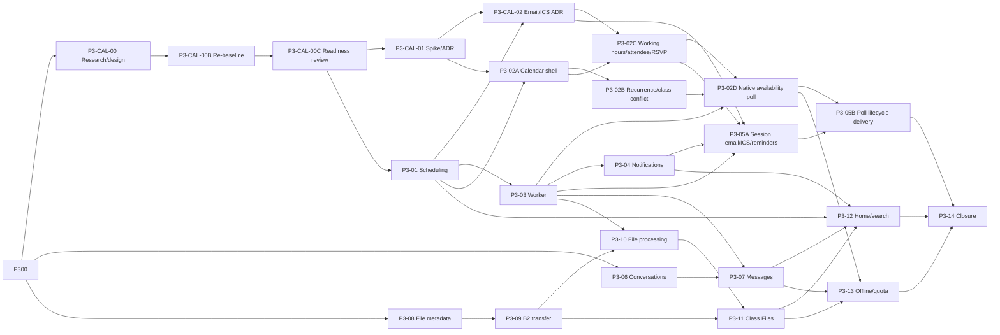

# Backlog Phase 3 - Daily learning workspace

> Nguồn thực thi chi tiết cho Phase 3. Master Plan giữ mục tiêu và exit gate; tài
> liệu này giữ dependency, phạm vi, acceptance, API/schema, kiểm thử và Definition of Done.

## 1. Mục tiêu phase

Xây daily learning workspace đủ dùng cho pilot có kiểm soát:

1. teacher lên lịch buổi học đúng timezone;
2. teacher và student trao đổi bằng tin nhắn bền vững;
3. người dùng nhận notification mà lỗi delivery không rollback nghiệp vụ;
4. file lớn upload/download trực tiếp với Backblaze B2, không đi xuyên Core API;
5. worker xử lý outbox theo at-least-once, retry idempotent và dead-letter;
6. calendar gửi invitation/update/cancellation/reminder email kèm ICS và theo dõi RSVP;
7. teacher, student và active member khác tạo Availability Poll native, chia sẻ an toàn
   và chốt thành buổi học chính thức hoặc Study Meeting đúng quyền;
8. home, calendar, search và Class Files có đủ trạng thái vận hành.

**Thời lượng re-baseline:** 13–17 tuần cho toàn Phase 3 khi một agent làm tuần tự trên
`main`; milestone Calendar chuyên nghiệp + email + Availability Poll khoảng 8–10 tuần
tính từ P3-CAL-01.
Domain/DNS, SES sandbox và production-access approval có thể chuẩn bị song song nhưng
không được tính `DONE` trước interoperability gate.

**Task vừa hoàn thành:** P3-CAL-01 decision spike và P3-01 đều `DONE`. P3-CAL-01
chấp nhận FullCalendar Standard v7.0.1, adapter/domain boundary, Warm Academic theme và
recurrence Go bounded; manual NVDA vẫn là explicit rollout gate trước khi nối renderer
vào route production. P3-01 đã đạt migration, contract, backend, feature/policy,
generated client, class-detail UI, Neon `14 false`, deploy/public probes và browser
acceptance Teacher/Student/IDOR. Biên bản P3-01 nằm tại
`docs/P3_01_STAGING_ACCEPTANCE.md`.

**Task hiện tại/tiếp theo:** P3-03 PostgreSQL outbox worker production shape.
P3-CAL-02/P3-02A chỉ bắt đầu khi dependency gate tương ứng đạt.

**Thiết kế Calendar có thẩm quyền:**
[`CALENDAR_PRODUCT_TECHNICAL_DESIGN.md`](CALENDAR_PRODUCT_TECHNICAL_DESIGN.md).

## 2. Non-goal

- Classroom moderation, lobby và media lifecycle đầy đủ thuộc Phase 4.
- Whiteboard, breakout, recording và classroom tools thuộc Phase 5.
- Assignment, exam và QuizHub thuộc Phase 6.
- Lavie AI, social feed và search nâng cao thuộc Phase 7.
- Google/Microsoft two-way sync, public booking, enterprise room/resource federation và
  organization-wide calendar ACL không nằm trong Phase 3.
- Link `anyone_with_link` của Availability Poll chỉ cấp quyền xem/trả lời khảo sát tối
  thiểu; nó không phải public booking, không giữ chỗ, thanh toán, auto-confirm hoặc tự
  tạo session/meeting.
- Mobile push, marketing/bulk email, inbound mailbox, billing và full production SLO
  không nằm trong Phase 3. Transactional Calendar email/ICS thuộc Phase 3.
- Không tự xây message broker, object storage, virus engine hoặc thumbnail service.
- Không thêm Redis, NATS, Kafka, microservice hoặc Kubernetes nếu chưa có tải/ADR.
- P3-01 không làm recurring series, reminder, calendar tổng hợp hoặc participant/media state.

## 3. Nguyên tắc bắt buộc

- OpenAPI đổi trước hoặc cùng implementation; generated TypeScript client không sửa tay.
- Tenant/class scope lấy từ session và repository authoritative; foreign ID bị conceal `404`.
- Mọi mutation nhạy cảm đi qua shared policy, audit và transactional outbox.
- Timestamp nghiệp vụ lưu dưới dạng instant UTC; civil time giữ IANA timezone và được
  kiểm tra DST theo ADR-0017.
- Worker chạy at-least-once; mọi handler phải idempotent theo outbox event ID.
- Notification failure không rollback business transaction đã commit.
- Binary không đi qua Core API; browser chỉ nhận presigned URL ngắn hạn và giới hạn scope.
- File chưa `ready` không được chia sẻ hoặc tải như artifact hợp lệ.
- Log, metric, audit và outbox không chứa token, cookie, signed URL, raw file content,
  message content không cần thiết hoặc PII thừa.
- Public capability dùng opaque token entropy cao, chỉ lưu hash, có expiry/revoke/scope/
  rate limit; raw token không nằm trong query, referrer, log hoặc analytics.
- Mỗi UI slice có loading, empty, filtered-empty, error, forbidden, offline/degraded và retry.

## 4. Trạng thái tổng hợp

| Task       | Nội dung                                       | Dependency                      | Trạng thái |
| ---------- | ---------------------------------------------- | ------------------------------- | ---------- |
| P3-00      | Backlog + architecture/contract baseline       | Phase 2                         | DONE       |
| P3-CAL-00  | Calendar research + product/technical design   | P3-00                           | DONE       |
| P3-CAL-00B | Teams/Google parity + visual/email re-baseline | P3-CAL-00                       | DONE       |
| P3-CAL-00C | Final implementation-readiness review          | P3-CAL-00B                      | DONE       |
| P3-CAL-01  | Renderer/recurrence/theme spike + ADR-0019     | P3-CAL-00C                      | DONE       |
| P3-01      | Course session scheduling và timezone          | P3-00, P3-CAL-00C               | DONE       |
| P3-CAL-02  | Invitation/RSVP/iCalendar/AWS SES + ADR-0020   | P3-CAL-01, P3-01                | TODO       |
| P3-02A     | Professional Calendar shell/read projection    | P3-01, P3-CAL-01                | TODO       |
| P3-02B     | Recurrence + class conflict                    | P3-02A, ADR-0019                | TODO       |
| P3-02C     | Working hours/attendee/free-busy/RSVP          | P3-02A, P3-CAL-02               | TODO       |
| P3-02D     | Native Availability Poll + Study Meeting       | P3-02B, P3-02C, P3-03, ADR-0021 | TODO       |
| P3-03      | PostgreSQL outbox worker production shape      | P3-01                           | TODO       |
| P3-04      | In-app notification và preference              | P3-03                           | TODO       |
| P3-05A     | Session email/ICS/external RSVP/reminder       | P3-02C, P3-CAL-02, P3-03, P3-04 | TODO       |
| P3-05B     | Poll/Study Meeting lifecycle delivery          | P3-02D, P3-05A                  | TODO       |
| P3-06      | Direct/class conversation                      | P3-00, Phase 2 policy           | TODO       |
| P3-07      | Persistent message, unread và read receipt     | P3-03, P3-06                    | TODO       |
| P3-08      | File metadata, upload intent và finalize       | P3-00, B2 baseline              | TODO       |
| P3-09      | Presigned B2 upload/download                   | P3-08                           | TODO       |
| P3-10      | Scan/metadata/thumbnail processing             | P3-03, P3-09                    | TODO       |
| P3-11      | Class Files UI                                 | P3-09, P3-10                    | TODO       |
| P3-12      | Home dashboard và PostgreSQL search cơ bản     | P3-01, P3-04, P3-07, P3-11      | TODO       |
| P3-13      | Offline/retry drafts và Phase 3 quota closure  | P3-02D, P3-07, P3-11            | TODO       |
| P3-14      | Staging acceptance và đóng Phase 3             | P3-CAL-02, P3-05B, P3-12, P3-13 | TODO       |

`VERIFY` nghĩa là implementation và kiểm tra local đã đạt, nhưng migration/deployment
và acceptance trên staging chưa hoàn tất. Trạng thái này không đồng nghĩa `DONE`.

## 5. Dependency graph

P3-03 được kéo lên ngay sau P3-01 để kiểm chứng worker sớm; không cần chờ poll.
P3-04/P3-05A/P3-05B/P3-07/P3-10 không được bypass worker foundation. P3-05A không
được bypass ADR-0020/provider/deliverability gate. Session delivery không bị P3-02D
chặn; P3-05B chỉ bổ sung poll/StudyMeeting lifecycle sau P3-02D. P3-02D theo ADR-0021
chỉ bắt đầu sau P3-02B/C và không phụ thuộc runtime When2meet.

## 6. P3-00 Backlog và architecture/contract baseline

**User outcome:** agent mới biết chính xác thứ tự Phase 3, task hiện tại và các quyết
định không được tự suy từ hội thoại.

### Definition of Done

- [x] Tạo backlog có task ID, dependency, scope, acceptance và exit gate.
- [x] Chọn P3-01 scheduling/timezone là vertical slice implementation đầu tiên.
- [x] ADR-0017 chốt instant/civil time, DST, lifecycle và recurrence boundary.
- [x] ADR-0018 chốt PostgreSQL leased outbox worker, retry và dead-letter.
- [x] Xác nhận không thêm provider/library/service ở P3-00.
- [x] Đồng bộ README, Project State, Agent Coordination, Delivery Roadmap và Master Plan.

## 7. P3-01 Course session scheduling và timezone

**User outcome:** teacher lên lịch một buổi học; người có quyền xem lớp thấy đúng thời
gian; teacher có thể sửa hoặc hủy mà không làm lẫn tenant/lớp.

Trước implementation phải đọc
[`CALENDAR_PRODUCT_TECHNICAL_DESIGN.md`](CALENDAR_PRODUCT_TECHNICAL_DESIGN.md). P3-01
không thêm FullCalendar hoặc recurrence; dependency chỉ được thêm sau P3-CAL-01.

### Scope

- Class-scoped session một lần, không recurrence.
- Lifecycle public của P3-01: `scheduled -> cancelled`; schema dự phòng `live/ended`
  nhưng chỉ Phase 4 được nối transition media.
- Create, list theo bounded range, detail, update metadata/time và cancel idempotent.
- UTC instant + IANA timezone; request có RFC3339 offset rõ và kiểm tra round-trip DST.
- Optimistic `version`; audit/outbox trong cùng transaction với mutation.
- Minimal class-session UI trên class detail; calendar tổng hợp thuộc P3-02.

### API/schema dự kiến

- Migration `000014_class_sessions` có forward/down path.
- `GET/POST /api/v1/classes/{class_id}/sessions`.
- `GET/PATCH /api/v1/classes/{class_id}/sessions/{session_id}`.
- `POST /api/v1/classes/{class_id}/sessions/{session_id}/cancel`.
- Permission mới `session.schedule`; read dùng class viewer projection authoritative.
- Không tin `tenant_id`, owner, role hoặc status do client tự khai.

### Acceptance

- [ ] Org admin, organization teacher, class owner và co-teacher tạo/sửa/hủy đúng quyền.
- [ ] TA/student active chỉ xem; unenrolled user bị deny; foreign IDs bị conceal `404`.
- [ ] Draft/archived class không tạo hoặc sửa lịch; archived history vẫn đọc được.
- [ ] `starts_at < ends_at`, duration/range bị giới hạn và timezone phải là IANA hợp lệ.
- [ ] DST gap bị từ chối; DST overlap chỉ nhận khi offset disambiguate đúng.
- [ ] Concurrent stale update trả `409`; cancel lặp lại là idempotent no-op.
- [ ] Mutation ghi audit/outbox redacted, không chứa description đầy đủ hoặc PII thừa.
- [ ] UI có vi/en, keyboard flow, loading/empty/error/forbidden/offline/retry.
- [ ] Unit, PostgreSQL integration, authorization/IDOR và Playwright teacher/student xanh.

### Rollout/rollback

- Feature mặc định chỉ mở cho staging/private alpha sau migration và CI.
- P3-01 phải thêm feature flag, bounded duration/range/fan-out cap và kill switch ngay
  trong slice; không chờ P3-13 mới enforcement.
- Rollback application không cần down migration; down chỉ chạy trên disposable branch.
- Không xóa row session để rollback UI; endpoint mới có thể tắt qua feature control.

### Bằng chứng implementation local ngày 2026-07-24

- [x] Migration `000014`, model/repository/service/HTTP, policy/feature control,
      OpenAPI/generated client và class-detail UI đã được triển khai.
- [x] Web typecheck, 144 test và production build; API client typecheck cùng 17 test đạt.
- [x] Các Go package liên quan `httpapi`, `classroom`, `featurecontrol`, `audit`,
      `policy`, `config` và recurrence spike đạt test local.
- [x] Timezone resolver từ chối DST gap và yêu cầu chọn offset cho overlap; unit test
      dùng `Asia/Ho_Chi_Minh` và `America/New_York`.
- [x] Neon staging migrate `13 -> 14`, runtime grant tối thiểu và version `14 false`.
- [x] Feature commit `b58666c`, security patch `a5741a1` và web acceptance fix `e7dc161`
      đã được deploy; Render direct cùng Cloudflare same-origin health/readiness/status
      public probes đều xanh.
- [x] Browser acceptance Teacher create/update/cancel, Student read-only và foreign-ID
      conceal `404` đạt trên staging. Lượt browser thủ công không được ghi thành
      Playwright staging.
- [x] P3-01 chuyển `VERIFY -> DONE` sau khi toàn bộ gate trên đạt ngày 2026-07-24.

## 8. P3-02 Calendar day/week/month và recurring series

- Thực thi UX/architecture trong `CALENDAR_PRODUCT_TECHNICAL_DESIGN.md`.
- Teams-inspired local sidebar/command bar, Warm Academic cream theme và editor hai cột;
  không sao chép icon/font/asset/trade dress.
- Top-level route có Day/Work week/Week/Month/Agenda; mobile mặc định Agenda.
- Calendar tổng hợp theo viewer timezone nhưng hiển thị class timezone khi khác biệt.
- Bounded date range, server-side query và URL state cho day/week/month.
- Recurrence là series + occurrence, không clone vô hạn; edit-one/edit-future/cancel có
  semantics và ADR-0019 trước implementation.
- Quick create, full editor, detail drawer, class/type/status filter, search và role-aware CTA.
- Organizer, roster audience, required/optional attendee, permitted external guest,
  guest permissions, show-as/visibility và RSVP accept/tentative/decline.
- Scheduling Assistant/Find a time, working hours và privacy-safe free/busy; external
  attendee chưa sync hiển thị unknown.
- Availability Poll là native P3-02D: all active authenticated member có thể tạo poll
  của mình; public capability chỉ trả projection tối thiểu và không phải booking.
- Drag/resize có keyboard alternative, optimistic revert, undo và stale-version handling.
- Conflict class/teacher authoritative ở backend; free/busy không lộ private detail.
- DST gap/overlap, month boundary, leap day và timezone switch có golden tests.
- Email/ICS/reminder không nằm trong transaction lịch; P3-05A/P3-05B tiêu thụ event sau
  commit.

### P3-CAL-00 research/design gate

- [x] Nghiên cứu Google Calendar, Microsoft Teams, Zoom và ClassIn bằng nguồn chính thức.
- [x] Audit read-only tab Lịch TutorHub V1, gồm UI, model/DAO, threading và security.
- [x] So sánh FullCalendar, Schedule-X, React Big Calendar, TOAST UI, Cal.diy và RRULE.
- [x] Chốt đề xuất UX, domain/read model, API, backend, security, a11y, test và rollout.
- [x] Ghi giới hạn nguồn và phân biệt fact/inference.

### P3-CAL-00B parity/visual/email re-baseline gate

- [x] Nghiên cứu lại Teams/Google bằng nguồn chính thức và bốn ảnh owner cung cấp.
- [x] Chốt parity contract: professional everyday core trong Phase 3, enterprise
      federation/booking/two-way sync để phase sau.
- [x] Chốt Teams-inspired IA/editor và Vauliys-inspired Warm Academic palette.
- [x] Đưa email invitation/update/cancel/reminder, ICS và RSVP vào Phase 3 exit gate.
- [x] Ghi rõ đây là tài liệu/re-baseline; chưa có runtime, provider hoặc dependency mới.

### P3-CAL-00C final implementation-readiness review

- [x] Đối chiếu lại Google Calendar, Teams/Outlook, FullCalendar v7, RFC 5545/5546/6047,
      AWS SES/SNS và recurrence Go bằng nguồn chính thức/repository upstream.
- [x] Tách P3-02A/B/C và P3-05A/B dependency; kéo P3-03 lên trước consumer side effect.
- [x] Thêm CalendarDisplayPreference/WorkingSchedule, deterministic suggested-time contract,
      split-exception preview, audience diff và reminder lifecycle.
- [x] Sửa `class.read` thành permission code thật `class.view`; làm rõ poll close/reopen,
      edit-after-response và direct StudyMeeting scheduling API trong ADR-0021.
- [x] Ghi rõ SES không có caller idempotency token; bổ sung `outcome_unknown`,
      event-transport verification, byte-level MIME/ICS và tracking-off gate.
- [x] Gỡ field UI chưa có domain khỏi lời hứa Phase 3: ClassSession/StudyMeeting là timed;
      all-day/online room/material chỉ bật khi source contract thật tồn tại.
- [x] Khóa iterator recurrence có cancellation/cap, suggested-time total order qua DST,
      canonical SES state machine/full durable ingress, one-part MIME/ICS required fields
      và giới hạn đúng mức của public-poll cohort/anonymous dedupe.

### P3-CAL-01 technical spike/ADR gate

- [x] ADR-0019 ghi alternatives/criteria và chuyển
      `Accepted with explicit manual NVDA gate`.
- [x] FullCalendar Standard v7.0.1 spike đạt React/Vite/strict/bundle/performance; đã
      so sánh v6.1.21 fallback, Temporal/package/CSS/theme và pin exact version.
- [x] Keyboard, Axe critical/serious=0, mobile Agenda, pointer drag/resize, drag
      alternative, zoom 200%, forced-colors và reduced-motion đạt automated evidence;
      Agenda mở progressive `24 -> 48 -> 51`, Axe waiver khóa exact node/count/scope.
- [ ] `PENDING_NVDA_REVIEW`: manual NVDA phải đạt trước khi P3-02A nối renderer vào
      route production. Đây là explicit rollout gate của ADR, không phải tuyên bố đã
      kiểm tra hoặc production-ready.
- [x] DST/drag/revert contract unit với fixture `Asia/Ho_Chi_Minh` và
      `America/New_York` đạt; browser interaction evidence vẫn thuộc mục trên.
- [x] Go recurrence candidate qua adapter đạt bounded RFC subset/golden/property/
      resource-exhaustion test hoặc bị loại; COUNT occurrence-last phải nằm trong
      horizon 730 ngày, YEARLY golden đã đạt; cấm `.All()` và hourly/minutely/secondly.
- [x] ADR-0019 được cập nhật từ kết quả spike và chấp nhận series/exception/occurrence
      identity, DST recurrence, split-exception policy, WorkingSchedule/suggested-time,
      class/teacher resource dependency, exact cap và dependency decision.
- [x] Dependency/license/security guard và root lock review đạt; không kéo
      Premium/telemetry ngoài ý muốn.

Automated local evidence đã đạt typecheck, lint, 8 unit/DOM test, build, dependency
guard 3/3, full v7 Playwright hậu fix `9 passed (23.6s)` và Go
unit/fuzz/benchmark. Calendar v7 JS/CSS gzip là `155.15/5.37 KiB`; heap 2.000 item
tăng `26,34 MiB`. Render p95 `152/164/201 ms`, navigation p95 `204/327/548 ms` và
long-task max `79/198/315 ms` ở 500/1.000/2.000 item, đạt budget tương ứng
`500/900/1.800`, `350/500/800` và `200/300/400 ms`.
Comparator parity-config v6 full run `4 passed (17.5s)`, JS gzip `139.00 KiB`, heap
`7,44 MiB`; vẫn không được chọn vì render 500 `1.492 > 500 ms` và long-task 2.000
`404 > 400 ms`. Recurrence hard cap là query window `366 ngày`, series horizon
`730 ngày`, `512 occurrence/series`, `2.000 occurrence/request` và deadline `250 ms`;
COUNT occurrence-last/YEARLY golden đạt. Axe chỉ có waiver upstream exact
`empty-table-header`, impact minor, một node/target/HTML/scope; critical/serious bằng 0. ADR-0019 được chấp nhận ở cấp decision spike, nhưng manual NVDA marker vẫn chặn
production route.

### P3-CAL-02 invitation/RSVP/iCalendar/provider gate

- [ ] Mở ADR-0020, ghi AWS SES là provider target owner đã chọn và chốt organizer,
      roster snapshot, required/optional/external attendee, guest permission cùng RSVP
      state/source of truth.
- [ ] Chốt RFC 5545/5546/6047 subset: globally unique stable UID, monotonic `SEQUENCE`,
      required `PRODID`/`VERSION:2.0`, `CALSCALE:GREGORIAN`, `TZID`,
      `RRULE/RECURRENCE-ID/EXDATE`, `METHOD:REQUEST/CANCEL`.
- [ ] Ở runtime, email/ICS chỉ phát sau commit qua ADR-0018 worker; effect dedupe theo
      invitation/recipient/effect/sequence/channel. Renderer/provider spike bên dưới chỉ
      dùng sandbox/sink cô lập và không phải đường gửi runtime.
- [ ] Xác minh AWS SES qua provider adapter bằng cost/quota/region/idempotency,
      event-transport và suppression evidence; phải ghi rõ không có caller idempotency
      token, `accepted` không phải inbox/delivery, `outcome_unknown`/grace/reconcile và
      external duplicate SLO; domain code không import AWS SDK trực tiếp.
- [ ] Sending domain, Easy DKIM, SPF/DMARC alignment và custom MAIL FROM decision được
      chốt; `delivered_to_recipient_server` không được hiển thị là “đã vào inbox”.
- [ ] Chọn full durable path Configuration Set -> EventBridge -> SQS/DLQ -> worker ->
      PostgreSQL inbox, hoặc SNS HTTPS -> verified ingress -> PostgreSQL inbox; khóa
      signature version, dedupe/out-of-order key, bounce/complaint/suppression, secret
      rotation và incident runbook.
- [ ] Trước khi có domain, chỉ test sandbox bằng personal sender/recipient email identity
      đã verify. Không coi đây là production readiness hoặc nới exit gate domain/DNS.
- [ ] External RSVP capability có scope/expiry/revoke/rate limit, chỉ lưu token hash.
- [ ] CTA TutorHub là RSVP source mặc định và ICS dùng `RSVP=FALSE`; chỉ bật
      `RSVP=TRUE`/inbound `METHOD:REPLY` nếu ADR bổ sung parser và security gate.
- [ ] Audience diff added/removed/unchanged/role-change, organizer transfer/disable/
      archive và RSVP retain/reset policy được chốt.
- [ ] Deterministic MIME/ICS có đúng một calendar part authoritative; đạt CRLF,
      75-octet folding, UTF-8/escaping/encoding, required VCALENDAR fields,
      MIME/VCALENDAR METHOD match và canonical retry bytes; tracking off cho capability.
- [ ] Invitation/update/cancel qua SES v2 `SendEmail` bắt buộc dùng `Content.Raw`/
      `RawMessage` từ canonical MIME bytes đã persist; không dùng `Simple` hoặc `Template`
      cho flow có iCalendar.
- [ ] Gmail/Google Calendar, Outlook và Apple Calendar spike đạt create/update/cancel;
      không thêm production dependency trước khi ADR-0020 được chấp nhận.
- [ ] Spike dùng deterministic fixture và provider sandbox/sink cô lập; không nối Core API,
      không consume outbox và không gửi business email tới end user. SES sandbox chỉ
      dùng owner-controlled verified identities. Runtime delivery vẫn phải chờ
      P3-03/P3-05A.

### P3-02A Professional Calendar shell và read projection

**Outcome:** người dùng có top-level Calendar chuyên nghiệp, đọc được session một lần từ
P3-01 qua một projection thống nhất; chưa hứa recurrence, attendee/RSVP hoặc email.

- [ ] Thêm route/navigation Calendar với Day, Work week, Week, Month và Agenda; mobile
      mặc định Agenda, browser back/forward giữ đúng URL state.
- [ ] Calendar read endpoint/query model nhận bounded range, source/type/class/status,
      search cursor và viewer timezone; cache key luôn có tenant/user/filter/range.
- [ ] `CalendarItem` chỉ là read projection có stable source identity/version; mutation
      vẫn gọi command của ClassSession/StudyMeeting nguồn, không tạo domain Event thứ hai.
- [ ] Mini calendar, Today/prev/next, view switcher, filter/search, saved default view,
      density/time scale, 12/24h, week start và secondary timezone badge đạt.
- [ ] Migration/OpenAPI/UI cho `CalendarDisplayPreference` lưu viewer timezone, locale,
      12/24h, week start, default view, density/time scale và secondary timezone; update
      dùng optimistic version và luôn tenant/user-scoped.
- [ ] Quick create/full editor ở task này chỉ tạo/sửa timed one-time ClassSession đã có
      contract P3-01; all-day, room/material và source chưa có field phải source-gated/
      hidden, không lưu placeholder.
- [ ] Dùng exact pin FullCalendar Standard đã được ADR-0019 chấp nhận; đóng manual NVDA
      marker trước production route. CI deny Premium package, telemetry và unreviewed
      CSS/assets.
- [ ] Warm Academic semantic token, Teams-inspired IA và editor hai cột đạt visual
      regression ở desktop/tablet/mobile nhưng không sao chép icon/font/trade dress.
- [ ] Drag/resize one-time có expected version, optimistic revert, undo và keyboard
      alternative; server `409` mở stale/conflict flow, không ghi đè mù.
- [ ] Loading, empty, filtered-empty, error, forbidden, offline/degraded và retry đầy đủ;
      workspace switch/logout hủy request và xóa tenant cache cũ.
- [ ] Range/query size, render p50/p95, long task, memory và bundle đạt numeric budget từ
      ADR-0019; 500/1.000/2.000 visible item fixture được đo.
- [ ] Keyboard-only, NVDA, Axe, zoom 200%, forced-colors, reduced-motion và semantic Agenda
      đạt; color không là tín hiệu duy nhất.
- [ ] Contract/integration/E2E chứng minh tenant isolation, timezone, stable ordering,
      pagination/range cap và source permission trước rollout staging.

### P3-02B Recurrence và class conflict authority

**Outcome:** ClassSession recurring series chạy bounded, đúng DST và có edit
one/following/all minh bạch; conflict authoritative nằm ở backend.

- [ ] Chỉ bắt đầu sau ADR-0019 `Accepted`; migration/OpenAPI khóa series, exception,
      occurrence identity, optimistic version và ICS identity mapping.
- [ ] Engine Go qua adapter iterator có context/deadline/item cap; cấm `.All()` và chỉ
      dùng `Between()` khi validator chứng minh upper bound nhỏ hơn hard cap.
- [ ] RFC subset/frequency/count/until/by-day/month policy, exact range/occurrence cap và
      unsupported-rule error được contract hóa; không clone occurrence vô hạn.
- [ ] Expansion dùng civil-time intent + IANA zone; gap/overlap, leap day, month-end,
      timezone change và all supported recurrence combinations có golden/property tests.
- [ ] Edit one tạo exception; edit following preview số occurrence/exception bị tác động
      và bắt chọn carry/rebase/discard hợp lệ; edit all không âm thầm mất exception.
- [ ] Cancel occurrence/series giữ tombstone/audit/outbox/UID/sequence semantics; stale
      replay idempotent và không hồi sinh occurrence cũ.
- [ ] Class/resource conflict được kiểm tra trong cùng transaction mutation/finalize,
      dùng half-open interval; override cần capability + reason + audit.
- [ ] Teacher conflict chỉ bật khi assignment/attendee authority đã tồn tại; trước đó UI
      và API không tuyên bố teacher-free, student conflict chỉ là private suggestion.
- [ ] Drag/resize recurrence bắt actor chọn one/following/all, có preview/revert/undo và
      không mutate series khi dialog bị hủy.
- [ ] Feature flag, exact hard cap, kill switch, metric expansion duration/count/rejection
      và resource-exhaustion test được thêm ngay trong task.
- [ ] Integration/E2E bao phủ concurrent edit, `409`, split series, exception retention,
      cross-tenant concealment và query plan theo bounded range.

### P3-02C Working schedule, attendee/free-busy và RSVP

**Outcome:** Calendar có Scheduling Assistant/Find a time, audience/attendee và RSVP nội
bộ đáng tin cậy; P3-05A chỉ phân phối email/ICS, không sở hữu business response.

- [ ] Migration/OpenAPI cho `WorkingSchedule` nhiều interval/ngày, exception/holiday/OOO
      và IANA timezone; validate overlap, range và optimistic version. Display preference
      đã thuộc P3-02A, không tạo model preference trùng ở task này.
- [ ] Attendee/audience có organizer, required/optional/internal/external, roster/manual
      source, show-as/visibility, guest permission và invitation snapshot theo ADR-0020.
- [ ] Audience update tính added/removed/unchanged/role-change; RSVP retain/reset,
      organizer disable/transfer và class archive policy không do worker tự suy.
- [ ] Free/busy endpoint trả canonical status
      `free/tentative/busy/out_of_office/unknown`; không trả title, description,
      class/file/roster detail và không coi external/no-sync là free.
- [ ] Suggested-time dùng total-order tuple đã khóa, bounded range/participant/step/
      candidate cap và DST grid policy; response có reason breakdown/empty reason ổn định.
- [ ] Scheduling Assistant hiển thị working hours, unknown, dual timezone, conflict reason
      và keyboard/screen-reader equivalent; không truyền nghĩa chỉ bằng heatmap color.
- [ ] RSVP `needs_action/accepted/tentative/declined` là domain/API/UI source of truth,
      có expected version/idempotency, organizer summary và không cập nhật attendance.
- [ ] External response đi qua purpose-bound capability hash/expiry/revoke/rate limit;
      CTA chỉ gọi command RSVP này. Native email reply không được hứa nếu chưa có parser.
- [ ] Teacher/organizer/resource conflict authority và privacy matrix được test riêng;
      participant thường không được đọc lịch riêng hay guest list ngoài quyền.
- [ ] Source flag/cap/kill switch, audience/fan-out max và tenant policy enforcement có từ
      task này; không chờ P3-13.
- [ ] Unit/integration/E2E bao phủ unknown vs busy ordering, DST gap/overlap, working-hour
      exception, concurrent RSVP, audience diff và cross-tenant/cross-class authorization.

### P3-02D Native Availability Poll và Study Meeting

- [x] ADR-0021 chốt native ownership, permission, share mode, capability security và
      ranh giới Phase 3/Phase 4 trước implementation.
- [ ] TutorHub tự xây poll bằng React + Go modular monolith + PostgreSQL; không iframe,
      scrape, API không chính thức, fork, code copy hoặc runtime dependency When2meet.
- [ ] Mọi active authenticated tenant member có `availability.poll.create`,
      `availability.poll.manage_own` và `study_meeting.schedule_own` theo feature/quota;
      external/anonymous responder không được tạo poll/meeting.
- [ ] Poll chỉ được bind `class_id` khi creator là active class member có `class.view`;
      class foreign/inaccessible bị conceal `404`.
- [ ] Có `class_members` mặc định cho poll gắn lớp, `invited_only` với token riêng từng
      recipient và `anyone_with_link` phải bật rõ ràng; đổi mode revoke/rotate token cũ.
- [ ] Poll có title, optional class/participants, timezone IANA, date range, working
      hours, duration, slot granularity, deadline, version và lifecycle.
- [ ] Close/deadline auto-close/reopen và edit-after-response tuân state machine; slot/
      timezone/duration không bị tái diễn giải âm thầm sau khi đã có response.
- [ ] Response normalized theo slot: `preferred`, `available`, `unavailable`; chưa trả
      lời là `unknown`, không dùng JSON/string như V1.
- [ ] Desktop có drag/paint heatmap; mobile dùng list/card; keyboard, screen reader và
      forced-colors có action/label tương đương, không truyền nghĩa chỉ bằng màu.
- [ ] Participant thường chỉ thấy response của mình và aggregate privacy-safe. Organizer
      hoặc teacher/admin đủ capability mới thấy individual response; public projection
      không lộ roster, email, class detail hay lịch riêng.
- [ ] Minimum cohort chỉ là giảm rủi ro, không hứa chống differencing/Sybil tuyệt đối.
      Public aggregate dùng coarse bucket/không lộ exact responder count; anonymous
      dedupe chỉ theo response handle + idempotency key, không tuyên bố one-human-one-vote.
      Retention/purge, uniform error và token/prefix/poll rate limit đạt.
- [ ] External link dùng high-entropy token hash-at-rest, expiry/revoke/scope/rate limit,
      URL fragment exchange, `history.replaceState`, `no-referrer`, `no-store`, `noindex`
      cùng strict CSP/no third-party pre-exchange và log/analytics redaction.
- [ ] Ranking deterministic, giải thích bounded; frontend preview không phải authority.
      Finalize luôn recheck conflict, dùng expected version và idempotency key.
- [ ] Actor có `session.schedule` trên class đích mới được finalize thành `ClassSession`;
      actor khác chỉ tạo `StudyMeeting` của mình. External responder không được finalize.
- [ ] Study Meeting trong Phase 3 là scheduling/room intent, không phải LiveKit room
      runtime; token, lobby, moderation, reconnect và media lifecycle thuộc Phase 4.
- [ ] Active member tạo/list/detail/update/cancel StudyMeeting trực tiếp hoặc từ poll;
      owner/admin-recovery và conflict/version policy đạt.
- [ ] Feature flag/hard cap/kill switch cho poll/slot/participant/capability/fan-out được
      enforcement ngay P3-02D, không chờ P3-13.
- [ ] Open/share/close/reopen/cancel/finalize ghi audit + outbox; P3-05B phân phối
      email sau commit và provider failure không rollback nghiệp vụ.

## 9. P3-03 PostgreSQL outbox worker production shape

- Thực thi ADR-0018 bằng `services/core-api/cmd/worker` trong cùng modular monolith/image.
- Lease batch bằng `FOR UPDATE SKIP LOCKED` cùng fencing token; stale owner không thể
  ack/retry/dead-letter sau khi lease bị reclaim.
- At-least-once, exponential backoff có cap/jitter, max attempts và dead-letter retained.
- Handler registry typed; downstream effect idempotent theo `source_outbox_event_id`.
- Worker dùng database role tối thiểu riêng; API runtime chỉ cần `INSERT` outbox.
- Không ép `tenant_id` thành `NOT NULL`; identity/system event global phải có context an toàn.
- Event Phase 1/2 không bị blanket mark published; chỉ claim event type/version allowlist.
- Graceful shutdown không nhận lease mới và không đánh dấu success khi handler chưa xong.
- Metric label bounded theo event/handler/outcome; log chỉ giữ error code redacted.
- Unit, PostgreSQL integration, crash/reclaim, duplicate delivery và poison-event tests.
- P3-03 chỉ chốt durable worker runtime/hosting; email-provider decision thuộc
  P3-CAL-02/P3-05A. Không nhét worker loop vào HTTP API và không xem Render Free web
  service có spin-down là durable worker. Task chỉ `DONE` khi một hosting target không
  spin-down/cron-loss được chọn, deploy và crash/reclaim acceptance đạt.

## 10. P3-04 In-app notification và preference

- Tenant/user-scoped notification projection, unread/read và preference versioned.
- Worker tạo notification từ event đã commit; lỗi delivery không rollback business row.
- API list keyset pagination, unread count, mark one/all read và update preference.
- Preference có channel in-app/email, reminder offset và quiet-hours semantics; calendar
  cancellation/update transactional vẫn tuân safety policy của ADR-0020.
- P3-04 không tự gọi provider; email adapter chỉ kích hoạt ở P3-05A sau ADR/provider gate.
- Realtime ban đầu có thể dùng bounded polling; SSE chỉ thêm khi contract/failure mode rõ.

## 11. P3-05A Session email/ICS, external response và reminder delivery

- Reminder được materialize từ session schedule sau commit và có dedupe key ổn định.
- Update/cancel session hủy/supersede reminder cũ; timezone/DST không làm gửi hai lần.
- Worker claim theo due time; retry idempotent; late delivery có bounded policy.
- In-app reminder có snooze/dismiss/join-open; per-user override là private, event
  cancel/ended hoặc quá late threshold phải supersede/expire.
- Notification preference được áp dụng lúc delivery, không làm mất audit nghiệp vụ.
- Publish gửi localized text/HTML + đúng một authoritative `text/calendar` part;
  reschedule giữ UID/tăng sequence; cancel gửi `METHOD:CANCEL` với cùng identity.
- Một delivery/recipient để không lộ roster email/RSVP capability; duplicate/replay
  không tạo effect thứ hai.
- P3-02C sở hữu RSVP domain/API/UI. P3-05A chỉ phân phối CTA/capability bên ngoài, chuyển
  response hợp lệ vào command P3-02C và project trạng thái cho organizer; không tạo một
  RSVP source of truth thứ hai và không cập nhật attendance.
- Delivery ledger dùng đúng canonical state:
  pending/sending/accepted/outcome_unknown/retry_wait/
  delivered_to_recipient_server/bounced/complained/suppressed/dead_letter/superseded;
  timeout ambiguous dùng grace/reconcile, không retry ngay như definite failure.
- Transition dùng expected version + provider-event inbox; event out-of-order được append
  history/project theo state machine. `delivered_to_recipient_server` chỉ là mail server
  đích chấp nhận, không được hiển thị là “đã vào inbox”.
- Application effect unique theo invitation/recipient/effect/sequence/channel; SES
  MessageId và opaque effect tag correlate event, không hứa provider exactly-once.
- Deterministic MIME/ICS đạt byte-level gate và tắt click/open tracking với capability.
- Audience diff và organizer lifecycle tuân ADR-0020; worker không tự đọc roster mới.
- Delivery ledger có provider attempt/reference và canonical payload hash;
  provider outage không rollback session và organizer có retry/resend đúng quyền.
- Provider event ingress đi hết durable topology ADR-0020 tới PostgreSQL inbox/consumer,
  được verify/dedupe/out-of-order test; bounce/complaint tạo suppression theo policy.
- Gmail/Google Calendar, Outlook và Apple Calendar staging acceptance đạt phạm vi
  ADR-0020; inbound email `METHOD:REPLY` không được tuyên bố nếu chưa triển khai parser.

## 12. P3-05B Availability Poll và Study Meeting lifecycle delivery

- Poll opened/reopened/deadline/cancelled/finalized được fan-out sau commit, một
  effect/recipient. Manual close mặc định chỉ audit + in-app cho organizer, không tự gửi
  broadcast; reopen gửi snapshot recipient trước đó cùng deadline/version mới.
- Deadline auto-close do durable worker P3-03 claim theo due time và phát đúng một
  lifecycle event; close/reopen/cancel/finalize tuân expected version/idempotency.
- Direct Study Meeting phát `scheduled/rescheduled/cancelled`; localized text/HTML/ICS giữ
  stable UID, tăng sequence khi reschedule/cancel và chỉ gửi khi delivery contract hợp lệ.
- Recipient snapshot được persist lúc command commit; worker không đọc lại roster mới.
  Effect unique theo
  `(source_type, source_id, recipient_id, effect_type, source_version, channel)`.
- Capability link per-recipient, tracking off, no roster disclosure; resend/expiry/revoke
  và suppression tuân ADR-0020/0021. Provider failure không rollback poll/meeting.
- Contract/integration/E2E phải chứng minh create/update/cancel cross-client, reopen/deadline
  không gửi trùng, out-of-order/retry/dead-letter/suppression đúng state, capability không
  lộ roster và finalized outcome không sinh hai invitation/meeting.

## 13. P3-06 Direct/class conversation

- Conversation class-scoped và direct same-tenant; không cho client tự khai participant.
- Class conversation membership lấy từ enrollment authoritative.
- Direct conversation có canonical participant set để create lặp không sinh duplicate.
- Archive class giữ history nhưng policy viết mới phải được chốt rõ.
- Tạo ADR transport/retention/moderation trước P3-07 nếu cần SSE/WebSocket.

## 14. P3-07 Persistent message, unread và read receipt

- REST write/read là source of truth; LiveKit DataChannel không lưu chat bền vững.
- Keyset pagination, client message ID idempotent, server timestamp và edited/deleted state.
- Unread/read receipt theo user/conversation, update monotonic và tenant-scoped.
- Message content không đi vào audit/outbox/log; event chỉ giữ ID/metadata allowlist.
- Reconnect không mất message đã commit; duplicate submit không tạo message thứ hai.

## 15. P3-08 File metadata, upload intent và finalize

- File state: `pending -> uploaded -> processing -> ready/rejected`; delete/retention tách rõ.
- Intent tạo object ID/key opaque, quota reservation và presigned scope ngắn hạn.
- Finalize kiểm tra size/checksum/content metadata server-side, không tin tên/MIME client.
- File chưa `ready` không xuất hiện trong share/download projection.

## 16. P3-09 Presigned B2 upload/download

- Browser upload/download trực tiếp B2; Core API không proxy binary lớn.
- URL ngắn hạn, exact method/key/content length/checksum và least-privilege capability.
- Download chỉ cấp sau authorization authoritative và file `ready`.
- Retry multipart, abort, expiry và checksum mismatch có test/smoke staging.

## 17. P3-10 Scan/metadata/thumbnail processing

- Chọn scanner/thumbnail runtime bằng spike/ADR; không tự nhận container hiện tại đủ tải.
- Worker xử lý idempotent; timeout/provider failure giữ file không-shareable.
- Malware/suspicious file thành `rejected`, không public; metadata redacted và bounded.
- Thumbnail là derived object có lifecycle theo source, không thay binary gốc.

## 18. P3-11 Class Files UI

- Teacher upload/quản lý; student chỉ xem/tải file được chia sẻ đúng lớp.
- UI có progress, resume/retry, checksum failure, processing, rejected và ready states.
- Không render active content nguy hiểm; download disposition/MIME được kiểm soát.
- Cache key chứa tenant/class và bị purge khi switch/archive/role change.

## 19. P3-12 Home dashboard và PostgreSQL search cơ bản

- Home gom session sắp tới, unread notification/message và file gần đây bằng bounded query.
- Search PostgreSQL chỉ trên resource actor được phép; không trả snippet vượt quyền.
- Không thêm Elasticsearch/vector store khi PostgreSQL chưa có bằng chứng không đủ.
- Partial provider/module failure degrade từng card, không làm hỏng toàn dashboard.

## 20. P3-13 Offline/retry drafts và Phase 3 quota closure

- Chỉ draft không nhạy cảm được lưu client; không lưu token/signed URL/message đã gửi.
- Retry mutation dùng idempotency key khi có khả năng submit lại tự động.
- Hợp nhất feature/quota catalog, admin visibility và dashboard cho scheduling, poll,
  message/file; enforcement/kill switch/hard cap bắt buộc đã nằm trong task nguồn
  P3-01/P3-02D/P3-07/P3-08, không chờ closure mới thêm.
- Quota rejection có typed problem, bounded metric và cleanup path; không xóa dữ liệu cũ.

## 21. P3-14 Staging acceptance và exit gate

### Acceptance scenarios

- [ ] Teacher tạo/sửa/hủy session; student thấy đúng timezone qua reload.
- [ ] Calendar Day/Work week/Week/Month/Agenda và recurrence vượt DST đúng semantics.
- [ ] Calendar đạt keyboard-only, screen reader/Axe và mobile Agenda acceptance; drag
      luôn có action thay thế không cần pointer.
- [ ] Teams-inspired shell/editor + Warm Academic token đạt contrast và visual regression;
      không dùng asset/font Vauliys hoặc nhận diện Teams/Google.
- [ ] Teacher chọn required/optional attendee, xem privacy-safe free/busy/conflict;
      student/external guest RSVP đúng quyền và organizer thấy trạng thái sau reload.
- [ ] WorkingSchedule nhiều interval/ngày + exception/OOO, unknown semantics, dual-zone
      và deterministic suggested-time reason/tie-break đạt.
- [ ] Student và active member khác tạo, mở/chia sẻ và quản lý poll của mình;
      class-only, invited-only và explicit anyone-link đều đúng authorization,
      expiry/revoke/rate limit. Fan-out tới roster vẫn cần capability riêng.
- [ ] Desktop drag/paint heatmap, mobile list/card, keyboard/screen reader/forced-colors
      đạt; public responder chỉ thấy projection/aggregate tối thiểu, không roster/email/
      individual availability.
- [ ] Student thiếu `session.schedule` chỉ finalize thành Study Meeting; teacher đủ quyền
      có thể finalize thành ClassSession. Cả hai recheck conflict và retry không tạo đôi.
- [ ] Poll close/deadline auto-close/reopen/edit-after-response và direct StudyMeeting
      create/update/cancel đúng version/audit/privacy/quota.
- [ ] Network/referrer/log test chứng minh raw poll token không rò; poll link không có
      booking/hold/payment/auto-confirm và runtime không gọi When2meet.
- [ ] Publish gửi invitation `.ics`; update giữ UID/tăng sequence; cancel cùng UID
      không tạo calendar item mới trên client mục tiêu.
- [ ] Gmail/Google Calendar, Outlook và Apple Calendar smoke đạt; provider timeout,
      retry và crash/reclaim không tạo duplicate application effect. Provider duplicate
      hiếm phải được đo, reconcile và nằm dưới ngưỡng acceptance đã chốt ở ADR-0020.
- [ ] Bounce/complaint/suppression, verified SES event ingress và external RSVP token
      security đạt; provider lỗi không rollback session.
- [ ] CTA-only `RSVP=FALSE` hoạt động và nội dung không hứa native Google/Outlook reply;
      chỉ tuyên bố inbound iTIP nếu parser/security/interoperability riêng đạt.
- [ ] Message không mất sau reconnect/reload; unread/read đúng user.
- [ ] Business mutation vẫn thành công khi notification delivery tạm lỗi.
- [ ] Worker crash/reclaim, retry và dead-letter không tạo duplicate effect.
- [ ] File lớn upload trực tiếp B2; finalize/checksum/scan/share/download đúng trạng thái.
- [ ] Foreign tenant/class/user/file/message IDs đều bị deny/conceal và không mutate.
- [ ] Home/search chỉ trả resource được phép; partial failure có degraded state.
- [ ] Deploy, migration up/down/up và application rollback smoke đạt trên staging.

### Exit gate Phase 3

- Message không mất sau reconnect và duplicate submit không tạo duplicate.
- Upload lớn không đi qua Core API.
- File chưa `ready` không được chia sẻ/tải.
- Worker retry/idempotency/dead-letter được test trên PostgreSQL thật.
- Timezone/DST tests và staging smoke đạt.
- Calendar professional DoD đạt đủ views, responsive, keyboard, screen reader và
  recurrence/conflict semantics.
- Attendee/free-busy/guest permission/RSVP semantics đạt authorization và privacy tests.
- Native Availability Poll đạt share-mode/capability/privacy/concurrency/a11y tests;
  public link không lộ roster/PII và official session không thể bypass `session.schedule`.
- Email invitation/update/cancel/reminder + ICS đạt UID/SEQUENCE/idempotency và
  cross-client gate; notification/provider failure không rollback nghiệp vụ.
- Sending domain SPF/DKIM/DMARC, provider-event ingress verification,
  bounce/complaint/suppression và delivery runbook đạt.
- Verify, Security, provider parity và staging acceptance đều xanh.
- Biên bản `PHASE_3_COMPLETION.md` được sign-off trước khi chuyển phase.

## 22. Thứ tự chặng triển khai

| Chặng | Task chính        | Kết quả demo                                     |
| ----- | ----------------- | ------------------------------------------------ |
| 0     | P3-00             | Backlog + ADR baseline                           |
| C0    | P3-CAL-00/00B/00C | Research, re-baseline và readiness review        |
| C1    | P3-CAL-01         | Renderer/recurrence/theme spike + ADR-0019       |
| 1     | P3-01             | Session một lần contract-first                   |
| 2     | P3-03             | Durable PostgreSQL leased worker                 |
| 3     | P3-02A            | Professional shell/read projection               |
| C2    | P3-CAL-02         | Invitation/iCalendar/provider spike + ADR-0020   |
| 4     | P3-02B            | Recurrence + class conflict                      |
| 5     | P3-02C            | Working hours, attendee/free-busy/RSVP           |
| 6     | P3-04             | In-app notification + channel preferences        |
| 7     | P3-05A            | Session email/ICS/reminder + provider acceptance |
| 8     | P3-02D            | Native poll, secure sharing và Study Meeting     |
| 9     | P3-05B            | Poll/StudyMeeting lifecycle delivery             |
| 10    | P3-06, P3-07      | Conversation và persistent message               |
| 11-13 | P3-08 đến P3-11   | B2 transfer, processing và Class Files           |
| 14    | P3-12, P3-13      | Home/search, quota và offline                    |
| 15    | P3-14             | Staging acceptance/closure                       |

Các nhãn `C0/C1/C2` là decision gate nằm trong chặng kế cận, không phải ba sprint cộng
thêm vào 13–17 tuần. C2 có thể chạy sandbox cô lập song song với P3-02A sau khi
P3-CAL-01 và P3-01 cùng đạt gate, nhưng runtime provider vẫn chờ P3-03/P3-05A. Số thứ tự
là dependency/ưu tiên, không phải cam kết mỗi hàng đúng một tuần.

## 23. Việc cần làm ngay

1. P3-CAL-00/00B/00C đã `DONE`; đây là research/readiness, chưa phải runtime.
2. P3-CAL-01 đã `DONE` ở cấp decision spike; ADR-0019 đã được chấp nhận với explicit
   manual NVDA rollout gate. Chưa nối renderer vào production route khi marker còn mở.
3. P3-01 đã `DONE` sau local/staging acceptance; không mở rộng one-time slice thành
   recurrence/reminder/calendar aggregate.
4. Thực hiện P3-03 ngay bây giờ, trước mọi notification/email/ICS/reminder side effect.
5. P3-CAL-02/ADR-0020 chỉ spike sandbox cô lập vì P3-CAL-01 và P3-01 đã đạt gate;
   pre-domain chỉ dùng verified-email sandbox và chưa bật business delivery.
6. Triển khai P3-02A, rồi P3-02B và P3-02C theo gate; teacher conflict chỉ bật khi
   assignment/attendee authoritative đã có.
7. P3-05A không chờ poll; P3-02D/P3-05B bổ sung poll/StudyMeeting sau core session.
8. Không đưa recurrence, reminder, worker, email hoặc calendar tổng hợp vào P3-01.
9. ADR-0021 đã `Accepted`; P3-02D không phụ thuộc When2meet.
10. Giữ file cá nhân ngoài scope và không đọc/commit `.env*.local`.
