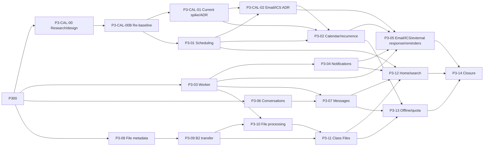

# Backlog Phase 3 - Daily learning workspace

> Nguồn thực thi chi tiết cho Phase 3. Master Plan giữ mục tiêu và exit gate; tài
> liệu này giữ dependency, phạm vi, acceptance, API/schema, kiểm thử và Definition of Done.

## 1. Mục tiêu phase

Xây daily learning workspace đủ dùng cho pilot có kiểm soát:

1. teacher lên lịch buổi học đúng timezone;
2. teacher và student trao đổi bằng tin nhắn bền vững;
3. người dùng nhận notification mà lỗi delivery không rollback nghiệp vụ;
4. file lớn upload/download trực tiếp với Backblaze B2, không đi xuyên Core API;
5. worker xử lý outbox theo at-least-once, retry idempotent và dead-letter;
6. calendar gửi invitation/update/cancellation/reminder email kèm ICS và theo dõi RSVP;
7. home, calendar, search và Class Files có đủ trạng thái vận hành.

**Thời lượng re-baseline:** 12–15 tuần cho toàn Phase 3 khi một agent làm tuần tự trên
`main`; milestone Calendar chuyên nghiệp + email khoảng 7–9 tuần tính từ P3-CAL-01.
DNS/provider approval có thể chạy song song nhưng không được tính `DONE` trước
interoperability gate.

**Task vừa hoàn thành:** P3-CAL-00B re-research Teams/Google, Vauliys visual direction
và Phase 3 email/ICS/RSVP re-baseline.

**Task hiện tại:** P3-CAL-01 technical spike + ADR recurrence/conflict (`READY`), sau đó
P3-01 Course session scheduling và timezone.

P3-01 không phụ thuộc kỹ thuật vào P3-CAL-01; cả hai đang `READY`. Hoàn thành spike
trước là thứ tự làm việc đã chọn để tránh renderer/recurrence/theme design drift.

**Thiết kế Calendar có thẩm quyền:**
[`CALENDAR_PRODUCT_TECHNICAL_DESIGN.md`](CALENDAR_PRODUCT_TECHNICAL_DESIGN.md).

## 2. Non-goal

- Classroom moderation, lobby và media lifecycle đầy đủ thuộc Phase 4.
- Whiteboard, breakout, recording và classroom tools thuộc Phase 5.
- Assignment, exam và QuizHub thuộc Phase 6.
- Lavie AI, social feed và search nâng cao thuộc Phase 7.
- Google/Microsoft two-way sync, public booking, enterprise room/resource federation và
  organization-wide calendar ACL không nằm trong Phase 3.
- Mobile push, marketing/bulk email, inbound mailbox, billing và full production SLO
  không nằm trong Phase 3. Transactional Calendar email/ICS thuộc Phase 3.
- Không tự xây message broker, object storage, virus engine hoặc thumbnail service.
- Không thêm Redis, NATS, Kafka, microservice hoặc Kubernetes nếu chưa có tải/ADR.
- P3-01 không làm recurring series, reminder, calendar tổng hợp hoặc participant/media state.

## 3. Nguyên tắc bắt buộc

- OpenAPI đổi trước hoặc cùng implementation; generated TypeScript client không sửa tay.
- Tenant/class scope lấy từ session và repository authoritative; foreign ID bị conceal `404`.
- Mọi mutation nhạy cảm đi qua shared policy, audit và transactional outbox.
- Timestamp nghiệp vụ lưu dưới dạng instant UTC; civil time giữ IANA timezone và được
  kiểm tra DST theo ADR-0017.
- Worker chạy at-least-once; mọi handler phải idempotent theo outbox event ID.
- Notification failure không rollback business transaction đã commit.
- Binary không đi qua Core API; browser chỉ nhận presigned URL ngắn hạn và giới hạn scope.
- File chưa `ready` không được chia sẻ hoặc tải như artifact hợp lệ.
- Log, metric, audit và outbox không chứa token, cookie, signed URL, raw file content,
  message content không cần thiết hoặc PII thừa.
- Mỗi UI slice có loading, empty, filtered-empty, error, forbidden, offline/degraded và retry.

## 4. Trạng thái tổng hợp

| Task       | Nội dung                                        | Dependency                      | Trạng thái |
| ---------- | ----------------------------------------------- | ------------------------------- | ---------- |
| P3-00      | Backlog + architecture/contract baseline        | Phase 2                         | DONE       |
| P3-CAL-00  | Calendar research + product/technical design    | P3-00                           | DONE       |
| P3-CAL-00B | Teams/Google parity + visual/email re-baseline  | P3-CAL-00                       | DONE       |
| P3-CAL-01  | Renderer/recurrence/theme spike + ADR-0019      | P3-CAL-00B                      | READY      |
| P3-01      | Course session scheduling và timezone           | P3-00, P3-CAL-00B               | READY      |
| P3-CAL-02  | Invitation/RSVP/iCalendar/provider + ADR-0020   | P3-CAL-01, P3-01                | TODO       |
| P3-02      | Calendar views/recurrence/attendee/free-busy    | P3-01, P3-CAL-01, P3-CAL-02     | TODO       |
| P3-03      | PostgreSQL outbox worker production shape       | P3-00                           | TODO       |
| P3-04      | In-app notification và preference               | P3-03                           | TODO       |
| P3-05      | Email/ICS/external-response/reminder delivery   | P3-02, P3-CAL-02, P3-03, P3-04 | TODO       |
| P3-06      | Direct/class conversation                       | P3-00, Phase 2 policy           | TODO       |
| P3-07      | Persistent message, unread và read receipt      | P3-03, P3-06                    | TODO       |
| P3-08      | File metadata, upload intent và finalize        | P3-00, B2 baseline              | TODO       |
| P3-09      | Presigned B2 upload/download                    | P3-08                           | TODO       |
| P3-10      | Scan/metadata/thumbnail processing              | P3-03, P3-09                    | TODO       |
| P3-11      | Class Files UI                                  | P3-09, P3-10                    | TODO       |
| P3-12      | Home dashboard và PostgreSQL search cơ bản      | P3-01, P3-04, P3-07, P3-11     | TODO       |
| P3-13      | Offline/retry drafts và Phase 3 quota closure   | P3-02, P3-07, P3-11             | TODO       |
| P3-14      | Staging acceptance và đóng Phase 3              | P3-CAL-02, P3-05, P3-12, P3-13 | TODO       |

## 5. Dependency graph

P3-01 và P3-03 có thể triển khai tuần tự trên `main`; không cần chạy đồng thời để đạt
tiến độ. P3-04/P3-05/P3-07/P3-10 không được bypass worker foundation. P3-05 không được
bypass ADR-0020/provider/deliverability gate.

## 6. P3-00 Backlog và architecture/contract baseline

**User outcome:** agent mới biết chính xác thứ tự Phase 3, task hiện tại và các quyết
định không được tự suy từ hội thoại.

### Definition of Done

- [x] Tạo backlog có task ID, dependency, scope, acceptance và exit gate.
- [x] Chọn P3-01 scheduling/timezone là vertical slice implementation đầu tiên.
- [x] ADR-0017 chốt instant/civil time, DST, lifecycle và recurrence boundary.
- [x] ADR-0018 chốt PostgreSQL leased outbox worker, retry và dead-letter.
- [x] Xác nhận không thêm provider/library/service ở P3-00.
- [x] Đồng bộ README, Project State, Agent Coordination, Delivery Roadmap và Master Plan.

## 7. P3-01 Course session scheduling và timezone

**User outcome:** teacher lên lịch một buổi học; người có quyền xem lớp thấy đúng thời
gian; teacher có thể sửa hoặc hủy mà không làm lẫn tenant/lớp.

Trước implementation phải đọc
[`CALENDAR_PRODUCT_TECHNICAL_DESIGN.md`](CALENDAR_PRODUCT_TECHNICAL_DESIGN.md). P3-01
không thêm FullCalendar hoặc recurrence; dependency chỉ được thêm sau P3-CAL-01.

### Scope

- Class-scoped session một lần, không recurrence.
- Lifecycle public của P3-01: `scheduled -> cancelled`; schema dự phòng `live/ended`
  nhưng chỉ Phase 4 được nối transition media.
- Create, list theo bounded range, detail, update metadata/time và cancel idempotent.
- UTC instant + IANA timezone; request có RFC3339 offset rõ và kiểm tra round-trip DST.
- Optimistic `version`; audit/outbox trong cùng transaction với mutation.
- Minimal class-session UI trên class detail; calendar tổng hợp thuộc P3-02.

### API/schema dự kiến

- Migration `000014_class_sessions` có forward/down path.
- `GET/POST /api/v1/classes/{class_id}/sessions`.
- `GET/PATCH /api/v1/classes/{class_id}/sessions/{session_id}`.
- `POST /api/v1/classes/{class_id}/sessions/{session_id}/cancel`.
- Permission mới `session.schedule`; read dùng class viewer projection authoritative.
- Không tin `tenant_id`, owner, role hoặc status do client tự khai.

### Acceptance

- [ ] Org admin, organization teacher, class owner và co-teacher tạo/sửa/hủy đúng quyền.
- [ ] TA/student active chỉ xem; unenrolled user bị deny; foreign IDs bị conceal `404`.
- [ ] Draft/archived class không tạo hoặc sửa lịch; archived history vẫn đọc được.
- [ ] `starts_at < ends_at`, duration/range bị giới hạn và timezone phải là IANA hợp lệ.
- [ ] DST gap bị từ chối; DST overlap chỉ nhận khi offset disambiguate đúng.
- [ ] Concurrent stale update trả `409`; cancel lặp lại là idempotent no-op.
- [ ] Mutation ghi audit/outbox redacted, không chứa description đầy đủ hoặc PII thừa.
- [ ] UI có vi/en, keyboard flow, loading/empty/error/forbidden/offline/retry.
- [ ] Unit, PostgreSQL integration, authorization/IDOR và Playwright teacher/student xanh.

### Rollout/rollback

- Feature mặc định chỉ mở cho staging/private alpha sau migration và CI.
- Rollback application không cần down migration; down chỉ chạy trên disposable branch.
- Không xóa row session để rollback UI; endpoint mới có thể tắt qua feature control.

## 8. P3-02 Calendar day/week/month và recurring series

- Thực thi UX/architecture trong `CALENDAR_PRODUCT_TECHNICAL_DESIGN.md`.
- Teams-inspired local sidebar/command bar, Warm Academic cream theme và editor hai cột;
  không sao chép icon/font/asset/trade dress.
- Top-level route có Day/Work week/Week/Month/Agenda; mobile mặc định Agenda.
- Calendar tổng hợp theo viewer timezone nhưng hiển thị class timezone khi khác biệt.
- Bounded date range, server-side query và URL state cho day/week/month.
- Recurrence là series + occurrence, không clone vô hạn; edit-one/edit-future/cancel có
  semantics và ADR-0019 trước implementation.
- Quick create, full editor, detail drawer, class/type/status filter, search và role-aware CTA.
- Organizer, roster audience, required/optional attendee, permitted external guest,
  guest permissions, show-as/visibility và RSVP accept/tentative/decline.
- Scheduling Assistant/Find a time, working hours và privacy-safe free/busy; external
  attendee chưa sync hiển thị unknown.
- Drag/resize có keyboard alternative, optimistic revert, undo và stale-version handling.
- Conflict class/teacher authoritative ở backend; free/busy không lộ private detail.
- DST gap/overlap, month boundary, leap day và timezone switch có golden tests.
- Email/ICS/reminder không nằm trong transaction lịch; P3-05 tiêu thụ event sau commit.

### P3-CAL-00 research/design gate

- [x] Nghiên cứu Google Calendar, Microsoft Teams, Zoom và ClassIn bằng nguồn chính thức.
- [x] Audit read-only tab Lịch TutorHub V1, gồm UI, model/DAO, threading và security.
- [x] So sánh FullCalendar, Schedule-X, React Big Calendar, TOAST UI, Cal.diy và RRULE.
- [x] Chốt đề xuất UX, domain/read model, API, backend, security, a11y, test và rollout.
- [x] Ghi giới hạn nguồn và phân biệt fact/inference.

### P3-CAL-00B parity/visual/email re-baseline gate

- [x] Nghiên cứu lại Teams/Google bằng nguồn chính thức và bốn ảnh owner cung cấp.
- [x] Chốt parity contract: professional everyday core trong Phase 3, enterprise
      federation/booking/two-way sync để phase sau.
- [x] Chốt Teams-inspired IA/editor và Vauliys-inspired Warm Academic palette.
- [x] Đưa email invitation/update/cancel/reminder, ICS và RSVP vào Phase 3 exit gate.
- [x] Ghi rõ đây là tài liệu/re-baseline; chưa có runtime, provider hoặc dependency mới.

### P3-CAL-01 technical spike/ADR gate

- [ ] Mở ADR-0019 ở trạng thái `PROPOSED`, ghi alternatives và tiêu chí quyết định.
- [ ] FullCalendar Standard spike đạt React/Vite/strict/bundle/performance.
- [ ] Keyboard, NVDA/Axe, mobile Agenda và drag alternative đạt.
- [ ] DST/drag/revert với fixture `Asia/Ho_Chi_Minh` và `America/New_York` đạt.
- [ ] Go recurrence candidate đạt RFC subset/golden/property test hoặc bị loại.
- [ ] ADR-0019 được cập nhật từ kết quả spike và chấp nhận series/exception/occurrence
      identity, DST recurrence, conflict policy và dependency decision.
- [ ] Dependency/license/security review; không kéo Premium/telemetry ngoài ý muốn.

### P3-CAL-02 invitation/RSVP/iCalendar/provider gate

- [ ] Mở ADR-0020 và chốt organizer, roster snapshot, required/optional/external attendee,
      guest permission và RSVP state/source of truth.
- [ ] Chốt RFC 5545/5546/6047 subset: globally unique stable UID, monotonic `SEQUENCE`,
      `TZID`, `RRULE/RECURRENCE-ID/EXDATE`, `METHOD:REQUEST/CANCEL`.
- [ ] Ở runtime, email/ICS chỉ phát sau commit qua ADR-0018 worker; effect dedupe theo
      invitation/recipient/effect/sequence/channel. Renderer/provider spike bên dưới chỉ
      dùng sandbox/sink cô lập và không phải đường gửi runtime.
- [ ] Chọn provider qua adapter từ cost/quota/region/idempotency/webhook evidence.
- [ ] Sending domain, SPF/DKIM/DMARC, signed webhook, bounce/complaint/suppression,
      secret rotation và incident runbook được chốt.
- [ ] External RSVP capability có scope/expiry/revoke/rate limit, chỉ lưu token hash.
- [ ] CTA TutorHub là RSVP source mặc định và ICS dùng `RSVP=FALSE`; chỉ bật
      `RSVP=TRUE`/inbound `METHOD:REPLY` nếu ADR bổ sung parser và security gate.
- [ ] Gmail/Google Calendar, Outlook và Apple Calendar spike đạt create/update/cancel;
      không thêm production dependency trước khi ADR-0020 được chấp nhận.
- [ ] Spike dùng deterministic fixture và provider sandbox/sink cô lập; không nối Core API,
      không consume outbox và không gửi tới người thật. Runtime delivery vẫn phải chờ
      P3-03/P3-05.

## 9. P3-03 PostgreSQL outbox worker production shape

- Thực thi ADR-0018 bằng `services/core-api/cmd/worker` trong cùng modular monolith/image.
- Lease batch bằng `FOR UPDATE SKIP LOCKED` cùng fencing token; stale owner không thể
  ack/retry/dead-letter sau khi lease bị reclaim.
- At-least-once, exponential backoff có cap/jitter, max attempts và dead-letter retained.
- Handler registry typed; downstream effect idempotent theo `source_outbox_event_id`.
- Worker dùng database role tối thiểu riêng; API runtime chỉ cần `INSERT` outbox.
- Không ép `tenant_id` thành `NOT NULL`; identity/system event global phải có context an toàn.
- Event Phase 1/2 không bị blanket mark published; chỉ claim event type/version allowlist.
- Graceful shutdown không nhận lease mới và không đánh dấu success khi handler chưa xong.
- Metric label bounded theo event/handler/outcome; log chỉ giữ error code redacted.
- Unit, PostgreSQL integration, crash/reclaim, duplicate delivery và poison-event tests.
- P3-03 chỉ chốt durable worker runtime/hosting; email-provider decision thuộc
  P3-CAL-02/P3-05. Không nhét worker loop vào HTTP API và không xem Render Free web
  service có spin-down là durable worker.

## 10. P3-04 In-app notification và preference

- Tenant/user-scoped notification projection, unread/read và preference versioned.
- Worker tạo notification từ event đã commit; lỗi delivery không rollback business row.
- API list keyset pagination, unread count, mark one/all read và update preference.
- Preference có channel in-app/email, reminder offset và quiet-hours semantics; calendar
  cancellation/update transactional vẫn tuân safety policy của ADR-0020.
- P3-04 không tự gọi provider; email adapter chỉ kích hoạt ở P3-05 sau ADR/provider gate.
- Realtime ban đầu có thể dùng bounded polling; SSE chỉ thêm khi contract/failure mode rõ.

## 11. P3-05 Calendar email/ICS, external response và reminder delivery

- Reminder được materialize từ session schedule sau commit và có dedupe key ổn định.
- Update/cancel session hủy/supersede reminder cũ; timezone/DST không làm gửi hai lần.
- Worker claim theo due time; retry idempotent; late delivery có bounded policy.
- Notification preference được áp dụng lúc delivery, không làm mất audit nghiệp vụ.
- Publish gửi localized text/HTML + `.ics` invitation; reschedule giữ UID/tăng sequence;
  cancel gửi `METHOD:CANCEL` với cùng identity.
- Một delivery/recipient để không lộ roster email/RSVP capability; duplicate/replay
  không tạo effect thứ hai.
- P3-02C sở hữu RSVP domain/API/UI. P3-05 chỉ phân phối CTA/capability bên ngoài, chuyển
  response hợp lệ vào command P3-02C và project trạng thái cho organizer; không tạo một
  RSVP source of truth thứ hai và không cập nhật attendance.
- Delivery ledger có pending/sent/delivered/bounced/complained/suppressed/dead-letter;
  provider outage không rollback session và organizer có retry/resend đúng quyền.
- Signed provider webhook idempotent; bounce/complaint tạo suppression theo policy.
- Gmail/Google Calendar, Outlook và Apple Calendar staging acceptance đạt phạm vi
  ADR-0020; inbound email `METHOD:REPLY` không được tuyên bố nếu chưa triển khai parser.

## 12. P3-06 Direct/class conversation

- Conversation class-scoped và direct same-tenant; không cho client tự khai participant.
- Class conversation membership lấy từ enrollment authoritative.
- Direct conversation có canonical participant set để create lặp không sinh duplicate.
- Archive class giữ history nhưng policy viết mới phải được chốt rõ.
- Tạo ADR transport/retention/moderation trước P3-07 nếu cần SSE/WebSocket.

## 13. P3-07 Persistent message, unread và read receipt

- REST write/read là source of truth; LiveKit DataChannel không lưu chat bền vững.
- Keyset pagination, client message ID idempotent, server timestamp và edited/deleted state.
- Unread/read receipt theo user/conversation, update monotonic và tenant-scoped.
- Message content không đi vào audit/outbox/log; event chỉ giữ ID/metadata allowlist.
- Reconnect không mất message đã commit; duplicate submit không tạo message thứ hai.

## 14. P3-08 File metadata, upload intent và finalize

- File state: `pending -> uploaded -> processing -> ready/rejected`; delete/retention tách rõ.
- Intent tạo object ID/key opaque, quota reservation và presigned scope ngắn hạn.
- Finalize kiểm tra size/checksum/content metadata server-side, không tin tên/MIME client.
- File chưa `ready` không xuất hiện trong share/download projection.

## 15. P3-09 Presigned B2 upload/download

- Browser upload/download trực tiếp B2; Core API không proxy binary lớn.
- URL ngắn hạn, exact method/key/content length/checksum và least-privilege capability.
- Download chỉ cấp sau authorization authoritative và file `ready`.
- Retry multipart, abort, expiry và checksum mismatch có test/smoke staging.

## 16. P3-10 Scan/metadata/thumbnail processing

- Chọn scanner/thumbnail runtime bằng spike/ADR; không tự nhận container hiện tại đủ tải.
- Worker xử lý idempotent; timeout/provider failure giữ file không-shareable.
- Malware/suspicious file thành `rejected`, không public; metadata redacted và bounded.
- Thumbnail là derived object có lifecycle theo source, không thay binary gốc.

## 17. P3-11 Class Files UI

- Teacher upload/quản lý; student chỉ xem/tải file được chia sẻ đúng lớp.
- UI có progress, resume/retry, checksum failure, processing, rejected và ready states.
- Không render active content nguy hiểm; download disposition/MIME được kiểm soát.
- Cache key chứa tenant/class và bị purge khi switch/archive/role change.

## 18. P3-12 Home dashboard và PostgreSQL search cơ bản

- Home gom session sắp tới, unread notification/message và file gần đây bằng bounded query.
- Search PostgreSQL chỉ trên resource actor được phép; không trả snippet vượt quyền.
- Không thêm Elasticsearch/vector store khi PostgreSQL chưa có bằng chứng không đủ.
- Partial provider/module failure degrade từng card, không làm hỏng toàn dashboard.

## 19. P3-13 Offline/retry drafts và Phase 3 quota closure

- Chỉ draft không nhạy cảm được lưu client; không lưu token/signed URL/message đã gửi.
- Retry mutation dùng idempotency key khi có khả năng submit lại tự động.
- Mở rộng feature catalog/quota cho scheduling, message và file bằng server enforcement.
- Quota rejection có typed problem, bounded metric và cleanup path; không xóa dữ liệu cũ.

## 20. P3-14 Staging acceptance và exit gate

### Acceptance scenarios

- [ ] Teacher tạo/sửa/hủy session; student thấy đúng timezone qua reload.
- [ ] Calendar Day/Work week/Week/Month/Agenda và recurrence vượt DST đúng semantics.
- [ ] Calendar đạt keyboard-only, screen reader/Axe và mobile Agenda acceptance; drag
      luôn có action thay thế không cần pointer.
- [ ] Teams-inspired shell/editor + Warm Academic token đạt contrast và visual regression;
      không dùng asset/font Vauliys hoặc nhận diện Teams/Google.
- [ ] Teacher chọn required/optional attendee, xem privacy-safe free/busy/conflict;
      student/external guest RSVP đúng quyền và organizer thấy trạng thái sau reload.
- [ ] Publish gửi invitation `.ics`; update giữ UID/tăng sequence; cancel cùng UID
      không tạo calendar item mới trên client mục tiêu.
- [ ] Gmail/Google Calendar, Outlook và Apple Calendar smoke đạt; provider timeout,
      retry và crash/reclaim không tạo duplicate application effect. Provider duplicate
      hiếm phải được đo, reconcile và nằm dưới ngưỡng acceptance đã chốt ở ADR-0020.
- [ ] Bounce/complaint/suppression, signed webhook và external RSVP token security đạt;
      provider lỗi không rollback session.
- [ ] Message không mất sau reconnect/reload; unread/read đúng user.
- [ ] Business mutation vẫn thành công khi notification delivery tạm lỗi.
- [ ] Worker crash/reclaim, retry và dead-letter không tạo duplicate effect.
- [ ] File lớn upload trực tiếp B2; finalize/checksum/scan/share/download đúng trạng thái.
- [ ] Foreign tenant/class/user/file/message IDs đều bị deny/conceal và không mutate.
- [ ] Home/search chỉ trả resource được phép; partial failure có degraded state.
- [ ] Deploy, migration up/down/up và application rollback smoke đạt trên staging.

### Exit gate Phase 3

- Message không mất sau reconnect và duplicate submit không tạo duplicate.
- Upload lớn không đi qua Core API.
- File chưa `ready` không được chia sẻ/tải.
- Worker retry/idempotency/dead-letter được test trên PostgreSQL thật.
- Timezone/DST tests và staging smoke đạt.
- Calendar professional DoD đạt đủ views, responsive, keyboard, screen reader và
  recurrence/conflict semantics.
- Attendee/free-busy/guest permission/RSVP semantics đạt authorization và privacy tests.
- Email invitation/update/cancel/reminder + ICS đạt UID/SEQUENCE/idempotency và
  cross-client gate; notification/provider failure không rollback nghiệp vụ.
- Sending domain SPF/DKIM/DMARC, webhook verification, bounce/complaint/suppression và
  delivery runbook đạt.
- Verify, Security, provider parity và staging acceptance đều xanh.
- Biên bản `PHASE_3_COMPLETION.md` được sign-off trước khi chuyển phase.

## 21. Thứ tự chặng triển khai

| Chặng  | Task chính             | Kết quả demo                                      |
| ------ | ---------------------- | ------------------------------------------------- |
| 0      | P3-00                  | Backlog + ADR baseline                            |
| C0     | P3-CAL-00/00B          | Báo cáo + parity/visual/email re-baseline         |
| C1     | P3-CAL-01              | Renderer/recurrence/theme spike + ADR-0019        |
| 1      | P3-01                  | Session một lần contract-first                    |
| C2     | P3-CAL-02              | Invitation/iCalendar/provider spike + ADR-0020    |
| 2-4    | P3-02                  | Shell/editor, recurrence, attendee/free-busy/RSVP |
| 5      | P3-03                  | Durable PostgreSQL leased worker                  |
| 6      | P3-04                  | In-app notification + channel preferences         |
| 7-8    | P3-05                  | Email/ICS/reminder + provider acceptance          |
| 9      | P3-06, P3-07           | Conversation và persistent message               |
| 10-12  | P3-08 đến P3-11        | B2 transfer, processing và Class Files            |
| 13     | P3-12, P3-13           | Home/search, quota và offline                     |
| 14     | P3-14                  | Staging acceptance/closure                        |

Các nhãn `C0/C1/C2` là decision gate nằm trong chặng kế cận, không phải ba sprint cộng
thêm vào 12–15 tuần. Các dải `2–4`, `7–8`, `10–12` thể hiện work package nhiều tuần;
số thứ tự là trình tự dự kiến, không phải cam kết mỗi hàng đúng một tuần.

## 22. Việc cần làm ngay

1. P3-CAL-00/00B đã `DONE`; đây là research/re-baseline, chưa phải runtime.
2. Thực hiện P3-CAL-01 spike + ADR-0019; chưa thêm dependency vào production trước gate.
3. Thực hiện P3-01 contract-first: migration `000014`, policy, OpenAPI/client, backend,
    minimal UI và test timezone/DST/tenant isolation.
4. Thực hiện P3-CAL-02/ADR-0020 trước participant/email/ICS production implementation.
5. Không đưa recurrence, reminder, worker, email hoặc calendar tổng hợp vào P3-01.
6. Thực hiện P3-03 trước notification/email/ICS/reminder side effect.
7. Giữ file cá nhân ngoài scope và không đọc/commit `.env*.local`.
