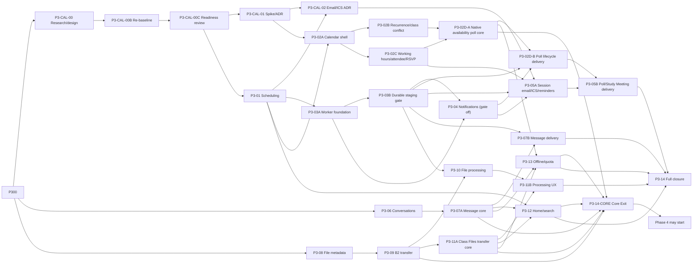

# Backlog Phase 3 - Daily learning workspace

> Nguồn thực thi chi tiết cho Phase 3. Master Plan giữ mục tiêu và exit gate; tài
> liệu này giữ dependency, phạm vi, acceptance, API/schema, kiểm thử và Definition of Done.

## 1. Mục tiêu phase

Xây daily learning workspace đủ dùng cho pilot có kiểm soát:

1. teacher lên lịch buổi học đúng timezone;
2. teacher và student trao đổi bằng tin nhắn bền vững;
3. người dùng nhận notification mà lỗi delivery không rollback nghiệp vụ;
4. file lớn upload/download trực tiếp với Backblaze B2, không đi xuyên Core API;
5. worker xử lý outbox theo at-least-once, retry idempotent và dead-letter;
6. calendar gửi invitation/update/cancellation/reminder email kèm ICS và theo dõi RSVP;
7. teacher, student và active member khác tạo Availability Poll native, chia sẻ an toàn
   và chốt thành buổi học chính thức hoặc Study Meeting đúng quyền;
8. home, calendar, search và Class Files có đủ trạng thái vận hành.

**Re-baseline thực thi ngày 2026-07-31:** Phase 3 được tách thành hai lane:

1. **Core Exit (runnable):** các slice có thể xây/chạy/test trên Render/Neon/B2 hiện tại,
   gồm P3-02D-A poll/Study Meeting core, conversation/message core, file transfer core
   và các phần dashboard/quality không cần worker hoặc provider live.
2. **Deferred carry-over:** durable worker, notification activation, live SES/domain/
   interoperability, email/ICS/reminder delivery và processing phụ thuộc worker.

Core Exit là mốc cho phép bắt đầu Phase 4 khi checklist của lane runnable xanh; nó không
đánh dấu umbrella Phase 3 hoặc P3-14 là `DONE`. Carry-over vẫn phải được theo dõi, không
được tuyên bố `PASS` bằng cách bỏ qua gate, và sẽ đóng sau bằng full P3-14.
Thời lượng 13–17 tuần trước đây chỉ là planning estimate cho một chuỗi tuần tự; từ
re-baseline này không dùng nó để chặn Phase 4 hay ép các gate provider/hạ tầng phải hoàn
tất trước khi có môi trường phù hợp. Domain/DNS, SES sandbox và production-access
approval có thể tiếp tục chuẩn bị song song.

**Task đang thực hiện:** `P3-07A` persistent message, unread/read core đã bắt đầu
`IN PROGRESS` ngày 2026-08-04 sau khi P3-06 đạt `DONE`. ADR-0025 và amendment ADR-0013
khóa REST/PostgreSQL authority, lifecycle, idempotency, receipt và privacy boundary.
`P3-02D-B` lifecycle delivery/
auto-close/fan-out và các gate P3-03B/P3-CAL-02/P3-05A/B là carry-over, không nằm trong
mốc Core Exit tối thiểu.

**Quyết định hosting/test ngày 2026-07-31:** giữ Render Web Service cho Core API
staging/private alpha. Render Free không phải durable worker và không được thay bằng
external ping, cron, GitHub Actions schedule hoặc laptop. Các test local/CI/disposable
staging vẫn bắt buộc thực hiện; chỉ gate cần host không spin-down, worker live grants,
crash/reclaim/duplicate và provider/domain production được gắn `DEFERRED/VERIFY`.
`DEFERRED` là trạng thái của một sub-gate, không làm umbrella task thành `DONE` và không
cho phép bật asynchronous delivery/notification/email/reminder hoặc worker-driven file
processing/sharing tới end user.

**Thiết kế Calendar có thẩm quyền:**
[`CALENDAR_PRODUCT_TECHNICAL_DESIGN.md`](CALENDAR_PRODUCT_TECHNICAL_DESIGN.md).

## 2. Non-goal

- Classroom moderation, lobby và media lifecycle đầy đủ thuộc Phase 4.
- Whiteboard, breakout, recording và classroom tools thuộc Phase 5.
- Assignment, exam và QuizHub thuộc Phase 6.
- Lavie AI, social feed và search nâng cao thuộc Phase 7.
- Google/Microsoft two-way sync, public booking, enterprise room/resource federation và
  organization-wide calendar ACL không nằm trong Phase 3.
- Link `anyone_with_link` của Availability Poll chỉ cấp quyền xem/trả lời khảo sát tối
  thiểu; nó không phải public booking, không giữ chỗ, thanh toán, auto-confirm hoặc tự
  tạo session/meeting.
- Mobile push, marketing/bulk email, inbound mailbox, billing và full production SLO
  không nằm trong Phase 3. Transactional Calendar email/ICS thuộc Phase 3.
- Không tự xây message broker, object storage, virus engine hoặc thumbnail service.
- Không thêm Redis, NATS, Kafka, microservice hoặc Kubernetes nếu chưa có tải/ADR.
- P3-01 không làm recurring series, reminder, calendar tổng hợp hoặc participant/media state.

## 3. Nguyên tắc bắt buộc

- OpenAPI đổi trước hoặc cùng implementation; generated TypeScript client không sửa tay.
- Tenant/class scope lấy từ session và repository authoritative; foreign ID bị conceal `404`.
- Mọi mutation nhạy cảm đi qua shared policy, audit và transactional outbox.
- Timestamp nghiệp vụ lưu dưới dạng instant UTC; civil time giữ IANA timezone và được
  kiểm tra DST theo ADR-0017.
- Worker chạy at-least-once; mọi handler phải idempotent theo outbox event ID.
- Notification failure không rollback business transaction đã commit.
- Binary không đi qua Core API; browser chỉ nhận presigned URL ngắn hạn và giới hạn scope.
- File chưa `ready` không được chia sẻ hoặc tải như artifact hợp lệ.
- Log, metric, audit và outbox không chứa token, cookie, signed URL, raw file content,
  message content không cần thiết hoặc PII thừa.
- Public capability dùng opaque token entropy cao, chỉ lưu hash, có expiry/revoke/scope/
  rate limit; raw token không nằm trong query, referrer, log hoặc analytics.
- Mỗi UI slice có loading, empty, filtered-empty, error, forbidden, offline/degraded và retry.

## 4. Trạng thái tổng hợp

| Task       | Nội dung                                       | Dependency                      | Trạng thái |
| ---------- | ---------------------------------------------- | ------------------------------- | ---------- |
| P3-00      | Backlog + architecture/contract baseline       | Phase 2                         | DONE       |
| P3-CAL-00  | Calendar research + product/technical design   | P3-00                           | DONE       |
| P3-CAL-00B | Teams/Google parity + visual/email re-baseline | P3-CAL-00                       | DONE       |
| P3-CAL-00C | Final implementation-readiness review          | P3-CAL-00B                      | DONE       |
| P3-CAL-01  | Renderer/recurrence/theme spike + ADR-0019     | P3-CAL-00C                      | DONE       |
| P3-01      | Course session scheduling và timezone          | P3-00, P3-CAL-00C               | DONE       |
| P3-CAL-02  | Invitation/RSVP/iCalendar/AWS SES + ADR-0020   | P3-CAL-01, P3-01                | VERIFY     |
| P3-02A     | Professional Calendar shell/read projection    | P3-01, P3-CAL-01                | DONE       |
| P3-02B     | Recurrence + class conflict                    | P3-02A, ADR-0019                | DONE       |
| P3-02C     | Working hours/attendee/free-busy/RSVP          | P3-02A, ADR-0023 contract       | DONE       |
| P3-02D-A   | Native Availability Poll + Study Meeting core  | P3-02B, P3-02C, ADR-0021        | DONE       |
| P3-02D-B   | Poll lifecycle delivery/auto-close/fan-out    | P3-02D-A, P3-03B, P3-04         | DEFERRED/TODO |
| P3-03A     | PostgreSQL outbox worker repository foundation | P3-01                          | VERIFY     |
| P3-03B     | Durable worker staging acceptance              | P3-03A                          | DEFERRED/VERIFY |
| P3-04      | In-app notification và preference              | P3-03A; P3-03B trước activation | VERIFY     |
| P3-05A     | Session email/ICS/external RSVP/reminder       | P3-02C, P3-CAL-02, P3-03B, P3-04 | DEFERRED/TODO |
| P3-05B     | Poll/Study Meeting lifecycle delivery          | P3-02D-B, P3-05A               | DEFERRED/TODO |
| P3-06      | Direct/class conversation                      | P3-00, Phase 2 policy           | DONE       |
| P3-07A     | Persistent message, unread/read core           | P3-06                           | IN PROGRESS |
| P3-07B     | Message notification delivery                  | P3-07A, P3-03B, P3-04           | DEFERRED/TODO |
| P3-08      | File metadata, upload intent và finalize       | P3-00, B2 baseline              | TODO       |
| P3-09      | Presigned B2 upload/download                   | P3-08                           | TODO       |
| P3-10      | Scan/metadata/thumbnail processing             | P3-03B, P3-09                   | DEFERRED/TODO |
| P3-11A     | Class Files transfer-core UI (gate off)        | P3-09                           | TODO       |
| P3-11B     | File processing/thumbnail/rejected UX          | P3-10, P3-11A                   | DEFERRED/TODO |
| P3-12      | Home dashboard và PostgreSQL search cơ bản     | P3-01, P3-07A, P3-11A           | TODO       |
| P3-13      | Offline/retry drafts và Phase 3 quota closure  | P3-02D-A, P3-07A, P3-11A        | TODO       |
| P3-14-CORE | Core Exit sign-off (cho phép bắt đầu Phase 4)  | P3-02D-A, P3-07A, P3-09, P3-11A, P3-12, P3-13 | TODO |
| P3-14      | Full staging acceptance và đóng Phase 3       | carry-over + P3-12/P3-13        | TODO       |

`VERIFY` nghĩa là implementation và các gate đã ghi nhận đạt, nhưng vẫn còn ít nhất một
exit gate staging/manual chưa hoàn tất. Trạng thái này không đồng nghĩa `DONE`.
`DEFERRED/VERIFY` nghĩa là phần kiểm tra đã được xác định rõ nhưng đang chờ một điều kiện
ngoài repository (ví dụ durable host, quyền provider hoặc domain/DNS). Không được đánh
dấu PASS bằng cách không chạy; các phần không phụ thuộc điều kiện đó vẫn phải chạy.
`DEFERRED/TODO` nghĩa là task chưa được triển khai và dependency hạ tầng/provider đang
chưa sẵn sàng; không được ngụ ý implementation hay verification đã tồn tại.
`P3-14-CORE` là checkpoint chuyển tiếp, không đóng umbrella Phase 3. Khi checkpoint này
đạt, Phase 4 được phép bắt đầu với carry-over register còn mở; P3-14 đầy đủ chỉ đóng sau
khi các carry-over gate và side-effect safety đều được nghiệm thu.

## 5. Dependency graph

```mermaid
flowchart LR
    P300 --> PC00["P3-CAL-00 Research/design"]
    PC00 --> PC00B["P3-CAL-00B Re-baseline"]
    PC00B --> PC00C["P3-CAL-00C Readiness review"]
    PC00C --> PC01["P3-CAL-01 Spike/ADR"]
    PC00C --> P301["P3-01 Scheduling"]
    PC01 --> PC02["P3-CAL-02 Email/ICS ADR"]
    P301 --> PC02
    P301 --> P303A["P3-03A Worker foundation"]
    P303A --> P303B["P3-03B Durable staging gate"]
    P300 --> P306["P3-06 Conversations"]
    P300 --> P308["P3-08 File metadata"]
    P301 --> P302A["P3-02A Calendar shell"]
    PC01 --> P302A
    P302A --> P302B["P3-02B Recurrence/class conflict"]
    P302A --> P302C["P3-02C Working hours/attendee/RSVP"]
    P302B --> P302DA["P3-02D-A Native availability poll core"]
    P302C --> P302DA
    P303A --> P304["P3-04 Notifications (gate off)"]
    P303B --> P304
    P302DA --> P302DB["P3-02D-B Poll lifecycle delivery"]
    P303B --> P302DB
    P304 --> P302DB
    P302C --> P305A["P3-05A Session email/ICS/reminders"]
    PC02 --> P305A
    P303B --> P305A
    P304 --> P305A
    P302DB --> P305B["P3-05B Poll/Study Meeting delivery"]
    P305A --> P305B
    P306 --> P307A["P3-07A Message core"]
    P303B --> P307B["P3-07B Message delivery"]
    P307A --> P307B
    P308 --> P309["P3-09 B2 transfer"]
    P309 --> P310["P3-10 File processing"]
    P303B --> P310
    P309 --> P311A["P3-11A Class Files transfer core"]
    P310 --> P311B["P3-11B Processing UX"]
    P311A --> P311B
    P301 --> P312["P3-12 Home/search"]
    P307A --> P312
    P311A --> P312
    P302DA --> P313["P3-13 Offline/quota"]
    P307A --> P313
    P311A --> P313
    P302DA --> P314C["P3-14-CORE Core Exit"]
    P307A --> P314C
    P309 --> P314C
    P311A --> P314C
    P312 --> P314C
    P313 --> P314C
    P314C --> P4["Phase 4 may start"]
    P305B --> P314["P3-14 Full closure"]
    P307B --> P314
    P311B --> P314
    P312 --> P314
    P313 --> P314
```

P3-03A được kéo lên ngay sau P3-01 để kiểm chứng worker sớm; không cần chờ poll. P3-04
được code handler canary sau P3-03A với registration/feature gate mặc định tắt; canary
đóng P3-03B rồi mới được activation tới end user. P3-05A/P3-05B/P3-07B/P3-10 không
được bypass P3-03B durable staging gate. P3-05A không được bypass ADR-0020/provider/
deliverability gate. P3-02D-A chỉ là poll/StudyMeeting core và có thể triển khai trước
durable worker; P3-02D-B mới bổ sung auto-close/fan-out/delivery sau P3-03B và activation
P3-04. P3-05B là adapter/delivery slice downstream của P3-02D-B, không phải prerequisite.
P3-07A là message persistence core; notification delivery thuộc P3-07B carry-over.
P3-02D theo ADR-0021 chỉ bắt đầu sau P3-02B/C và không phụ thuộc runtime When2meet.

## 5A. Hai lane thực thi và điều kiện `Core Exit`

### Lane runnable — được phép hoàn thiện trước Phase 4

Các task sau có thể tiếp tục với hạ tầng hiện tại, miễn là vẫn giữ tenant policy, audit,
idempotency, a11y và feature gate đúng:

- `P3-02D-A`: poll/Study Meeting core — create, edit, share capability, response,
  aggregate/ranking, manual close/reopen/finalize và direct StudyMeeting intent. Không
  auto-send email, không fan-out và không mint LiveKit token.
- `P3-06` + `P3-07A`: conversation và message persistence/unread/read core. Notification
  delivery, reminder và worker consumer thuộc `P3-07B` carry-over.
- `P3-08` + `P3-09`: file metadata, upload intent/finalize và presigned B2 transfer.
  Scan/thumbnail/processing cần worker được tách khỏi Core Exit.
- `P3-11A`, `P3-12`, `P3-13` có thể chạy song song ở phạm vi không phụ thuộc worker/
  provider và là điều kiện bắt buộc của Core Exit; degraded/empty/error/forbidden/offline
  state vẫn là acceptance bắt buộc.
  Class Files transfer core giữ feature gate tắt cho end user cho tới khi P3-10/P3-11B
  đóng scan/processing safety.

### Lane deferred — vẫn mở, không được đánh dấu PASS bằng cách bỏ qua

`P3-03B` durable host/worker role/grants/crash-reclaim, `P3-04` activation, live
`P3-CAL-02` SES/domain/interoperability, `P3-05A` session email/ICS/reminder,
`P3-02D-B` auto-close/fan-out/poll delivery, `P3-05B`, `P3-10` và `P3-11B` worker-dependent
processing/UX là carry-over. Các test local/CI/disposable của chúng vẫn phải chạy ngay; chỉ
sub-gate cần host/provider thật được giữ `DEFERRED/VERIFY`; task chưa triển khai dùng
`DEFERRED/TODO`. Hai notification flag và Class Files activation vẫn `false`, không tạo
asynchronous delivery hoặc worker-driven file side effect tới end user.

### Mốc chuyển tiếp

`P3-14-CORE` đạt khi P3-02A/B/C đã DONE (đã đạt), lane runnable đã qua test/authorization/
tenant isolation/a11y/staging acceptance và có carry-over register rõ ràng. Khi đó owner
được phép bắt đầu Phase 4. `P3-14-CORE` không đóng Phase 3; `P3-14` full closure chỉ
được sign-off sau khi lane deferred đóng và toàn bộ exit gate email/worker/file processing
đạt.

## 6. P3-00 Backlog và architecture/contract baseline

**User outcome:** agent mới biết chính xác thứ tự Phase 3, task hiện tại và các quyết
định không được tự suy từ hội thoại.

### Definition of Done

- [x] Tạo backlog có task ID, dependency, scope, acceptance và exit gate.
- [x] Chọn P3-01 scheduling/timezone là vertical slice implementation đầu tiên.
- [x] ADR-0017 chốt instant/civil time, DST, lifecycle và recurrence boundary.
- [x] ADR-0018 chốt PostgreSQL leased outbox worker, retry và dead-letter.
- [x] Xác nhận không thêm provider/library/service ở P3-00.
- [x] Đồng bộ README, Project State, Agent Coordination, Delivery Roadmap và Master Plan.

## 7. P3-01 Course session scheduling và timezone

**User outcome:** teacher lên lịch một buổi học; người có quyền xem lớp thấy đúng thời
gian; teacher có thể sửa hoặc hủy mà không làm lẫn tenant/lớp.

Trước implementation phải đọc
[`CALENDAR_PRODUCT_TECHNICAL_DESIGN.md`](CALENDAR_PRODUCT_TECHNICAL_DESIGN.md). P3-01
không thêm FullCalendar hoặc recurrence; dependency chỉ được thêm sau P3-CAL-01.

### Scope

- Class-scoped session một lần, không recurrence.
- Lifecycle public của P3-01: `scheduled -> cancelled`; schema dự phòng `live/ended`
  nhưng chỉ Phase 4 được nối transition media.
- Create, list theo bounded range, detail, update metadata/time và cancel idempotent.
- UTC instant + IANA timezone; request có RFC3339 offset rõ và kiểm tra round-trip DST.
- Optimistic `version`; audit/outbox trong cùng transaction với mutation.
- Minimal class-session UI trên class detail; calendar tổng hợp thuộc P3-02.

### API/schema dự kiến

- Migration `000014_class_sessions` có forward/down path.
- `GET/POST /api/v1/classes/{class_id}/sessions`.
- `GET/PATCH /api/v1/classes/{class_id}/sessions/{session_id}`.
- `POST /api/v1/classes/{class_id}/sessions/{session_id}/cancel`.
- Permission mới `session.schedule`; read dùng class viewer projection authoritative.
- Không tin `tenant_id`, owner, role hoặc status do client tự khai.

### Acceptance

- [ ] Org admin, organization teacher, class owner và co-teacher tạo/sửa/hủy đúng quyền.
- [ ] TA/student active chỉ xem; unenrolled user bị deny; foreign IDs bị conceal `404`.
- [ ] Draft/archived class không tạo hoặc sửa lịch; archived history vẫn đọc được.
- [ ] `starts_at < ends_at`, duration/range bị giới hạn và timezone phải là IANA hợp lệ.
- [ ] DST gap bị từ chối; DST overlap chỉ nhận khi offset disambiguate đúng.
- [ ] Concurrent stale update trả `409`; cancel lặp lại là idempotent no-op.
- [ ] Mutation ghi audit/outbox redacted, không chứa description đầy đủ hoặc PII thừa.
- [ ] UI có vi/en, keyboard flow, loading/empty/error/forbidden/offline/retry.
- [ ] Unit, PostgreSQL integration, authorization/IDOR và Playwright teacher/student xanh.

### Rollout/rollback

- Feature mặc định chỉ mở cho staging/private alpha sau migration và CI.
- P3-01 phải thêm feature flag, bounded duration/range/fan-out cap và kill switch ngay
  trong slice; không chờ P3-13 mới enforcement.
- Rollback application không cần down migration; down chỉ chạy trên disposable branch.
- Không xóa row session để rollback UI; endpoint mới có thể tắt qua feature control.

### Bằng chứng implementation local ngày 2026-07-24

- [x] Migration `000014`, model/repository/service/HTTP, policy/feature control,
      OpenAPI/generated client và class-detail UI đã được triển khai.
- [x] Web typecheck, 144 test và production build; API client typecheck cùng 17 test đạt.
- [x] Các Go package liên quan `httpapi`, `classroom`, `featurecontrol`, `audit`,
      `policy`, `config` và recurrence spike đạt test local.
- [x] Timezone resolver từ chối DST gap và yêu cầu chọn offset cho overlap; unit test
      dùng `Asia/Ho_Chi_Minh` và `America/New_York`.
- [x] Neon staging migrate `13 -> 14`, runtime grant tối thiểu và version `14 false`.
- [x] Feature commit `b58666c`, security patch `a5741a1` và web acceptance fix `e7dc161`
      đã được deploy; Render direct cùng Cloudflare same-origin health/readiness/status
      public probes đều xanh.
- [x] Browser acceptance Teacher create/update/cancel, Student read-only và foreign-ID
      conceal `404` đạt trên staging. Lượt browser thủ công không được ghi thành
      Playwright staging.
- [x] P3-01 chuyển `VERIFY -> DONE` sau khi toàn bộ gate trên đạt ngày 2026-07-24.

## 8. P3-02 Calendar day/week/month và recurring series

- Thực thi UX/architecture trong `CALENDAR_PRODUCT_TECHNICAL_DESIGN.md`.
- Teams-inspired local sidebar/command bar, Warm Academic cream theme và editor hai cột;
  không sao chép icon/font/asset/trade dress.
- Top-level route có Day/Work week/Week/Month/Agenda; mobile mặc định Agenda.
- Calendar tổng hợp theo viewer timezone nhưng hiển thị class timezone khi khác biệt.
- Bounded date range, server-side query và URL state cho day/week/month.
- Recurrence là series + occurrence, không clone vô hạn; edit-one/edit-future/cancel có
  semantics và ADR-0019 trước implementation.
- Quick create, full editor, detail drawer, class/type/status filter, search và role-aware CTA.
- Organizer, roster audience, required/optional attendee, permitted external guest,
  guest permissions, show-as/visibility và RSVP accept/tentative/decline.
- Scheduling Assistant/Find a time, working hours và privacy-safe free/busy; external
  attendee chưa sync hiển thị unknown.
- Availability Poll là native P3-02D: all active authenticated member có thể tạo poll
  của mình; public capability chỉ trả projection tối thiểu và không phải booking.
- Drag/resize có keyboard alternative, optimistic revert, undo và stale-version handling.
- Conflict class/teacher authoritative ở backend; free/busy không lộ private detail.
- DST gap/overlap, month boundary, leap day và timezone switch có golden tests.
- Email/ICS/reminder không nằm trong transaction lịch; P3-05A/P3-05B tiêu thụ event sau
  commit.

### P3-CAL-00 research/design gate

- [x] Nghiên cứu Google Calendar, Microsoft Teams, Zoom và ClassIn bằng nguồn chính thức.
- [x] Audit read-only tab Lịch TutorHub V1, gồm UI, model/DAO, threading và security.
- [x] So sánh FullCalendar, Schedule-X, React Big Calendar, TOAST UI, Cal.diy và RRULE.
- [x] Chốt đề xuất UX, domain/read model, API, backend, security, a11y, test và rollout.
- [x] Ghi giới hạn nguồn và phân biệt fact/inference.

### P3-CAL-00B parity/visual/email re-baseline gate

- [x] Nghiên cứu lại Teams/Google bằng nguồn chính thức và bốn ảnh owner cung cấp.
- [x] Chốt parity contract: professional everyday core trong Phase 3, enterprise
      federation/booking/two-way sync để phase sau.
- [x] Chốt Teams-inspired IA/editor và Vauliys-inspired Warm Academic palette.
- [x] Đưa email invitation/update/cancel/reminder, ICS và RSVP vào Phase 3 exit gate.
- [x] Ghi rõ đây là tài liệu/re-baseline; chưa có runtime, provider hoặc dependency mới.

### P3-CAL-00C final implementation-readiness review

- [x] Đối chiếu lại Google Calendar, Teams/Outlook, FullCalendar v7, RFC 5545/5546/6047,
      AWS SES/SNS và recurrence Go bằng nguồn chính thức/repository upstream.
- [x] Tách P3-02A/B/C và P3-05A/B dependency; kéo P3-03 lên trước consumer side effect.
- [x] Thêm CalendarDisplayPreference/WorkingSchedule, deterministic suggested-time contract,
      split-exception preview, audience diff và reminder lifecycle.
- [x] Sửa `class.read` thành permission code thật `class.view`; làm rõ poll close/reopen,
      edit-after-response và direct StudyMeeting scheduling API trong ADR-0021.
- [x] Ghi rõ SES không có caller idempotency token; bổ sung `outcome_unknown`,
      event-transport verification, byte-level MIME/ICS và tracking-off gate.
- [x] Gỡ field UI chưa có domain khỏi lời hứa Phase 3: ClassSession/StudyMeeting là timed;
      all-day/online room/material chỉ bật khi source contract thật tồn tại.
- [x] Khóa iterator recurrence có cancellation/cap, suggested-time total order qua DST,
      canonical SES state machine/full durable ingress, one-part MIME/ICS required fields
      và giới hạn đúng mức của public-poll cohort/anonymous dedupe.

### P3-CAL-01 technical spike/ADR gate

- [x] ADR-0019 ghi alternatives/criteria và chuyển
      `Accepted; manual NVDA gate PASS`.
- [x] FullCalendar Standard v7.0.1 spike đạt React/Vite/strict/bundle/performance; đã
      so sánh v6.1.21 fallback, Temporal/package/CSS/theme và pin exact version.
- [x] Keyboard, Axe critical/serious=0, mobile Agenda, pointer drag/resize, drag
      alternative, zoom 200%, forced-colors và reduced-motion đạt automated evidence;
      Agenda mở progressive `24 -> 48 -> 51`, Axe waiver khóa exact node/count/scope.
- [x] `PENDING_NVDA_REVIEW`: manual NVDA đã PASS ngày 2026-07-26 trên NVDA 2026.1.1;
      marker được giữ để production guard đọc trạng thái. Đây là gate accessibility
      của ADR, không tự thay thế các gate route production.
- [x] DST/drag/revert contract unit với fixture `Asia/Ho_Chi_Minh` và
      `America/New_York` đạt; browser interaction evidence vẫn thuộc mục trên.
- [x] Go recurrence candidate qua adapter đạt bounded RFC subset/golden/property/
      resource-exhaustion test hoặc bị loại; COUNT occurrence-last phải nằm trong
      horizon 730 ngày, YEARLY golden đã đạt; cấm `.All()` và hourly/minutely/secondly.
- [x] ADR-0019 được cập nhật từ kết quả spike và chấp nhận series/exception/occurrence
      identity, DST recurrence, split-exception policy, WorkingSchedule/suggested-time,
      class/teacher resource dependency, exact cap và dependency decision.
- [x] Dependency/license/security guard và root lock review đạt; không kéo
      Premium/telemetry ngoài ý muốn.

Automated local evidence đã đạt typecheck, lint, 8 unit/DOM test, build, dependency
guard 3/3, full v7 Playwright hậu fix `9 passed (23.6s)` và Go
unit/fuzz/benchmark. Calendar v7 JS/CSS gzip là `155.15/5.37 KiB`; heap 2.000 item
tăng `26,34 MiB`. Render p95 `152/164/201 ms`, navigation p95 `204/327/548 ms` và
long-task max `79/198/315 ms` ở 500/1.000/2.000 item, đạt budget tương ứng
`500/900/1.800`, `350/500/800` và `200/300/400 ms`.
Comparator parity-config v6 full run `4 passed (17.5s)`, JS gzip `139.00 KiB`, heap
`7,44 MiB`; vẫn không được chọn vì render 500 `1.492 > 500 ms` và long-task 2.000
`404 > 400 ms`. Recurrence hard cap là query window `366 ngày`, series horizon
`730 ngày`, `512 occurrence/series`, `2.000 occurrence/request` và deadline `250 ms`;
COUNT occurrence-last/YEARLY golden đạt. Axe chỉ có waiver upstream exact
`empty-table-header`, impact minor, một node/target/HTML/scope; critical/serious bằng 0.
ADR-0019 được chấp nhận ở cấp decision spike; manual NVDA gate đã PASS và production
route đã được nghiệm thu trong P3-02A.

### P3-CAL-02 invitation/RSVP/iCalendar/provider gate

- [x] Mở ADR-0020, ghi AWS SES là provider target owner đã chọn và chốt organizer,
      roster snapshot, required/optional/external attendee, guest permission cùng RSVP
      state/source of truth.
- [x] Chốt RFC 5545/5546/6047 subset: globally unique stable UID, monotonic `SEQUENCE`,
      required `PRODID`/`VERSION:2.0`, `CALSCALE:GREGORIAN`, `TZID`,
      `RRULE/RECURRENCE-ID/EXDATE`, `METHOD:REQUEST/CANCEL`.
- [x] Ở runtime, email/ICS chỉ phát sau commit qua ADR-0018 worker; effect dedupe theo
      invitation/recipient/effect/sequence/channel. Renderer/provider spike bên dưới chỉ
      dùng sandbox/sink cô lập và không phải đường gửi runtime.
- [ ] Xác minh AWS SES qua provider adapter bằng cost/quota/region/idempotency,
      event-transport và suppression evidence; phải ghi rõ không có caller idempotency
      token, `accepted` không phải inbox/delivery, `outcome_unknown`/grace/reconcile và
      external duplicate SLO; domain code không import AWS SDK trực tiếp. Adapter local,
      error mapping và SDK no-retry đã PASS; account/quota/topology live vẫn `BLOCKED`.
- [x] Sending domain, Easy DKIM, SPF/DMARC alignment và custom MAIL FROM decision được
      chốt; `delivered_to_recipient_server` không được hiển thị là “đã vào inbox”.
- [x] Chọn full durable path Configuration Set -> EventBridge -> SQS/DLQ -> worker ->
      PostgreSQL inbox, hoặc SNS HTTPS -> verified ingress -> PostgreSQL inbox; khóa
      signature version, dedupe/out-of-order key, bounce/complaint/suppression, secret
      rotation và incident runbook.
- [x] Trước khi có domain, chỉ test sandbox bằng personal sender/recipient email identity
      đã verify. Không coi đây là production readiness hoặc nới exit gate domain/DNS.
- [x] External RSVP capability có scope/expiry/revoke/rate limit, chỉ lưu token hash.
- [x] CTA TutorHub là RSVP source mặc định và ICS dùng `RSVP=FALSE`; chỉ bật
      `RSVP=TRUE`/inbound `METHOD:REPLY` nếu ADR bổ sung parser và security gate.
- [x] Audience diff added/removed/unchanged/role-change, organizer transfer/disable/
      archive và RSVP retain/reset policy được chốt.
- [x] Deterministic MIME/ICS có đúng một calendar part authoritative; đạt CRLF,
      75-octet folding, UTF-8/escaping/encoding, required VCALENDAR fields,
      MIME/VCALENDAR METHOD match và canonical retry bytes; tracking off cho capability.
- [x] Invitation/update/cancel qua SES v2 `SendEmail` bắt buộc dùng `Content.Raw`/
      `RawMessage` từ canonical MIME bytes đã persist; không dùng `Simple` hoặc `Template`
      cho flow có iCalendar.
- [ ] Gmail/Google Calendar, Outlook và Apple Calendar spike đạt create/update/cancel;
      không thêm production dependency trước khi ADR-0020 được chấp nhận.
- [x] Spike dùng deterministic fixture và provider sandbox/sink cô lập; không nối Core API,
      không consume outbox và không gửi business email tới end user. SES sandbox chỉ
      dùng owner-controlled verified identities. Runtime delivery vẫn phải chờ
      P3-03/P3-05A.

**Gate vận hành hiện tại (2026-07-31):** renderer, golden, sink và adapter sandbox tiếp
tục được kiểm tra local/CI. SES account/region/quota, provider event ingress/suppression,
sending domain/DNS/SPF/DKIM/DMARC và cross-client interoperability được giữ
`DEFERRED/VERIFY` cho tới khi có bằng chứng live; không coi việc chưa gửi email là PASS và
không nối business delivery vào Render Web Service.

### P3-02A Professional Calendar shell và read projection

**Outcome:** người dùng có top-level Calendar chuyên nghiệp, đọc được session một lần từ
P3-01 qua một projection thống nhất; chưa hứa recurrence, attendee/RSVP hoặc email.

- [x] Thêm route/navigation Calendar với Day, Work week, Week, Month và Agenda; mobile
      mặc định Agenda, browser back/forward giữ đúng URL state.
- [x] Calendar read endpoint/query model nhận bounded range, source/type/class/status,
      search cursor và viewer timezone; cache key luôn có tenant/user/filter/range.
- [x] `CalendarItem` chỉ là read projection có stable source identity/version; mutation
      vẫn gọi command của ClassSession/StudyMeeting nguồn, không tạo domain Event thứ hai.
- [x] Mini calendar, Today/prev/next, view switcher, filter/search, saved default view,
      density/time scale, 12/24h, week start và secondary timezone badge đạt.
- [x] Migration/OpenAPI/UI cho `CalendarDisplayPreference` lưu viewer timezone, locale,
      12/24h, week start, default view, density/time scale và secondary timezone; update
      dùng optimistic version và luôn tenant/user-scoped.
- [x] Quick create/full editor ở task này chỉ tạo/sửa timed one-time ClassSession đã có
      contract P3-01; all-day, room/material và source chưa có field phải source-gated/
      hidden, không lưu placeholder.
- [x] Đóng manual NVDA marker bằng checklist PASS của ADR-0019; CI vẫn deny Premium
      package, telemetry và unreviewed CSS/assets.
- [x] Dùng exact pin FullCalendar Standard đã được ADR-0019 chấp nhận và nối production
      route sau khi route thật lặp lại authorization/range/a11y/bundle gate.
- [x] Warm Academic semantic token, Teams-inspired IA và editor hai cột đạt visual
      regression ở desktop/tablet/mobile nhưng không sao chép icon/font/trade dress.
- [x] Drag/resize one-time có expected version, optimistic revert, undo và keyboard
      alternative; server `409` mở stale/conflict flow, không ghi đè mù.
- [x] Loading, empty, filtered-empty, error, forbidden, offline/degraded và retry đầy đủ;
      workspace switch/logout hủy request và xóa tenant cache cũ.
- [x] Range/query size, render p50/p95, long task, memory và bundle đạt numeric budget từ
      ADR-0019; 500/1.000/2.000 visible item fixture được đo.
- [x] Keyboard-only, NVDA, Axe, zoom 200%, forced-colors, reduced-motion và semantic Agenda
      đạt; color không là tín hiệu duy nhất.
- [x] Contract/integration/E2E chứng minh tenant isolation, timezone, stable ordering,
      pagination/range cap và source permission trước rollout staging.

**DONE 2026-07-26:** source migration `000017`, Go projection/repository/service,
HTTP/OpenAPI/generated client, preference CAS và Calendar shell semantic đã có. Toàn bộ
Go test + vet, integration-tag compile, API client 22/22, web 176/176 + build, security
19/19, Calendar production guard và 20 cặp token contrast đều đạt. PostgreSQL integration
thật không chạy vì process không có `DATABASE_MIGRATION_URL`/`DATABASE_POOL_URL`; không
đọc `.env*.local`. Marker `PENDING_NVDA_REVIEW` đã có kết quả PASS. Route thật đã import và
mount FullCalendar Standard v7.0.1 cho Day/Work week/Week/Month; Agenda semantic vẫn là
progressive/keyboard alternative. Quick create/full editor timed one-time ClassSession,
drag/resize expected-version, optimistic revert, undo và flow `409` đã nối về command
P3-01. Rerun spike hậu tích hợp đạt 9/9. Production-route Playwright đạt 8/8, gồm
authorization/range/pagination, Axe, semantic Agenda, zoom/forced-colors/reduced-motion và
visual desktop/tablet/mobile. Render/navigation/long-task p95 cho fixture
500/1.000/2.000 item lần lượt là `177/266/102`, `310/481/180` và `570/716/326 ms`, đều
trong ngân sách ADR-0019. Route build tách Calendar chunk khoảng 298,64 kB
(82,29 kB gzip).

**Staging rollout 2026-07-26:** backup branch `p3-calendar-pre-migration-20260726` (auto-delete
7 ngày) đã được tạo trước rollout. Neon staging direct migration `14 false -> 17 false` thành
công. Exact runtime ACL probe đạt schema usage/no-create, outbox column INSERT, notification
read/read-at update, preference allowlist và calendar preference SELECT/INSERT/UPDATE; mọi
DELETE/TRUNCATE ngoài allowlist đều bị từ chối. Worker role chưa tồn tại nên worker/canary gate
vẫn mở và chưa bật feature.

**Staging acceptance 2026-07-26:** commit `0606813` được manual deploy lên Render do
Auto-Deploy đang tắt; Core API và Cloudflare health/ready đều HTTP 200. Browser staging
với Admin xác nhận Calendar empty-state, chuyển Agenda giữ URL state, mở Preference đầy
đủ và Quick Create xử lý đúng trạng thái không có lớp có thể lên lịch; không tạo mutation.
Biên bản: [`P3_02A_STAGING_ACCEPTANCE.md`](P3_02A_STAGING_ACCEPTANCE.md).

### P3-02B Recurrence và class conflict authority

**Outcome:** ClassSession recurring series chạy bounded, đúng DST và có edit
one/following/all minh bạch; conflict authoritative nằm ở backend.

- [x] Chỉ bắt đầu sau ADR-0019 `Accepted`; migration/OpenAPI khóa series, exception,
      occurrence identity, optimistic version và ICS identity mapping.
- [x] Engine Go qua adapter iterator có context/deadline/item cap; cấm `.All()` và chỉ
      dùng `Between()` khi validator chứng minh upper bound nhỏ hơn hard cap.
- [x] RFC subset/frequency/count/until/by-day/month policy, exact range/occurrence cap và
      unsupported-rule error được contract hóa; không clone occurrence vô hạn.
- [x] Expansion dùng civil-time intent + IANA zone; gap/overlap, leap day, month-end,
      timezone change và all supported recurrence combinations có golden/property tests.
- [x] Edit one tạo exception; edit following preview số occurrence/exception bị tác động
      và bắt chọn carry/rebase/discard hợp lệ; edit all không âm thầm mất exception.
- [x] Cancel occurrence/series giữ tombstone/audit/outbox/UID/sequence semantics; stale
      replay idempotent và không hồi sinh occurrence cũ.
- [x] Class/resource conflict được kiểm tra trong cùng transaction mutation/finalize,
      dùng half-open interval; override cần capability + reason + audit.
- [x] Teacher conflict chỉ bật khi assignment/attendee authority đã tồn tại; trước đó UI
      và API không tuyên bố teacher-free, student conflict chỉ là private suggestion.
- [x] Drag/resize recurrence bắt actor chọn one/following/all, có preview/revert/undo và
      không mutate series khi dialog bị hủy.
- [x] Feature flag, exact hard cap, kill switch, metric expansion duration/count/rejection
      và resource-exhaustion test được thêm ngay trong task.
- [x] Staging integration/E2E bao phủ concurrent edit, `409`, split series, exception retention,
      cross-tenant concealment và query plan theo bounded range.

**VERIFY 2026-07-27 — implementation complete:** typed recurrence boundary đã được
đưa vào `internal/modules/calendar/recurrence`, bọc engine bounded của ADR-0019 và
không nhận raw RRULE từ caller. Rule đã có frequency/interval, weekday/month filters,
`COUNT` hoặc date-only `UNTIL`, overlap policy và cap/horizon/deadline; scope preview
đã buộc chọn `carry/rebase/discard` cho edit following và giữ occurrence identity.
Migration `000018` đã chuẩn bị `class_session_series`, `class_session_exceptions` và
identity columns/index trên `class_sessions`; OpenAPI/generated client đã có typed
recurrence, scope và privacy-safe conflict schemas. One-time ClassSession create/update
đã có class-scoped half-open hard-conflict check sau class-row lock, trong cùng
transaction, trả HTTP `409 class_session_schedule_conflict`; touching intervals vẫn
được phép. Unit, package HTTP/classroom, migration-fragment và integration-tag compile
đã đạt local. Feature catalog/OpenAPI/generated client/UI đã có
`class_session_recurrence`; deployment guardrail
`FEATURE_CONTROL_ENABLE_CLASS_SESSION_RECURRENCE=false` mặc định ép tắt fail-closed và
tenant override không thể tự bật khi chưa mở canary.
Read-overlay domain đã nối vào Calendar projection production; repository/service/HTTP
có create/get/preview/update/cancel, split-series và carry/rebase/discard exception,
stable occurrence key + iCal UID/sequence, audit/outbox/idempotency, same-transaction
half-open conflict, admin override + reason, recurrence drag/resize/cancel dialog,
undo/revert, cross-tenant concealment và metrics expansion bounded. Teacher/student
free-busy không được thêm vào P3-02B; thuộc P3-02C.

Code gate đã đạt local: Go unit/HTTP/classroom, integration-tag compile, web
typecheck/lint và 176 web tests; API client generate-check/build và 22/22 tests; metrics
rejection/duration/count; migration fragment checks. P3-02B chỉ chuyển `DONE` sau khi
chạy migration `000018/000019`, exact runtime grants, feature canary, focused staging
smoke và concurrent/authorization/query-plan acceptance trên Neon branch disposable.
Runbook và mẫu ghi bằng chứng:
[`P3_02B_STAGING_ACCEPTANCE.md`](P3_02B_STAGING_ACCEPTANCE.md).

**Staging checkpoint 2026-07-28:** Neon staging đạt `19 false`; exact runtime ACL giữ
series/exception `SELECT/INSERT/UPDATE`, receipt append-only `SELECT/INSERT` và từ chối
`DELETE/TRUNCATE`. Render đã deploy commit `c622244`; lỗi receipt lookup đòi `UPDATE`
do `FOR UPDATE` thừa đã được sửa mà không nới quyền. Teacher drag occurrence 2026-07-30
`13:00–14:00 -> 11:30–12:30` theo scope `this_occurrence` lưu thành công, giữ nguyên sau
reload; occurrence 2026-08-06 và 2026-08-13 vẫn `13:00–14:00`. Bốn recurrence metrics
hiện diện và có số liệu.

**DONE 2026-07-28:** acceptance commit `734d2b6` bổ sung fixture PostgreSQL thực cho
concurrent idempotent replay, competing stale-version edit, Student/Teacher/Admin
authorization, conflict override có reason, cross-tenant concealment, split/carry
exception retention và bounded class query-plan index. Test chạy trên Neon disposable
branch `p3-calendar-pre-migration-20260726` (`br-silent-math-aozfo2ci`) đạt trong
`25,75s`; migration version literal `19 false`. Full Core API test và vet đều xanh.
Không tạo/xóa Neon branch mới. P3-02B chuyển `VERIFY -> DONE`; phạm vi free-busy/RSVP
không bị kéo vào task này và tiếp tục ở P3-02C.

### P3-02C Working schedule, attendee/free-busy và RSVP

**Outcome:** Calendar có Scheduling Assistant/Find a time, audience/attendee và RSVP nội
bộ đáng tin cậy; P3-05A chỉ phân phối email/ICS, không sở hữu business response.

- [x] ADR-0023 được chấp nhận để khóa WorkingSchedule/free-busy/RSVP authority mà không
      đổi ADR-0020 khỏi `Proposed`; Calendar sở hữu schedule/projection/ranking, source
      domain sở hữu session/series/occurrence audience và business lifecycle.
- [x] Contract hard cap đã chốt: availability tối đa 31 ngày/50 participant, duration
      15–480 phút, step 15/30/60, trả 20 candidate, đánh giá 2.000 start/deadline 250 ms;
      audience tối đa 128 recipient; WorkingSchedule tối đa 8 interval/ngày và 366
      exception.
- [x] Rollout contract tái sử dụng `class_session_scheduling` và
      `FEATURE_CONTROL_DISABLE_CLASS_SESSION_SCHEDULING`; không thêm feature key mới.
- [x] Migration/OpenAPI cho `WorkingSchedule` nhiều interval/ngày, exception/holiday/OOO
      và IANA timezone; validate overlap, range và optimistic version. Display preference
      đã thuộc P3-02A, không tạo model preference trùng ở task này.
- [x] Internal attendee/audience có organizer, required/optional, roster/manual source,
      show-as/visibility, guest permission và invitation snapshot theo ADR-0020; typed
      series/occurrence dùng inherited revision `0` và copy-on-write revision `1`.
- [x] External attendee và purpose-bound RSVP capability theo ADR-0020 đã có local
      implementation; raw token không nằm trong URL/query/log và email/ICS delivery vẫn
      thuộc P3-05A.
- [x] Audience update tính deterministic added/removed/unchanged/role-change và RSVP
      retain/reset; organizer transfer cùng cancel close/revoke/snapshot do source domain
      quyết định, worker không tự suy business lifecycle.
- [x] Free/busy endpoint trả canonical status
      `free/tentative/busy/out_of_office/unknown`; không trả title, description,
      class/file/roster detail và không coi external/no-sync là free.
- [x] Suggested-time dùng total-order tuple đã khóa, bounded range/participant/step/
      candidate cap và DST grid policy; response có reason breakdown/empty reason ổn định.
- [x] Scheduling Assistant hiển thị working hours, unknown, dual timezone, conflict reason
      và keyboard/screen-reader equivalent; không truyền nghĩa chỉ bằng heatmap color.
- [x] Internal RSVP `needs_action/accepted/tentative/declined` là domain/API/UI source of
      truth, có expected version/idempotency, organizer summary và không cập nhật attendance.
- [x] External response đi qua purpose-bound capability hash/expiry/revoke/rate limit;
      CTA chỉ gọi command RSVP này. Native email reply không được hứa nếu chưa có parser.
- [x] Teacher/organizer/resource conflict authority và privacy projection có local test;
      participant thường không được đọc lịch riêng hay external guest list ngoài quyền.
- [x] Source flag/cap/kill switch, audience/fan-out max và tenant policy enforcement có từ
      task này; không chờ P3-13.
- [x] Unit/HTTP/UI và integration-tag compile bao phủ unknown vs busy ordering, DST
      gap/overlap, working-hour exception, audience diff, capability security và privacy
      projection.
- [x] Neon migration `000020/000021`, exact runtime ACL, concurrent RSVP,
      cross-tenant/cross-class authorization và browser/live E2E acceptance đạt.

**Implementation checkpoint 2026-07-28:** migration `000020`, typed OpenAPI client,
working-hours UI, authenticated HTTP handlers và PostgreSQL repository cho `WorkingSchedule`
và availability đã có local test coverage. Execution budget 250 ms áp dụng end-to-end;
candidate grid vượt 2.000 trả `429`, không cắt im lặng. Chưa chạy migration/ACL trên Neon
và không đánh dấu `DONE` trước attendee/audience command, RSVP domain/API/UI, Scheduling
Assistant và các acceptance tests còn lại.

**Implementation checkpoint 2026-07-29 (one-time participation):** internal one-time
ClassSession đã có privacy-filtered audience GET/PUT, authenticated self RSVP với
CAS/idempotency, encrypted neutral invitation/recipient snapshot, audit/outbox domain event
và detail-drawer RSVP/organizer summary. Scheduling Assistant manager-only đã dùng
required/optional audience, working interval, canonical availability status, conflict reason,
dual timezone và semantic keyboard/screen-reader table; focused local acceptance xanh.

**Implementation checkpoint 2026-07-29 (recurring participation):** manager roster editor
đã dùng active-class-roster search/cursor, required/optional role, cap 128, 403 conceal/retry
và 409 focus recovery. OpenAPI/client/HTTP đã có audience GET/PUT và self-RSVP cho session,
series và occurrence; query key tách theo typed source. PostgreSQL đã đọc audience occurrence
theo inheritance revision `0`, tạo snapshot copy-on-write revision `1` khi occurrence có
replacement hoặc RSVP đầu tiên, giữ RSVP của series/occurrence khác độc lập và ghi audit +
outbox domain fact. Local gates xanh: `go test ./... -count=1`, integration-tag compile,
10 web tests, 25 API-client tests, web lint/typecheck và Vite build. Chưa chạy live migration/
ACL/Neon staging; external guest/capability, audience diff semantics, organizer transfer/archive,
full concurrency/IDOR/E2E acceptance vẫn mở nên P3-02C vẫn `IN PROGRESS`.

**Implementation checkpoint 2026-07-29 (local completion):** external audience được bảo
vệ khi lưu và chỉ project chi tiết cho manager; public RSVP dùng capability hash-at-rest,
expiry/revoke/rate limit, POST body và generic error/secure-cache headers. Audience diff
đã phân loại added/removed/unchanged/role-change cùng RSVP retain/reset; organizer
transfer giữ source authority. Cancel session/series/occurrence đóng response, revoke
capability, tăng sequence và giữ immutable cancellation invitation snapshot để P3-05A
phân phối sau này. OpenAPI/generated client, Core API và web có focused local coverage.
P3-02C chuyển `IN PROGRESS -> VERIFY`, không chuyển `DONE`: Neon staging đã đạt
`21 false`, exact runtime ACL/role isolation đã đạt; staging participation checkpoint
trên commit `32a770ac` xác nhận audience PUT và Student self-RSVP sau reload. Public
capability đã được phát hành bằng fixture server-side trên disposable Codespace; public
smoke và audience remove/re-add revocation đã đạt một phần. Concurrent/IDOR, full
rate/expiry matrix, organizer transfer/archive và browser accessibility live vẫn theo
[`P3_02C_STAGING_ACCEPTANCE.md`](P3_02C_STAGING_ACCEPTANCE.md) và chưa đủ exit gate.

**Teacher lifecycle staging checkpoint 2026-07-30:** Teacher reload giữ working
schedule gồm hai interval, timezone IANA và exception theo ngày; Scheduling Assistant
trả 10 gợi ý bounded, privacy-safe. Một fixture staging có audience nội bộ/yêu cầu RSVP
đã được organizer tạo rồi hủy; reload giữ trạng thái `Đã hủy` và lịch sử. Đây là evidence
cho cancel one-time, không thay thế organizer transfer/archive/capability revocation,
concurrency/IDOR hoặc public capability; P3-02C tiếp tục `VERIFY`.

**Public RSVP staging checkpoint 2026-07-30:** fixture server-side trên disposable
Codespace đã phát hành capability không qua SQL mutation. Fragment scrub, minimal
resolve, respond/replay/collision/stale/origin/malformed/secure-header và bounded
resolve-rate smoke đạt. Teacher remove rồi re-add external fixture qua audience flow
làm link cũ trả generic unavailable. Focused Go test bổ sung kill-switch-before-query,
working-schedule hard caps và fixture lifecycle guard đều đạt. Full token/IP rate matrix,
expiry/hash-at-rest postcheck, organizer transfer/archive và PostgreSQL concurrency/IDOR
vẫn mở; P3-02C tiếp tục `VERIFY`.

**Manual accessibility/privacy checkpoint 2026-07-30:** operator xác nhận toàn bộ
manual matrix PASS cho Teacher working-hours/audience, Student privacy/self-RSVP,
keyboard-only, focus recovery sau `409`, NVDA trên Calendar/public RSVP và
cancel/revocation fixture. Không lưu credential, capability URL/token hoặc dữ liệu
người học. Manual gate đã đóng; các gate tự động/live còn lại không bị coi là PASS
thay thế và P3-02C vẫn `VERIFY`.

**DONE 2026-07-30:** Neon staging ở `21 false`; exact ACL/runtime-role isolation đạt.
`corepack pnpm verify`, focused Go Calendar/Classroom/HTTP/API/fixture và Calendar E2E
`11/11` đều PASS. Operator xác nhận toàn bộ ma trận staging/disposable PostgreSQL và
manual accessibility/privacy còn lại PASS, gồm concurrency/IDOR, capability,
organizer/cancel/archive và log privacy. Exact runtime acceptance commit `7859c233`
đã Live trên Render và Cloudflare; Render health trả HTTP `200`. P3-02C chuyển
`VERIFY -> DONE`.

### P3-02D-A Native Availability Poll và Study Meeting core

P3-02D-A là phần runnable của Availability Poll. Phạm vi này không bật email/fan-out,
không auto-close bằng worker và không tạo LiveKit room. Các hành vi delivery/auto-close/
roster fan-out được ghi riêng ở P3-02D-B và giữ `DEFERRED/TODO` cho tới khi P3-03B và
P3-04 activation đạt gate; P3-05B là delivery adapter downstream.

- [x] ADR-0021 chốt native ownership, permission, share mode, capability security và
      ranh giới Phase 3/Phase 4 trước implementation.
- [x] TutorHub tự xây poll bằng React + Go modular monolith + PostgreSQL; không iframe,
      scrape, API không chính thức, fork, code copy hoặc runtime dependency When2meet.
- [x] Mọi active authenticated tenant member có `availability.poll.create`,
      `availability.poll.manage_own` và `study_meeting.schedule_own` theo feature/quota;
      external/anonymous responder không được tạo poll/meeting.
- [x] Poll chỉ được bind `class_id` khi creator là active class member có `class.view`;
      class foreign/inaccessible bị conceal `404`.
- [x] Có `class_members` mặc định cho poll gắn lớp, `invited_only` với token riêng từng
      recipient và `anyone_with_link` phải bật rõ ràng; đổi mode revoke/rotate token cũ.
- [x] Poll có title, optional class/participants, timezone IANA, date range, working
      hours, duration, slot granularity, deadline, version và lifecycle.
- [x] Manual close/reopen/cancel và edit-after-response tuân state machine; deadline được
      lưu/hiển thị nhất quán nhưng worker auto-close thuộc P3-02D-B. Slot/timezone/duration
      không bị tái diễn giải âm thầm sau khi đã có response.
- [x] Response normalized theo slot: `preferred`, `available`, `unavailable`; chưa trả
      lời là `unknown`, không dùng JSON/string như V1.
- [x] Desktop có drag/paint heatmap; mobile dùng list/card; keyboard, screen reader và
      forced-colors có action/label tương đương, không truyền nghĩa chỉ bằng màu.
- [x] Participant thường chỉ thấy response của mình và aggregate privacy-safe. Organizer
      hoặc teacher/admin đủ capability mới thấy individual response; public projection
      không lộ roster, email, class detail hay lịch riêng. Individual response dùng endpoint
      keyset riêng; cursor bind tenant/poll/scope và page mặc định 25.
- [x] Minimum cohort chỉ là giảm rủi ro, không hứa chống differencing/Sybil tuyệt đối.
      Public aggregate dùng coarse bucket/không lộ exact responder count; anonymous
      dedupe chỉ theo response handle + idempotency key, không tuyên bố one-human-one-vote.
      Hard-retention/purge, uniform error và token/prefix/poll rate limit đã có trong local
      implementation; PostgreSQL/ACL/cascade acceptance disposable đã PASS.
- [x] External link dùng high-entropy token hash-at-rest, expiry/revoke/scope/rate limit,
      URL fragment exchange, `history.replaceState`, `no-referrer`, `no-store`, `noindex`
      cùng strict CSP/no third-party pre-exchange và log/analytics redaction.
- [x] Ranking deterministic, giải thích bounded; frontend preview không phải authority.
      Finalize luôn recheck conflict, dùng expected version và idempotency key.
- [x] Actor có `session.schedule` trên class đích mới được finalize thành `ClassSession`;
      actor khác chỉ tạo `StudyMeeting` của mình. External responder không được finalize.
- [x] Study Meeting trong Phase 3 là scheduling/room intent, không phải LiveKit room
      runtime; token, lobby, moderation, reconnect và media lifecycle thuộc Phase 4.
- [x] Active member tạo/list/detail/update/cancel StudyMeeting trực tiếp hoặc từ poll;
      owner/admin-recovery, version và transactional owner-conflict recheck đã có.
- [x] Feature flag/hard cap/kill switch cho poll/slot/participant/capability và
      StudyMeeting active/create-rate được enforcement ngay P3-02D-A, không chờ P3-13.
      Fan-out cap/enforcement thuộc P3-02D-B.
- [x] Open/share/close/reopen/cancel/finalize thủ công ghi audit + outbox; P3-05B phân phối
      email/fan-out sau commit và provider failure không rollback nghiệp vụ (carry-over).
- [x] Chạy migration `000022` up/down/up trên disposable PostgreSQL và đối chiếu exact
      Core API runtime ACL.
- [x] Forward disposable `22 -> 23`, re-provision maintenance chỉ còn schema `USAGE` +
      function `EXECUTE`, chứng minh hard-retention cascade, quota/concurrency/tenant
      isolation và capability lifecycle trên PostgreSQL thật.
- [x] Forward shared Neon tới `23 false`, exact runtime/maintenance ACL và targeted
      PostgreSQL gates PASS; exact candidate `8585864` Live trên Render/Cloudflare,
      health/readiness/public privacy headers và Playwright/axe `3/3` PASS.
- [x] Authenticated Admin/Teacher/Student browser/API matrix và manual NVDA
      `2026.1.1.55980` trên organizer/public production route PASS theo
      `P3_02D_A_STAGING_ACCEPTANCE.md`; task chuyển `VERIFY -> DONE` ngày 2026-08-03.
- **Disposable checkpoint 2026-08-02:** migration lịch sử (`21 false -> 22 false -> 21 false
  -> 22 false`) và forward `22 false -> 23 false` idempotent đều PASS. Owner preflight,
  exact Core API runtime ACL, maintenance re-provision/login, hard-retention cascade/
  `SKIP LOCKED`, poll ownership/quota/tenant isolation/capability privacy/rate,
  StudyMeeting/ClassSession barrier, feature-control concurrency và full Calendar
  integration package đều PASS. Không rollback thêm, không migrate/deploy shared staging;
  disposable branch được giữ lại.
- **Shared staging checkpoint 2026-08-03:** forward-only `21 false -> 23 false` và
  idempotent rerun PASS; exact Core API/maintenance ACL, poll ownership/quota/isolation/
  capability, maintenance cascade/`SKIP LOCKED`, StudyMeeting/ClassSession barrier và
  feature-control concurrency PASS. Candidate `8585864` Live trên Render deployment
  `dep-d9nvul5aeets73cpc330`; matching Cloudflare Pages/Browser E2E/Secret scan success,
  health/readiness `200 + no-store`, public privacy headers và local Playwright/axe `3/3`
  PASS. Authenticated live role/API safety-admin matrix và manual NVDA organizer/public
  route cũng PASS; disposable branch vẫn giữ theo quyết định của owner.
- [x] Harden cross-writer code: Study Meeting, one-time/recurring ClassSession, internal
      audience addition và organizer transfer dùng chung advisory authority theo
      tenant/user, stable UUID lock order và reverse StudyMeeting recheck. PostgreSQL
      two-writer barrier thật đã PASS trên disposable và shared staging: đúng một writer
      commit, writer còn lại nhận conflict.
- [ ] **Separate P3-02C/Core-Exit regression; không phải P3-02D-A exit gate:**
      Following-split audience continuity: child đã giữ authoritative organizer, nhưng
      audience/participation settings chưa được copy/re-seal từ parent. Xử lý regression
      riêng bằng business snapshot path; không raw-copy protected invitation ciphertext.

### P3-02D-B Poll lifecycle delivery (deferred carry-over)

- [ ] Deadline auto-close, reminder, roster fan-out và delivery sau commit có worker lease,
      idempotency, retry/dead-letter và suppression đúng ADR-0018/0021.
- [ ] Chỉ mở sau P3-03B durable acceptance và P3-04 activation. P3-05B tiêu thụ lifecycle
      này để thực hiện delivery; nó không phải prerequisite ngược của P3-02D-B.
- [ ] Không chặn việc nghiệm thu P3-02D-A hoặc bắt đầu Phase 4 sau `P3-14-CORE`.

## 9. P3-03 PostgreSQL outbox worker production shape

**Trạng thái 2026-07-31:** P3-03A `VERIFY`; P3-03B `DEFERRED/VERIFY`. Repository đã có
migration `000015`, worker binary độc lập, exact allowlist/typed registry, lease +
fencing, bounded claim concurrency,
retry/backoff/dead-letter, graceful shutdown, bounded structured metrics, startup ACL
probe, OCI image chung, CI PostgreSQL integration và runbook. Registry runtime để rỗng
theo mặc định; P3-04 chỉ đăng ký exact controlled-canary handler khi worker gate bật,
nên không đụng event lịch sử. Registry gate-off vẫn phát heartbeat định kỳ nhưng không claim. Local unit/compile gate
đạt; PostgreSQL runtime suite chạy ở CI. Neon staging đã áp migration và API runtime ACL;
worker role/ACL, host không spin-down và crash/reclaim acceptance vẫn chưa có, vì vậy tuyệt đối
chưa chuyển `DONE`. Quyết định hiện tại giữ Render Web Service cho Core API
staging/private alpha; không provision hoặc migrate host khác trong task này.

- Thực thi ADR-0018 bằng `services/core-api/cmd/worker` trong cùng modular monolith/image.
- Lease batch bằng `FOR UPDATE SKIP LOCKED` cùng fencing token; stale owner không thể
  ack/retry/dead-letter sau khi lease bị reclaim.
- At-least-once, exponential backoff có cap/jitter, max attempts và dead-letter retained.
- Handler registry typed; downstream effect idempotent theo `source_outbox_event_id`.
- Worker dùng database role tối thiểu riêng; API runtime chỉ cần `INSERT` outbox.
- Startup probe yêu cầu direct LOGIN exact ACL, không membership/ownership/DDL/quyền bảng
  nghiệp vụ khác và chặn cả REFERENCES/TRIGGER dư thừa.
- Không ép `tenant_id` thành `NOT NULL`; identity/system event global phải có context an toàn.
- Event Phase 1/2 không bị blanket mark published; chỉ claim event type/version allowlist.
- Graceful shutdown không nhận lease mới và không đánh dấu success khi handler chưa xong.
- Metric label bounded theo event/handler/outcome; log chỉ giữ error code redacted.
- Unit, PostgreSQL integration, crash/reclaim, duplicate delivery và poison-event tests.
- P3-03 chỉ chốt durable worker runtime/hosting; email-provider decision thuộc
  P3-CAL-02/P3-05A. Không nhét worker loop vào HTTP API và không xem Render Free web
  service có spin-down là durable worker. Task chỉ `DONE` khi migration `000015` đã áp
  dụng trên staging, API/worker direct-LOGIN grants cùng exact ACL probes và startup smoke
  đạt, một hosting target không spin-down/cron-loss được chọn/deploy, và crash/reclaim
  acceptance đạt.
- **Phân loại kiểm tra:** unit/integration/CI, image build, static ACL/config probe và
  local/disposable PostgreSQL lease tests vẫn phải chạy ngay. Worker live role/grants,
  non-spin-down host, duplicate canary và crash/reclaim được ghi `DEFERRED/VERIFY` vì
  chưa có runtime phù hợp; không được bỏ qua hoặc tuyên bố PASS.
- P3-04 implementation đã đạt local `VERIFY` sau P3-03A, nhưng worker registration và
  product-visibility gate đều mặc định tắt; không có end-user activation trước P3-03B.

## 10. P3-04 In-app notification và preference

**Trạng thái 2026-08-03:** `VERIFY`. Implementation repository đã hoàn thiện và local gate
đạt; Neon staging hiện ở `23 false`, migration `000016` và exact API runtime grants đã
probe xanh nhưng durable worker chưa provision, worker ACL/canary/crash-reclaim chưa
nghiệm thu và cả hai gate phải giữ false. Không mô tả notification là chức năng runtime
đã bật.

- [x] ADR-0022 chốt tenant/user projection, recipient snapshot boundary, idempotency,
      preference, least privilege, polling và controlled-canary activation gate.
- [x] Migration `000016` tạo `notifications`, `notification_preferences`, constraint/index
      tenant-scoped và feature key `in_app_notifications`; up/down và schema tests có trong repo.
- [x] Worker chỉ đăng ký `notification.in_app_canary.requested.v1` khi
      `OUTBOX_ENABLE_IN_APP_NOTIFICATION_CANARY=true`; mặc định false, payload strict,
      tenant required, source event dedupe và không claim event lịch sử.
- [x] Canary dùng kind `system.worker_canary`, exact column-level INSERT và luôn bị API
      feed loại; không có public endpoint enqueue canary và worker không đọc roster.
- [x] API list keyset, unread bounded, mark one/all read và preference GET/PUT versioned;
      scope lấy từ authenticated session. Header `X-TutorHub-Expected-Tenant-ID` bắt buộc
      chỉ là cache/workspace assertion và không chọn tenant/cấp quyền.
- [x] IDOR/cursor-scope/foreign ID fail closed, mutation dùng CSRF, response `no-store`,
      mark-read idempotent và preference optimistic conflict được test.
- [x] Web có bell, notification center, preference, loading/empty/filtered-empty/error/
      forbidden/retry; polling 30 giây bounded, không polling nền và không mount khi feature tắt.
- [x] Product visibility `FEATURE_CONTROL_ENABLE_IN_APP_NOTIFICATIONS=false` mặc định;
      deployment guardrail không cho tenant override bật lại feature.
- [x] Preference lưu in-app/email, reminder offset và quiet-hours IANA; P3-04 không gọi
      provider hoặc gửi email. Email adapter/delivery chỉ thuộc P3-05A sau ADR-0020 gate.
- [x] Unit/HTTP/module/worker/config/API-client/web tests, typecheck và build liên quan đạt local.
- [x] Áp migration `000015 -> 000016` và exact API runtime grants trên Neon staging;
      migration ledger `17 false`, direct LOGIN positive/negative ACL probes xanh, không ghi credential.
- [ ] Provision `tutorhub_worker` và áp exact worker grants trên staging; role hiện chưa tồn tại
      nên chưa bật worker/canary.
- [ ] Provision durable worker không spin-down, chạy controlled canary duplicate cùng
      crash/lease-expiry/reclaim acceptance và lưu evidence redacted.
- [ ] Chỉ sau hai gate trên mới nghiệm thu product visibility/tenant feature activation;
      giữ P3-03B ở `DEFERRED/VERIFY` và P3-04 ở `VERIFY` cho tới khi toàn bộ acceptance đạt.

Các mục provision/activation ở trên hiện là `DEFERRED/VERIFY`, không phải mục được miễn.
Hai gate notification vẫn phải giữ `false` trong khi Render chỉ phục vụ API staging.

## 11. P3-05A Session email/ICS, external response và reminder delivery

- Reminder được materialize từ session schedule sau commit và có dedupe key ổn định.
- Update/cancel session hủy/supersede reminder cũ; timezone/DST không làm gửi hai lần.
- Worker claim theo due time; retry idempotent; late delivery có bounded policy.
- In-app reminder có snooze/dismiss/join-open; per-user override là private, event
  cancel/ended hoặc quá late threshold phải supersede/expire.
- Notification preference được áp dụng lúc delivery, không làm mất audit nghiệp vụ.
- Publish gửi localized text/HTML + đúng một authoritative `text/calendar` part;
  reschedule giữ UID/tăng sequence; cancel gửi `METHOD:CANCEL` với cùng identity.
- Một delivery/recipient để không lộ roster email/RSVP capability; duplicate/replay
  không tạo effect thứ hai.
- P3-02C sở hữu RSVP domain/API/UI. P3-05A chỉ phân phối CTA/capability bên ngoài, chuyển
  response hợp lệ vào command P3-02C và project trạng thái cho organizer; không tạo một
  RSVP source of truth thứ hai và không cập nhật attendance.
- Delivery ledger dùng đúng canonical state:
  pending/sending/accepted/outcome_unknown/retry_wait/
  delivered_to_recipient_server/bounced/complained/suppressed/dead_letter/superseded;
  timeout ambiguous dùng grace/reconcile, không retry ngay như definite failure.
- Transition dùng expected version + provider-event inbox; event out-of-order được append
  history/project theo state machine. `delivered_to_recipient_server` chỉ là mail server
  đích chấp nhận, không được hiển thị là “đã vào inbox”.
- Application effect unique theo invitation/recipient/effect/sequence/channel; SES
  MessageId và opaque effect tag correlate event, không hứa provider exactly-once.
- Deterministic MIME/ICS đạt byte-level gate và tắt click/open tracking với capability.
- Audience diff và organizer lifecycle tuân ADR-0020; worker không tự đọc roster mới.
- Delivery ledger có provider attempt/reference và canonical payload hash;
  provider outage không rollback session và organizer có retry/resend đúng quyền.
- Provider event ingress đi hết durable topology ADR-0020 tới PostgreSQL inbox/consumer,
  được verify/dedupe/out-of-order test; bounce/complaint tạo suppression theo policy.
- Gmail/Google Calendar, Outlook và Apple Calendar staging acceptance đạt phạm vi
  ADR-0020; inbound email `METHOD:REPLY` không được tuyên bố nếu chưa triển khai parser.

## 12. P3-05B Availability Poll và Study Meeting lifecycle delivery

- Poll opened/reopened/deadline/cancelled/finalized được fan-out sau commit, một
  effect/recipient. Manual close mặc định chỉ audit + in-app cho organizer, không tự gửi
  broadcast; reopen gửi snapshot recipient trước đó cùng deadline/version mới.
- Deadline auto-close do durable worker P3-03 claim theo due time và phát đúng một
  lifecycle event; close/reopen/cancel/finalize tuân expected version/idempotency.
- Direct Study Meeting phát `scheduled/rescheduled/cancelled`; localized text/HTML/ICS giữ
  stable UID, tăng sequence khi reschedule/cancel và chỉ gửi khi delivery contract hợp lệ.
- Recipient snapshot được persist lúc command commit; worker không đọc lại roster mới.
  Effect unique theo
  `(source_type, source_id, recipient_id, effect_type, source_version, channel)`.
- Capability link per-recipient, tracking off, no roster disclosure; resend/expiry/revoke
  và suppression tuân ADR-0020/0021. Provider failure không rollback poll/meeting.
- Contract/integration/E2E phải chứng minh create/update/cancel cross-client, reopen/deadline
  không gửi trùng, out-of-order/retry/dead-letter/suppression đúng state, capability không
  lộ roster và finalized outcome không sinh hai invitation/meeting.

## 13. P3-06 Direct/class conversation

- Conversation class-scoped và direct same-tenant; không cho client tự khai participant.
- Class conversation membership lấy từ enrollment authoritative.
- Direct conversation có canonical participant set để create lặp không sinh duplicate.
- Archive class giữ history nhưng policy viết mới phải được chốt rõ.
- Tạo ADR transport/retention/moderation trước P3-07 nếu cần SSE/WebSocket.
- [x] Amend ADR-0013: direct đúng hai active same-tenant member; class conversation duy
      nhất dùng owner/enrollment authoritative; archived class giữ history read-only.
- [x] Migration `000024` tạo `conversations`/`conversation_members`, tenant-scoped FK,
      canonical direct pair và unique class conversation; rollback cùng ACL rõ ràng.
- [x] Feature `conversations` mặc định bật, có deployment emergency-off; create bị chặn
      trong transaction khi feature off nhưng history read vẫn còn. Quota để P3-13.
- [x] REST list/detail, direct create bằng exact target-member email và class get-or-create;
      mọi request bind expected tenant, mutation có CSRF và foreign scope bị conceal.
- [x] Web `/app/messages` có list/detail, exact-email direct create và action mở class
      conversation; loading/empty/error/forbidden/retry/read-only cùng keyboard focus đã
      có automated test.
- [x] Unit, HTTP, disposable PostgreSQL integration và concurrency test chứng minh canonical create,
      authoritative membership, archive policy, tenant isolation và không lộ email/log.
- [x] Shared staging forward-only `23 -> 24`, exact ACL, candidate `756ca60a` Live trên
      Render/Cloudflare; authenticated role/API, keyboard/focus, direct/class Axe và CI
      security/integration đều PASS. P3-06 chuyển `VERIFY -> DONE` ngày 2026-08-04.

## 14. P3-07 Persistent message, unread và read receipt

- REST write/read là source of truth; LiveKit DataChannel không lưu chat bền vững.
- Keyset pagination, client message ID idempotent, server timestamp và edited/deleted state.
- Unread/read receipt theo user/conversation, update monotonic và tenant-scoped.
- Message content không đi vào audit/outbox/log; event chỉ giữ ID/metadata allowlist.
- Reconnect không mất message đã commit; duplicate submit không tạo message thứ hai.
- [x] ADR-0025 `Accepted` và ADR-0013 được amend: direct/class REST-only, PostgreSQL là
      authority; không bật realtime, outbox consumer hoặc notification delivery.
- [x] Migration `000025` tạo message/receipt/order/idempotency/lifecycle với tenant-composite
      integrity, index/constraint, PUBLIC revoke, exact runtime column ACL và up/down test.
- [x] Feature emergency-off, body hard cap, tenant storage/send quota và shared PostgreSQL
      actor rate limit có typed 403/409/429 + Retry-After; metric không mang nội dung.
- [x] Go repository/service/HTTP, OpenAPI/generated client hoàn tất idempotent send, stable
      keyset list, author edit/delete và monotonic mark-read/unread. Mutation luôn CSRF,
      expected-tenant và reauthorize source permission trong transaction.
- [x] Message body không vào audit/outbox/log/metric/error/cursor; P3-07A không tạo delivery
      side effect và hai notification gate vẫn giữ false.
- [ ] Web `/app/messages` có history/composer/pagination/unread/read, loading/empty/error/
      forbidden/retry/read-only, memory-only retry ID, keyboard/focus và Axe.
- [x] Unit/HTTP test đạt replay/conflict, cursor binding, bounds, CSRF/tenant scope,
      lifecycle/version và read monotonic contract.
- [ ] PostgreSQL integration đạt exact ACL, concurrent duplicate, direct both-active,
      class enrollment/archive/restore, foreign-ID conceal, receipt monotonic, pagination,
      quota/rate và content không xuất hiện trong audit/outbox.
- [ ] Full local verify và disposable Neon forward-only `24 -> 25`/idempotent cùng focused
      database gates PASS trước khi chuyển `IN PROGRESS -> VERIFY`.
- [ ] Shared staging forward/exact ACL, exact deploy, CI/security và authenticated role/
      reload/API-reconnect/keyboard/Axe acceptance PASS trước `VERIFY -> DONE`.

## 15. P3-08 File metadata, upload intent và finalize

- File state: `pending -> uploaded -> processing -> ready/rejected`; delete/retention tách rõ.
- Intent tạo object ID/key opaque, quota reservation và presigned scope ngắn hạn.
- Finalize kiểm tra size/checksum/content metadata server-side, không tin tên/MIME client.
- File chưa `ready` không xuất hiện trong share/download projection.

## 16. P3-09 Presigned B2 upload/download

- Browser upload/download trực tiếp B2; Core API không proxy binary lớn.
- URL ngắn hạn, exact method/key/content length/checksum và least-privilege capability.
- Download chỉ cấp sau authorization authoritative và file `ready`.
- Retry multipart, abort, expiry và checksum mismatch có test/smoke staging.

## 17. P3-10 Scan/metadata/thumbnail processing

- Chọn scanner/thumbnail runtime bằng spike/ADR; không tự nhận container hiện tại đủ tải.
- Worker xử lý idempotent; timeout/provider failure giữ file không-shareable.
- Malware/suspicious file thành `rejected`, không public; metadata redacted và bounded.
- Thumbnail là derived object có lifecycle theo source, không thay binary gốc.

## 18. P3-11A/P3-11B Class Files UI

### P3-11A — transfer-core UI (runnable, feature gate off)

- Teacher upload/quản lý; student chỉ xem/tải file được chia sẻ đúng lớp.
- UI có progress, resume/retry, checksum failure và các trạng thái transfer cơ bản.
- Không render active content nguy hiểm; download disposition/MIME được kiểm soát.
- Cache key chứa tenant/class và bị purge khi switch/archive/role change.
- Có thể nghiệm thu contract/UI bằng fixture và object test an toàn, nhưng feature gate
  chia sẻ file tới end user vẫn tắt cho tới khi P3-10/P3-11B đóng processing safety.

### P3-11B — processing/thumbnail/rejected UX (deferred carry-over)

- UI phản ánh `processing`, `rejected`, thumbnail và retry/dead-letter từ worker thật.
- Chỉ activation sau P3-10 durable worker acceptance; không giả lập PASS bằng fixture.

## 19. P3-12 Home dashboard và PostgreSQL search cơ bản

- Home gom session sắp tới, unread notification/message và file gần đây bằng bounded query.
- Search PostgreSQL chỉ trên resource actor được phép; không trả snippet vượt quyền.
- Không thêm Elasticsearch/vector store khi PostgreSQL chưa có bằng chứng không đủ.
- Partial provider/module failure degrade từng card, không làm hỏng toàn dashboard.

## 20. P3-13 Offline/retry drafts và Phase 3 quota closure

- Chỉ draft không nhạy cảm được lưu client; không lưu token/signed URL/message đã gửi.
- Retry mutation dùng idempotency key khi có khả năng submit lại tự động.
- Hợp nhất feature/quota catalog, admin visibility và dashboard cho scheduling, poll,
  message/file; enforcement/kill switch/hard cap bắt buộc đã nằm trong task nguồn
  P3-01/P3-02D/P3-07/P3-08, không chờ closure mới thêm.
- Quota rejection có typed problem, bounded metric và cleanup path; không xóa dữ liệu cũ.

## 21. P3-14 Staging acceptance và exit gate

### 21A. `P3-14-CORE` — checkpoint cho phép bắt đầu Phase 4

Đây là acceptance tối thiểu cho lane runnable, không phải biên bản đóng Phase 3:

- [ ] P3-02A/P3-02B/P3-02C tiếp tục giữ `DONE` và không có regression trên tenant,
      authorization, a11y, recurrence/conflict và RSVP.
- [x] P3-02D-A poll/StudyMeeting core đạt schema/API/UI, capability link, response,
      aggregate/ranking, manual lifecycle, concurrency, privacy và accessibility gate.
- [ ] P3-06/P3-07A conversation/message core đạt persistence, unread/read, reload/reconnect,
      idempotency và foreign-tenant conceal; notification delivery vẫn gate-off.
- [ ] P3-08/P3-09 file metadata + direct B2 transfer đạt intent/finalize/checksum,
      state safety và authorization; scan/thumbnail worker có thể để carry-over.
- [ ] P3-11A/P3-12/P3-13 được đưa vào Core Exit chỉ ở phạm vi không phụ thuộc worker/
      provider; loading/empty/error/forbidden/offline và quota tests đều xanh. P3-11B
      vẫn ở carry-over và Class Files activation vẫn tắt.
- [ ] Verify/Security/accessibility/tenant-isolation và staging smoke của lane runnable xanh;
      lập carry-over register nêu rõ owner, dependency, flag đang tắt và gate còn mở.

Khi các mục trên đạt, owner được phép bắt đầu Phase 4 (Classroom Media MVP). Các mục
chưa đạt của lane deferred không bị xóa hay đánh dấu PASS; chúng tiếp tục chạy song song
hoặc sau khi Phase 4 đã bắt đầu.

### Acceptance scenarios tổng hợp (Core + carry-over)

Các scenario phụ thuộc email/provider/durable worker/file processing thuộc full P3-14,
không chặn việc mở Phase 4 sau khi checklist P3-14-CORE ở trên đã đạt.

- [ ] Teacher tạo/sửa/hủy session; student thấy đúng timezone qua reload.
- [ ] Calendar Day/Work week/Week/Month/Agenda và recurrence vượt DST đúng semantics.
- [ ] Calendar đạt keyboard-only, screen reader/Axe và mobile Agenda acceptance; drag
      luôn có action thay thế không cần pointer.
- [ ] Teams-inspired shell/editor + Warm Academic token đạt contrast và visual regression;
      không dùng asset/font Vauliys hoặc nhận diện Teams/Google.
- [ ] Teacher chọn required/optional attendee, xem privacy-safe free/busy/conflict;
      student/external guest RSVP đúng quyền và organizer thấy trạng thái sau reload.
- [ ] WorkingSchedule nhiều interval/ngày + exception/OOO, unknown semantics, dual-zone
      và deterministic suggested-time reason/tie-break đạt.
- [ ] Student và active member khác tạo, mở/chia sẻ và quản lý poll của mình;
      class-only, invited-only và explicit anyone-link đều đúng authorization,
      expiry/revoke/rate limit. Fan-out tới roster vẫn cần capability riêng.
- [ ] Desktop drag/paint heatmap, mobile list/card, keyboard/screen reader/forced-colors
      đạt; public responder chỉ thấy projection/aggregate tối thiểu, không roster/email/
      individual availability.
- [ ] Student thiếu `session.schedule` chỉ finalize thành Study Meeting; teacher đủ quyền
      có thể finalize thành ClassSession. Cả hai recheck conflict và retry không tạo đôi.
- [ ] Poll close/deadline auto-close/reopen/edit-after-response và direct StudyMeeting
      create/update/cancel đúng version/audit/privacy/quota.
- [ ] Network/referrer/log test chứng minh raw poll token không rò; poll link không có
      booking/hold/payment/auto-confirm và runtime không gọi When2meet.
- [ ] Publish gửi invitation `.ics`; update giữ UID/tăng sequence; cancel cùng UID
      không tạo calendar item mới trên client mục tiêu.
- [ ] Gmail/Google Calendar, Outlook và Apple Calendar smoke đạt; provider timeout,
      retry và crash/reclaim không tạo duplicate application effect. Provider duplicate
      hiếm phải được đo, reconcile và nằm dưới ngưỡng acceptance đã chốt ở ADR-0020.
- [ ] Bounce/complaint/suppression, verified SES event ingress và external RSVP token
      security đạt; provider lỗi không rollback session.
- [ ] CTA-only `RSVP=FALSE` hoạt động và nội dung không hứa native Google/Outlook reply;
      chỉ tuyên bố inbound iTIP nếu parser/security/interoperability riêng đạt.
- [ ] Message không mất sau reconnect/reload; unread/read đúng user.
- [ ] Business mutation vẫn thành công khi notification delivery tạm lỗi.
- [ ] Worker crash/reclaim, retry và dead-letter không tạo duplicate effect.
- [ ] File lớn upload trực tiếp B2; finalize/checksum/scan/share/download đúng trạng thái.
- [ ] Foreign tenant/class/user/file/message IDs đều bị deny/conceal và không mutate.
- [ ] Home/search chỉ trả resource được phép; partial failure có degraded state.
- [ ] Deploy, migration up/down/up và application rollback smoke đạt trên staging.

### Exit gate **full Phase 3** (P3-14)

Các mục dưới đây vẫn là điều kiện đóng hoàn toàn Phase 3, không phải điều kiện bắt đầu
Phase 4 sau `P3-14-CORE`:

- Message không mất sau reconnect và duplicate submit không tạo duplicate.
- Upload lớn không đi qua Core API.
- File chưa `ready` không được chia sẻ/tải.
- Worker retry/idempotency/dead-letter được test trên PostgreSQL thật.
- Timezone/DST tests và staging smoke đạt.
- Calendar professional DoD đạt đủ views, responsive, keyboard, screen reader và
  recurrence/conflict semantics.
- Attendee/free-busy/guest permission/RSVP semantics đạt authorization và privacy tests.
- Native Availability Poll đạt share-mode/capability/privacy/concurrency/a11y tests;
  public link không lộ roster/PII và official session không thể bypass `session.schedule`.
- Email invitation/update/cancel/reminder + ICS đạt UID/SEQUENCE/idempotency và
  cross-client gate; notification/provider failure không rollback nghiệp vụ.
- Sending domain SPF/DKIM/DMARC, provider-event ingress verification,
  bounce/complaint/suppression và delivery runbook đạt.
- Verify, Security, provider parity và staging acceptance đều xanh.
- Biên bản `PHASE_3_COMPLETION.md` được sign-off trước khi chuyển phase.

## 22. Thứ tự chặng triển khai

| Chặng | Task chính        | Kết quả demo                                     |
| ----- | ----------------- | ------------------------------------------------ |
| 0     | P3-00             | Backlog + ADR baseline                           |
| C0    | P3-CAL-00/00B/00C | Research, re-baseline và readiness review        |
| C1    | P3-CAL-01         | Renderer/recurrence/theme spike + ADR-0019       |
| 1     | P3-01             | Session một lần contract-first                   |
| 2     | P3-02A            | Professional shell/read projection               |
| C2    | P3-CAL-02         | Invitation/iCalendar/provider spike + ADR-0020   |
| 3     | P3-02B            | Recurrence + class conflict                      |
| 4     | P3-02C            | Working hours, attendee/free-busy/RSVP           |
| 5     | P3-02D-A          | Native poll/Study Meeting core (runnable)        |
| 6     | P3-06, P3-07A    | Conversation và persistent message core          |
| 7     | P3-08, P3-09     | File metadata và direct B2 transfer core         |
| 8     | P3-11A đến P3-13 | Class Files core, dashboard/search, quota/offline |
| CE    | P3-14-CORE       | Core Exit sign-off; cho phép bắt đầu Phase 4     |
| D1    | P3-03B, P3-04    | Durable worker + notification activation (deferred) |
| D2    | P3-05A, P3-CAL-02 | Session email/ICS/provider live (deferred)      |
| D3    | P3-02D-B, P3-05B | Poll lifecycle delivery (deferred)               |
| D4    | P3-10, P3-11B    | Worker-dependent file processing/UX (deferred)   |
| F     | P3-14            | Full staging acceptance/Phase 3 closure          |

Các nhãn `C0/C1/C2` là decision gate nằm trong chặng kế cận, không phải ba sprint cộng
thêm vào estimate. `CE` là checkpoint chuyển tiếp, không đóng Phase 3. Các nhãn `D1–D4`
là carry-over có thể chờ host/provider phù hợp; không được giả định chúng đã PASS. `F`
mới là full closure. Số thứ tự là dependency/ưu tiên, không phải cam kết mỗi hàng đúng
một tuần.

## 23. Việc cần làm ngay

1. P3-CAL-00/00B/00C đã `DONE`; đây là research/readiness, chưa phải runtime.
2. P3-CAL-01 đã `DONE` ở cấp decision spike; ADR-0019 đã được chấp nhận và manual NVDA
   rollout gate đã PASS. Exact renderer đã được nối vào production route trong P3-02A.
3. P3-01 đã `DONE` sau local/staging acceptance; không mở rộng one-time slice thành
   recurrence/reminder/calendar aggregate.
4. P3-03A repository implementation đã đạt `VERIFY`; hoàn tất P3-03B worker role/grants,
   durable host và crash/reclaim gate trước các asynchronous delivery side effect.
   P3-04 chỉ được triển khai handler canary sau gate mặc định tắt để đóng acceptance.
   Render Web Service vẫn được giữ cho Core API staging/private alpha; không dùng Render
   Free làm worker và không chuyển provider trong lượt cập nhật này.
5. P3-CAL-02/ADR-0020 đã đạt local `VERIFY`: contract, deterministic renderer,
   7 golden lineage, sink và SES v2 Raw adapter/no-retry đều xanh trong package spike
   cô lập. ADR vẫn `Proposed`; SES sandbox live, EventBridge/SQS/DLQ, sending domain/DNS
   và Gmail/Outlook/Apple matrix còn `BLOCKED/VERIFY`, chưa bật business delivery.
6. P3-02A/P3-02B/P3-02C đã `DONE`; working-hours, free-busy, audience và RSVP core đã
   qua local/staging/manual gate. P3-02D-A poll/StudyMeeting core cũng đã `DONE` ngày
   2026-08-03 sau forward `000023`, exact ACL/PostgreSQL barriers, authenticated browser/API
   matrix và manual NVDA PASS. P3-06 cũng đã `DONE` ngày 2026-08-04 sau migration `000024`,
   exact ACL/PostgreSQL, deployment, authenticated browser/API, focus và Axe gate. Runnable
   lane tiếp tục với P3-07A; không bật delivery side effect và không chờ P3-03B.
7. P3-03B/P3-04, P3-CAL-02/P3-05A và P3-02D-B/P3-05B tiếp tục ở carry-over. Đóng
   `P3-14-CORE` sau lane runnable cho phép bắt đầu Phase 4; full P3-14 vẫn chờ các gate này.
8. Không đưa recurrence, reminder, worker, email hoặc calendar tổng hợp vào P3-01.
9. ADR-0021 đã `Accepted`; P3-02D-A không phụ thuộc When2meet. P3-02D-B chỉ mở sau
   durable worker/provider delivery gate tương ứng.
10. Giữ file cá nhân ngoài scope và không đọc/commit `.env*.local`.
