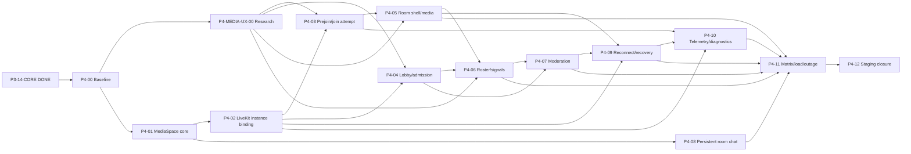

# Backlog Phase 4 - Classroom Media MVP

> Nguồn thực thi chi tiết cho Phase 4. Master Plan giữ mục tiêu/exit gate cấp phase;
> tài liệu này giữ task ID, dependency, contract, security, test và Definition of Done.
> Kiến trúc có thẩm quyền: [ADR-0030](adr/0030-authoritative-classroom-media-spaces-lifecycle-and-livekit-grants.md).

## 1. Mục tiêu phase

Xây classroom media ổn định cho pilot 2-50 người:

1. official ClassSession/occurrence và member-owned StudyMeeting/instant room có lifecycle rõ;
2. backend cấp LiveKit credential room-instance-scoped, tối thiểu quyền;
3. prejoin kiểm tra thiết bị/network, effect progressive-enhancement, lobby/admission và join recovery;
4. camera, mic, screen share, grid/speaker/presentation layout;
5. participant roster, hand raise, reaction và moderation server-authorized;
6. chat trong phòng bền vững, reconnect/degraded audio-only và support diagnostics an toàn;
7. browser/device matrix, join-storm/load profile và provider-outage runbook có bằng chứng.

P3-14-CORE đã `DONE`; Phase 4 được phép bắt đầu trong khi Phase 3 deferred carry-over tiếp tục.
Không task Phase 4 nào được xóa, giả lập PASS hoặc bật notification/email/file-processing side
effect thuộc Phase 3 khi carry-over chưa đạt gate riêng.

**Task `DONE` gần nhất:** `P4-09` Reconnect, recovery instance và degraded audio-only ngày
2026-08-15. Exact candidate `fe33ffaba19d8f82f2034ddeb4b16d4e919e5014` PASS GitHub Verify
`31868991020`, Security `31868991007`, shared forward-only `34 false -> 35 false -> 35 false`, exact
ACL, Render `dep-da00d7dbedkc739jgt60`, Cloudflare Pages, live `10/10`, feature-off/concealment/
accessibility và post-live zero-side-effect snapshot. Không rollback; disposable branch được giữ lại
và các gate physical/manual/load/outage tiếp tục `UNVERIFIED — P4-11`. Evidence tại
[P4_09_STAGING_ACCEPTANCE.md](P4_09_STAGING_ACCEPTANCE.md).
**Task hiện tại:** `P4-10` Join telemetry, privacy và diagnostics export (`TODO`).

`P4-MEDIA-UX-00` đã `DONE`; không đổi LiveKit provider, không thêm processor production dependency
hoặc mở `CanPublishData=false`. P4-03/P4-04/P4-05/P4-06/P4-11 phải tuân ADR-0031 và báo rõ các
physical/manual effect gate còn `UNVERIFIED` thay vì suy PASS từ research.

## 2. Non-goal

- Recording/egress, transcription, AI meeting summary, E2EE policy và consent workflow.
- Whiteboard, breakout, quiz, shared notes, co-watch và plugin classroom của Phase 5.
- Webinar/broadcast/large-event profile; Phase 4 chỉ là interactive classroom tối đa 50.
- Anonymous/external room participant; guest phải là active authenticated tenant member.
- Attendance/grade authority từ join telemetry hoặc provider webhook.
- Provider billing, automated plan upgrade hoặc self-host LiveKit.
- Beauty/makeup/avatar/sticker, AI/video background và user-uploaded background trong P4 MVP.
- Mobile/native app implementation; API/domain phải không khóa khả năng dùng client khác.
- Media proxy qua Core API, raw media storage hoặc browser-held provider secret.
- Redis, NATS, Kafka, microservice hoặc Kubernetes khi chưa có tải chứng minh.
- Bật Phase 3 email/notification/processing carry-over chỉ để phục vụ demo media.

## 3. Nguyên tắc bắt buộc

- OpenAPI đổi trước/cùng implementation; generated TypeScript client không sửa tay.
- PostgreSQL/shared policy là authority; LiveKit state/JWT/client role chỉ là transport projection.
- Mọi business row predicate `tenant_id`; cross-tenant/inaccessible ID conceal `404`.
- Official class và member-owned space có quyền khác nhau; ownership không nâng thành
  `session.schedule` hoặc attendance authority.
- Token ngắn hạn, exact RoomInstance, memory-only, response `no-store`; provider identifiers opaque.
- Feature `classroom_media_rooms` và `instant_study_rooms` có catalog default false và deployment
  guardrail force-off đến rollout acceptance; tenant override không được bypass guardrail.
- Start/end/admit/lock/moderate dùng expected version/idempotency và audit allowlist.
- Server không remote-unmute; recording mặc định off; `CanPublishData` giữ false.
- Webhook phải signed + idempotent + map database; không parse tenant/class từ provider room name.
- API mới nhận `X-TutorHub-Expected-Tenant-ID` chỉ làm workspace-race assertion; active session
  và repository tenant predicate vẫn là authorization authority.
- Không giữ PostgreSQL transaction trong lúc gọi LiveKit; provider result reconcile idempotently.
- Media đi browser <-> LiveKit; Core API chỉ cấp quyền/command/metadata/telemetry bounded.
- Không log token, SDP/ICE, IP chi tiết, device label, media/chat content hoặc raw provider error.
- UI có loading, empty, error, forbidden, feature-off, provider-unavailable, reconnect và retry.
- Mỗi slice có authorization, tenant isolation, concurrency, privacy, accessibility và rollback plan.

## 4. Trạng thái tổng hợp

| Task           | Nội dung                                            | Dependency                      | Trạng thái |
| -------------- | --------------------------------------------------- | ------------------------------- | ---------- |
| P4-00          | Architecture/backlog/contract baseline              | P3-14-CORE                      | DONE       |
| P4-MEDIA-UX-00 | Prejoin/layout/signals/effects research spike       | P4-00; song song P4-01/P4-02    | DONE       |
| P4-01          | MediaSpace lifecycle, schema và API core            | P4-00                           | DONE       |
| P4-02          | RoomInstance LiveKit credential + webhook binding   | P4-01, P1-07 baseline           | DONE       |
| P4-03          | Prejoin device/network và join-attempt flow         | P4-02, P4-MEDIA-UX-00           | DONE       |
| P4-04          | Lobby, admission và explicit same-tenant invite     | P4-02, P4-03, P4-MEDIA-UX-00    | DONE       |
| P4-05          | Classroom shell, media controls và layouts          | P4-03, P4-MEDIA-UX-00           | DONE       |
| P4-06          | Participant roster, hand raise và reaction          | P4-04, P4-05, P4-MEDIA-UX-00    | DONE       |
| P4-07          | Host/co-host/TA moderation, lock/mute/remove/end    | P4-04, P4-06                    | DONE       |
| P4-08          | Persistent in-room chat                             | P4-01, P3-07A; ADR review       | DONE        |
| P4-09          | Reconnect, recovery instance và degraded audio-only | P4-02, P4-05, P4-07             | DONE        |
| P4-10          | Join telemetry, privacy và diagnostics export       | P4-02, P4-03, P4-09             | TODO       |
| P4-11          | Browser/device matrix, load và outage runbook       | P4-05 đến P4-10                 | TODO       |
| P4-12          | Exact staging acceptance và Phase 4 closure         | P4-MEDIA-UX-00, P4-01 đến P4-11 | TODO       |

`TODO` không ngụ ý implementation đã tồn tại. `VERIFY` chỉ dùng sau khi implementation và các gate
pre-staging do runbook task quy định đã xanh; riêng P4-02 cần local/disposable/provider cùng exact
candidate CI/security PASS. `DONE` yêu cầu toàn bộ acceptance của task, cập nhật Project State/
backlog và bằng chứng exact candidate phù hợp.

## 5. Dependency graph

P4-08 có thể chạy song song sau P4-01 nhưng phải review/amend ADR-0013/0025 vì conversation hiện
có đúng hai kind `direct`/`class`. P4-11 provider load chỉ chạy khi owner cho phép dùng quota/
credential staging; local/synthetic gates không được bỏ qua trong lúc chờ.

P4-MEDIA-UX-00 có thể chạy song song với P4-01/P4-02 nhưng không được kéo provider/dependency
mới vào production. Kết quả phải là evidence + ADR/amendment; P4 không bắt buộc ship effect nếu
performance, privacy, accessibility hoặc license gate không đạt.

## 6. Reuse matrix và compatibility boundary

| Nền hiện có            | Tái sử dụng                                                                    | Không được coi là Phase 4 authority                                       |
| ---------------------- | ------------------------------------------------------------------------------ | ------------------------------------------------------------------------- |
| ADR-0004 LiveKit Cloud | Provider choice, backend-held secret                                           | Không chốt room lifecycle/moderation                                      |
| P1 media module        | Token issuer, signed webhook verifier, bounded telemetry patterns              | Class-wide deterministic room/token path                                  |
| P1 web room            | Prejoin, device choice, LiveKit components, reconnect states                   | Không có source/instance/lobby authority                                  |
| V1 classroom prototype | Preview/device/effect, layout/screen-share, hand/reaction và failure inventory | Global/JCEF/DOM/CDN/client-metadata/DataChannel authority không được port |
| ADR-0013 policy        | Shared deny-by-default role/class projection                                   | JWT/client role không cấp quyền                                           |
| ADR-0015 controls      | Typed feature/quota + deployment clamp                                         | Capability projection không thay API enforcement                          |
| P3 scheduling          | ClassSession/occurrence/StudyMeeting source authority                          | StudyMeeting không tự mint token                                          |
| P3 conversation        | Persistent REST messages, unread/read                                          | DataChannel không lưu chat; room kind chưa được chốt                      |
| P3 audit/outbox        | Transactional allowlist events                                                 | Không ghi media content/telemetry noise                                   |

Legacy `/api/v1/classes/{class_id}/media-token` chỉ phục vụ controlled P1 compatibility cho tới
khi P4 route thay thế. Không tenant nào được chạy đồng thời class-wide authority và MediaSpace
authority. P4-12 phải disable legacy route cho tenant đã rollout.

## 7. P4-00 Architecture/backlog baseline

**User outcome:** agent mới biết chính xác aggregate, quyền, thứ tự task, gate và phần P1 được tái
sử dụng mà không cần suy từ lịch sử chat.

### Definition of Done

- [x] Tạo backlog Phase 4 có task ID, dependency graph, acceptance và exit gate.
- [x] ADR-0030 chốt MediaSpace, RoomInstance, ParticipantSession và source lifecycle.
- [x] Chốt official/member-owned authorization, lobby/moderation và no-anonymous boundary.
- [x] Chốt room-instance token, opaque provider identity và signed webhook database mapping.
- [x] Chốt feature/quota defaults off, tenant ACL, audit/privacy/retention và P1 compatibility.
- [x] Chọn P4-01 MediaSpace lifecycle/schema/API core là vertical slice đầu tiên.
- [x] Xác nhận P4-00 không thêm dependency, migration, provider config, deploy hoặc side effect.
- [x] Đồng bộ README, Project State, Agent Coordination, Delivery Roadmap, Master Plan,
      Domain Model, Security Baseline và LiveKit runbook.

## 7A. P4-MEDIA-UX-00 Classroom media UX research spike

**Dependency:** P4-00. **Trạng thái:** `DONE` ngày 2026-08-09. **Execution:** đã hoàn thành
trước P4-03/P4-04/P4-05/P4-06.

**Đặc tả và Definition of Done:**
[P4_MEDIA_UX_00_RESEARCH_SPIKE.md](P4_MEDIA_UX_00_RESEARCH_SPIKE.md).
Evidence: [P4_MEDIA_UX_00_RESEARCH_REPORT.md](P4_MEDIA_UX_00_RESEARCH_REPORT.md).
Decision: [ADR-0031](adr/0031-classroom-media-ux-devices-layout-effects-and-signals.md).

### Scope

- Benchmark current official Zoom/Google Meet green-room, layouts, hand raise/reactions,
  background/effects, degraded mode, waiting-room và accessibility; không sao chép UI/asset.
- Audit read-only V1 lobby/layout/roster/LiveKit/MediaPipe để lấy use case/test; không port
  authority/code cũ.
- So sánh native browser capability, LiveKit track-processors, MediaPipe fallback, WebRTC audio
  defaults và Krisp go/no-go trên cùng performance/privacy/license/accessibility matrix.
- Prototype grid/active-speaker/presentation theo fixture contract 2/5/25/50 và hand queue/reaction
  projection với Core API authority, FIFO/rate-limit; resync thật vẫn là acceptance P4-06/P4-11;
  tiếp tục giữ `CanPublishData=false`.
- Prototype cô lập `None`/blur/curated static background; không production route/dependency/deploy.

### Acceptance

- [x] V1 reuse/reject matrix và current official Zoom/Meet/LiveKit source inventory được lưu.
- [x] Browser/device/capability, 360p-720p performance và low-end degrade evidence đạt hoặc có cap;
      effect giữ off do Firefox/Safari/low-end gate chưa đạt.
- [x] Permission/device/autoplay/error recovery và observable processor/track cleanup có contract
      fail về no-effect/audio-only/listen-only; exact physical-device 10-cycle cleanup còn ở P4-11.
- [x] Layout fixture contract 2/5/25/50 có deterministic pagination/degrade/pin và 320px/a11y
      evidence; physical-browser 200%/visual stability và adaptive LiveKit subscription thật còn ở P4-11.
- [x] Hand server-sequence/FIFO/idempotency và reaction allowlist/TTL/grouping/rate-limit có
      deterministic evidence; moderator lifecycle và snapshot/gap resync thật còn ở P4-06/P4-11.
- [x] CSP/self-host model/WASM, asset license, privacy/telemetry và accessibility gates rõ.
- [x] ADR-0031 chọn `None` baseline và Track Processors 0.7.2 conditional candidate.
- [x] P4-03/P4-04/P4-05/P4-06/P4-11 được điều chỉnh theo decision trước implementation.

## 8. P4-01 MediaSpace lifecycle, schema và API core

**Dependency:** P4-00. **Trạng thái:** `DONE`. **Rollout:** feature-off, không mint
LiveKit token. **Acceptance:** [P4_01_STAGING_ACCEPTANCE.md](P4_01_STAGING_ACCEPTANCE.md).

### Scope

- Thêm `media_spaces`, `media_room_instances`, `media_space_members`,
  `media_admission_requests`, `media_participant_sessions` và
  `media_space_mutation_receipts` bằng forward migration
  `000029_classroom_media_spaces`. P4-01 chỉ tạo database intent, chưa gọi provider.
- Exact tenant/composite FK, unique one-space-per-source và one-active-instance constraints.
- Domain state machine/lock order/idempotency; bind one-time ClassSession, recurring occurrence
  hoặc StudyMeeting do server resolve. Instant command atomically tạo/bind StudyMeeting, không
  tạo source authority thứ ba.
- Shared policy actions và server-derived viewer operations; không nhận tenant/owner/role từ body.
- Catalog feature/quota theo ADR-0030, defaults off, deployment clamp và fail-closed prerequisite.
- Cập nhật catalog tests theo invariant mới: chỉ P4 feature được phép compiled default false;
  không nới assertion cho feature hiện hữu.
- REST create/get/start/end/cancel skeleton, audit/outbox allowlist; provider adapter chưa được gọi.

### Acceptance

- [x] Disposable forward-only `28 -> 29`, rerun giữ `29 false`; không rollback.
- [x] Shared forward-only `28 -> 29`, rerun giữ `29 false`, sau disposable/CI và owner approval.
- [x] Runtime role exact DML, không owner/DDL/broad table grant; foreign tenant conceal `404`.
- [x] Official teacher/admin/owner/co-teacher start/end matrix đúng; student không nâng quyền.
- [x] StudyMeeting owner, gồm StudyMeeting do instant command tạo, và explicit same-tenant member
      boundary đúng; anonymous bị từ chối.
- [x] Concurrent/retry start chỉ tạo một space/instance intent; end/cancel race deterministic.
- [x] Source cancel/archive/enrollment revoke fail closed; audit/outbox không chứa private content.
- [x] Feature/quota disabled paths không tạo row; storage failure trả `503`.
- [x] OpenAPI/generated client, Go/TS tests và fresh full verify xanh; không có provider side effect.
- [x] Exact candidate GitHub CI/security, shared forward/ACL, deploy và live feature-off acceptance.

### Checkpoint implementation local 2026-08-09

- [x] Migration/OpenAPI/generated client, lifecycle repository/HTTP skeleton và feature-control
      candidate đã được tạo; feature parent/child giữ mặc định off.
- [x] Focused feature-control/config/HTTP, API client, web và generated-contract checks PASS.
- [x] Policy/security action matrix được review; typed `room.create.instant` theo ADR-0021,
      tenant/membership/ownership guard và focused tests PASS.
- [x] Disposable PostgreSQL `28 false -> 29 false -> 29 false`, exact ACL và full
      tenant/concurrency/source/privacy gates PASS; final ledger giữ `29 false`, không rollback.
- [x] Fresh full local `pnpm verify` PASS sau disposable harness fixes; exact candidate
      `183ca338557fafd6e8fe502d67763bb2a73d9aa0` PASS Verify `31291917865` và Security
      `31291917871`.
- [x] Shared staging forward-only `28 false -> 29 false -> 29 false`, exact ACL/focused
      integration, Render/Cloudflare deployment và authenticated/live feature-off acceptance PASS.

## 9. P4-02 RoomInstance LiveKit credential và webhook binding

**Dependency:** P4-01 và P1-07 baseline. **Trạng thái:** `DONE`.

Candidate ngày 2026-08-09 có migration `000030`, exact ACL/runbook, official LiveKit RoomService
adapter, provider lifecycle reconciliation, RoomInstance credential API, opaque ParticipantSession
binding, shared rate limit, signed webhook receipt/transition và P1/P4 mutual exclusion. Security
hardening đã khóa official signature/body-hash trước mutation, redacted database error, tenant
advisory-before-row-lock ordering, exact tenant concealment, Unix-second timestamp clamp, room-wide
capacity release, failed-intent cleanup và concurrent credential/webhook/provider reconcile.

Full local verify PASS trong 182.5 giây; rerun sau khi bỏ log endpoint LiveKit tiếp tục PASS trong
26.2 giây với cache. Disposable owner/runtime preflight, forward-only
`29 false -> 30 false -> 30 false`, rerun idempotent, exact ACL provision/probe và PostgreSQL
authority/quota/concurrency/privacy gates đều PASS; final ledger giữ `30 false`, không rollback.
Allowlist đã bổ sung exact `SELECT attempt_number` sau gate thực tế. LiveKit test-provider create/
reuse, token 5 phút least-privilege, real connect/disconnect và exact cleanup PASS; synthetic signed
webhook verifier valid/wrong-key/tamper PASS. Feature vẫn force-off.

### Scope

- Tái dùng official LiveKit token issuer/verifier; thêm narrow provider room/moderation adapter.
- Mint JWT exact active RoomInstance, opaque room/participant ID, TTL mặc định 5 phút.
- Reissue/rate-limit/idempotent join attempt; camera/mic, screen share và subscribe grant riêng.
- Signed webhook lookup database binding, replay/out-of-order handling và bounded receipt retention.
- Deprecation/mutual exclusion cho class-wide P1 token path.

### Acceptance

- [x] Credential request không nhận/echo tenant, provider room, role hoặc grant client-supplied.
- [x] Token no-store/memory-only; secret/token/identifier không vào bundle, log, audit hoặc metric.
- [x] Inactive/locked/ended/foreign/revoked source không mint token; exact allow/deny matrix PASS.
- [x] Signed duplicate webhook idempotent; unsigned/malformed/unknown/stale event không mutate state.
- [x] Provider outage trả typed `503`, không để partial active instance hoặc duplicate room.
- [x] P1/P4 route mutual exclusion và compatibility tests PASS.

Các acceptance implementation/database/provider trên đã xanh. Exact candidate
`f622e5f4b4c5efd6b877914e35aff16d765fba53` PASS GitHub Verify `31303424310` trong 3 phút 13 giây
và Security `31303424335` trong 2 phút 55 giây, nên P4-02 chuyển `IN PROGRESS -> VERIFY`.
Shared safety candidate `d223daf0f2d504e6a0088071239aa9daeb36372c` tiếp tục PASS Verify
`31304103932` và Security `31304103916`. Shared preflight, forward-only
`29 false -> 30 false -> 30 false`, exact ACL/read-only probe và Render deployment
`dep-d9s3vh0n74is73ftetr0` đều PASS. Live đạt 6/6 health/readiness/status, authenticated media
feature-off, anonymous auth/privacy, provider-emitted signed webhook và zero unexpected shared
room/session/receipt side effect. P4-02 chuyển `IN PROGRESS -> VERIFY -> DONE`; không rollback và
disposable branch tiếp tục được giữ lại.

## 10. P4-03 Prejoin device/network và join-attempt flow

**Dependency:** P4-02/P4-MEDIA-UX-00. **Trạng thái:** `DONE` ngày 2026-08-10.

Implementation/OpenAPI/generated client, local full verify, 6/6 Chromium E2E, exact ACL cùng
PostgreSQL lifecycle/concurrency/quota/privacy/join-attempt gates trên Neon disposable và LiveKit
test-provider smoke đều PASS. Exact candidate
`e49a8cc38f464e3ec56655823bcbb1ee77cbc651` PASS GitHub Verify `31330663644` và Security
`31330663663`; shared exact ACL/read-only gate giữ `30 false`; Render deployment
`dep-d9sd4ne7bikc739bf7l0`, Cloudflare exact SHA và live public/privacy/feature-off/no-side-effect
acceptance đều PASS. P4-03 không có migration, không rollback và không temporary-enable feature.
Evidence chi tiết:
[P4_03_STAGING_ACCEPTANCE.md](P4_03_STAGING_ACCEPTANCE.md).

### Scope

- Tách prejoin local device probe khỏi credential issuance; không mở camera trước explicit action.
- Mic/camera/speaker selection, preview, permission denied/in-use/no-device và browser guidance.
- Coarse connectivity/TURN readiness probe không thu raw IP/ICE; create join attempt sau consent.
- Route reload không phục hồi token; workspace/principal/source change purge state.
- Speech mặc định request EC/NS/AGC dạng ideal rồi đọc actual settings; original-sound/music là
  explicit escape hatch. Speaker selection/autoplay là progressive enhancement, không join gate.
- Không mount LiveKit prefab tạo track ở initial render; effect mặc định `None` và chưa tải processor.

### Acceptance

- [x] Automated keyboard/Axe/screen-reader semantics, 200%-equivalent reflow và forced-colors;
      physical/manual matrix được giữ rõ cho P4-11.
- [x] Permission denial hoặc missing device vẫn cho listen-only khi policy cho phép.
- [x] Không device label trước permission; không token trong history/storage/error report.
- [x] Chromium automated pilot matrix và unit/Playwright happy/error/offline paths PASS.
- [x] Error taxonomy bounded gồm denied/policy, not-found, busy, overconstraint, abort và autoplay;
      device switch/unplug 20 vòng và cancel/unmount để lại zero owned track/AudioContext/listener.
- [x] Join dùng canonical RoomInstance attempt/credential; participant waiting chưa connect LiveKit.
- [x] Exact candidate GitHub Verify/Security, shared exact ACL/deploy và live acceptance PASS.

## 11. P4-04 Lobby, admission và explicit same-tenant invite

**Dependency:** P4-02/P4-03/P4-MEDIA-UX-00. **Trạng thái:** `DONE` ngày 2026-08-10.

Local candidate đã thêm self poll/cancel join-attempt, moderator admission queue với
admit/deny/restore, explicit same-tenant StudyMeeting member invite/revoke/restore, forward
migration `000031`, exact ACL candidate, bounded audit/outbox và waiting/moderator/invite UI.
OpenAPI/generated client, API client `49` tests, web `305` tests, focused P4-04 web `23/23`, full
`pnpm verify`, Go test/vet và integration-tag compile đều PASS. Neon disposable owner preflight,
forward `30 false -> 31 false -> 31 false`, exact/default ACL, lobby race/restore, lifecycle và
RoomInstance PostgreSQL gates cũng PASS. Exact runtime candidate
`735a5e5579d6e5efe7c4efca2b8a48c3de1b1f23` PASS GitHub Verify/Security; shared forward-only
`30 false -> 31 false -> 31 false`, exact ACL/read-only snapshot, Render/Cloudflare deploy và live
privacy/feature-off/no-side-effect gates đều PASS. Không rollback và hai media feature vẫn force-off.
Evidence/runbook:
[P4_04_STAGING_ACCEPTANCE.md](P4_04_STAGING_ACCEPTANCE.md).

### Scope

- Authenticated same-tenant explicit member grant cho StudyMeeting, gồm instant-created meeting.
- Lobby request exact instance/actor; host/co-host/TA projection; admit/deny CAS/idempotency.
- Source/class membership revoke immediately blocks new admission/credential.
- No public/anonymous link in P4 MVP.

### Acceptance

- [x] Uninvited/foreign/inactive member concealed/denied without roster enumeration.
- [x] Concurrent admit/deny/end produces one terminal result; stale instance cannot admit.
- [x] Denied/removed member cannot rejoin until explicit restore; no raw email in event payload.
- [x] Lobby waiting UX has timeout, cancel, retry, accessibility and provider-unavailable state.
- [x] Waiting participant có zero provider credential/connection; V1 connect-before-admit bị chặn
      bằng integration/E2E test và effect/device state không đổi admission/capacity.

## 12. P4-05 Classroom shell, media controls và layouts

**Dependency:** P4-03/P4-MEDIA-UX-00. **Trạng thái:** `DONE` ngày 2026-08-12.

Checkpoint local đầu tiên đã tách canonical room thành lazy route riêng, thêm custom classroom
stage/toolbar/rail-drawer, exact grant controls, manual bounded audio/video subscription, opaque
local-first session-local append-stable participant fallback không dùng provider identity/join time, cùng
Grid/Active speaker/Presentation với cap `12/6/4`, rail `6`, local pin, hysteresis
`800/2500/1500 ms`, deterministic share restore, ordered degradation và cleanup first-wins. Device
enumeration chỉ bắt đầu khi mở panel và media operation đang chờ bị invalidate khi leave/unmount.
TutorHub-owned Room lifecycle chặn StrictMode double-create/disconnect và late terminal callback.
Focused tests đạt `76/76`; full web đạt `62` files/`376` tests, Vite-only Chromium P4-03/P4-04/P4-05
regression đạt `16/16`, Playwright P4-05 đạt `7/7`, lint/typecheck/production build và client bundle
security đều PASS. LiveKit vendor chỉ được static-import từ room routes; app entry/prejoin không tải
SDK. Neon disposable read-only đạt ledger `31 false`, effective feature-off và exact runtime ACL;
LiveKit Go two-participant matrix `2/2` cùng Chromium actual-media gate `1/1` bằng real publisher +
subscribe-only subscriber shells (remote camera/audio và explicit screen-share delivery) và exact room cleanup
đều PASS. Exact runtime candidate `dcbdfef3c209a7c6d17197ccbcf737b58cd9e315` PASS Verify
`31598671906`, Security `31598671939`, exact Cloudflare/Render deploy và live `13/13`
public/anonymous + Admin feature-off acceptance. Shared before/after snapshot giữ `31 false`, exact
ACL và toàn bộ bounded count không đổi. Task chuyển `IN PROGRESS -> VERIFY -> DONE`; physical/manual/
load/outage/effect gates vẫn `UNVERIFIED — P4-11`.

### Scope

- Classroom stage, toolbar, participant rail and responsive drawer using existing design system.
- Camera/mic/screen-share device switching; grid, active speaker and presentation layout.
- Áp dụng layout modes, pagination/rail, visual-stability và degrade order đã chốt bởi research spike.
- Grid cap 12 desktop/6 medium/4 compact; active-speaker/presentation có bounded rail, local pin,
  tunable hysteresis và deterministic screen-share restore; Grid không reorder theo speaker/hand.
- Release tracks/device on leave; listen-only and browser autoplay handling.
- Lazy-load LiveKit bundle and declare performance budget.
- Production baseline `None`; optional blur/3-4 project-owned static backgrounds force-off cho tới
  exact self-host/hash/CSP/privacy/browser/low-end gate, không dùng V1 backgrounds.

### Acceptance

- [x] 2/5/25/50 fixture layout không overlap; 320 px và 200% zoom có usable controls.
- [x] Automated keyboard/Axe/screen-reader semantics, focus restore, forced colors và reduced motion PASS.
- [x] Publish controls exactly match server grant; hidden UI không được coi là thay thế provider deny gate.
- [x] Automated Leave/unmount stops every owned fake-device track, detaches subscriber remote media;
      navigation/URL/DOM/storage cannot leak token/state và exact provider room cleanup về `0`. Physical device indicator/hardware thật
      vẫn `UNVERIFIED — P4-11`.
- [x] Off-page video không attach/subscribe vô hạn; audio/control sống lâu hơn video khi degrade.
- [x] Baseline `effect=None` không request jsDelivr/Google model/
      telemetry endpoint chưa phê duyệt và không bật effect trên Firefox/Safari chưa đạt gate.

## 13. P4-06 Participant roster, hand raise và reaction

**Dependency:** P4-04/P4-05/P4-MEDIA-UX-00. **Trạng thái:** `DONE` ngày 2026-08-13.
**Acceptance:** [P4_06_STAGING_ACCEPTANCE.md](P4_06_STAGING_ACCEPTANCE.md).

### Scope

- Server-derived participant projection with bounded display name/role/media state; thay P4-05
  session-local fallback bằng versioned server roster sequence + opaque participant key.
- Hand raise/reaction through authorized/rate-limited Core API signal; `CanPublishData=false`.
- FIFO dùng server sequence; moderator lower-one/lower-all, reaction TTL/grouping và bounded a11y
  announcements theo contract đã chốt bởi research spike.
- Hand không auto-lower theo active speaker. Reaction enum `thumbs_up/clap/heart/celebrate/laugh/
surprised`, TTL 10 giây, grouping 750 ms, snapshot max 50 summary/UI max 3 visual cluster, actor
  3/5s + 20/min và room 100/5s.
- Active-speaker/quality remain provider ephemeral; bounded resync after signal loss.
- Snapshot poll dùng shared tenant read lock; mutation giữ exclusive lock và timestamp lấy từ
  PostgreSQL sau lock. Reaction hard purge + signal receipt retention 24 giờ đi qua exact maintenance
  `SECURITY DEFINER`/`SKIP LOCKED`; runtime không có table-wide `DELETE`.

### Acceptance

- [x] Participant cannot forge role/user/tenant or signal for another ParticipantSession.
- [x] Spam rate limit cross-instance-safe; unknown payload discarded without log injection.
- [x] Join/leave/reconnect roster eventually converges after duplicate/out-of-order webhook.
- [x] Grid canonical order dùng server roster sequence/key, không dùng session observation order,
      display name, client/join time hoặc provider identity; gate này phải PASS trước feature enable.
- [x] Roster/reaction accessible without color-only meaning and does not expose email/session ID.
- [x] Hand/reaction duplicate/retry/offline/403/409/429/sequence-gap hội tụ qua versioned snapshot;
      25/50 storm không tạo DOM/live-region unbounded và direct DataChannel không đổi authority.
- [x] Reaction/receipt retention purge bounded, exact maintenance ACL và two-transaction
      `SKIP LOCKED` PASS; runtime/PUBLIC direct `DELETE` denied.

### Disposable checkpoint — `PASS` ngày 2026-08-13

- Read-only preflight xác thực direct owner + direct maintenance + pooled runtime là ba principal
  riêng trên cùng Neon disposable database ở ledger `31 false`.
- Forward-only `31 false -> 32 false -> 32 false`, exact runtime/PUBLIC/maintenance/dependency ACL,
  retention purge và two-transaction `SKIP LOCKED` đều PASS; không rollback.
- Roster privacy/tenant/source/opaque key, FIFO/idempotency/moderator lower/terminal cleanup,
  24 giờ replay, reaction TTL/grouping/allowlist, actor `3/5 s` + `20/60 s`, room `100/5 s` và
  shared-read/exclusive-write concurrency đều PASS.
- Final postflight giữ `32 false`, media feature force-off, P4-06 side-effect count `0`; branch được
  giữ lại.

### Exact closure — `PASS` ngày 2026-08-13

- Exact candidate `d773641f796076b90f31a876ee840a427db43372` PASS GitHub Verify/Security.
- Shared owner preflight, forward-only `31 false -> 32 false -> 32 false`, exact ACL và final snapshot
  PASS; feature vẫn force-off, bounded P4-06 business count `0`, không rollback.
- Render deployment `dep-d9ul9q6417fc738gfa3g` `Live` exact candidate; Cloudflare Pages cũng chạy
  exact `d773641f`. Public/privacy/feature-off/automated accessibility/no-side-effect acceptance PASS.
- Không temporary-enable shared/live signal path. Physical/manual browser-device, provider load,
  outage và optional-effect gates giữ `UNVERIFIED — P4-11`; không suy PASS.
- P4-06 chuyển `IN PROGRESS -> VERIFY -> DONE`; P4-07 trở thành task `TODO` runnable tiếp theo.

## 14. P4-07 Host/co-host/TA moderation

**Dependency:** P4-04/P4-06. **Trạng thái:** `DONE` ngày 2026-08-14.

### Scope

- Instance-scoped co-host promotion/demotion, lock/unlock, mute/remove and the existing lifecycle
  end command; integrate fail-closed races with the P4-04 admit/deny paths.
- Server-authorized provider adapter; safety-admin recovery with reason/audit.
- Remote mute only; never remote-unmute. Removed participant block/recovery state.

### Acceptance

- [x] Official and member-owned role matrix table-tested; TA/co-host scope expires with instance.
- [x] Direct provider call cannot bypass TutorHub command authority.
- [x] Concurrent lock/join, lock/admit, remove/rejoin, end/token and role-change/token barriers pass
      deterministic unit/static coverage and PostgreSQL two-connection disposable proof.
- [x] Moderation audit allowlist has actor/target opaque IDs/action/outcome, no media/chat content.
- [x] Provider failure exposes the committed business result and retry/reconcile state without
      claiming that the provider effect has been applied.
- [x] Exact candidate GitHub CI/security, shared forward/ACL, exact deploy và live feature-off/
      privacy/accessibility/no-side-effect acceptance PASS.

### Disposable evidence — `PASS` ngày 2026-08-13

- Owner preflight PASS at `32 false`; forward-only `32 false -> 33 false -> 33 false`, exact
  runtime/PUBLIC/maintenance/dependency ACL and idempotent rerun PASS; no rollback.
- P4-07 authority/concurrency PASS and full retained media PostgreSQL regression passes `9/9`
  programs. Final read-only snapshot remains `33 false`, features effective force-off and
  `unsafe_unresolved_effects=0`; retained synthetic audit fixtures are reported, not deleted.
- Isolated LiveKit microphone mute, participant removal, room deletion and idempotent NotFound replay
  PASS. Sustained provider-outage evidence remains explicitly deferred to P4-11.

### Exact closure — `PASS` ngày 2026-08-14

- Exact runtime candidate `2c309eabed9a4b8425f12895df071ee5f06edfb0` PASS GitHub Verify
  `31814509810` và Security `31814509808`.
- Shared staging PASS forward-only `32 false -> 33 false -> 33 false`, exact ACL và read-only
  final/post-live snapshot `ledger=33 dirty=false media_features=false moderation_side_effects=0`.
- Render deployment `dep-d9vjhvp5efls73ea5l3g` `Live` exact SHA; Cloudflare Pages deployment
  `1b935dc9-7498-4a3c-81c6-2571ca080c53` exact SHA success.
- Live `16/16` và authenticated Admin feature-off/conceal/accessibility/resource/log acceptance
  đều PASS mà không temporary-enable hai media feature.
- Không rollback; disposable branch được giữ lại. Physical/manual browser-device, provider load và
  sustained outage tiếp tục `UNVERIFIED — P4-11`; P4-08 trở thành task tiếp theo.

## 15. P4-08 Persistent in-room chat

**Dependency:** P4-01/P3-07A và ADR review. **Trạng thái:** `DONE`.

### Scope

- Review/amend ADR-0013/0025 before adding room-scoped conversation authority.
- Reuse conversation message persistence, pagination, sanitization, unread/read and idempotency.
- LiveKit DataChannel only optional transient hint; database REST response remains source of truth.
- History visibility follows room/source policy; ended room becomes read-only.

### Implementation và acceptance — 2026-08-15

- ADR-0013/0025 chốt `room` là kind thứ ba của canonical conversation aggregate, liên kết một-một
  với `MediaSpace`; không tạo message table hoặc provider-content path song song.
- Forward migration `000034_persistent_room_conversations` thêm tenant-composite FK, partial unique
  index và shape constraint; PUBLIC tiếp tục zero privilege.
- Core API tạo/lấy room conversation theo current class/StudyMeeting authority. Write reauthorizes
  MediaSpace `open`, active RoomInstance và ParticipantSession `admitted|joining|connected|reconnecting`
  trong cùng transaction; `left|removed|failed`, room end và source revoke thắng write/reconnect.
- Web classroom shell mở drawer chat bền vững và tái sử dụng pagination, unread/read, sanitization,
  idempotent retry cùng message composer của P3-07A. UI giữ lịch sử read-only sau room end và có
  loading/empty/error/forbidden/retry, keyboard focus return cùng long-content wrapping.
- Full local verify gates, integration-tag compile/vet, OpenAPI generation check, web lint/typecheck và
  toàn bộ web test `67/67` files, `430/430` tests đã PASS. Neon disposable PASS preflight
  `33 dirty=false`, forward-only/idempotent `33 false -> 34 false -> 34 false`, exact ACL,
  authority/concurrency/privacy và final snapshot `34 dirty=false`.
- Exact candidate `fd2c3fc70f7e32c252523367e8aa56e8b466b810` PASS GitHub Verify
  `31858451744` và Security `31858451822`. Shared staging PASS preflight, forward-only/idempotent
  `33 false -> 34 false -> 34 false`, exact ACL và zero-side-effect postflight.
- Render `dep-d9vsqjojo6nc73d6f6n0` đạt `Live`; Cloudflare Pages
  `d64338e9-8116-4021-8f5e-90e261868ecb` success cùng SHA. Live HTTP `10/10`, Admin feature-off,
  synthetic-space concealment, accessibility/privacy/resource/log audit và post-live database
  snapshot đều PASS. Không temporary-enable capability, không rollback; xem
  [P4_08_STAGING_ACCEPTANCE.md](P4_08_STAGING_ACCEPTANCE.md).

### Acceptance

- [x] No parallel ad-hoc media message table or provider webhook content persistence.
- [x] Retry/reconnect does not duplicate or lose committed messages; foreign room concealed.
- [x] Removed/inactive member loses new write immediately; historical read follows explicit policy.
- [x] Message content absent from log/audit/telemetry; accessibility and long-content layout PASS.

## 16. P4-09 Reconnect, recovery instance và degraded audio-only

**Dependency:** P4-02/P4-05/P4-07. **Trạng thái:** `DONE`.

### Scope

- Distinguish transient reconnect, token reissue and provider recovery instance.
- Recovery instance requires old instance terminal/failed and one-active-instance invariant.
- Degraded mode turns video off before audio; user can leave/rejoin cleanly.
- End/lock/remove/enrollment revoke wins over reconnect.

### Acceptance

- [x] Network loss 5-15s reconnects without duplicate participant or new business room.
- [x] Long loss/token expiry asks server for current authority; stale token/state not reused.
- [x] Provider instance failure creates at most one recovery instance under concurrency.
- [x] Revoked/ended/removed actor never reconnects via cached credential.

Exact local/disposable/CI/shared/deploy/live gates PASS trên `fe33ffab`; migration `000035` kết thúc
`35 dirty=false` ở disposable và shared, exact ACL cùng concurrency/privacy/post-live snapshot đều
xanh. Hai media feature vẫn force-off; không rollback. Physical browser/device/load/outage/effect
vẫn thuộc P4-11, không được suy PASS từ deterministic P4-09 acceptance.

## 17. P4-10 Join telemetry, privacy và diagnostics export

**Dependency:** P4-02/P4-03/P4-09. **Trạng thái:** `TODO`.

### Scope

- Typed join-stage/media-quality metrics and bounded error taxonomy.
- Participant diagnostics retention max 30 days; maintenance purge bounded/role-separated.
- Authorized support export bounded time/size, no-store, audited and redacted.
- Dashboard join success, time-to-media and reconnect outcome without tenant/user high-cardinality labels.

### Acceptance

- [ ] Token/secret/SDP/ICE/raw IP/device label/raw exception never accepted or logged.
- [ ] Retention/purge ACL and SKIP LOCKED concurrency PASS on disposable PostgreSQL.
- [ ] Export actor/tenant authorization, size/range cap and log-redaction tests PASS.
- [ ] Metrics compute join success and p95 time-to-media from bounded schema.

## 18. P4-11 Browser/device matrix, load và outage runbook

**Dependency:** P4-05 đến P4-10. **Trạng thái:** `TODO`.

### Scope

- Chromium/Edge/Firefox/Safari support statement; Windows/macOS primary pilot devices.
- Camera/mic/speaker/screen-share permission matrix and accessibility/NVDA acceptance.
- Join storm and sustained room profile up to 50 or lower documented provider-safe cap.
- LiveKit outage/degradation, credential rotation and support/recovery runbook.

### Acceptance

- [ ] Join success >=99% in declared pilot matrix; time-to-media p95 <10s.
- [ ] 50 participant/profile load or lower published cap has CPU/memory/bandwidth evidence.
- [ ] No Core API media proxy; API remains healthy under join storm/rate limit.
- [ ] Provider outage drill has fail-closed start, existing-room behavior and recovery evidence.
- [ ] Load test uses staging synthetic identities and explicit provider quota approval; no real PII.
- [ ] Exact physical Safari/macOS, Firefox fallback, standard/low-end 360p/540p/720p và
      NVDA/VoiceOver được ghi PASS/FAIL; WebKit/headless/source evidence không thay test thật.
- [ ] Effect chỉ được bật nếu self-hosted assets/privacy/CSP/network/120s perf/10-cycle cleanup đạt;
      nếu fail thì giữ `None` mà không hạ core classroom acceptance.

## 19. P4-12 Exact staging acceptance và Phase 4 closure

**Dependency:** P4-MEDIA-UX-00 và P4-01 đến P4-11. **Trạng thái:** `TODO`.

### Exit gate

- [ ] Exact candidate Verify/Security/Browser E2E/Cloudflare/Render checks green.
- [ ] Disposable migration/ACL/concurrency/privacy matrix green before shared forward.
- [ ] Teacher/TA/student/guest official room and member-owned room role matrix green.
- [ ] Lobby, moderation, reconnect, chat persistence, accessibility and support diagnostics green.
- [ ] LiveKit signed webhook/replay/provider-outage and declared browser/device/load profile green.
- [ ] Feature rollout canary is reversible by server-evaluated kill switch; legacy P1 authority off.
- [ ] Recording/egress remains off; no Phase 3 carry-over falsely marked PASS or activated.
- [ ] `docs/PHASE_4_COMPLETION.md`, Project State, Master Plan and roadmap updated.

## 20. Cross-cutting test matrix

| Risk          | Automated evidence bắt buộc                                                      |
| ------------- | -------------------------------------------------------------------------------- |
| Tenant/IDOR   | foreign source/space/instance/participant concealment across every endpoint      |
| Role drift    | org/class/source role matrix, revoke after token, no client-role trust           |
| Concurrency   | start/start, start/end, lock/join, admit/deny, remove/rejoin, recovery/recovery  |
| Token/privacy | TTL/scope/grant/no-store/memory-only, bundle/log/audit secret scan               |
| Webhook       | signature, replay, out-of-order, unknown room, stale instance, malformed ID fuzz |
| Feature/quota | defaults off, parent/subfeature dependency, clamp, concurrent ceiling            |
| Accessibility | keyboard, NVDA/Axe, 200% zoom, forced colors, reduced motion, focus recovery     |
| Reliability   | network short/long loss, provider unavailable, tab reload, device unplug/change  |
| Performance   | lazy bundle, layout 2/5/25/50, time-to-media, join storm, Core API health        |
| Retention     | participant/webhook purge ACL, bounded batch, SKIP LOCKED, export redaction      |

## 21. Threat model và risk register

Đây là threat-model baseline của P4-00 cho trust boundary mới browser/Core API/LiveKit/
PostgreSQL. Mỗi implementation slice phải cập nhật khi thêm provider command, dữ liệu hoặc actor.

| Rủi ro                                              | Giảm thiểu/Gate                                                               |
| --------------------------------------------------- | ----------------------------------------------------------------------------- |
| P1 class-wide route bị nhầm là production lifecycle | Mutual exclusion, deprecation và P4-12 disable                                |
| JWT/role stale sau roster change                    | TTL ngắn, reauthorize mutation, server kick/reissue                           |
| Hai provider room cho một session                   | Row lock + partial unique + idempotency + race test                           |
| Fake/tampered provider event                        | Official signature/body verify, DB binding, replay/out-of-order test          |
| Join/admission storm vượt capacity                  | Atomic reservation, tenant/actor rate-limit, deployment ceiling               |
| Provider outage làm state lệch                      | Instance reconciliation/recovery, typed failed state, runbook                 |
| Student nâng quyền từ StudyMeeting                  | Source-kind policy, owner boundary, no attendance/session.schedule            |
| DataChannel bypass moderation                       | `CanPublishData=false`; command qua Core API                                  |
| Token/metadata leak                                 | Opaque IDs, memory-only/no-store, log/bundle regression scan                  |
| Join telemetry bị dùng như attendance               | Domain/docs/API label rõ, no grade/attendance projection                      |
| 50-person cost/quality không đạt free tier          | Deployment cap có thể hạ; publish measured supported profile                  |
| P3 carry-over bị bật nhầm                           | Separate flags/register; P4 tasks không activate email/worker/file processing |

## 22. Definition of Done Phase 4

- Classroom pilot có official và member-owned room đúng authority, 2-50 hoặc cap thấp hơn công bố.
- Join success >=99%, time-to-media p95 <10 giây trên declared pilot matrix.
- Lobby/moderation/reconnect server-authorized; provider/client state không là source of truth.
- Chat bền vững, room lifecycle/idempotency/concurrency/tenant isolation và privacy gates xanh.
- Không media đi qua Core API; recording off; provider outage/runbook/kill switch có bằng chứng.
- Exact local/disposable/CI/staging/browser/device/load acceptance được lưu trong repository.

## 23. Thứ tự thực hiện ngay

1. P4-02 đã `DONE`: shared forward-only `29 false -> 30 false -> 30 false`, exact ACL, deploy và
   live feature-off/provider acceptance đều PASS; hai media feature tiếp tục off và không rollback.
2. P4-MEDIA-UX-00 đã `DONE`: report/prototype/ADR-0031 chốt no-effect baseline, bounded layout và
   Core API signal authority; không schema/provider/production processor change.
3. P4-03 đã `DONE`: exact candidate CI/security, shared exact ACL/deploy và live acceptance PASS;
   không có forward migration, ledger giữ `30 false`.
4. P4-04 đã `DONE`: disposable/shared forward-only `30 false -> 31 false -> 31 false`, exact
   ACL/PostgreSQL, exact CI/security, deploy/live acceptance đều PASS; không rollback và optional
   effect cùng hai media capability tiếp tục force-off.
5. P4-05 đã `DONE`: local/disposable/isolated LiveKit, exact CI/security, shared read-only và
   exact deploy/live acceptance đều PASS; không migration/rollback/ACL mutation và capability/effect
   vẫn force-off.
6. P4-06 đã `DONE`: exact candidate `d773641f` PASS CI/security; disposable/shared forward-only
   `31 false -> 32 false -> 32 false`, exact ACL/final snapshot, Render/Cloudflare exact deploy và
   live privacy/feature-off/accessibility/no-side-effect acceptance đều PASS; không rollback,
   disposable branch được giữ lại và các physical/manual/load/outage/effect gate vẫn
   `UNVERIFIED — P4-11`.
7. P4-07 đã `DONE` ngày 2026-08-14 trên exact runtime candidate
   `2c309eabed9a4b8425f12895df071ee5f06edfb0`: Verify `31814509810` và Security
   `31814509808` PASS; disposable/shared forward-only `32 false -> 33 false -> 33 false`, exact ACL,
   final/post-live snapshot sạch, Render/Cloudflare exact deploy và live `16/16` + Admin
   feature-off/conceal/accessibility/resource/log acceptance đều PASS. Không rollback; disposable
   branch được giữ lại và P4-11 deferred gates không bị suy PASS.
8. P4-08 Persistent in-room chat đã `DONE` trên exact candidate `fd2c3fc7`: disposable/shared
   forward-only `33 false -> 34 false -> 34 false`, exact CI/security/ACL, Render/Cloudflare deploy,
   live privacy/feature-off/accessibility và post-live zero-side-effect đều PASS; không rollback.
9. P4-09 Reconnect, recovery instance và degraded audio-only đã `DONE` trên exact candidate
   `fe33ffab`: Verify/Security/Browser E2E, disposable/shared `34 -> 35`, exact ACL,
   Render/Cloudflare, live feature-off/privacy/accessibility và post-live zero-side-effect đều PASS.
