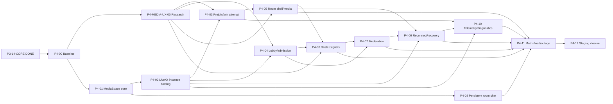

# Backlog Phase 4 - Classroom Media MVP

> Nguồn thực thi chi tiết cho Phase 4. Master Plan giữ mục tiêu/exit gate cấp phase;
> tài liệu này giữ task ID, dependency, contract, security, test và Definition of Done.
> Kiến trúc có thẩm quyền: [ADR-0030](adr/0030-authoritative-classroom-media-spaces-lifecycle-and-livekit-grants.md).

## 1. Mục tiêu phase

Xây classroom media ổn định cho pilot 2-50 người:

1. official ClassSession/occurrence và member-owned StudyMeeting/instant room có lifecycle rõ;
2. backend cấp LiveKit credential room-instance-scoped, tối thiểu quyền;
3. prejoin kiểm tra thiết bị/network, effect progressive-enhancement, lobby/admission và join recovery;
4. camera, mic, screen share, grid/speaker/presentation layout;
5. participant roster, hand raise, reaction và moderation server-authorized;
6. chat trong phòng bền vững, reconnect/degraded audio-only và support diagnostics an toàn;
7. browser/device matrix, join-storm/load profile và provider-outage runbook có bằng chứng.

P3-14-CORE đã `DONE`; Phase 4 được phép bắt đầu trong khi Phase 3 deferred carry-over tiếp tục.
Không task Phase 4 nào được xóa, giả lập PASS hoặc bật notification/email/file-processing side
effect thuộc Phase 3 khi carry-over chưa đạt gate riêng.

**Task `DONE` gần nhất:** `P4-00` architecture/backlog baseline ngày 2026-08-08. ADR-0030 chốt
MediaSpace/RoomInstance/ParticipantSession, source/ownership, token/webhook, lobby/moderation,
feature-off rollout, privacy và compatibility với P1 spike. **Task kế tiếp:** `P4-01`
MediaSpace lifecycle/schema/API core; chưa migration hoặc deploy trong P4-00.

`P4-MEDIA-UX-00` là research lane `TODO` có thể chạy song song P4-01/P4-02 và phải `DONE`
trước phần UX/signals/effects của P4-03/P4-04/P4-05/P4-06. Task không đổi LiveKit provider,
không thêm production dependency và không làm thay đổi critical path hiện tại là P4-01.

## 2. Non-goal

- Recording/egress, transcription, AI meeting summary, E2EE policy và consent workflow.
- Whiteboard, breakout, quiz, shared notes, co-watch và plugin classroom của Phase 5.
- Webinar/broadcast/large-event profile; Phase 4 chỉ là interactive classroom tối đa 50.
- Anonymous/external room participant; guest phải là active authenticated tenant member.
- Attendance/grade authority từ join telemetry hoặc provider webhook.
- Provider billing, automated plan upgrade hoặc self-host LiveKit.
- Beauty/makeup/avatar/sticker, AI/video background và user-uploaded background trong P4 MVP.
- Mobile/native app implementation; API/domain phải không khóa khả năng dùng client khác.
- Media proxy qua Core API, raw media storage hoặc browser-held provider secret.
- Redis, NATS, Kafka, microservice hoặc Kubernetes khi chưa có tải chứng minh.
- Bật Phase 3 email/notification/processing carry-over chỉ để phục vụ demo media.

## 3. Nguyên tắc bắt buộc

- OpenAPI đổi trước/cùng implementation; generated TypeScript client không sửa tay.
- PostgreSQL/shared policy là authority; LiveKit state/JWT/client role chỉ là transport projection.
- Mọi business row predicate `tenant_id`; cross-tenant/inaccessible ID conceal `404`.
- Official class và member-owned space có quyền khác nhau; ownership không nâng thành
  `session.schedule` hoặc attendance authority.
- Token ngắn hạn, exact RoomInstance, memory-only, response `no-store`; provider identifiers opaque.
- Feature `classroom_media_rooms` và `instant_study_rooms` có catalog default false và deployment
  guardrail force-off đến rollout acceptance; tenant override không được bypass guardrail.
- Start/end/admit/lock/moderate dùng expected version/idempotency và audit allowlist.
- Server không remote-unmute; recording mặc định off; `CanPublishData` giữ false.
- Webhook phải signed + idempotent + map database; không parse tenant/class từ provider room name.
- API mới nhận `X-TutorHub-Expected-Tenant-ID` chỉ làm workspace-race assertion; active session
  và repository tenant predicate vẫn là authorization authority.
- Không giữ PostgreSQL transaction trong lúc gọi LiveKit; provider result reconcile idempotently.
- Media đi browser <-> LiveKit; Core API chỉ cấp quyền/command/metadata/telemetry bounded.
- Không log token, SDP/ICE, IP chi tiết, device label, media/chat content hoặc raw provider error.
- UI có loading, empty, error, forbidden, feature-off, provider-unavailable, reconnect và retry.
- Mỗi slice có authorization, tenant isolation, concurrency, privacy, accessibility và rollback plan.

## 4. Trạng thái tổng hợp

| Task            | Nội dung                                           | Dependency                              | Trạng thái |
| --------------- | -------------------------------------------------- | --------------------------------------- | ---------- |
| P4-00           | Architecture/backlog/contract baseline             | P3-14-CORE                              | DONE       |
| P4-MEDIA-UX-00 | Prejoin/layout/signals/effects research spike      | P4-00; song song P4-01/P4-02            | TODO       |
| P4-01           | MediaSpace lifecycle, schema và API core            | P4-00                                   | TODO       |
| P4-02           | RoomInstance LiveKit credential + webhook binding   | P4-01, P1-07 baseline                   | TODO       |
| P4-03           | Prejoin device/network và join-attempt flow         | P4-02, P4-MEDIA-UX-00                  | TODO       |
| P4-04           | Lobby, admission và explicit same-tenant invite     | P4-02, P4-03, P4-MEDIA-UX-00           | TODO       |
| P4-05           | Classroom shell, media controls và layouts          | P4-03, P4-MEDIA-UX-00                  | TODO       |
| P4-06           | Participant roster, hand raise và reaction          | P4-04, P4-05, P4-MEDIA-UX-00           | TODO       |
| P4-07           | Host/co-host/TA moderation, lock/mute/remove/end     | P4-04, P4-06                            | TODO       |
| P4-08           | Persistent in-room chat                             | P4-01, P3-07A; ADR review               | TODO       |
| P4-09           | Reconnect, recovery instance và degraded audio-only | P4-02, P4-05, P4-07                     | TODO       |
| P4-10           | Join telemetry, privacy và diagnostics export       | P4-02, P4-03, P4-09                     | TODO       |
| P4-11           | Browser/device matrix, load và outage runbook        | P4-05 đến P4-10                         | TODO       |
| P4-12           | Exact staging acceptance và Phase 4 closure          | P4-MEDIA-UX-00, P4-01 đến P4-11         | TODO       |

`TODO` không ngụ ý implementation đã tồn tại. `VERIFY` chỉ dùng sau khi implementation và local/
disposable gates xanh nhưng exact staging/manual/provider gate còn mở. `DONE` yêu cầu toàn bộ
acceptance của task, cập nhật Project State/backlog và bằng chứng exact candidate phù hợp.

## 5. Dependency graph

P4-08 có thể chạy song song sau P4-01 nhưng phải review/amend ADR-0013/0025 vì conversation hiện
có đúng hai kind `direct`/`class`. P4-11 provider load chỉ chạy khi owner cho phép dùng quota/
credential staging; local/synthetic gates không được bỏ qua trong lúc chờ.

P4-MEDIA-UX-00 có thể chạy song song với P4-01/P4-02 nhưng không được kéo provider/dependency
mới vào production. Kết quả phải là evidence + ADR/amendment; P4 không bắt buộc ship effect nếu
performance, privacy, accessibility hoặc license gate không đạt.

## 6. Reuse matrix và compatibility boundary

| Nền hiện có | Tái sử dụng | Không được coi là Phase 4 authority |
| ----------- | ----------- | ----------------------------------- |
| ADR-0004 LiveKit Cloud | Provider choice, backend-held secret | Không chốt room lifecycle/moderation |
| P1 media module | Token issuer, signed webhook verifier, bounded telemetry patterns | Class-wide deterministic room/token path |
| P1 web room | Prejoin, device choice, LiveKit components, reconnect states | Không có source/instance/lobby authority |
| V1 classroom prototype | Preview/device/effect, layout/screen-share, hand/reaction và failure inventory | Global/JCEF/DOM/CDN/client-metadata/DataChannel authority không được port |
| ADR-0013 policy | Shared deny-by-default role/class projection | JWT/client role không cấp quyền |
| ADR-0015 controls | Typed feature/quota + deployment clamp | Capability projection không thay API enforcement |
| P3 scheduling | ClassSession/occurrence/StudyMeeting source authority | StudyMeeting không tự mint token |
| P3 conversation | Persistent REST messages, unread/read | DataChannel không lưu chat; room kind chưa được chốt |
| P3 audit/outbox | Transactional allowlist events | Không ghi media content/telemetry noise |

Legacy `/api/v1/classes/{class_id}/media-token` chỉ phục vụ controlled P1 compatibility cho tới
khi P4 route thay thế. Không tenant nào được chạy đồng thời class-wide authority và MediaSpace
authority. P4-12 phải disable legacy route cho tenant đã rollout.

## 7. P4-00 Architecture/backlog baseline

**User outcome:** agent mới biết chính xác aggregate, quyền, thứ tự task, gate và phần P1 được tái
sử dụng mà không cần suy từ lịch sử chat.

### Definition of Done

- [x] Tạo backlog Phase 4 có task ID, dependency graph, acceptance và exit gate.
- [x] ADR-0030 chốt MediaSpace, RoomInstance, ParticipantSession và source lifecycle.
- [x] Chốt official/member-owned authorization, lobby/moderation và no-anonymous boundary.
- [x] Chốt room-instance token, opaque provider identity và signed webhook database mapping.
- [x] Chốt feature/quota defaults off, tenant ACL, audit/privacy/retention và P1 compatibility.
- [x] Chọn P4-01 MediaSpace lifecycle/schema/API core là vertical slice đầu tiên.
- [x] Xác nhận P4-00 không thêm dependency, migration, provider config, deploy hoặc side effect.
- [x] Đồng bộ README, Project State, Agent Coordination, Delivery Roadmap, Master Plan,
      Domain Model, Security Baseline và LiveKit runbook.

## 7A. P4-MEDIA-UX-00 Classroom media UX research spike

**Dependency:** P4-00. **Trạng thái:** `TODO`. **Execution:** song song P4-01/P4-02;
phải `DONE` trước phần UX/signals/effects của P4-03/P4-04/P4-05/P4-06.

**Đặc tả và Definition of Done:**
[P4_MEDIA_UX_00_RESEARCH_SPIKE.md](P4_MEDIA_UX_00_RESEARCH_SPIKE.md).

### Scope

- Benchmark current official Zoom/Google Meet green-room, layouts, hand raise/reactions,
  background/effects, degraded mode, waiting-room và accessibility; không sao chép UI/asset.
- Audit read-only V1 lobby/layout/roster/LiveKit/MediaPipe để lấy use case/test; không port
  authority/code cũ.
- So sánh native browser capability, LiveKit track-processors, MediaPipe fallback, WebRTC audio
  defaults và Krisp go/no-go trên cùng performance/privacy/license/accessibility matrix.
- Prototype grid/active-speaker/presentation ở 2/5/25/50 và hand queue/reaction projection với
  Core API authority, FIFO/resync/rate-limit; tiếp tục giữ `CanPublishData=false`.
- Prototype cô lập `None`/blur/curated static background; không production route/dependency/deploy.

### Acceptance

- [ ] V1 reuse/reject matrix và current official Zoom/Meet/LiveKit source inventory được lưu.
- [ ] Browser/device/capability, 360p-720p performance và low-end degrade evidence đạt hoặc có cap.
- [ ] Permission/device/autoplay/error recovery và processor/track cleanup không chặn Join.
- [ ] Layout 2/5/25/50 có pagination/degrade, visual stability, adaptive-subscription và a11y evidence.
- [ ] Hand FIFO/moderator lifecycle/resync và reaction allowlist/TTL/grouping/rate-limit có evidence.
- [ ] CSP/self-host model/WASM, asset license, privacy/telemetry và accessibility gates rõ.
- [ ] ADR/amendment chọn một processor/fallback/MVP scope, hoặc quyết định ship no-effect.
- [ ] P4-03/P4-04/P4-05/P4-06/P4-11 được điều chỉnh theo decision trước implementation.

## 8. P4-01 MediaSpace lifecycle, schema và API core

**Dependency:** P4-00. **Trạng thái:** `TODO`. **Rollout:** feature-off, không mint LiveKit token.

### Scope

- Thêm `media_spaces`, `media_room_instances`, `media_space_members`,
  `media_admission_requests`, `media_participant_sessions` và provider binding cần thiết bằng
  forward migration kế tiếp (dự kiến `000029`, chỉ khóa số khi bắt đầu implementation).
- Exact tenant/composite FK, unique one-space-per-source và one-active-instance constraints.
- Domain state machine/lock order/idempotency; bind one-time ClassSession, recurring occurrence
  hoặc StudyMeeting do server resolve. Instant command atomically tạo/bind StudyMeeting, không
  tạo source authority thứ ba.
- Shared policy actions và server-derived viewer operations; không nhận tenant/owner/role từ body.
- Catalog feature/quota theo ADR-0030, defaults off, deployment clamp và fail-closed prerequisite.
- Cập nhật catalog tests theo invariant mới: chỉ P4 feature được phép compiled default false;
  không nới assertion cho feature hiện hữu.
- REST create/get/start/end/cancel skeleton, audit/outbox allowlist; provider adapter chưa được gọi.

### Acceptance

- [ ] Migration up/down PASS local và disposable; forward shared chỉ sau disposable report/approval.
- [ ] Runtime role exact DML, không owner/DDL/broad table grant; foreign tenant conceal `404`.
- [ ] Official teacher/admin/owner/co-teacher start/end matrix đúng; student không nâng quyền.
- [ ] StudyMeeting owner, gồm StudyMeeting do instant command tạo, và explicit same-tenant member
      boundary đúng; anonymous bị từ chối.
- [ ] Concurrent/retry start chỉ tạo một space/instance intent; end/cancel race deterministic.
- [ ] Source cancel/archive/enrollment revoke fail closed; audit/outbox không chứa private content.
- [ ] Feature/quota disabled paths không tạo row; storage failure trả `503`.
- [ ] OpenAPI/generated client, Go/TS tests và full verify xanh; không có provider side effect.

## 9. P4-02 RoomInstance LiveKit credential và webhook binding

**Dependency:** P4-01 và P1-07 baseline. **Trạng thái:** `TODO`.

### Scope

- Tái dùng official LiveKit token issuer/verifier; thêm narrow provider room/moderation adapter.
- Mint JWT exact active RoomInstance, opaque room/participant ID, TTL mặc định 5 phút.
- Reissue/rate-limit/idempotent join attempt; camera/mic, screen share và subscribe grant riêng.
- Signed webhook lookup database binding, replay/out-of-order handling và bounded receipt retention.
- Deprecation/mutual exclusion cho class-wide P1 token path.

### Acceptance

- [ ] Credential request không nhận/echo tenant, provider room, role hoặc grant client-supplied.
- [ ] Token no-store/memory-only; secret/token/identifier không vào bundle, log, audit hoặc metric.
- [ ] Inactive/locked/ended/foreign/revoked source không mint token; exact allow/deny matrix PASS.
- [ ] Signed duplicate webhook idempotent; unsigned/malformed/unknown/stale event không mutate state.
- [ ] Provider outage trả typed `503`, không để partial active instance hoặc duplicate room.
- [ ] P1/P4 route mutual exclusion và compatibility tests PASS.

## 10. P4-03 Prejoin device/network và join-attempt flow

**Dependency:** P4-02. **Trạng thái:** `TODO`.

### Scope

- Tách prejoin local device probe khỏi credential issuance; không mở camera trước explicit action.
- Mic/camera/speaker selection, preview, permission denied/in-use/no-device và browser guidance.
- Coarse connectivity/TURN readiness probe không thu raw IP/ICE; create join attempt sau consent.
- Route reload không phục hồi token; workspace/principal/source change purge state.

### Acceptance

- [ ] Keyboard/screen reader/200% zoom/forced-colors; labels và error recovery rõ.
- [ ] Permission denial hoặc missing device vẫn cho listen-only khi policy cho phép.
- [ ] Không device label trước permission; không token trong history/storage/error report.
- [ ] Chromium pilot matrix và unit/Playwright happy/error/offline paths PASS.

## 11. P4-04 Lobby, admission và explicit same-tenant invite

**Dependency:** P4-02/P4-03. **Trạng thái:** `TODO`.

### Scope

- Authenticated same-tenant explicit member grant cho StudyMeeting, gồm instant-created meeting.
- Lobby request exact instance/actor; host/co-host/TA projection; admit/deny CAS/idempotency.
- Source/class membership revoke immediately blocks new admission/credential.
- No public/anonymous link in P4 MVP.

### Acceptance

- [ ] Uninvited/foreign/inactive member concealed/denied without roster enumeration.
- [ ] Concurrent admit/deny/end produces one terminal result; stale instance cannot admit.
- [ ] Denied/removed member cannot rejoin until explicit restore; no raw email in event payload.
- [ ] Lobby waiting UX has timeout, cancel, retry, accessibility and provider-unavailable state.

## 12. P4-05 Classroom shell, media controls và layouts

**Dependency:** P4-03/P4-MEDIA-UX-00. **Trạng thái:** `TODO`.

### Scope

- Classroom stage, toolbar, participant rail and responsive drawer using existing design system.
- Camera/mic/screen-share device switching; grid, active speaker and presentation layout.
- Áp dụng layout modes, pagination/rail, visual-stability và degrade order đã chốt bởi research spike.
- Release tracks/device on leave; listen-only and browser autoplay handling.
- Lazy-load LiveKit bundle and declare performance budget.

### Acceptance

- [ ] 2/5/25/50 profile layout không overlap; 320 px và 200% zoom có usable controls.
- [ ] Keyboard, screen reader, focus restore, forced colors và reduced motion PASS.
- [ ] Publish controls exactly match server grant; hidden UI never substitutes API deny test.
- [ ] Leave/unmount stops tracks and device indicators; navigation cannot leak token/state.

## 13. P4-06 Participant roster, hand raise và reaction

**Dependency:** P4-04/P4-05/P4-MEDIA-UX-00. **Trạng thái:** `TODO`.

### Scope

- Server-derived participant projection with bounded display name/role/media state.
- Hand raise/reaction through authorized/rate-limited Core API signal; `CanPublishData=false`.
- FIFO dùng server sequence; moderator lower-one/lower-all, reaction TTL/grouping và bounded a11y
  announcements theo contract đã chốt bởi research spike.
- Active-speaker/quality remain provider ephemeral; bounded resync after signal loss.

### Acceptance

- [ ] Participant cannot forge role/user/tenant or signal for another ParticipantSession.
- [ ] Spam rate limit cross-instance-safe; unknown payload discarded without log injection.
- [ ] Join/leave/reconnect roster eventually converges after duplicate/out-of-order webhook.
- [ ] Roster/reaction accessible without color-only meaning and does not expose email/session ID.

## 14. P4-07 Host/co-host/TA moderation

**Dependency:** P4-04/P4-06. **Trạng thái:** `TODO`.

### Scope

- Instance-scoped co-host promotion/demotion, lock/unlock, admit/deny, mute/remove and end.
- Server-authorized provider adapter; safety-admin recovery with reason/audit.
- Remote mute only; never remote-unmute. Removed participant block/recovery state.

### Acceptance

- [ ] Official and member-owned role matrix table-tested; TA/co-host scope expires with instance.
- [ ] Direct provider call cannot bypass TutorHub command authority.
- [ ] Concurrent lock/join, remove/rejoin, end/token and role-change/token races fail closed.
- [ ] Moderation audit allowlist has actor/target opaque IDs/action/outcome, no media/chat content.
- [ ] Provider failure exposes retry/reconcile state without claiming mutation succeeded.

## 15. P4-08 Persistent in-room chat

**Dependency:** P4-01/P3-07A và ADR review. **Trạng thái:** `TODO`.

### Scope

- Review/amend ADR-0013/0025 before adding room-scoped conversation authority.
- Reuse conversation message persistence, pagination, sanitization, unread/read and idempotency.
- LiveKit DataChannel only optional transient hint; database REST response remains source of truth.
- History visibility follows room/source policy; ended room becomes read-only.

### Acceptance

- [ ] No parallel ad-hoc media message table or provider webhook content persistence.
- [ ] Retry/reconnect does not duplicate or lose committed messages; foreign room concealed.
- [ ] Removed/inactive member loses new write immediately; historical read follows explicit policy.
- [ ] Message content absent from log/audit/telemetry; accessibility and long-content layout PASS.

## 16. P4-09 Reconnect, recovery instance và degraded audio-only

**Dependency:** P4-02/P4-05/P4-07. **Trạng thái:** `TODO`.

### Scope

- Distinguish transient reconnect, token reissue and provider recovery instance.
- Recovery instance requires old instance terminal/failed and one-active-instance invariant.
- Degraded mode turns video off before audio; user can leave/rejoin cleanly.
- End/lock/remove/enrollment revoke wins over reconnect.

### Acceptance

- [ ] Network loss 5-15s reconnects without duplicate participant or new business room.
- [ ] Long loss/token expiry asks server for current authority; stale token/state not reused.
- [ ] Provider instance failure creates at most one recovery instance under concurrency.
- [ ] Revoked/ended/removed actor never reconnects via cached credential.

## 17. P4-10 Join telemetry, privacy và diagnostics export

**Dependency:** P4-02/P4-03/P4-09. **Trạng thái:** `TODO`.

### Scope

- Typed join-stage/media-quality metrics and bounded error taxonomy.
- Participant diagnostics retention max 30 days; maintenance purge bounded/role-separated.
- Authorized support export bounded time/size, no-store, audited and redacted.
- Dashboard join success, time-to-media and reconnect outcome without tenant/user high-cardinality labels.

### Acceptance

- [ ] Token/secret/SDP/ICE/raw IP/device label/raw exception never accepted or logged.
- [ ] Retention/purge ACL and SKIP LOCKED concurrency PASS on disposable PostgreSQL.
- [ ] Export actor/tenant authorization, size/range cap and log-redaction tests PASS.
- [ ] Metrics compute join success and p95 time-to-media from bounded schema.

## 18. P4-11 Browser/device matrix, load và outage runbook

**Dependency:** P4-05 đến P4-10. **Trạng thái:** `TODO`.

### Scope

- Chromium/Edge/Firefox/Safari support statement; Windows/macOS primary pilot devices.
- Camera/mic/speaker/screen-share permission matrix and accessibility/NVDA acceptance.
- Join storm and sustained room profile up to 50 or lower documented provider-safe cap.
- LiveKit outage/degradation, credential rotation and support/recovery runbook.

### Acceptance

- [ ] Join success >=99% in declared pilot matrix; time-to-media p95 <10s.
- [ ] 50 participant/profile load or lower published cap has CPU/memory/bandwidth evidence.
- [ ] No Core API media proxy; API remains healthy under join storm/rate limit.
- [ ] Provider outage drill has fail-closed start, existing-room behavior and recovery evidence.
- [ ] Load test uses staging synthetic identities and explicit provider quota approval; no real PII.

## 19. P4-12 Exact staging acceptance và Phase 4 closure

**Dependency:** P4-MEDIA-UX-00 và P4-01 đến P4-11. **Trạng thái:** `TODO`.

### Exit gate

- [ ] Exact candidate Verify/Security/Browser E2E/Cloudflare/Render checks green.
- [ ] Disposable migration/ACL/concurrency/privacy matrix green before shared forward.
- [ ] Teacher/TA/student/guest official room and member-owned room role matrix green.
- [ ] Lobby, moderation, reconnect, chat persistence, accessibility and support diagnostics green.
- [ ] LiveKit signed webhook/replay/provider-outage and declared browser/device/load profile green.
- [ ] Feature rollout canary is reversible by server-evaluated kill switch; legacy P1 authority off.
- [ ] Recording/egress remains off; no Phase 3 carry-over falsely marked PASS or activated.
- [ ] `docs/PHASE_4_COMPLETION.md`, Project State, Master Plan and roadmap updated.

## 20. Cross-cutting test matrix

| Risk | Automated evidence bắt buộc |
| ---- | --------------------------- |
| Tenant/IDOR | foreign source/space/instance/participant concealment across every endpoint |
| Role drift | org/class/source role matrix, revoke after token, no client-role trust |
| Concurrency | start/start, start/end, lock/join, admit/deny, remove/rejoin, recovery/recovery |
| Token/privacy | TTL/scope/grant/no-store/memory-only, bundle/log/audit secret scan |
| Webhook | signature, replay, out-of-order, unknown room, stale instance, malformed ID fuzz |
| Feature/quota | defaults off, parent/subfeature dependency, clamp, concurrent ceiling |
| Accessibility | keyboard, NVDA/Axe, 200% zoom, forced colors, reduced motion, focus recovery |
| Reliability | network short/long loss, provider unavailable, tab reload, device unplug/change |
| Performance | lazy bundle, layout 2/5/25/50, time-to-media, join storm, Core API health |
| Retention | participant/webhook purge ACL, bounded batch, SKIP LOCKED, export redaction |

## 21. Threat model và risk register

Đây là threat-model baseline của P4-00 cho trust boundary mới browser/Core API/LiveKit/
PostgreSQL. Mỗi implementation slice phải cập nhật khi thêm provider command, dữ liệu hoặc actor.

| Rủi ro | Giảm thiểu/Gate |
| ------ | -------------- |
| P1 class-wide route bị nhầm là production lifecycle | Mutual exclusion, deprecation và P4-12 disable |
| JWT/role stale sau roster change | TTL ngắn, reauthorize mutation, server kick/reissue |
| Hai provider room cho một session | Row lock + partial unique + idempotency + race test |
| Fake/tampered provider event | Official signature/body verify, DB binding, replay/out-of-order test |
| Join/admission storm vượt capacity | Atomic reservation, tenant/actor rate-limit, deployment ceiling |
| Provider outage làm state lệch | Instance reconciliation/recovery, typed failed state, runbook |
| Student nâng quyền từ StudyMeeting | Source-kind policy, owner boundary, no attendance/session.schedule |
| DataChannel bypass moderation | `CanPublishData=false`; command qua Core API |
| Token/metadata leak | Opaque IDs, memory-only/no-store, log/bundle regression scan |
| Join telemetry bị dùng như attendance | Domain/docs/API label rõ, no grade/attendance projection |
| 50-person cost/quality không đạt free tier | Deployment cap có thể hạ; publish measured supported profile |
| P3 carry-over bị bật nhầm | Separate flags/register; P4 tasks không activate email/worker/file processing |

## 22. Definition of Done Phase 4

- Classroom pilot có official và member-owned room đúng authority, 2-50 hoặc cap thấp hơn công bố.
- Join success >=99%, time-to-media p95 <10 giây trên declared pilot matrix.
- Lobby/moderation/reconnect server-authorized; provider/client state không là source of truth.
- Chat bền vững, room lifecycle/idempotency/concurrency/tenant isolation và privacy gates xanh.
- Không media đi qua Core API; recording off; provider outage/runbook/kill switch có bằng chứng.
- Exact local/disposable/CI/staging/browser/device/load acceptance được lưu trong repository.

## 23. Thứ tự thực hiện ngay

1. Bắt đầu `P4-01`: review exact P1 code + scheduling/source schema và khóa migration design.
2. Có thể chạy `P4-MEDIA-UX-00` song song; không để research đổi schema/authority hoặc chặn P4-01/P4-02.
3. Viết OpenAPI/Go domain tests trước, giữ feature defaults off và provider adapter chưa gọi.
4. Chạy local PostgreSQL/disposable migration + exact ACL/concurrency gates.
5. Chỉ sau P4-01 `DONE` mới nối credential/webhook RoomInstance ở P4-02; research phải `DONE`
   trước phần UX/signals/effects của P4-03/P4-04/P4-05/P4-06.
