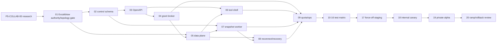

# Backlog Phase 5 - Classroom Collaboration

> Nguồn thực thi cho Phase 5. P5-COLLAB-01 đã `DONE` ngày 2026-08-20 sau khi Excalidraw +
> self-managed Yjs/Hocuspocus topology, Gate A-F, disposable Render/Neon/B2 drill, quota evidence và
> owner operations/risk sign-off đều PASS; ADR-0034 đã `Accepted`. P5-COLLAB-02 đã `DONE` ngày
> 2026-08-21: migration `000037`, local/full verify, disposable/shared Neon gates, exact ACL,
> candidate CI/security và final read-only snapshot đều PASS. P5-COLLAB-03 cũng đã `DONE` ngày
> 2026-08-21 trên exact candidate `647ffe4`. P5-COLLAB-04 đã `DONE` ngày 2026-08-21 với one-time
> grant broker, exact authority revalidation và bounded revoke disconnect. P5-COLLAB-05 đã `DONE`
> ngày 2026-08-22 với local data-plane candidate. P5-COLLAB-06 cũng đã `DONE` ngày 2026-08-22 với
> lazy classroom tool shell; P5-COLLAB-07 runnable. Production whiteboard vẫn force-off tới
> P5-COLLAB-17.

## 1. Mục tiêu phase

Xây collaboration plane cho lớp học mà không làm rời hoặc làm yếu classroom media:

1. teacher mở/đóng whiteboard qua tool shell lazy-load;
2. đúng một authority sở hữu document, history và undo/redo;
3. Core API/PostgreSQL sở hữu lifecycle, tenant policy, capability và grant generation;
4. collaboration data plane riêng truyền operation/awareness, không dùng Core API REST hay
   LiveKit DataChannel làm đường sync document;
5. snapshot/import/export/restore có checksum, generation và recovery được kiểm chứng;
6. profile pilot 2-50 người đạt convergence, performance, accessibility và failure budget;
7. rollout force-off -> internal canary -> private alpha -> ramp có kill switch và exit plan.

## 2. Non-goal và ranh giới

- Không tích hợp hoặc kích hoạt production engine/provider chỉ vì ADR-0034 đã `Accepted`; mỗi slice
  implementation/staging/rollout vẫn phải qua exit gate riêng.
- Không xếp Yjs lên store/sync native của engine nếu tạo document/history/undo authority thứ hai.
- Không để browser tự khai tenant, role, document, provider room hoặc capability.
- Không gửi whiteboard operation/snapshot qua Core API REST hoặc LiveKit DataChannel.
- Không đưa raw board content, snapshot body, grant, email học sinh hoặc provider error vào log/audit.
- Không coi presence/awareness là attendance, grade hoặc durable audit authority.
- Không mở recording/egress, breakout, quiz, shared notes hay untrusted tool chỉ vì whiteboard chạy.
- Không giữ production provider secret trong web bundle; không dùng credential production cho test.

## 3. Nguyên tắc bắt buộc

- **Một document authority:** canonical model/provider được ADR chấp nhận sở hữu document, causal
  history và undo semantics; Excalidraw là editor/projection. PostgreSQL chỉ giữ business metadata/
  snapshot catalog; B2 chỉ giữ immutable blob.
- **Tách plane:** Core API là control plane; provider/gateway riêng là collaboration data plane.
- **Deny by default:** capability `view/edit/present` được server resolve từ active tenant/source/
  membership; read-only phải được data plane enforce, không chỉ disable toolbar.
- **Grant ngắn hạn:** one-time, TTL tối đa 60 giây, exact opaque document, actor, capability,
  Origin allowlist và revoke generation; response `no-store`, browser giữ memory-only.
- **Snapshot an toàn:** immutable, versioned, checksummed, size-bounded; restore tạo generation mới
  bằng atomic swap, không sửa lịch sử cũ tại chỗ.
- **Undo theo actor:** thao tác local không được hoàn tác thay đổi của actor khác ngoài semantics đã
  công bố và được test bằng concurrent edit/reconnect.
- **Payload bị chặn:** frame/update/import/export có cap, schema validation, rate/connection quota và
  chống CRDT amplification/noisy tenant.
- **Feature mặc định off:** catalog default false và deployment guardrail force-off tới P5-17.
- Mỗi slice phải có loading, empty, error, forbidden, read-only, reconnect và retry phù hợp.

## 4. Trạng thái tổng hợp

| Task         | Dải            | Nội dung                                        | Dependency                 | Trạng thái |
| ------------ | -------------- | ----------------------------------------------- | -------------------------- | ---------- |
| P5-COLLAB-01 | Decision gate  | Chấp nhận Excalidraw authority/topology         | P5-COLLAB-00               | DONE       |
| P5-COLLAB-02 | Implementation | Control-plane schema                            | P5-COLLAB-01               | DONE       |
| P5-COLLAB-03 | Implementation | OpenAPI lifecycle/grant/snapshot/export/restore | P5-COLLAB-02               | DONE       |
| P5-COLLAB-04 | Implementation | Grant broker và revoke generation               | P5-COLLAB-03               | DONE       |
| P5-COLLAB-05 | Implementation | Collaboration data plane/provider adapter       | P5-COLLAB-01, P5-COLLAB-04 | DONE       |
| P5-COLLAB-06 | Implementation | Lazy classroom tool shell                       | P5-COLLAB-03, P5-COLLAB-05 | DONE       |
| P5-COLLAB-07 | Implementation | Snapshot/import/export/restore worker và B2     | P5-COLLAB-02, P5-COLLAB-05 | TODO       |
| P5-COLLAB-08 | Implementation | Reconnect, compaction và recovery               | P5-COLLAB-05, P5-COLLAB-07 | TODO       |
| P5-COLLAB-09 | Implementation | Feature/quota/operations                        | P5-COLLAB-04..08           | TODO       |
| P5-COLLAB-10 | Test           | Authorization và tenant isolation               | P5-COLLAB-02..09           | TODO       |
| P5-COLLAB-11 | Test           | Credential/revoke/WebSocket abuse               | P5-COLLAB-04, P5-COLLAB-05 | TODO       |
| P5-COLLAB-12 | Test           | Convergence/history/undo/reconnect              | P5-COLLAB-05, P5-COLLAB-08 | TODO       |
| P5-COLLAB-13 | Test           | Snapshot/import/export/restore                  | P5-COLLAB-07, P5-COLLAB-08 | TODO       |
| P5-COLLAB-14 | Test           | Performance 500/2.000 shapes và 2/10/50 người   | P5-COLLAB-05..09           | TODO       |
| P5-COLLAB-15 | Test           | Accessibility và browser matrix                 | P5-COLLAB-06, P5-COLLAB-08 | TODO       |
| P5-COLLAB-16 | Test           | Failure, outage và provider exit                | P5-COLLAB-05..09           | TODO       |
| P5-COLLAB-17 | Rollout        | Force-off staging acceptance                    | P5-COLLAB-10..16           | TODO       |
| P5-COLLAB-18 | Rollout        | Internal canary                                 | P5-COLLAB-17               | TODO       |
| P5-COLLAB-19 | Rollout        | Private alpha                                   | P5-COLLAB-18               | TODO       |
| P5-COLLAB-20 | Rollout        | Ramp và rollback/exit review                    | P5-COLLAB-19               | TODO       |

`VERIFY` chỉ được dùng sau khi implementation và toàn bộ gate pre-staging của task xanh. `DONE`
yêu cầu exact candidate/evidence được lưu trong repository và trạng thái tài liệu được cập nhật.

## 5. Dependency graph

## 6. Implementation slices

### P5-COLLAB-01 - Excalidraw authority/topology acceptance

**Scope:** dùng evidence matrix P5-COLLAB-00 đã hoàn tất, tập trung chứng minh Excalidraw + một
self-managed collaboration topology; owner quyết định exact provider/runtime/cost. ADR-0034 chỉ
chuyển `Accepted` khi đúng một document/history/undo authority, exact private-alpha topology và
production upgrade boundary được chứng minh.

**Owner checkpoint cuối 2026-08-18:** sau khi xem lại license và khả năng sở hữu sản phẩm, owner chọn
**Excalidraw làm whiteboard engine chính thức** với collaboration runtime tự quản. Quyết định này
thay thế target tldraw trước đó. P5-COLLAB-01 từ đây chỉ chạy implementation/evidence lane
Excalidraw; tldraw official-sync prototype được giữ làm historical evidence/exit comparator, không
phải writer/provider song song. Exact CRDT/provider/runtime vẫn phải được chốt bằng hard gate.

**Owner runtime checkpoint 2026-08-19:** chọn `FREE_PRIVATE_ALPHA` gồm một Render Free instance tại
Singapore, không Redis, Neon checkpoint và B2 portable snapshot trong free allowance; hard cap
`0 USD`, không automatic upgrade. Render Standard x2 + Redis Cloud paid Multi-AZ được hoãn tới gate
public beta/production và chưa provision.

**Exit gate:**

- [x] Owner chọn đúng một target: Excalidraw + self-managed collaboration.
- [x] Exact Excalidraw production pin, MIT/dependency/asset notices, upstream bundle config và React
      peer compatibility PASS.
- [x] Excalidraw scene adapter + một canonical authority PASS convergence, actor-local undo/redo,
      offline/reconnect và bounded corrupt/oversized denial (Gate B `5/5`).
- [x] Exact candidate one-time grant, tenant/capability/view-only, generation revoke/close/restore và
      abuse boundary PASS trên Excalidraw adapter/provider (Gate C `4/4`).
- [x] Durable restart recovery, immutable snapshot/generation swap và portable provider exit PASS
      trên exact Excalidraw canonical authority (Gate D `4/4`).
- [x] Excalidraw 2/10/50 load PASS với budget và cleanup-zero được công bố.
- [x] Exact CRDT/provider/runtime và vận hành PASS isolated + disposable Render Free/Neon/B2; quota
      dashboard/redacted usage evidence và owner sign-off đã đạt.
- [x] Semantic canvas companion/fallback từ cùng canonical authority được công bố và tự động kiểm thử.
- [x] Physical Chrome/Edge + NVDA được owner xác nhận; installed headed matrix PASS role/name/focus,
      200%-equivalent reflow, forced colors/reduced motion và Axe; owner NVDA speech PASS gồm
      toolbar/mode/semantic fallback và reconnect/error/focus recovery.
- [x] Excalidraw-only bundle security/config guard và production dependency audit PASS; không dùng
      allowlist để che public upstream API/Firebase/collaboration config.
- [x] Owner chấp thuận single-instance/no-HA/cold-start, hard cap `0 USD`, on-call/RPO/RTO/retention;
      portable fallback/exit và paid HA upgrade trigger được ghi.
- [x] ADR-0034 `Accepted`; production chỉ có một engine/provider topology.

**Gate F checkpoint 2026-08-19:** Node `24.15.0` + Hocuspocus `4.6.0` + Yjs `13.6.27` runtime
candidate và runbook đã được khóa. Owner đã chọn Render Free Singapore một instance/no Redis cho
development/private alpha; paid two-node/Redis HA path được hoãn. Isolated executable contract PASS
`18/18` cho two-node shared grant/quota, writer fencing/takeover, drain/checkpoint, sustained dependency
outage, kill switch,
4-kind credential rotation, snapshot binding-key overlap, provider exit, bounded telemetry và
70/90/100 cost guard; full unit/integration `53/53` và quality/build/security regression xanh.
Gate F đạt `2/4`, giữ `VERIFY`; Render Free/Neon/B2 disposable drill,
OCI/SBOM, quota evidence, no-HA/on-call/RPO/RTO owner approval và ADR `Accepted` vẫn bắt buộc.
Chi tiết: [P5_COLLAB_01_RUNTIME_OPERATIONS.md](P5_COLLAB_01_RUNTIME_OPERATIONS.md).

**Gate F.1 checkpoint 2026-08-19:** `services/whiteboard-runtime` là OCI source candidate thật, gồm
Hocuspocus/Yjs server, exact control/grant exchange, Neon checkpoint, B2 immutable snapshot,
readiness/metrics/drain và bounded abuse controls. Dockerfile pin Node digest, non-root, isolated four-
dependency production package; CI có Trivy HIGH/CRITICAL + CycloneDX guard. Runtime `9/9`, lint,
typecheck, build, OCI static guard và package-boundary test PASS. Actual image/SBOM scan cùng
disposable provider drill chưa chạy, vì vậy Gate F vẫn `2/4`, ADR-0034 vẫn `Proposed`.

**Gate F.2 checkpoint 2026-08-19:** exact GitHub builder đã build production Dockerfile của candidate
`2731387`. Verify `32245999557` và Security `32245999597` PASS; Trivy HIGH/CRITICAL, CycloneDX SBOM
validation và artifact retention đều xanh. Artifact `9362612946` chứa exact built image ID cùng SBOM;
archive digest `sha256:6016ae0c30ead0b837868b1884e1d66cb042262d1179caf66999a04ca3e7bef7`.
Gate F đạt `3/4 VERIFY`; disposable Render/Neon/B2 drill và owner/ops sign-off vẫn bắt buộc.
ADR-0034 vẫn `Proposed` và production tiếp tục force-off.

**Gate F.3 preparation checkpoint 2026-08-19:** disposable-only control fixture, strict preflight,
Render Blueprint, Neon exact-ACL provision, provider round-trip và sustained control-outage runner đã
được thêm và local tests PASS. Chưa provision provider resource hoặc có live evidence; do đó Gate F vẫn
`3/4 VERIFY`. Xem `docs/P5_COLLAB_01_GATE_F3_DISPOSABLE.md`.
Exact automation tree `def10c0` PASS Verify `32255600426` và Security `32255600491`; provider drill
vẫn phải chạy trên resource disposable thật trước khi tick gate.

**Gate F.3 provider checkpoint 2026-08-20:** Render Free Singapore, Neon role riêng và B2 private
bucket riêng đã PASS baseline, SIGTERM/drain + post-redeploy recovery, sustained Control/Neon/B2
outage `600s`, B2 và Control credential rotation/negative probe, portable semantic restore round-trip
và cleanup-zero. Evidence chỉ giữ boolean/status/duration bucket; shared staging/production không bị
đụng tới. Provider sub-gate đã đóng; P5-COLLAB-01 vẫn `IN PROGRESS`, Gate F giữ `VERIFY` vì quota
dashboard, named on-call/security/cost owner, explicit no-HA/cold-start risk và RPO/RTO/retention
approval còn thiếu. ADR-0034 vẫn `Proposed`.

**Gate F owner closure 2026-08-20:** quota evidence đã redacted cho Render/Neon/B2 đều trong allowance
và current/projected cost `0 USD`; owner chấp thuận single-instance/no-HA, spin-down/cold-start,
RPO/RTO candidate, `SEV-1/SEV-2`, B2 Object Lock disabled và force-off khi chạm quota. Primary on-call
`Bá Sáng`, backup `Duy Mạnh`, security incident owner `Bá Sáng`, cost owner `Bá Sáng`. Gate F và
P5-COLLAB-01 chuyển `DONE`; ADR-0034 chuyển `Accepted`. Paid HA vẫn deferred và production tiếp tục
force-off tới P5-COLLAB-17.

### P5-COLLAB-02 - Control-plane schema

**Scope:** tenant-owned document, source binding, lifecycle, capability policy, grant/revoke
generation, immutable snapshot catalog, restore generation và retention metadata trong PostgreSQL.

**Checkpoint 2026-08-21 — DONE:** forward candidate `000037_whiteboard_control_plane` đã tạo năm relation
tenant-scoped, exact column-level runtime ACL harness, maintenance/PUBLIC deny, lifecycle CAS,
restore-generation concurrency và no-second-authority PostgreSQL gate. Local full verify và Neon
disposable forward/idempotency/exact ACL/concurrency/tenant/authority gates PASS tại final ledger
`37 false`. Shared acceptance candidate `ef2b277` PASS Verify `32436740864` và Security `32436740906`;
shared staging owner preflight, forward/idempotent `36 false -> 37 false -> 37 false`, exact ACL và
final read-only zero-row/no-second-authority snapshot đều PASS. Không rollback/production deploy;
whiteboard production tiếp tục force-off.

**Exit gate:**

- [x] Migration forward-only, exact runtime/maintenance ACL và `tenant_id` predicate PASS disposable.
- [x] Unique/current-generation, lifecycle CAS/idempotency và restore swap có concurrency test.
- [x] PostgreSQL không trở thành operation/history authority thứ hai.
- [x] Shared staging `36 -> 37`, exact ACL và final repeatable-read snapshot PASS.

Acceptance: [`P5_COLLAB_02_STAGING_ACCEPTANCE.md`](P5_COLLAB_02_STAGING_ACCEPTANCE.md).

### P5-COLLAB-03 - OpenAPI lifecycle/grants/snapshot/export/restore

**Scope:** contract-first create/open/suspend/close, capability projection, credential exchange,
snapshot list/create, export, import validation và restore command.

**Closure 2026-08-21 — DONE:** OpenAPI strict và generated TypeScript client đã đồng bộ; Core API
đã có lifecycle/capability/import/restore implementation, PostgreSQL repository, uniform concealed
`404`, privacy headers, bounded body và HTTP/service tests. Grant broker thật thuộc P5-COLLAB-04;
snapshot/export worker thật thuộc P5-COLLAB-07 nên hai boundary này giữ `503` fail-closed khi chưa
inject dependency. Deployment guard `COLLABORATION_CONTROL_PLANE_ENABLED` mặc định `false`, nên tenant
override không thể mở route trước P5-COLLAB-17. Runner disposable chỉ allowlist ba biến, kiểm tra exact
role/direct-vs-pooled/same-branch và không log credential. Local unit/API/integration-tag compile PASS.
Full `pnpm verify` đã PASS ngày 2026-08-21. Neon P5-COLLAB-03 disposable repository gate đã PASS ở
ledger `37 false`, gồm runtime create/exact ACL, lifecycle/idempotency receipt, snapshot projection,
restore generation swap, tenant concealment và cleanup. Exact candidate `647ffe4` đã PASS review/
no-secret, GitHub Verify `32461523646` và Security `32461523627`; task chuyển `DONE`. Không cần
migration/shared-staging forward mới và không deploy production.

**Exit gate:**

- [x] Strict DTO, bounded body, canonical opaque ID, Problem Details và generated client PASS.
- [x] Foreign/inaccessible resource dùng uniform `404`; response nhạy cảm `no-store`.
- [x] Restore/export yêu cầu current authority, expected generation và idempotency.

Acceptance: [`P5_COLLAB_03_STAGING_ACCEPTANCE.md`](P5_COLLAB_03_STAGING_ACCEPTANCE.md).

### P5-COLLAB-04 - Grant broker và revoke

**Scope:** server-issued one-time grant TTL <=60 giây, exact document/actor/capability/Origin/revoke
generation; exchange sang provider credential tối thiểu quyền và đóng connection khi authority mất.

**Exit gate:**

- [x] Replay, expired, wrong Origin/document/tenant/actor/generation và forged role đều bị deny.
- [x] `view` không thể phát update; `edit/present` được data plane enforce server-side.
- [x] Membership/source close/revoke tăng generation, chặn refresh và disconnect bounded.
- [x] Grant/provider secret không xuất hiện trong URL/storage/log/audit/bundle.

**Closure 2026-08-21 — DONE:** Core API đã có atomic process-local one-time broker cho accepted
single-instance private-alpha profile, TTL/rate/capacity bounds, exact DB authority revalidation và
internal exchange/validate API. Whiteboard runtime revalidate authority lease mỗi 750 ms, enforce
read-only và đóng exact connection khi revoke. Replay/expiry/forged binding/concurrency/revoke/privacy,
runtime 17/17 tests, integration-tag compile và full `pnpm verify` đều PASS. Không có migration,
shared-staging forward hoặc deploy; production tiếp tục force-off. Shared broker trước multi-instance
và data-plane quota/backpressure thuộc P5-COLLAB-05/P5-COLLAB-09.

Acceptance: [`P5_COLLAB_04_STAGING_ACCEPTANCE.md`](P5_COLLAB_04_STAGING_ACCEPTANCE.md).

### P5-COLLAB-05 - Collaboration data plane/provider adapter

**Scope:** runtime riêng theo ADR, engine adapter và provider transport; authenticated WebSocket,
awareness ephemeral, health/readiness/drain, payload cap, connection quota và backpressure.

**Exit gate:**

- [x] Không dùng Core API REST/LiveKit DataChannel làm document transport.
- [x] Frame/update/presence rate, size, nesting và per-tenant connection quota fail closed.
- [x] Split brain/duplicate provider session không tạo authority thứ hai.
- [x] Deploy/scale/secret rotation/observability và provider outage owner có runbook.

**Closure 2026-08-22 — DONE:** runtime riêng Hocuspocus/Yjs đã dùng authenticated WebSocket với
exact one-time grant/authority lease, server-enforced `view`, awareness ephemeral đã sanitize,
frame/update/document cap, rolling message/byte/reconnect budget và quota global/tenant/document/actor.
Dedicated PostgreSQL session advisory lock chặn runtime thứ hai và mất lock làm readiness fail closed.
Health/readiness/metrics, bounded drain, authentication/drain race, split-brain guard và privacy-safe
telemetry đều có automated test; runtime package PASS `100/100` trên 12 file, typecheck/lint/build/OCI
boundary và full repository verify xanh. Advisory-lock gate dùng hai PostgreSQL session giả lập độc
lập; task này không chạy live Neon disposable mới, migration, shared-staging write hoặc deploy.
Checkpoint relation hiện chỉ là
disposable Gate F fixture, durable worker/B2 thuộc P5-COLLAB-07 và production tiếp tục force-off.

Acceptance: [`P5_COLLAB_05_STAGING_ACCEPTANCE.md`](P5_COLLAB_05_STAGING_ACCEPTANCE.md).

### P5-COLLAB-06 - Lazy classroom tool shell

**Scope:** tool registry, teacher open/present/suspend/close, student read-only projection, lazy engine
chunk, focus handoff và classroom media layout không remount.

**Exit gate:**

- [x] Whiteboard không nằm trong initial classroom bundle và không remount media room.
- [x] Loading/empty/error/forbidden/read-only/reconnect/feature-off states có keyboard/focus test.
- [x] UI không tự suy capability; read-only enforcement vẫn nằm ở server/data plane.

Closure 2026-08-22: typed classroom tool registry chỉ mount whiteboard drawer theo yêu cầu và trả
focus đúng trigger; LiveKit room/media tile không remount. Core API resolve exact tenant/media-space
projection, UI chỉ dùng server capability, canonical browser session ép `view` read-only và cleanup
provider/Y.Doc khi unmount. Vite bundle guard tách Excalidraw khỏi initial entry; targeted UI/session,
Core API, typecheck, build và full verify đều PASS. Không migration/shared-staging write/deploy;
production tiếp tục force-off. Acceptance:
[`P5_COLLAB_06_ACCEPTANCE.md`](P5_COLLAB_06_ACCEPTANCE.md).

### P5-COLLAB-07 - Snapshot/import/export/restore worker và B2

**Scope:** bounded worker tạo immutable snapshot envelope, checksum, engine/schema version và causal
watermark; B2 object opaque; import quarantine; export/restore authorization và maintenance cleanup.

**Exit gate:**

- [ ] Snapshot checksum/version/size và B2 metadata/object binding được verify trước publish/restore.
- [ ] Malicious archive, zip bomb, path traversal, external URL/SSRF và active HTML/SVG XSS bị chặn.
- [ ] Export không vượt tenant/document scope; raw content không vào log/audit.
- [ ] Maintenance purge dùng exact role, bounded batch và `SKIP LOCKED`.

### P5-COLLAB-08 - Reconnect, compaction và recovery

**Scope:** short/long network loss, resume watermark, resync, compaction, incompatible/corrupt state,
atomic generation restore và deterministic terminal behavior.

**Exit gate:**

- [ ] Reconnect hội tụ không duplicate/lost update trong published failure window.
- [ ] Compaction không phá causal history hoặc actor-local undo semantics còn được cam kết.
- [ ] Corrupt/incompatible snapshot fail closed; last-good restore có RPO/RTO được đo.
- [ ] Close/revoke/restore generation thắng cached client và stale provider connection.

### P5-COLLAB-09 - Feature, quota và operations

**Scope:** feature catalog/default false, deployment force-off, per-tenant document/connection/storage/
operation quota, metrics bounded-cardinality, SLO/runbook/cost alert và kill switch.

**Exit gate:**

- [ ] Feature dependency và quota clamp server-side; noisy tenant không làm cạn toàn hệ thống.
- [ ] Metrics không chứa document content/user ID/provider credential/high-cardinality raw ID.
- [ ] Health/readiness/drain, backup/restore, secret rotation và cost/outage alerts được drill.
- [ ] Kill switch đưa editor về read-only/export mà không mất snapshot.

## 7. Test slices

### P5-COLLAB-10 - Authorization và tenant isolation

**Exit gate:**

- [ ] Matrix owner/teacher/TA/student/guest/removed/inactive cho lifecycle và `view/edit/present` PASS.
- [ ] IDOR, cross-tenant document/snapshot/export, forged tenant/role/provider ID và stale membership deny.
- [ ] Same document ID/cursor/idempotency key không tái dùng được qua tenant/principal/generation.

### P5-COLLAB-11 - Credential/revoke/WebSocket abuse

**Exit gate:**

- [ ] One-time <=60s grant, Origin allowlist, replay/expiry/revoke generation và reader enforcement PASS.
- [ ] Frame/payload/update/connection/rate caps cùng malformed/fuzz/CRDT amplification fail bounded.
- [ ] Revoke giữa handshake, reconnect storm và broker/data-plane partial outage không fail open.

### P5-COLLAB-12 - Convergence/history/reconnect

**Exit gate:**

- [ ] Hai browser concurrent edit, offline/reconnect, duplicate/out-of-order delivery hội tụ.
- [ ] Concurrent actor-local undo/redo không hoàn tác remote edit ngoài semantics công bố.
- [ ] Split-brain/dual-authority detector và repeated reconnect soak không có divergent final hash.

### P5-COLLAB-13 - Snapshot/import/export/restore

**Exit gate:**

- [ ] Immutable checksum snapshot và clean export/import round-trip giữ final document hash.
- [ ] Corrupt/incompatible/oversize/malicious import bị quarantine và không phát operation.
- [ ] Concurrent edit/restore generation swap atomically; stale generation không ghi tiếp.
- [ ] B2 unavailable/retry/purge concurrency và last-good recovery PASS.

### P5-COLLAB-14 - Performance 500/2.000 shapes và 2/10/50 người

**Exit gate:**

- [ ] Bundle/lazy-load, memory, input latency, snapshot size/time và reconnect được ghi cho 500/2.000 shapes.
- [ ] Profile 2/10/50 đo join/convergence/update latency, CPU/memory/network và cleanup zero.
- [ ] Backpressure/noisy tenant/compaction soak đạt budget; nếu không, cap thấp hơn được công bố.

### P5-COLLAB-15 - Accessibility và browser matrix

**Exit gate:**

- [ ] Keyboard-only open/close/tool/object/focus recovery và visible focus PASS.
- [ ] Windows Chrome/Edge + NVDA, 200% zoom, forced colors và reduced motion có physical evidence.
- [ ] Canvas limitation có semantic alternative/fallback rõ; Axe không được dùng thay manual gate.
- [ ] Matrix browser/device pilot công bố PASS/UNAVAILABLE, không suy PASS từ engine docs.

### P5-COLLAB-16 - Failure, outage và provider exit

**Exit gate:**

- [ ] Provider/broker/B2/PostgreSQL outage, latency, credential rotation và recovery drill PASS.
- [ ] Existing room có behavior công bố; room mới fail closed; content không mất vượt RPO.
- [ ] Export portability và restore bằng last-good artifact được kiểm chứng ngoài provider đang chọn.
- [ ] Exit trigger, owner, thời gian migrate, read-only fallback và rollback runbook được duyệt.

## 8. Rollout slices

### P5-COLLAB-17 - Force-off staging acceptance

**Exit gate:**

- [ ] Exact candidate CI/security, disposable migration/ACL và isolated provider gates xanh.
- [ ] Shared staging chỉ forward sau disposable report; feature vẫn deployment force-off.
- [ ] Exact Chrome/Edge authorization/convergence/recovery/a11y và post-test cleanup snapshot PASS.

### P5-COLLAB-18 - Internal canary

**Exit gate:**

- [ ] Allowlist tenant nội bộ, quota thấp, synthetic/non-sensitive board và on-call owner rõ.
- [ ] SLO/error/cost/privacy dashboards cùng kill-switch drill PASS; không cross-tenant leakage.
- [ ] Canary off/rollback giữ export và last-good snapshot khả dụng.

### P5-COLLAB-19 - Private alpha

**Exit gate:**

- [ ] Tenant opt-in, teacher guidance, limitation/accessibility notice và support path được công bố.
- [ ] Soak thực tế trong declared cap không vi phạm convergence, latency, error hoặc cost budget.
- [ ] Incident/export/restore/revoke drill và owner sign-off PASS trước mở rộng.

### P5-COLLAB-20 - Ramp và rollback/exit review

**Exit gate:**

- [ ] Ramp theo tenant/cap có hold point; auto/manual kill switch và rollback tiêu chí rõ.
- [ ] License/runtime/cost/security/a11y/provider-exit review vẫn đạt ở dữ liệu thực.
- [ ] Phase completion ghi exact candidate, supported profile, residual risk và deferred work.
- [ ] Không tăng ramp nếu portability/recovery hoặc one-authority invariant bị vi phạm.

## 9. Threat model và test matrix xuyên suốt

| Threat/failure                       | Gate bắt buộc                                                        |
| ------------------------------------ | -------------------------------------------------------------------- |
| Forged tenant/role/provider document | Server resolve + opaque binding + uniform concealment                |
| Grant theft/replay/Origin giả        | One-time <=60s + Origin allowlist + generation revoke                |
| Reader phát update                   | Data-plane capability enforcement + mutation denial test             |
| IDOR snapshot/export                 | Tenant/document/current-generation authorization                     |
| Oversize frame/update/import         | Byte/object/depth cap trước decode/apply                             |
| CRDT amplification/reconnect storm   | Per-actor/document/tenant rate + backpressure + connection ceiling   |
| Split brain/dual authority           | One provider generation + divergent-hash alarm + no mirrored writer  |
| Undo xóa remote edit                 | Actor-origin tracking + concurrent undo matrix                       |
| Corrupt/malicious snapshot/import    | Immutable checksum + quarantine + parser/URL/XSS/SSRF policy         |
| Export exfiltration                  | Recent authority + audit metadata allowlist + bounded artifact       |
| Content/credential leak trong log    | Structured allowlist + secret/content regression scan                |
| Noisy tenant/provider cost runaway   | Tenant quotas + usage/cost alert + force-off                         |
| Provider outage/lock-in              | Last-good snapshot + portable export + read-only fallback/exit drill |

## 10. Definition of Done Phase 5 collaboration foundation

- ADR-0034 `Accepted` chọn đúng một document/history/undo authority và production topology.
- Control/data plane, one-time grant, tenant/capability/revoke boundary đạt exact security gates.
- Convergence/actor-local undo/snapshot recovery xanh với 500/2.000 shapes và 2/10/50 profile hoặc
  cap thấp hơn được công bố bằng số liệu.
- Keyboard/NVDA/200%/forced-colors cùng browser matrix có physical evidence và fallback rõ.
- Provider outage/exit, immutable portable export, kill switch và rollback được drill.
- Force-off staging, internal canary, private alpha và ramp chỉ tiến khi exact gate liền trước xanh.
