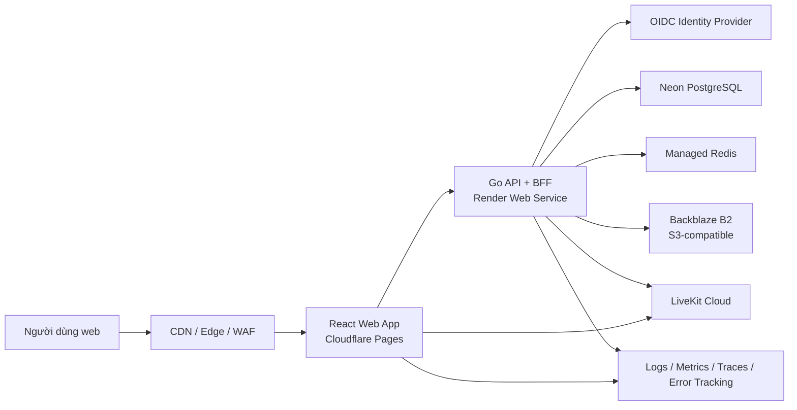

# Bối cảnh và kiến trúc hệ thống

## 1. Kiến trúc mục tiêu giai đoạn MVP

## 2. Lý do chọn modular monolith

- Nghiệp vụ V1 rộng nhưng đội ngũ V2 ban đầu chưa cần chi phí vận hành microservice.
- Một binary Go với module nội bộ rõ ràng vẫn cho phép transaction nhất quán và triển khai đơn giản.
- Ranh giới module và outbox event được chuẩn hóa để tách service sau này mà không viết lại toàn bộ.
- Kubernetes chưa được đưa vào MVP; managed container và managed data services giảm tải DevOps.

## 3. Ranh giới module backend

| Module | Trách nhiệm |
|---|---|
| identity | User mapping, OIDC identity, session, device/session management |
| tenancy | Organization, membership, role, policy |
| classroom | Class, enrollment, invite, schedule, live session |
| media | LiveKit room/token policy, recording job metadata |
| messaging | Persistent class/session messages và moderation |
| content | File metadata, presigned upload/download, quota |
| assessment | Question bank, quiz, exam, attempt, grading |
| notification | In-app/email notification và preference |
| audit | Security và administrative audit events |

Chỉ các module MVP được triển khai ở Phase 1-3; bảng trên giữ ranh giới dài hạn.

## 4. Quy tắc giao tiếp

- REST/JSON `/api/v1` cho nghiệp vụ đồng bộ; OpenAPI là nguồn sự thật.
- WebSocket/SSE cho cập nhật bền vững như chat và notification.
- LiveKit transport cho media và tín hiệu phòng tạm thời.
- Object upload đi trực tiếp từ browser tới storage bằng presigned URL ngắn hạn; API không proxy file lớn.
- Event nội bộ dùng transaction outbox. NATS JetStream chỉ thêm khi có consumer độc lập và nhu cầu vận hành thực tế.

## 5. Dữ liệu và cache

- PostgreSQL là system of record.
- Neon là nhà cung cấp PostgreSQL đã chọn cho MVP/private beta.
- Mọi bảng nghiệp vụ tenant-scoped có `tenant_id` và index phù hợp.
- Redis dùng cho session, rate limit, ephemeral coordination và cache có thể tái tạo; không là nguồn dữ liệu duy nhất.
- Object storage chứa binary; PostgreSQL chỉ giữ metadata, owner, tenant, checksum, trạng thái scan và retention.
- Backblaze B2 là object storage đã chọn; filesystem của container không được dùng làm persistent storage.

## 6. Môi trường

| Môi trường | Mục tiêu | Dữ liệu |
|---|---|---|
| local | Phát triển cá nhân qua Docker Compose | Dữ liệu giả |
| test | CI integration/E2E | Tạo và xóa tự động |
| staging | Kiểm thử gần production | Dữ liệu tổng hợp, không copy PII production |
| production | Người dùng thật | Kiểm soát truy cập và retention đầy đủ |

Mỗi môi trường có database, Redis, storage bucket, OIDC client và LiveKit project/key riêng.

Web staging chạy trên Cloudflare Pages; Core API staging chạy trên Render Web Service.
Cloudflare Pages Function chuyển tiếp same-origin `/api/*` tới Render. Hugging Face chỉ còn là
lựa chọn cho dịch vụ AI độc lập. Kiến trúc Core API vẫn stateless và portable; Render Free phải
được thay thế hoặc nâng cấp trước public beta nếu gate availability/load không đạt.

## 7. Hướng mở rộng

- Desktop Tauri dùng chung React packages và API, thêm Rust command cho native capability.
- Mobile React Native dùng chung domain types, validation và generated API client, không dùng lại DOM component.
- Secure Exam là native companion riêng, giao tiếp backend qua protocol được ký và phiên thi có hạn.
